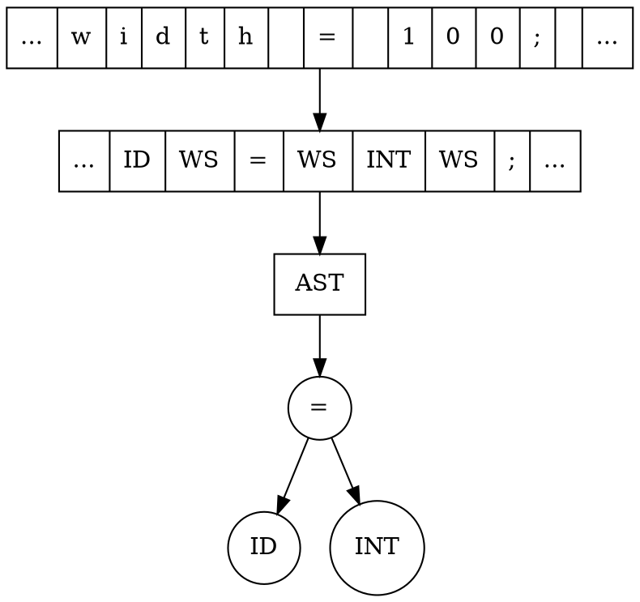
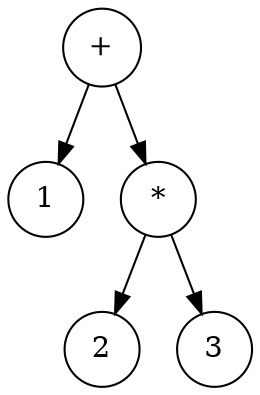

A language is ambiguous if the same sentence or phrase can be interpreted in more than a single way.
For example, the following sentence by Groucho Marx is easily interpreted in two ways: "I once shot an
elephant in my pajamas. How he got in my pajamas I'll never know!" In the computer world, a typical
language ambiguity is the if-then-else ambiguity where the else-clause may be attached to either the
most recent if-then or an older one. Reference manuals for computer languages resolve this ambiguity
by stating that else-clauses always match up with the most recent if-then.
A grammar is ambiguous if the same input sequence can be derived in multiple ways. Ambiguous
languages always yield ambiguous grammars unless you can find a way to encode semantics (actions
or predicates etc...) that resolve the ambiguity. Most language tools like ANTLR resolve the if-then-else
ambiguity by simply choosing to match greedily (i.e., as soon as possible). This matches the else with
the most recent if-then. See nondeterministic.
http://www.antlr.org/history.html
The PCCTS project began as a parser-generator project for a graduate course at Purdue University in the Fall of 1988 taught by Hank Dietz--“translator-writing systems”. Under the guidance of Professor Dietz, the parser generator, ANTLR (originally called YUCC), continued after the termination of the course and eventually became the subject of Terence Parr’s Master’s thesis. Originally, lexical analysis was performed via a simple scanner generator which was soon replaced by Will Cohen’s DLG in the Fall of 1989 (DFA-based lexical-analyzer generator, also an offshoot of the graduate translation course).
The alpha version of ANTLR was totally rewritten resulting in 1.00B. Version 1.00B was released via an internet newsgroup (comp.compilers) posting in February of 1990 and quickly gathered a large following. 1.00B generated only LL(1) parsers, but allowed the merged description of lexical and syntactic analysis. It had rudimentary attribute handling similar to that of YACC and did not incorporate rule parameters or return values; downward inheritance was very awkward. 1.00B-generated parsers terminated upon the first syntax error. Lexical classes (modes) were not allowed and DLG did not have an interactive mode.
Upon starting his Ph.D. at Purdue in the Fall of 1990, Terence Parr began the second total rewrite of ANTLR. The method by which grammars may be practically analyzed to generate LL(k) lookahead information was discovered in August of 1990 just before Terence’s return to Purdue. Version 1.00 incorporated this algorithm and included the AST mechanism, lexical classes, error classes, and automatic error recovery; code quality and portability were higher. In February of 1992 1.00 was released via an article in SIGPLAN Notices. Peter Dahl, then Ph.D. candidate, and Professor Matt O’Keefe (both at the University of Minnesota) tested this version extensively. Dana Hoggatt (Micro Data Base Systems, Inc.) tested 1.00 heavily.
Version 1.06 was released in December 1992 and represented a large feature enhancement over 1.00. For example, rudimentary semantic predicates were introduced, error messages were significantly improved for k>1 lookahead and ANTLR parsers could indicate that lookahead fetches were to occur only when necessary for the parse (normally, the lookahead “pipe” was constantly full). Russell Quong joined the project in the Spring of 1992 to aid in the semantic predicate design. Beginning and advanced tutorials were created and released as well. A makefile generator was included that sets up dependencies and such correctly for ANTLR and DLG. Very few 1.00 incompatibilities were introduced (1.00 was quite different from 1.00B in some areas).
Version 1.10 was released on August 31, 1993 after Terence’s release from Purdue and incorporated bug fixes, a few feature enhancements and a major new capability--an arbitrary lookahead operator (syntactic predicate), “(a)?b”. This feature was codesigned with Professor Russell Quong also at Purdue. To support infinite lookahead, a preprocessor flag, ZZINF_LOOK, was created that forced the ANTLR() macro to tokenize all input prior to parsing. Hence, at any moment, an action or predicate could see the entire input sentence. The predicate mechanism of 1.06 was extended to allow multiple predicates to be hoisted; the syntactic context of a predicate could also be moved along with the predicate.
In February of 1994, SORCERER was released. This tool allowed the user to parse child-sibling trees by specifying a grammar rather than building a recursive-descent tree walker by hand. Aaron Sawdey at The University of Minnesota became a second author of SORCERER after the initial release. On April 1, 1994, PCCTS 1.20 was released. This was the first version to actively support C++ output. It also included important fixes regarding semantic predicates and (..)+ subrules. This version also introduced token classes, the “not” operator, and token ranges.
On June 19, 1994, SORCERER 1.00B9 was released. Gary Funck of Intrepid Technology joined the SORCERER team and provided very valuable suggestions regarding the “transform” mode of SORCERER.
On August 8, 1994, PCCTS 1.21 was released. It mainly cleaned up the C++ output and included a number of bug fixes.
From the 1.21 release forward, the maintenance and support of all PCCTS tools was picked up by Parr Research Corporation.
A sophisticated error handling mechanism called “parser exception handling” was released for version 1.30. 1.31 fixed a few bugs.
Release 1.33 is the version corresponding to the initial book release.
ANTLR 2.0.0 came out around May 1997 and was partially funded so Terence hired John Lilley, a maniac coder and serious ANTLR hacker, to build much of the initial version.  Terence did the grammar analyzer, naturally.
John Mitchell, Jim Coker, Scott Stanchfield, and Monty Zukowski donate lots of brain power to ANTLR 2.xx in general.
ANTLR 2.1.0, July 1997, mainly improved parsing performance, descreased parser memory requirements, and added a lot of cool lexer features including a case-insensitivity option.
ANTLR 2.2.0, December 1997, saw the introduction of the new http://www.antlr.org website.  This release also added grammar inheritance, enhanced AST support, and enhanced lexical translation support (each lexical rule now was considered to return a Token object even when referenced by another lexical rule).
ANTLR 2.3.0, June 1998, was the first version to have Peter Wells C++ code generator.
ANTLR 2.4.0, September 1998, introduced the ParseView parser debugger by Scott Stanchfield.  This version also had a semi-functional -html option to generate HTML from your grammar for reading purposes.  Scott and Terence updated the file I/O to be JDK 1.1.
ANTLR 2.5.0, November 1998, introduced the filter option for the lexer that lets ANTLR behave like SED or AWK.
ANTLR 2.6.0, March 1999, introduced token streams.   Chapman Flack, Purdue Graduate student, pounded me at the right moment about streams, nudging me in the right direction.
MageLang Institute currently provides support and continues development of ANTLR.
MageLang becomes jGuru.com as we quit doing Java training and start building the jGuru Java developer's website.
2.7.0 released January 19, 2000 had the following enhancements:
Nongreedy subrules
Heterogeneous trees
Element options.  To support heterogeneous trees, elements such as token references may now include options.
Exception hierarchy redesign
XML serialization
Improved C++ code generator
New Sather code generator
And had a Sather code generator.
2.7.1 released October 1, 2000 had the following enhancements
ANTLR now allows UNICODE characters because Terence made case-statement expressions more efficient ;)  See the unicode example in the distribution and the brief blurb in the documentation.
Massively improved C++ code generator (Thanks to Ric Klaren).
Added automatic column setting support.
Ter added throws to tree and regular parsers .
2.7.2 release January 19, 2003 was mainly a bug fix release but also included a C# code generator by Micheal Jordan, Kunle Odutola and Anthony Oguntimehin. :) I added an antlr.build.Tool 'cause I hate ANT. This release does UNICODE properly now. Added limited lexical lookahead hoisting. Sather code generator disappears. Source changes for Eclipse and NetBeans by Marco van Meegen and Brian Smith.
2.7.3 released March 22, 2004 was mainly a bug fix release, but included the parse-tree/derivation code to aid in debugging plus the cool TokenStreamRewriteEngine that makes rewriting or tweaking input files particularly easy.
2.7.4 released May 9, 2004 was mainly a bug fix release for C++ and C# generators.
2.7.5 released January 28, 2005 was mainly a release for the Python code generator and a provided number of bug fixes. Wolfgang H�felinger and Marq Kole joined the project to handle the Python!
2.7.6 was mainly a bug fix release.
2.7.7 released November 1, 2006 was mainly a bug fix release. Last v2 release probably.
ANTLR v3 released May 17, 2007 is a completely rewritten version (in Java). The goal of version 3 was to provide a really clean source base and to significantly clean up the syntax and semantics of the ANTLR grammar meta-language. While there are significant enhancements based upon new and exciting research, the tool retains its strong mojo and should feel very familiar to ANTLR v2 users. See What is the difference between ANTLR v2 and v3? The core tool is written by Terence Parr, the lunatic behind the previous two versions. v3 took four years of frantic coding and research effort (please see credit).
[[TOC]]
# ANTLR 
```
Why program by hand in five days what you can spend five years of
your life automating?
```
ANTLR(`ANother Tool for Language Recognition`) (formerly PCCTS) is a language tool that provides a
framework for constructing recognizers, compilers, and translators from grammatical description
Computer language translation has become a common task. While compilers and tools for traditional
computer languages (such as C or Java) are still being built, their number is dwarfed by the thousands
of mini-languages for which recognizers and translators are being developed. Programmers construct
translators for database formats, graphical data files (e.g., PostScript, AutoCAD), text processing files (e.
g., HTML, SGML). ANTLR is designed to handle all of your translation tasks.
Terence Parr has been working on ANTLR since 1989 and, together with his colleagues, has made a
number of fundamental contributions to parsing theory and language tool construction, leading to the
resurgence of LL(k)-based recognition tools.
# 安装
Arch:
```
#!sh
$ [sudo] packman -S antlr2
```
源码安装:
```
#!sh
$ cd /usr/local
$ tar xvfz antlr-3.0.tar.gz
antlr-3.0/
antlr-3.0/build/
antlr-3.0/build.properties
antlr-3.0/build.xml
antlr-3.0/lib/
antlr-3.0/lib/antlr-3.0.jar
```
 * ANTLRv3 依赖于ANTLRv2(2.770和StringTemplate3.0.
 * 你不需要使用ANTLR的jar包来运行你生成的parser, 同样你也不需要StringTemplate的java包, 除非你的parser使用了TemplateConstructionRules
 
设置CLASSPATH
```
#!sh
$ export CLASSPATH="$CLASSPATH:/usr/local/antlr-3.0/lib/antlr-3.0.jar:\
/usr/local/antlr-3.0/lib/stringtemplate-3.0.jar:\
/usr/local/antlr-3.0/lib/antlr-2.7.7.jar"
```
# 使用ANTLRWorks
ANTLRWorks是官方提供的IDE.
`~/.profile`:
```sh
export ANTLR3_HOME=/opt/antlr3
export ANTLRWORKS=$ANTLR3_HOME/antlrworks.jar
export CLASSPATH=$CLASSPATH:$ANTLRWORKS
```
`~/bin/antlrworks`:
```sh
#!/bin/sh
export LANG=C
java -jar $ANTLRWORKS
```
启动: 
```sh
$ antlrworks
```
# 开始ANTLR之旅
程序员通常使用ANTLR构建[wiki:Translators]和[wiki:Dsls]的解释器.
Translator可以实现不同语言之间的翻译, 将语言A的句子Sa输入到Translator中得到语言B的语句Sb. 
如果把识别工作分解为两个独立的步骤, 理解起来会更加容易.
这两个步骤也反映了人类阅读的本质. 你绝对不会一个字母一个字母的阅读整个句子, 你会将一个句子视为单词流. 你的大脑负责将字母分组成单词, 而后按照顺序扫过单词,从而理解整个句子的含义. 这两个步骤为:
 1. LexicalAnalysis (Char -> LexicalAnalysis -> Token)
 2. Parsing ( Token -> Parser -> )
ANTLR可以为我们生成语言的此词法分析器和语法分析器(Parser).
字符,语言符号(token), 和抽象语法树(ASTs).

```div class=warn
I just stumbled upon a simple way to create this error:
```
... java.lang.ClassCastException: org.antlr.runtime.tree.CommonTree cannot be cast to org.antlr.tool.GrammarAST 
```
```
grammar Demo; 
Name : 'a' |'b' | 'c'; 
```
The problem is that Name is a lexer rule because it starts with a capitol 
letter. There are no parser rules which start with a lower case letter. Just 
change 'Name' to 'name". 
```
# Why did I become interested in ANTLR?
```
#!div class=note
I have used YACC (which is more or less interchangeable with Bison) for many years. YACC has several notable problems however:
Parsers created with YACC tend to have poor error reporting. Anyone who has used the original portable C compiler under UNIX will be familiar with the dreaded "syntax error line XX" error messages. With work, YACC can be made to do a better job by introducing error productions, but its still an uphill battle.
Errors in YACC grammars are difficult to understand. YACC will report a "shift/reduce" or "reduce/reduce" error associated with a given grammar rule. In many cases to understand why this error occured, the user must pour over the YACC debug trace, which can be obscure.
The parser generated by YACC is table driven (that is, the parser state transitions result from values in a table). This makes the parser difficult to impossible to debug.
Language grammars take a lot of work to develop. I was hoping that by using a parser generator with more than one token lookahead I would not have to work as hard on the grammar. As a friend of mine pointed out to me:
LR(k) for any k, most grammars that are not LR(1) are ambigious so the additional lookahead doesn't really do what most people think.
ANTLR's syntactic predicates allow arbitrary lookahead which can be a powerful way to resolve difficult parts of a syntax. But sadly they don't make grammars that much easier to develop. ANTLR grammars still take a lot of work and good grammar development is an art.
I need a parser generator that generates C++ (or at least C), since I am planning on implementing my compiler in C++.
I am planning to use the parser generator for a production quality compiler that I hope may be a commercial product one day where I might license the compiler source. So I had some other requirements:
Cost. For me, $500 is a lot of money for a software tool. So while tools like Visual Parse++ have attractive features, the cost is too high.
Longevity. As a compiler writer I know that selling compilers is not an easy business. Selling parser generators is an even more difficult business. So I don't want to spend a couple of years developing a compiler based on a product from company that may disappear.
Support. If I license my compiler to someone they will expect me to support all phases of the compiler. If a parser generator bug is found in the front end, I will be expected to fix it.
Given the issues listed above, ANTLR is the most attractive parser generator I have looked at:
ANTLR generates recursive decent parsers and has good error reporting "right out of the box". It appears that with a little work even better error reporting is possible.
The parser generated by ANTLR is more or less readable. This helps in debugging.
ANTLR is free.
ANTLR is available as "open source" so I don't have to worry about the vendor going out of business. Also, I can support it myself if necessary. ANTLR is not Linux, but there are a number of ANTLR users world wide, so there is a reasonable chance that bugs will be identified and corrected.
ANTLR will generate C++ parsers. Java may have some advantages as a compiler implementation language, but the performance of Java on compiler like applications is terrible. It is hard enough to make an optimization phase run with acceptable performance. If the compiler developer is saddled with Java's interpretive overhead as well, the compiler may be very slow. Unless native compiled Java is used, C++ is the only choice available for production quality compiler implementation.
Although ANTLR has some compelling advantages, it has some disadvantages as well:
ANTLR has a steep learning curve. There is a fair amount of HTML documention on ANTLR, but the tool is complex and I have found that the documentation can only be understood by working through many examples.
ANTLR grammars are not easy to debug. An error in an ANTLR grammar can result in an error report in a distant production. For example, I had an error in the grammar production for a C style for loop. ANTLR reported a non-determinism warning on the grammar production for unary minus. It was not until I was adding trees to the grammar and I corrected the problem with the for loop production that I understood that this was the problem. But it's worth mentioning that I have yet to use a parser generator where grammar errors were easy to find.
YACC follows the UNIX tool philosophy of doing one thing and providing a fairly simple interface to other tools and software. YACC is just a parser generator. If you want a scanner you use Lex or write one yourself. In the case of ANTLR, you get much more. ANTLR has a very nice lexical scanner description language, it can build trees, it can parse trees. ANTLR is sort of the Emacs of parser generators. This is great if you want to get a language processor up and running quickly. The ANTLR scanner even handles file input and line numbering. But if you don't want to use the stock ANTLR components things get more complicated. For example, if you don't want to use ANTLR's reference counted tree nodes but you still want to use the tree building syntax, its unclear to me what you need to do. Similarly there is only sketchy documentation on how to interface a non-ANTLR scanner with ANTLR.
Afterward
I did use ANTLR to generate a Java parser based on the John Mitchell, Terence Parr, John Lilley and Scott Stanchfield grammar. This is a very nice grammar and represents a lot of work on the author's part. I would like to publicly thank them for putting this grammar in the public domain. I am very happy with ANTLR. The parser is now complete and consists of about 5K lines of grammar, C++ actions and comments.
I do not use ANTLR tree generation. In part the reason for this is that I generate a C++ parser and C++ does not have an "interface" construct, like Java has. The Java parser defines the tree via a Java interface, which allows the Java parser user to define the actual implementation of the tree in any number of ways. For the C++ user however, the tree base class must be used and this had more features (like reference count) than I wanted. So I generate my own light weight trees using C++ actions.
Tree node definitions aside, there is another reason to generate AST through C++ or Java actions. The AST generated by the parser represents the core information for the statement or expression. As a result, tree shape is very important and a lot of work can go into generating trees that will make later processing easier. If trees are generated directly from ANTLR, tree shape tends to be controlled by modifying the grammar. This can fragment rules into several sub-productions. A grammar for a language like Java is already large. Fragmenting rules may make it more difficult to maintain. Direct generation of trees gives allows more freedom than generating trees using ANTLR. The drawback is that it is also more work.
```
```
grammar Hello;
call    : 'call' ID ';' { System.out.println("hello"); }
    ;
ID  :   'a'..'z'+
    ;
INT :   '0'..'9'+
    ;
WS  :   ( ' '
        | '	'
        | '
'
        | '
'
        ) {$channel=HIDDEN;}
    ;
```
```
# BottomUp 和 TopDown 识别器的差异
另一类识别器叫做LR, 与LL不同, LR采用最右推导(RightMostDerviations).
LR识别器又称为BottomUp识别器, 因为它总是尽可能先匹配ParserTree的叶子节点, 而后向根节点匹配.
可以这么理解,LR识别器不断消耗输入符号,直到找到完全匹配的项目. LL识别器则是目标驱动.
```
# Lookahead
Lookahead指的是看看前面的符号,以便确定到底该使用哪条匹配规则. 我们知道LL识别器总是自顶向下工作的, Lookahead就好像是到了岔路口,向前瞅瞅到底该往哪走. 如果一个LL识别器,最多能向前瞅一个符号,那它就是LL(1)识别器. 如果能向前瞅k个符号,那它自然就是LL(k)识别器.这个k叫做LookaheadDepth
多数TopDown识别器的k值都是固定的.
我们来看个实际的例子:
```
decl : 'int' ID '=' INT ';' // int x = 3;
     | 'int' ID ';'         // int x;
```
比如语法识别器正要处理'int'这个符号, 此时有两条路可走, 为了弄明白正确路线, 它就需要Lookahead了, 可它需要Look几个符号才能确定路线呢? 注意,这里要算上'int', 也就是说看到'='号或者';'时,它就可以做出判断了, 因此k=3, 这是个LL(3)语法. LL(3)语法, 其实也是可以改成LL(1)语法的, 上面那个语法可以重构为:
```
decl : 'int' ID ('=' INT)? ';'
```
识别器的k值越大,显然它的能力就越强, 但遗憾的是即便k值足够大, 有些语法LL(k)识别器还是没法处理.
来看下面这个语法:
```
decl : // E.g., "int x = 3;", "static int x = 3;"
     modifier* 'int' ID '=' INT ';'
     | // E.g., "int x;", "static int x;", "static register int x;",
       // "static static register int x;" (weird but grammar says legal)
     modifier* 'int' ID ';'
     ;
modifier // match a single 'static' or 'register' keyword
     : 'static'
     | 'register'
     ;
```
 这个modifier的个数没法确定, 理论上讲LL(k)识别器没法100%处理它, 因为k值不定. 但是AntlrV3之是可以完美识别这种语法的, 它构造的识别器可以Lookahead任意个符号,直到成功匹配. 这种识别器叫做LL(*)语法识别器.
有了LL(*)好强大, 是不是就够了呢? 这个还真不够, LL(*)的实现全靠DFA, DFA这东西没脑子, 记不住东西(PushdownMachine有记忆), 没记忆的语法识别器是不能处理嵌套结构的, 要是碰到递归定义的语法, LL(*)就傻眼了.
```
decl : 'int' declarator '=' INT ';' // E.g., "int **x=3;"
     | 'int' declarator ';' // E.g., "int *x;"
     ;
declarator // E.g., "x", "*x", "**x", "***x"
     : ID
     | '*' declarator
     ;
```
这个decl不是LL(*)语法, Antlr有另一个法子可以对付它, 叫做Backtrack. 没记性不是么? 不要紧, 咱可以让时光到流, 从头再来, 直到成功. 这么老从头开始显然是笨办法,肯定会影响识别效率. 最根本还是没记忆, Antlr的memoization技术弥补了这个不足, 后面再说.
说到这,咱必须得问一个哲学问题, "一定能够定义出任意一种语言的语法么?"
答案是否定的.
有些语言的短语只有在其它特定短语的修饰下才有一定的意义, 比如, 我说"好",这个好到底啥意思? 什么好, 不得而知. 咱人类使用的语言就是这种上下文有关系的语法. 没有上下文, 就会产生歧义, 计算机最怕歧义. 
举个C++里面的例子:
```c
Function(i);
```
 * 如果Function是个函数, 那么这是个函数调用
 * 如果Function是个类, 这句话是个类型转换
Antlr提供了一种叫做SemanticPredicates的方法来处理这种情况.
SemanticPredicates 是一个布尔表达式, 在语法解析过程中可以被动态的求值, 从而获得更加灵活的识别能力.
```
expr : {«lookahead(1) is function»}? functionCall
     | {«lookahead(1) is type»}? ctorTypecast
     ;
```
 
Antlr还提供一种SyntacticPredicates, 它提供这样一种处理方法, 如果当前这句话貌似是a, 那它就是a, 即便它也可以匹配b.
```
s : (a) => a
  | b
  ;
```
LL(*) + SemanticPredicates + SyntacticPredicates 这种组合使得Antlr可以给绝大多数令人抓狂的语法构造正确的识别器.
# 动手
Expr.g
```
grammar Expr;
//------------------[Parser Rules]
prog:	 stat+ ;
stat:	 expr NEWLINE
    |    ID '=' expr NEWLINE
    |    NEWLINE
    ;
expr:	multExpr (('+'|'-')multExpr)*
	;
	
multExpr
	: atom ('*' atom)*
	;
	
atom:	INT
	|   ID
	|   '(' expr ')'
	;
//------------------[Lexer Rules]
ID  :	('a'..'z'|'A'..'Z'|'_') ('a'..'z'|'A'..'Z'|'0'..'9'|'_')*
    ;
INT :	'0'..'9'+
    ;
    
NEWLINE 
	:	'
'? '
';
WS  :   ( ' '
        | '	'
        | '
'
        | '
'
        ) {$channel=HIDDEN;}
    ;
```
```sh
# 为了方便以后使用,我们来定义一个别名
$ alias antlr.tool='java org.antlr.Tool' 
# 目前我们只有一个刚刚完成的后缀名为'g'的语法文件
$ ls
Expr.g
# 生成Parser和Lexer
$ antlr.tools Expr.g && ls
Expr.g
ExprLexer.java
ExprParser.java
Expr.tokens
```
# Expr.token
```
T__8=8
T__9=9
T__10=10
T__11=11
T__12=12
T__13=13
ID=4
INT=5
NEWLINE=6
WS=7
'('=8
')'=9
'*'=10
'+'=11
'-'=12
'='=13
```
# ExprLexer.java
```java
// $ANTLR 3.4 Expr.g 2012-06-11 15:14:33
import org.antlr.runtime.*;
import java.util.Stack;
import java.util.List;
import java.util.ArrayList;
@SuppressWarnings({"all", "warnings", "unchecked"})
public class ExprLexer extends Lexer {
    public static final int EOF=-1;
    public static final int T__8=8;
    public static final int T__9=9;
    public static final int T__10=10;
    public static final int T__11=11;
    public static final int T__12=12;
    public static final int T__13=13;
    public static final int ID=4;
    public static final int INT=5;
    public static final int NEWLINE=6;
    public static final int WS=7;
    // delegates
    // delegators
    public Lexer[] getDelegates() {
        return new Lexer[] {};
    }
    public ExprLexer() {} 
    public ExprLexer(CharStream input) {
        this(input, new RecognizerSharedState());
    }
    public ExprLexer(CharStream input, RecognizerSharedState state) {
        super(input,state);
    }
    public String getGrammarFileName() { return "Expr.g"; }
    // $ANTLR start "T__8"
    public final void mT__8() throws RecognitionException {
        try {
            int _type = T__8;
            int _channel = DEFAULT_TOKEN_CHANNEL;
            // Expr.g:2:6: ( '(' )
            // Expr.g:2:8: '('
            {
            match('('); 
            }
            state.type = _type;
            state.channel = _channel;
        }
        finally {
        	// do for sure before leaving
        }
    }
    // $ANTLR end "T__8"
    // $ANTLR start "T__9"
    public final void mT__9() throws RecognitionException {
        try {
            int _type = T__9;
            int _channel = DEFAULT_TOKEN_CHANNEL;
            // Expr.g:3:6: ( ')' )
            // Expr.g:3:8: ')'
            {
            match(')'); 
            }
            state.type = _type;
            state.channel = _channel;
        }
        finally {
        	// do for sure before leaving
        }
    }
    // $ANTLR end "T__9"
    // $ANTLR start "T__10"
    public final void mT__10() throws RecognitionException {
        try {
            int _type = T__10;
            int _channel = DEFAULT_TOKEN_CHANNEL;
            // Expr.g:4:7: ( '*' )
            // Expr.g:4:9: '*'
            {
            match('*'); 
            }
            state.type = _type;
            state.channel = _channel;
        }
        finally {
        	// do for sure before leaving
        }
    }
    // $ANTLR end "T__10"
    // $ANTLR start "T__11"
    public final void mT__11() throws RecognitionException {
        try {
            int _type = T__11;
            int _channel = DEFAULT_TOKEN_CHANNEL;
            // Expr.g:5:7: ( '+' )
            // Expr.g:5:9: '+'
            {
            match('+'); 
            }
            state.type = _type;
            state.channel = _channel;
        }
        finally {
        	// do for sure before leaving
        }
    }
    // $ANTLR end "T__11"
    // $ANTLR start "T__12"
    public final void mT__12() throws RecognitionException {
        try {
            int _type = T__12;
            int _channel = DEFAULT_TOKEN_CHANNEL;
            // Expr.g:6:7: ( '-' )
            // Expr.g:6:9: '-'
            {
            match('-'); 
            }
            state.type = _type;
            state.channel = _channel;
        }
        finally {
        	// do for sure before leaving
        }
    }
    // $ANTLR end "T__12"
    // $ANTLR start "T__13"
    public final void mT__13() throws RecognitionException {
        try {
            int _type = T__13;
            int _channel = DEFAULT_TOKEN_CHANNEL;
            // Expr.g:7:7: ( '=' )
            // Expr.g:7:9: '='
            {
            match('='); 
            }
            state.type = _type;
            state.channel = _channel;
        }
        finally {
        	// do for sure before leaving
        }
    }
    // $ANTLR end "T__13"
    // $ANTLR start "ID"
    public final void mID() throws RecognitionException {
        try {
            int _type = ID;
            int _channel = DEFAULT_TOKEN_CHANNEL;
            // Expr.g:23:5: ( ( 'a' .. 'z' | 'A' .. 'Z' | '_' ) ( 'a' .. 'z' | 'A' .. 'Z' | '0' .. '9' | '_' )* )
            // Expr.g:23:7: ( 'a' .. 'z' | 'A' .. 'Z' | '_' ) ( 'a' .. 'z' | 'A' .. 'Z' | '0' .. '9' | '_' )*
            {
            if ( (input.LA(1) >= 'A' && input.LA(1) <= 'Z')||input.LA(1)=='_'||(input.LA(1) >= 'a' && input.LA(1) <= 'z') ) {
                input.consume();
            }
            else {
                MismatchedSetException mse = new MismatchedSetException(null,input);
                recover(mse);
                throw mse;
            }
            // Expr.g:23:31: ( 'a' .. 'z' | 'A' .. 'Z' | '0' .. '9' | '_' )*
            loop1:
            do {
                int alt1=2;
                int LA1_0 = input.LA(1);
                if ( ((LA1_0 >= '0' && LA1_0 <= '9')||(LA1_0 >= 'A' && LA1_0 <= 'Z')||LA1_0=='_'||(LA1_0 >= 'a' && LA1_0 <= 'z')) ) {
                    alt1=1;
                }
                switch (alt1) {
            	case 1 :
            	    // Expr.g:
            	    {
            	    if ( (input.LA(1) >= '0' && input.LA(1) <= '9')||(input.LA(1) >= 'A' && input.LA(1) <= 'Z')||input.LA(1)=='_'||(input.LA(1) >= 'a' && input.LA(1) <= 'z') ) {
            	        input.consume();
            	    }
            	    else {
            	        MismatchedSetException mse = new MismatchedSetException(null,input);
            	        recover(mse);
            	        throw mse;
            	    }
            	    }
            	    break;
            	default :
            	    break loop1;
                }
            } while (true);
            }
            state.type = _type;
            state.channel = _channel;
        }
        finally {
        	// do for sure before leaving
        }
    }
    // $ANTLR end "ID"
    // $ANTLR start "INT"
    public final void mINT() throws RecognitionException {
        try {
            int _type = INT;
            int _channel = DEFAULT_TOKEN_CHANNEL;
            // Expr.g:26:5: ( ( '0' .. '9' )+ )
            // Expr.g:26:7: ( '0' .. '9' )+
            {
            // Expr.g:26:7: ( '0' .. '9' )+
            int cnt2=0;
            loop2:
            do {
                int alt2=2;
                int LA2_0 = input.LA(1);
                if ( ((LA2_0 >= '0' && LA2_0 <= '9')) ) {
                    alt2=1;
                }
                switch (alt2) {
            	case 1 :
            	    // Expr.g:
            	    {
            	    if ( (input.LA(1) >= '0' && input.LA(1) <= '9') ) {
            	        input.consume();
            	    }
            	    else {
            	        MismatchedSetException mse = new MismatchedSetException(null,input);
            	        recover(mse);
            	        throw mse;
            	    }
            	    }
            	    break;
            	default :
            	    if ( cnt2 >= 1 ) break loop2;
                        EarlyExitException eee =
                            new EarlyExitException(2, input);
                        throw eee;
                }
                cnt2++;
            } while (true);
            }
            state.type = _type;
            state.channel = _channel;
        }
        finally {
        	// do for sure before leaving
        }
    }
    // $ANTLR end "INT"
    // $ANTLR start "NEWLINE"
    public final void mNEWLINE() throws RecognitionException {
        try {
            int _type = NEWLINE;
            int _channel = DEFAULT_TOKEN_CHANNEL;
            // Expr.g:30:2: ( ( '\r' )? '\n' )
            // Expr.g:30:4: ( '\r' )? '\n'
            {
            // Expr.g:30:4: ( '\r' )?
            int alt3=2;
            int LA3_0 = input.LA(1);
            if ( (LA3_0=='
') ) {
                alt3=1;
            }
            switch (alt3) {
                case 1 :
                    // Expr.g:30:4: '\r'
                    {
                    match('
'); 
                    }
                    break;
            }
            match('
'); 
            }
            state.type = _type;
            state.channel = _channel;
        }
        finally {
        	// do for sure before leaving
        }
    }
    // $ANTLR end "NEWLINE"
    // $ANTLR start "WS"
    public final void mWS() throws RecognitionException {
        try {
            int _type = WS;
            int _channel = DEFAULT_TOKEN_CHANNEL;
            // Expr.g:32:5: ( ( ' ' | '\t' | '\r' | '\n' ) )
            // Expr.g:32:9: ( ' ' | '\t' | '\r' | '\n' )
            {
            if ( (input.LA(1) >= '	' && input.LA(1) <= '
')||input.LA(1)=='
'||input.LA(1)==' ' ) {
                input.consume();
            }
            else {
                MismatchedSetException mse = new MismatchedSetException(null,input);
                recover(mse);
                throw mse;
            }
            _channel=HIDDEN;
            }
            state.type = _type;
            state.channel = _channel;
        }
        finally {
        	// do for sure before leaving
        }
    }
    // $ANTLR end "WS"
    public void mTokens() throws RecognitionException {
        // Expr.g:1:8: ( T__8 | T__9 | T__10 | T__11 | T__12 | T__13 | ID | INT | NEWLINE | WS )
        int alt4=10;
        switch ( input.LA(1) ) {
        case '(':
            {
            alt4=1;
            }
            break;
        case ')':
            {
            alt4=2;
            }
            break;
        case '*':
            {
            alt4=3;
            }
            break;
        case '+':
            {
            alt4=4;
            }
            break;
        case '-':
            {
            alt4=5;
            }
            break;
        case '=':
            {
            alt4=6;
            }
            break;
        case 'A':
        case 'B':
        case 'C':
        case 'D':
        case 'E':
        case 'F':
        case 'G':
        case 'H':
        case 'I':
        case 'J':
        case 'K':
        case 'L':
        case 'M':
        case 'N':
        case 'O':
        case 'P':
        case 'Q':
        case 'R':
        case 'S':
        case 'T':
        case 'U':
        case 'V':
        case 'W':
        case 'X':
        case 'Y':
        case 'Z':
        case '_':
        case 'a':
        case 'b':
        case 'c':
        case 'd':
        case 'e':
        case 'f':
        case 'g':
        case 'h':
        case 'i':
        case 'j':
        case 'k':
        case 'l':
        case 'm':
        case 'n':
        case 'o':
        case 'p':
        case 'q':
        case 'r':
        case 's':
        case 't':
        case 'u':
        case 'v':
        case 'w':
        case 'x':
        case 'y':
        case 'z':
            {
            alt4=7;
            }
            break;
        case '0':
        case '1':
        case '2':
        case '3':
        case '4':
        case '5':
        case '6':
        case '7':
        case '8':
        case '9':
            {
            alt4=8;
            }
            break;
        case '
':
            {
            int LA4_9 = input.LA(2);
            if ( (LA4_9=='
') ) {
                alt4=9;
            }
            else {
                alt4=10;
            }
            }
            break;
        case '
':
            {
            alt4=9;
            }
            break;
        case '	':
        case ' ':
            {
            alt4=10;
            }
            break;
        default:
            NoViableAltException nvae =
                new NoViableAltException("", 4, 0, input);
            throw nvae;
        }
        switch (alt4) {
            case 1 :
                // Expr.g:1:10: T__8
                {
                mT__8(); 
                }
                break;
            case 2 :
                // Expr.g:1:15: T__9
                {
                mT__9(); 
                }
                break;
            case 3 :
                // Expr.g:1:20: T__10
                {
                mT__10(); 
                }
                break;
            case 4 :
                // Expr.g:1:26: T__11
                {
                mT__11(); 
                }
                break;
            case 5 :
                // Expr.g:1:32: T__12
                {
                mT__12(); 
                }
                break;
            case 6 :
                // Expr.g:1:38: T__13
                {
                mT__13(); 
                }
                break;
            case 7 :
                // Expr.g:1:44: ID
                {
                mID(); 
                }
                break;
            case 8 :
                // Expr.g:1:47: INT
                {
                mINT(); 
                }
                break;
            case 9 :
                // Expr.g:1:51: NEWLINE
                {
                mNEWLINE(); 
                }
                break;
            case 10 :
                // Expr.g:1:59: WS
                {
                mWS(); 
                }
                break;
        }
    }
 
}
```
# ExprParser.java
```java
// $ANTLR 3.4 Expr.g 2012-06-11 15:14:33
import org.antlr.runtime.*;
import java.util.Stack;
import java.util.List;
import java.util.ArrayList;
@SuppressWarnings({"all", "warnings", "unchecked"})
public class ExprParser extends Parser {
    public static final String[] tokenNames = new String[] {
        "<invalid>", "<EOR>", "<DOWN>", "<UP>", "ID", "INT", "NEWLINE", "WS", "'('", "')'", "'*'", "'+'", "'-'", "'='"
    };
    public static final int EOF=-1;
    public static final int T__8=8;
    public static final int T__9=9;
    public static final int T__10=10;
    public static final int T__11=11;
    public static final int T__12=12;
    public static final int T__13=13;
    public static final int ID=4;
    public static final int INT=5;
    public static final int NEWLINE=6;
    public static final int WS=7;
    // delegates
    public Parser[] getDelegates() {
        return new Parser[] {};
    }
    // delegators
    public ExprParser(TokenStream input) {
        this(input, new RecognizerSharedState());
    }
    public ExprParser(TokenStream input, RecognizerSharedState state) {
        super(input, state);
    }
    public String[] getTokenNames() { return ExprParser.tokenNames; }
    public String getGrammarFileName() { return "Expr.g"; }
    // $ANTLR start "prog"
    // Expr.g:4:1: prog : ( stat )+ ;
    public final void prog() throws RecognitionException {
        try {
            // Expr.g:4:5: ( ( stat )+ )
            // Expr.g:4:8: ( stat )+
            {
            // Expr.g:4:8: ( stat )+
            int cnt1=0;
            loop1:
            do {
                int alt1=2;
                int LA1_0 = input.LA(1);
                if ( ((LA1_0 >= ID && LA1_0 <= NEWLINE)||LA1_0==8) ) {
                    alt1=1;
                }
                switch (alt1) {
            	case 1 :
            	    // Expr.g:4:8: stat
            	    {
            	    pushFollow(FOLLOW_stat_in_prog11);
            	    stat();
            	    state._fsp--;
            	    }
            	    break;
            	default :
            	    if ( cnt1 >= 1 ) break loop1;
                        EarlyExitException eee =
                            new EarlyExitException(1, input);
                        throw eee;
                }
                cnt1++;
            } while (true);
            }
        }
        catch (RecognitionException re) {
            reportError(re);
            recover(input,re);
        }
        finally {
        	// do for sure before leaving
        }
        return ;
    }
    // $ANTLR end "prog"
    // $ANTLR start "stat"
    // Expr.g:6:1: stat : ( expr NEWLINE | ID '=' expr NEWLINE | NEWLINE );
    public final void stat() throws RecognitionException {
        try {
            // Expr.g:6:5: ( expr NEWLINE | ID '=' expr NEWLINE | NEWLINE )
            int alt2=3;
            switch ( input.LA(1) ) {
            case INT:
            case 8:
                {
                alt2=1;
                }
                break;
            case ID:
                {
                int LA2_2 = input.LA(2);
                if ( (LA2_2==13) ) {
                    alt2=2;
                }
                else if ( (LA2_2==NEWLINE||(LA2_2 >= 10 && LA2_2 <= 12)) ) {
                    alt2=1;
                }
                else {
                    NoViableAltException nvae =
                        new NoViableAltException("", 2, 2, input);
                    throw nvae;
                }
                }
                break;
            case NEWLINE:
                {
                alt2=3;
                }
                break;
            default:
                NoViableAltException nvae =
                    new NoViableAltException("", 2, 0, input);
                throw nvae;
            }
            switch (alt2) {
                case 1 :
                    // Expr.g:6:8: expr NEWLINE
                    {
                    pushFollow(FOLLOW_expr_in_stat21);
                    expr();
                    state._fsp--;
                    match(input,NEWLINE,FOLLOW_NEWLINE_in_stat23); 
                    }
                    break;
                case 2 :
                    // Expr.g:7:10: ID '=' expr NEWLINE
                    {
                    match(input,ID,FOLLOW_ID_in_stat34); 
                    match(input,13,FOLLOW_13_in_stat36); 
                    pushFollow(FOLLOW_expr_in_stat38);
                    expr();
                    state._fsp--;
                    match(input,NEWLINE,FOLLOW_NEWLINE_in_stat40); 
                    }
                    break;
                case 3 :
                    // Expr.g:8:10: NEWLINE
                    {
                    match(input,NEWLINE,FOLLOW_NEWLINE_in_stat51); 
                    }
                    break;
            }
        }
        catch (RecognitionException re) {
            reportError(re);
            recover(input,re);
        }
        finally {
        	// do for sure before leaving
        }
        return ;
    }
    // $ANTLR end "stat"
    // $ANTLR start "expr"
    // Expr.g:11:1: expr : multExpr ( ( '+' | '-' ) multExpr )* ;
    public final void expr() throws RecognitionException {
        try {
            // Expr.g:11:5: ( multExpr ( ( '+' | '-' ) multExpr )* )
            // Expr.g:11:7: multExpr ( ( '+' | '-' ) multExpr )*
            {
            pushFollow(FOLLOW_multExpr_in_expr63);
            multExpr();
            state._fsp--;
            // Expr.g:11:16: ( ( '+' | '-' ) multExpr )*
            loop3:
            do {
                int alt3=2;
                int LA3_0 = input.LA(1);
                if ( ((LA3_0 >= 11 && LA3_0 <= 12)) ) {
                    alt3=1;
                }
                switch (alt3) {
            	case 1 :
            	    // Expr.g:11:17: ( '+' | '-' ) multExpr
            	    {
            	    if ( (input.LA(1) >= 11 && input.LA(1) <= 12) ) {
            	        input.consume();
            	        state.errorRecovery=false;
            	    }
            	    else {
            	        MismatchedSetException mse = new MismatchedSetException(null,input);
            	        throw mse;
            	    }
            	    pushFollow(FOLLOW_multExpr_in_expr71);
            	    multExpr();
            	    state._fsp--;
            	    }
            	    break;
            	default :
            	    break loop3;
                }
            } while (true);
            }
        }
        catch (RecognitionException re) {
            reportError(re);
            recover(input,re);
        }
        finally {
        	// do for sure before leaving
        }
        return ;
    }
    // $ANTLR end "expr"
    // $ANTLR start "multExpr"
    // Expr.g:14:1: multExpr : atom ( '*' atom )* ;
    public final void multExpr() throws RecognitionException {
        try {
            // Expr.g:15:2: ( atom ( '*' atom )* )
            // Expr.g:15:4: atom ( '*' atom )*
            {
            pushFollow(FOLLOW_atom_in_multExpr85);
            atom();
            state._fsp--;
            // Expr.g:15:9: ( '*' atom )*
            loop4:
            do {
                int alt4=2;
                int LA4_0 = input.LA(1);
                if ( (LA4_0==10) ) {
                    alt4=1;
                }
                switch (alt4) {
            	case 1 :
            	    // Expr.g:15:10: '*' atom
            	    {
            	    match(input,10,FOLLOW_10_in_multExpr88); 
            	    pushFollow(FOLLOW_atom_in_multExpr90);
            	    atom();
            	    state._fsp--;
            	    }
            	    break;
            	default :
            	    break loop4;
                }
            } while (true);
            }
        }
        catch (RecognitionException re) {
            reportError(re);
            recover(input,re);
        }
        finally {
        	// do for sure before leaving
        }
        return ;
    }
    // $ANTLR end "multExpr"
    // $ANTLR start "atom"
    // Expr.g:18:1: atom : ( INT | ID | '(' expr ')' );
    public final void atom() throws RecognitionException {
        try {
            // Expr.g:18:5: ( INT | ID | '(' expr ')' )
            int alt5=3;
            switch ( input.LA(1) ) {
            case INT:
                {
                alt5=1;
                }
                break;
            case ID:
                {
                alt5=2;
                }
                break;
            case 8:
                {
                alt5=3;
                }
                break;
            default:
                NoViableAltException nvae =
                    new NoViableAltException("", 5, 0, input);
                throw nvae;
            }
            switch (alt5) {
                case 1 :
                    // Expr.g:18:7: INT
                    {
                    match(input,INT,FOLLOW_INT_in_atom102); 
                    }
                    break;
                case 2 :
                    // Expr.g:19:6: ID
                    {
                    match(input,ID,FOLLOW_ID_in_atom109); 
                    }
                    break;
                case 3 :
                    // Expr.g:20:6: '(' expr ')'
                    {
                    match(input,8,FOLLOW_8_in_atom116); 
                    pushFollow(FOLLOW_expr_in_atom118);
                    expr();
                    state._fsp--;
                    match(input,9,FOLLOW_9_in_atom120); 
                    }
                    break;
            }
        }
        catch (RecognitionException re) {
            reportError(re);
            recover(input,re);
        }
        finally {
        	// do for sure before leaving
        }
        return ;
    }
    // $ANTLR end "atom"
    // Delegated rules
 
    public static final BitSet FOLLOW_stat_in_prog11 = new BitSet(new long[]{0x0000000000000172L});
    public static final BitSet FOLLOW_expr_in_stat21 = new BitSet(new long[]{0x0000000000000040L});
    public static final BitSet FOLLOW_NEWLINE_in_stat23 = new BitSet(new long[]{0x0000000000000002L});
    public static final BitSet FOLLOW_ID_in_stat34 = new BitSet(new long[]{0x0000000000002000L});
    public static final BitSet FOLLOW_13_in_stat36 = new BitSet(new long[]{0x0000000000000130L});
    public static final BitSet FOLLOW_expr_in_stat38 = new BitSet(new long[]{0x0000000000000040L});
    public static final BitSet FOLLOW_NEWLINE_in_stat40 = new BitSet(new long[]{0x0000000000000002L});
    public static final BitSet FOLLOW_NEWLINE_in_stat51 = new BitSet(new long[]{0x0000000000000002L});
    public static final BitSet FOLLOW_multExpr_in_expr63 = new BitSet(new long[]{0x0000000000001802L});
    public static final BitSet FOLLOW_set_in_expr66 = new BitSet(new long[]{0x0000000000000130L});
    public static final BitSet FOLLOW_multExpr_in_expr71 = new BitSet(new long[]{0x0000000000001802L});
    public static final BitSet FOLLOW_atom_in_multExpr85 = new BitSet(new long[]{0x0000000000000402L});
    public static final BitSet FOLLOW_10_in_multExpr88 = new BitSet(new long[]{0x0000000000000130L});
    public static final BitSet FOLLOW_atom_in_multExpr90 = new BitSet(new long[]{0x0000000000000402L});
    public static final BitSet FOLLOW_INT_in_atom102 = new BitSet(new long[]{0x0000000000000002L});
    public static final BitSet FOLLOW_ID_in_atom109 = new BitSet(new long[]{0x0000000000000002L});
    public static final BitSet FOLLOW_8_in_atom116 = new BitSet(new long[]{0x0000000000000130L});
    public static final BitSet FOLLOW_expr_in_atom118 = new BitSet(new long[]{0x0000000000000200L});
    public static final BitSet FOLLOW_9_in_atom120 = new BitSet(new long[]{0x0000000000000002L});
}
```
# 测试Parser和Lexer
Test.java:
```
#!java
import org.antlr.runtime.*;
public class Test {
    public static void main(String[] args) throws Exception {
        // 使用STDIN作为输入流
        ANTLRInputStream input   = new ANTLRInputStream(System.in);
        // 建立Lexer
        ExprLexer lexer          = new ExprLexer(input);
        // 从Lexer中获得Token流
        CommonTokenStream tokens = new CommonTokenStream(lexer);
        // 建立Parser
        ExprParser parser        = new ExprParser(tokens);
        // 开始执行指定语法规则
        parser.prog();
    }
}
```
编译:
```sh
$ echo $CLASSPATH
.:/opt/java/lib:/opt/antlr3/antlrworks.jar
$ java Test.java ExprLexer.java ExprParser.java
```
运行:
```sh
# 首先我们来输入正确的Expr语句, 结果什么都没有发生, 这是因为咱还没有定义任何'动作'.
$ java Test
1+2
<<EOF>>
# 接下来再试试非法的Expr语句, 这下能看到错误提示了
$ java Test
1-$
<<EOF>>
line 1:2 no viable alternative at character '$'
line 1:3 no viable alternative at input '
'
```
<<EOF>>:
|| windows || C-z ||
|| *nix    || C-d ||
# 添加动作
当Parser识别出某个标志后,我们有机会嵌入一些代码,这些代码在识别出对应的标志后会被执行. 通过这种方式,可以实现对Expr语法的表达式求值.
```diff
--- a/Expr.g
+++ b/Expr.g
@@ -1,23 +1,40 @@
 grammar Expr;
+@header {
+import java.util.HashMap;
+}
 
+@members {
+/** Map variable name to Integer object holding value */
+HashMap memory = new HashMap();
+}
 //------------------[Parser Rules]
 prog:   stat+ ;
 
-stat:   expr NEWLINE
-    |    ID '=' expr NEWLINE
+stat:   expr NEWLINE          {System.out.println($expr.value);}
+    |    ID '=' expr NEWLINE   {memory.put($ID.text, new Integer($expr.value));}
     |    NEWLINE
     ;
 
-expr:  multExpr (('+'|'-')multExpr)*
+expr returns [int value]
+       :       e=multExpr {$value = $e.value;} 
+           ('+' e=multExpr {$value += $e.value;}
+           |'-' e=multExpr {$value -= $e.value;}
+           )*
        ;
        
-multExpr
-       : atom ('*' atom)*
+multExpr returns [int value]
+       : e=atom {$value = $e.value;} ('*' e=atom {$value *= $e.value;})*
        ;
        
-atom:  INT
-       |   ID
-       |   '(' expr ')'
+atom returns [int value]
+    :  INT                    {$value = Integer.parseInt($INT.text);}
+       |   ID                     { // look up value of variable
+                                                               Integer v = (Integer)memory.get($ID.text);
+                                                               // if found, set return value else error
+                                                               if ( v!=null ) $value = v.intValue();
+                                                               else System.err.println("undefined variable "+$ID.text);
+                                                          }
+       |   '(' expr ')'           {$value = $expr.value;}
        ;
 //------------------[Lexer Rules]
 ID  :  ('a'..'z'|'A'..'Z'|'_') ('a'..'z'|'A'..'Z'|'0'..'9'|'_')*
```
添加动作后的语法文件:
```
grammar Expr;
@header {
import java.util.HashMap;
}
@members {
/** Map variable name to Integer object holding value */
HashMap memory = new HashMap();
}
//------------------[Parser Rules]
prog:	 stat+ ;
stat:	 expr NEWLINE          {System.out.println($expr.value);}
    |    ID '=' expr NEWLINE   {memory.put($ID.text, new Integer($expr.value));}
    |    NEWLINE
    ;
expr returns [int value]
	:	e=multExpr {$value = $e.value;} 
	    ('+' e=multExpr {$value += $e.value;}
	    |'-' e=multExpr {$value -= $e.value;}
	    )*
	;
	
multExpr returns [int value]
	: e=atom {$value = $e.value;} ('*' e=atom {$value *= $e.value;})*
	;
	
atom returns [int value]
    :	INT                    {$value = Integer.parseInt($INT.text);}
	|   ID                     { // look up value of variable
								Integer v = (Integer)memory.get($ID.text);
								// if found, set return value else error
								if ( v!=null ) $value = v.intValue();
								else System.err.println("undefined variable "+$ID.text);
							   }
	|   '(' expr ')'           {$value = $expr.value;}
	;
//------------------[Lexer Rules]
ID  :	('a'..'z'|'A'..'Z'|'_') ('a'..'z'|'A'..'Z'|'0'..'9'|'_')*
    ;
INT :	'0'..'9'+
    ;
    
NEWLINE 
	:	'
'? '
';
WS  :   ( ' '
        | '	'
        | '
'
        | '
'
        ) {$channel=HIDDEN;}
    ;
```
# Parser发生的变化
```diff
diff --git a/ExprParser.java b/ExprParser.java
index 0be83ce..d99a721 100644
--- a/ExprParser.java
+++ b/ExprParser.java
@@ -1,4 +1,7 @@
-// $ANTLR 3.4 Expr.g 2012-06-11 15:14:33
+// $ANTLR 3.4 Expr.g 2012-06-11 16:56:31
+
+import java.util.HashMap;
+
 
 import org.antlr.runtime.*;
 import java.util.Stack;
@@ -42,15 +45,19 @@ public class ExprParser extends Parser {
     public String getGrammarFileName() { return "Expr.g"; }
 
 
+    /** Map variable name to Integer object holding value */
+    HashMap memory = new HashMap();
+
+
 
     // $ANTLR start "prog"
-    // Expr.g:4:1: prog : ( stat )+ ;
+    // Expr.g:11:1: prog : ( stat )+ ;
     public final void prog() throws RecognitionException {
         try {
-            // Expr.g:4:5: ( ( stat )+ )
-            // Expr.g:4:8: ( stat )+
+            // Expr.g:11:5: ( ( stat )+ )
+            // Expr.g:11:8: ( stat )+
             {
-            // Expr.g:4:8: ( stat )+
+            // Expr.g:11:8: ( stat )+
             int cnt1=0;
             loop1:
             do {
@@ -64,9 +71,9 @@ public class ExprParser extends Parser {
 
                 switch (alt1) {
             	case 1 :
-            	    // Expr.g:4:8: stat
+            	    // Expr.g:11:8: stat
             	    {
-            	    pushFollow(FOLLOW_stat_in_prog11);
+            	    pushFollow(FOLLOW_stat_in_prog21);
             	    stat();
 
             	    state._fsp--;
@@ -103,10 +110,16 @@ public class ExprParser extends Parser {
 
 
     // $ANTLR start "stat"
-    // Expr.g:6:1: stat : ( expr NEWLINE | ID '=' expr NEWLINE | NEWLINE );
+    // Expr.g:13:1: stat : ( expr NEWLINE | ID '=' expr NEWLINE | NEWLINE );
     public final void stat() throws RecognitionException {
+        Token ID2=null;
+        int expr1 =0;
+
+        int expr3 =0;
+
+
         try {
-            // Expr.g:6:5: ( expr NEWLINE | ID '=' expr NEWLINE | NEWLINE )
+            // Expr.g:13:5: ( expr NEWLINE | ID '=' expr NEWLINE | NEWLINE )
             int alt2=3;
             switch ( input.LA(1) ) {
             case INT:
@@ -149,39 +162,43 @@ public class ExprParser extends Parser {
 
             switch (alt2) {
                 case 1 :
-                    // Expr.g:6:8: expr NEWLINE
+                    // Expr.g:13:8: expr NEWLINE
                     {
-                    pushFollow(FOLLOW_expr_in_stat21);
-                    expr();
+                    pushFollow(FOLLOW_expr_in_stat31);
+                    expr1=expr();
 
                     state._fsp--;
 
 
-                    match(input,NEWLINE,FOLLOW_NEWLINE_in_stat23); 
+                    match(input,NEWLINE,FOLLOW_NEWLINE_in_stat33); 
+
+                    System.out.println(expr1);
 
                     }
                     break;
                 case 2 :
-                    // Expr.g:7:10: ID '=' expr NEWLINE
+                    // Expr.g:14:10: ID '=' expr NEWLINE
                     {
-                    match(input,ID,FOLLOW_ID_in_stat34); 
+                    ID2=(Token)match(input,ID,FOLLOW_ID_in_stat55); 
 
-                    match(input,13,FOLLOW_13_in_stat36); 
+                    match(input,13,FOLLOW_13_in_stat57); 
 
-                    pushFollow(FOLLOW_expr_in_stat38);
-                    expr();
+                    pushFollow(FOLLOW_expr_in_stat59);
+                    expr3=expr();
 
                     state._fsp--;
 
 
-                    match(input,NEWLINE,FOLLOW_NEWLINE_in_stat40); 
+                    match(input,NEWLINE,FOLLOW_NEWLINE_in_stat61); 
+
+                    memory.put((ID2!=null?ID2.getText():null), new Integer(expr3));
 
                     }
                     break;
                 case 3 :
-                    // Expr.g:8:10: NEWLINE
+                    // Expr.g:15:10: NEWLINE
                     {
-                    match(input,NEWLINE,FOLLOW_NEWLINE_in_stat51); 
+                    match(input,NEWLINE,FOLLOW_NEWLINE_in_stat76); 
 
                     }
                     break;
@@ -203,49 +220,69 @@ public class ExprParser extends Parser {
 
 
     // $ANTLR start "expr"
-    // Expr.g:11:1: expr : multExpr ( ( '+' | '-' ) multExpr )* ;
-    public final void expr() throws RecognitionException {
+    // Expr.g:18:1: expr returns [int value] : e= multExpr ( '+' e= multExpr | '-' e= multExpr )* ;
+    public final int expr() throws RecognitionException {
+        int value = 0;
+
+
+        int e =0;
+
+
         try {
-            // Expr.g:11:5: ( multExpr ( ( '+' | '-' ) multExpr )* )
-            // Expr.g:11:7: multExpr ( ( '+' | '-' ) multExpr )*
+            // Expr.g:19:2: (e= multExpr ( '+' e= multExpr | '-' e= multExpr )* )
+            // Expr.g:19:4: e= multExpr ( '+' e= multExpr | '-' e= multExpr )*
             {
-            pushFollow(FOLLOW_multExpr_in_expr63);
-            multExpr();
+            pushFollow(FOLLOW_multExpr_in_expr96);
+            e=multExpr();
 
             state._fsp--;
 
 
-            // Expr.g:11:16: ( ( '+' | '-' ) multExpr )*
+            value = e;
+
+            // Expr.g:20:6: ( '+' e= multExpr | '-' e= multExpr )*
             loop3:
             do {
-                int alt3=2;
+                int alt3=3;
                 int LA3_0 = input.LA(1);
 
-                if ( ((LA3_0 >= 11 && LA3_0 <= 12)) ) {
+                if ( (LA3_0==11) ) {
                     alt3=1;
                 }
+                else if ( (LA3_0==12) ) {
+                    alt3=2;
+                }
 
 
                 switch (alt3) {
             	case 1 :
-            	    // Expr.g:11:17: ( '+' | '-' ) multExpr
+            	    // Expr.g:20:7: '+' e= multExpr
             	    {
-            	    if ( (input.LA(1) >= 11 && input.LA(1) <= 12) ) {
-            	        input.consume();
-            	        state.errorRecovery=false;
-            	    }
-            	    else {
-            	        MismatchedSetException mse = new MismatchedSetException(null,input);
-            	        throw mse;
-            	    }
+            	    match(input,11,FOLLOW_11_in_expr107); 
+
+            	    pushFollow(FOLLOW_multExpr_in_expr111);
+            	    e=multExpr();
+
+            	    state._fsp--;
+
 
+            	    value += e;
 
-            	    pushFollow(FOLLOW_multExpr_in_expr71);
-            	    multExpr();
+            	    }
+            	    break;
+            	case 2 :
+            	    // Expr.g:21:7: '-' e= multExpr
+            	    {
+            	    match(input,12,FOLLOW_12_in_expr121); 
+
+            	    pushFollow(FOLLOW_multExpr_in_expr125);
+            	    e=multExpr();
 
             	    state._fsp--;
 
 
+            	    value -= e;
+
             	    }
             	    break;
 
@@ -266,26 +303,34 @@ public class ExprParser extends Parser {
         finally {
         	// do for sure before leaving
         }
-        return ;
+        return value;
     }
     // $ANTLR end "expr"
 
 
 
     // $ANTLR start "multExpr"
-    // Expr.g:14:1: multExpr : atom ( '*' atom )* ;
-    public final void multExpr() throws RecognitionException {
+    // Expr.g:25:1: multExpr returns [int value] : e= atom ( '*' e= atom )* ;
+    public final int multExpr() throws RecognitionException {
+        int value = 0;
+
+
+        int e =0;
+
+
         try {
-            // Expr.g:15:2: ( atom ( '*' atom )* )
-            // Expr.g:15:4: atom ( '*' atom )*
+            // Expr.g:26:2: (e= atom ( '*' e= atom )* )
+            // Expr.g:26:4: e= atom ( '*' e= atom )*
             {
-            pushFollow(FOLLOW_atom_in_multExpr85);
-            atom();
+            pushFollow(FOLLOW_atom_in_multExpr153);
+            e=atom();
 
             state._fsp--;
 
 
-            // Expr.g:15:9: ( '*' atom )*
+            value = e;
+
+            // Expr.g:26:32: ( '*' e= atom )*
             loop4:
             do {
                 int alt4=2;
@@ -298,16 +343,18 @@ public class ExprParser extends Parser {
 
                 switch (alt4) {
             	case 1 :
-            	    // Expr.g:15:10: '*' atom
+            	    // Expr.g:26:33: '*' e= atom
             	    {
-            	    match(input,10,FOLLOW_10_in_multExpr88); 
+            	    match(input,10,FOLLOW_10_in_multExpr158); 
 
-            	    pushFollow(FOLLOW_atom_in_multExpr90);
-            	    atom();
+            	    pushFollow(FOLLOW_atom_in_multExpr162);
+            	    e=atom();
 
             	    state._fsp--;
 
 
+            	    value *= e;
+
             	    }
             	    break;
 
@@ -328,17 +375,25 @@ public class ExprParser extends Parser {
         finally {
         	// do for sure before leaving
         }
-        return ;
+        return value;
     }
     // $ANTLR end "multExpr"
 
 
 
     // $ANTLR start "atom"
-    // Expr.g:18:1: atom : ( INT | ID | '(' expr ')' );
-    public final void atom() throws RecognitionException {
+    // Expr.g:29:1: atom returns [int value] : ( INT | ID | '(' expr ')' );
+    public final int atom() throws RecognitionException {
+        int value = 0;
+
+
+        Token INT4=null;
+        Token ID5=null;
+        int expr6 =0;
+
+
         try {
-            // Expr.g:18:5: ( INT | ID | '(' expr ')' )
+            // Expr.g:30:5: ( INT | ID | '(' expr ')' )
             int alt5=3;
             switch ( input.LA(1) ) {
             case INT:
@@ -366,31 +421,42 @@ public class ExprParser extends Parser {
 
             switch (alt5) {
                 case 1 :
-                    // Expr.g:18:7: INT
+                    // Expr.g:30:7: INT
                     {
-                    match(input,INT,FOLLOW_INT_in_atom102); 
+                    INT4=(Token)match(input,INT,FOLLOW_INT_in_atom185); 
+
+                    value = Integer.parseInt((INT4!=null?INT4.getText():null));
 
                     }
                     break;
                 case 2 :
-                    // Expr.g:19:6: ID
+                    // Expr.g:31:6: ID
                     {
-                    match(input,ID,FOLLOW_ID_in_atom109); 
+                    ID5=(Token)match(input,ID,FOLLOW_ID_in_atom213); 
+
+                     // look up value of variable
+                    								Integer v = (Integer)memory.get((ID5!=null?ID5.getText():null));
+                    								// if found, set return value else error
+                    								if ( v!=null ) value = v.intValue();
+                    								else System.err.println("undefined variable "+(ID5!=null?ID5.getText():null));
+                    							   
 
                     }
                     break;
                 case 3 :
-                    // Expr.g:20:6: '(' expr ')'
+                    // Expr.g:37:6: '(' expr ')'
                     {
-                    match(input,8,FOLLOW_8_in_atom116); 
+                    match(input,8,FOLLOW_8_in_atom242); 
 
-                    pushFollow(FOLLOW_expr_in_atom118);
-                    expr();
+                    pushFollow(FOLLOW_expr_in_atom244);
+                    expr6=expr();
 
                     state._fsp--;
 
 
-                    match(input,9,FOLLOW_9_in_atom120); 
+                    match(input,9,FOLLOW_9_in_atom246); 
+
+                    value = expr6;
 
                     }
                     break;
@@ -405,7 +471,7 @@ public class ExprParser extends Parser {
         finally {
         	// do for sure before leaving
         }
-        return ;
+        return value;
     }
     // $ANTLR end "atom"
 
@@ -414,24 +480,26 @@ public class ExprParser extends Parser {
 
  
 
-    public static final BitSet FOLLOW_stat_in_prog11 = new BitSet(new long[]{0x0000000000000172L});
-    public static final BitSet FOLLOW_expr_in_stat21 = new BitSet(new long[]{0x0000000000000040L});
-    public static final BitSet FOLLOW_NEWLINE_in_stat23 = new BitSet(new long[]{0x0000000000000002L});
-    public static final BitSet FOLLOW_ID_in_stat34 = new BitSet(new long[]{0x0000000000002000L});
-    public static final BitSet FOLLOW_13_in_stat36 = new BitSet(new long[]{0x0000000000000130L});
-    public static final BitSet FOLLOW_expr_in_stat38 = new BitSet(new long[]{0x0000000000000040L});
-    public static final BitSet FOLLOW_NEWLINE_in_stat40 = new BitSet(new long[]{0x0000000000000002L});
-    public static final BitSet FOLLOW_NEWLINE_in_stat51 = new BitSet(new long[]{0x0000000000000002L});
-    public static final BitSet FOLLOW_multExpr_in_expr63 = new BitSet(new long[]{0x0000000000001802L});
-    public static final BitSet FOLLOW_set_in_expr66 = new BitSet(new long[]{0x0000000000000130L});
-    public static final BitSet FOLLOW_multExpr_in_expr71 = new BitSet(new long[]{0x0000000000001802L});
-    public static final BitSet FOLLOW_atom_in_multExpr85 = new BitSet(new long[]{0x0000000000000402L});
-    public static final BitSet FOLLOW_10_in_multExpr88 = new BitSet(new long[]{0x0000000000000130L});
-    public static final BitSet FOLLOW_atom_in_multExpr90 = new BitSet(new long[]{0x0000000000000402L});
-    public static final BitSet FOLLOW_INT_in_atom102 = new BitSet(new long[]{0x0000000000000002L});
-    public static final BitSet FOLLOW_ID_in_atom109 = new BitSet(new long[]{0x0000000000000002L});
-    public static final BitSet FOLLOW_8_in_atom116 = new BitSet(new long[]{0x0000000000000130L});
-    public static final BitSet FOLLOW_expr_in_atom118 = new BitSet(new long[]{0x0000000000000200L});
-    public static final BitSet FOLLOW_9_in_atom120 = new BitSet(new long[]{0x0000000000000002L});
+    public static final BitSet FOLLOW_stat_in_prog21 = new BitSet(new long[]{0x0000000000000172L});
+    public static final BitSet FOLLOW_expr_in_stat31 = new BitSet(new long[]{0x0000000000000040L});
+    public static final BitSet FOLLOW_NEWLINE_in_stat33 = new BitSet(new long[]{0x0000000000000002L});
+    public static final BitSet FOLLOW_ID_in_stat55 = new BitSet(new long[]{0x0000000000002000L});
+    public static final BitSet FOLLOW_13_in_stat57 = new BitSet(new long[]{0x0000000000000130L});
+    public static final BitSet FOLLOW_expr_in_stat59 = new BitSet(new long[]{0x0000000000000040L});
+    public static final BitSet FOLLOW_NEWLINE_in_stat61 = new BitSet(new long[]{0x0000000000000002L});
+    public static final BitSet FOLLOW_NEWLINE_in_stat76 = new BitSet(new long[]{0x0000000000000002L});
+    public static final BitSet FOLLOW_multExpr_in_expr96 = new BitSet(new long[]{0x0000000000001802L});
+    public static final BitSet FOLLOW_11_in_expr107 = new BitSet(new long[]{0x0000000000000130L});
+    public static final BitSet FOLLOW_multExpr_in_expr111 = new BitSet(new long[]{0x0000000000001802L});
+    public static final BitSet FOLLOW_12_in_expr121 = new BitSet(new long[]{0x0000000000000130L});
+    public static final BitSet FOLLOW_multExpr_in_expr125 = new BitSet(new long[]{0x0000000000001802L});
+    public static final BitSet FOLLOW_atom_in_multExpr153 = new BitSet(new long[]{0x0000000000000402L});
+    public static final BitSet FOLLOW_10_in_multExpr158 = new BitSet(new long[]{0x0000000000000130L});
+    public static final BitSet FOLLOW_atom_in_multExpr162 = new BitSet(new long[]{0x0000000000000402L});
+    public static final BitSet FOLLOW_INT_in_atom185 = new BitSet(new long[]{0x0000000000000002L});
+    public static final BitSet FOLLOW_ID_in_atom213 = new BitSet(new long[]{0x0000000000000002L});
+    public static final BitSet FOLLOW_8_in_atom242 = new BitSet(new long[]{0x0000000000000130L});
+    public static final BitSet FOLLOW_expr_in_atom244 = new BitSet(new long[]{0x0000000000000200L});
+    public static final BitSet FOLLOW_9_in_atom246 = new BitSet(new long[]{0x0000000000000002L});
 
 }
 No newline at end of file
```
重新编译/运行:
```sh
$ javac Test.java ExprLexer.java ExprParser.java
$ java Test
1+(3-12)*9
-80
$ java Test
a=1
b=2
a+b
3
```
# 生成AST
在解释AST之前,先来了解下ParserTree, 就以Expr语法为例:
```
1+2*3
```
Parser Tree:
[[Image(ParserTree.jpg)]]
 1. ParserTree的叶子节点是Parser识别出的符号
 2. 非叶子节点是Parser规则名
 3. 根节点是语法名
 4. ParserTree反映了语法识别器是如何识别输入字符流的
    * 实际上可以定义不同的语法来识别同一种语言, 这意味着ParserTree是可以发生变化的, 但是无论怎样识别一种语言, 我们最终其实并不太关心这个识别过程, 好比`1+2*3`, 我们并不在乎1,2,3在语法里是个啥标志,,我们关心的是先算`1+2`还是`2*3`, 这个背后的逻辑其实是语言所真正表达的东西,它更加抽象, 这就是后面将要讲到的AST.
    * 在语言的开发过程中,ParserTree是很可能发生变化的,但是AST是决少发生变化.
AST:

1. 配置参数
```
options {
output=AST;
// ANTLR can handle literally any tree node type.
// For convenience, specify the Java type
ASTLabelType=CommonTree; // type of $stat.tree ref etc...
}
```
 1. 每个匹配的符号都将生成一个AST节点
 2. Given no instructions to the contrary, the generated recognizer will build a flat tree (a linked list) of those nodes.
2. 
接下来我们要决定哪些标志要放到AST中, 方法很简单, 就是使用下面的两个操作符:
|| !^　|| 
|| !  ||
Expr.g:
```diff
diff --git a/Expr.g b/Expr.g
index 930d74d..322dcac 100644
--- a/Expr.g
+++ b/Expr.g
@@ -1,23 +1,30 @@
 grammar Expr;
+//------------------[Options]
+options {
+output=AST;
+// ANTLR can handle literally any tree node type.
+// For convenience, specify the Java type
+ASTLabelType=CommonTree; // type of $stat.tree ref etc...
+}
 
 //------------------[Parser Rules]
-prog:	 stat+ ;
+prog:	 ( stat {System.out.println($stat.tree.toStringTree());} )+ ;
 
-stat:	 expr NEWLINE
-    |    ID '=' expr NEWLINE
-    |    NEWLINE
+stat:	 expr NEWLINE            -> expr
+    |    ID '=' expr NEWLINE    -> ^('=' ID expr)
+    |    NEWLINE                ->
     ;
 
-expr:	multExpr (('+'|'-')multExpr)*
+expr:	multExpr (('+'^|'-'^)multExpr)*
 	;
 	
 multExpr
-	: atom ('*' atom)*
+	: atom ('*'^ atom)*
 	;
 	
 atom:	INT
 	|   ID
-	|   '(' expr ')'
+	|   '('! expr ')'!
 	;
 
 //------------------[Lexer Rules]
```
```
grammar Expr;
//------------------[Options]
options {
output=AST;
// ANTLR can handle literally any tree node type.
// For convenience, specify the Java type
ASTLabelType=CommonTree; // type of $stat.tree ref etc...
}
//------------------[Parser Rules]
prog:	 ( stat {System.out.println($stat.tree.toStringTree());} )+ ;
stat:	 expr NEWLINE           -> expr
    |    ID '=' expr NEWLINE    -> ^('=' ID expr)
    |    NEWLINE                ->
    ;
expr:	multExpr (('+'^|'-'^)multExpr)*
	;
	
multExpr
	: atom ('*'^ atom)*
	;
	
atom:	INT
	|   ID
	|   '('! expr ')'!
	;
//------------------[Lexer Rules]
ID  :	('a'..'z'|'A'..'Z'|'_') ('a'..'z'|'A'..'Z'|'0'..'9'|'_')*
    ;
INT :	'0'..'9'+
    ;
    
NEWLINE 
	:	'
'? '
';
WS  :   ( ' '
        | '	'
        | '
'
        | '
'
        ) {$channel=HIDDEN;}
    ;
```
ExprParser:
```
#!CodeExample
#!java
// $ANTLR 3.4 Expr.g 2012-06-11 18:30:57
import org.antlr.runtime.*;
import java.util.Stack;
import java.util.List;
import java.util.ArrayList;
import org.antlr.runtime.tree.*;
@SuppressWarnings({"all", "warnings", "unchecked"})
public class ExprParser extends Parser {
    public static final String[] tokenNames = new String[] {
        "<invalid>", "<EOR>", "<DOWN>", "<UP>", "ID", "INT", "NEWLINE", "WS", "'('", "')'", "'*'", "'+'", "'-'", "'='"
    };
    public static final int EOF=-1;
    public static final int T__8=8;
    public static final int T__9=9;
    public static final int T__10=10;
    public static final int T__11=11;
    public static final int T__12=12;
    public static final int T__13=13;
    public static final int ID=4;
    public static final int INT=5;
    public static final int NEWLINE=6;
    public static final int WS=7;
    // delegates
    public Parser[] getDelegates() {
        return new Parser[] {};
    }
    // delegators
    public ExprParser(TokenStream input) {
        this(input, new RecognizerSharedState());
    }
    public ExprParser(TokenStream input, RecognizerSharedState state) {
        super(input, state);
    }
protected TreeAdaptor adaptor = new CommonTreeAdaptor();
public void setTreeAdaptor(TreeAdaptor adaptor) {
    this.adaptor = adaptor;
}
public TreeAdaptor getTreeAdaptor() {
    return adaptor;
}
    public String[] getTokenNames() { return ExprParser.tokenNames; }
    public String getGrammarFileName() { return "Expr.g"; }
    public static class prog_return extends ParserRuleReturnScope {
        CommonTree tree;
        public Object getTree() { return tree; }
    };
    // $ANTLR start "prog"
    // Expr.g:11:1: prog : ( stat )+ ;
    public final ExprParser.prog_return prog() throws RecognitionException {
        ExprParser.prog_return retval = new ExprParser.prog_return();
        retval.start = input.LT(1);
        CommonTree root_0 = null;
        ExprParser.stat_return stat1 =null;
        try {
            // Expr.g:11:5: ( ( stat )+ )
            // Expr.g:11:8: ( stat )+
            {
            root_0 = (CommonTree)adaptor.nil();
            // Expr.g:11:8: ( stat )+
            int cnt1=0;
            loop1:
            do {
                int alt1=2;
                int LA1_0 = input.LA(1);
                if ( ((LA1_0 >= ID && LA1_0 <= NEWLINE)||LA1_0==8) ) {
                    alt1=1;
                }
                switch (alt1) {
            	case 1 :
            	    // Expr.g:11:10: stat
            	    {
            	    pushFollow(FOLLOW_stat_in_prog31);
            	    stat1=stat();
            	    state._fsp--;
            	    adaptor.addChild(root_0, stat1.getTree());
            	    System.out.println((stat1!=null?((CommonTree)stat1.tree):null).toStringTree());
            	    }
            	    break;
            	default :
            	    if ( cnt1 >= 1 ) break loop1;
                        EarlyExitException eee =
                            new EarlyExitException(1, input);
                        throw eee;
                }
                cnt1++;
            } while (true);
            }
            retval.stop = input.LT(-1);
            retval.tree = (CommonTree)adaptor.rulePostProcessing(root_0);
            adaptor.setTokenBoundaries(retval.tree, retval.start, retval.stop);
        }
        catch (RecognitionException re) {
            reportError(re);
            recover(input,re);
    	retval.tree = (CommonTree)adaptor.errorNode(input, retval.start, input.LT(-1), re);
        }
        finally {
        	// do for sure before leaving
        }
        return retval;
    }
    // $ANTLR end "prog"
    public static class stat_return extends ParserRuleReturnScope {
        CommonTree tree;
        public Object getTree() { return tree; }
    };
    // $ANTLR start "stat"
    // Expr.g:13:1: stat : ( expr NEWLINE -> expr | ID '=' expr NEWLINE -> ^( '=' ID expr ) | NEWLINE ->);
    public final ExprParser.stat_return stat() throws RecognitionException {
        ExprParser.stat_return retval = new ExprParser.stat_return();
        retval.start = input.LT(1);
        CommonTree root_0 = null;
        Token NEWLINE3=null;
        Token ID4=null;
        Token char_literal5=null;
        Token NEWLINE7=null;
        Token NEWLINE8=null;
        ExprParser.expr_return expr2 =null;
        ExprParser.expr_return expr6 =null;
        CommonTree NEWLINE3_tree=null;
        CommonTree ID4_tree=null;
        CommonTree char_literal5_tree=null;
        CommonTree NEWLINE7_tree=null;
        CommonTree NEWLINE8_tree=null;
        RewriteRuleTokenStream stream_NEWLINE=new RewriteRuleTokenStream(adaptor,"token NEWLINE");
        RewriteRuleTokenStream stream_ID=new RewriteRuleTokenStream(adaptor,"token ID");
        RewriteRuleTokenStream stream_13=new RewriteRuleTokenStream(adaptor,"token 13");
        RewriteRuleSubtreeStream stream_expr=new RewriteRuleSubtreeStream(adaptor,"rule expr");
        try {
            // Expr.g:13:5: ( expr NEWLINE -> expr | ID '=' expr NEWLINE -> ^( '=' ID expr ) | NEWLINE ->)
            int alt2=3;
            switch ( input.LA(1) ) {
            case INT:
            case 8:
                {
                alt2=1;
                }
                break;
            case ID:
                {
                int LA2_2 = input.LA(2);
                if ( (LA2_2==13) ) {
                    alt2=2;
                }
                else if ( (LA2_2==NEWLINE||(LA2_2 >= 10 && LA2_2 <= 12)) ) {
                    alt2=1;
                }
                else {
                    NoViableAltException nvae =
                        new NoViableAltException("", 2, 2, input);
                    throw nvae;
                }
                }
                break;
            case NEWLINE:
                {
                alt2=3;
                }
                break;
            default:
                NoViableAltException nvae =
                    new NoViableAltException("", 2, 0, input);
                throw nvae;
            }
            switch (alt2) {
                case 1 :
                    // Expr.g:13:8: expr NEWLINE
                    {
                    pushFollow(FOLLOW_expr_in_stat45);
                    expr2=expr();
                    state._fsp--;
                    stream_expr.add(expr2.getTree());
                    NEWLINE3=(Token)match(input,NEWLINE,FOLLOW_NEWLINE_in_stat47);  
                    stream_NEWLINE.add(NEWLINE3);
                    // AST REWRITE
                    // elements: expr
                    // token labels: 
                    // rule labels: retval
                    // token list labels: 
                    // rule list labels: 
                    // wildcard labels: 
                    retval.tree = root_0;
                    RewriteRuleSubtreeStream stream_retval=new RewriteRuleSubtreeStream(adaptor,"rule retval",retval!=null?retval.tree:null);
                    root_0 = (CommonTree)adaptor.nil();
                    // 13:31: -> expr
                    {
                        adaptor.addChild(root_0, stream_expr.nextTree());
                    }
                    retval.tree = root_0;
                    }
                    break;
                case 2 :
                    // Expr.g:14:10: ID '=' expr NEWLINE
                    {
                    ID4=(Token)match(input,ID,FOLLOW_ID_in_stat72);  
                    stream_ID.add(ID4);
                    char_literal5=(Token)match(input,13,FOLLOW_13_in_stat74);  
                    stream_13.add(char_literal5);
                    pushFollow(FOLLOW_expr_in_stat76);
                    expr6=expr();
                    state._fsp--;
                    stream_expr.add(expr6.getTree());
                    NEWLINE7=(Token)match(input,NEWLINE,FOLLOW_NEWLINE_in_stat78);  
                    stream_NEWLINE.add(NEWLINE7);
                    // AST REWRITE
                    // elements: ID, 13, expr
                    // token labels: 
                    // rule labels: retval
                    // token list labels: 
                    // rule list labels: 
                    // wildcard labels: 
                    retval.tree = root_0;
                    RewriteRuleSubtreeStream stream_retval=new RewriteRuleSubtreeStream(adaptor,"rule retval",retval!=null?retval.tree:null);
                    root_0 = (CommonTree)adaptor.nil();
                    // 14:33: -> ^( '=' ID expr )
                    {
                        // Expr.g:14:36: ^( '=' ID expr )
                        {
                        CommonTree root_1 = (CommonTree)adaptor.nil();
                        root_1 = (CommonTree)adaptor.becomeRoot(
                        stream_13.nextNode()
                        , root_1);
                        adaptor.addChild(root_1, 
                        stream_ID.nextNode()
                        );
                        adaptor.addChild(root_1, stream_expr.nextTree());
                        adaptor.addChild(root_0, root_1);
                        }
                    }
                    retval.tree = root_0;
                    }
                    break;
                case 3 :
                    // Expr.g:15:10: NEWLINE
                    {
                    NEWLINE8=(Token)match(input,NEWLINE,FOLLOW_NEWLINE_in_stat102);  
                    stream_NEWLINE.add(NEWLINE8);
                    // AST REWRITE
                    // elements: 
                    // token labels: 
                    // rule labels: retval
                    // token list labels: 
                    // rule list labels: 
                    // wildcard labels: 
                    retval.tree = root_0;
                    RewriteRuleSubtreeStream stream_retval=new RewriteRuleSubtreeStream(adaptor,"rule retval",retval!=null?retval.tree:null);
                    root_0 = (CommonTree)adaptor.nil();
                    // 15:33: ->
                    {
                        root_0 = null;
                    }
                    retval.tree = root_0;
                    }
                    break;
            }
            retval.stop = input.LT(-1);
            retval.tree = (CommonTree)adaptor.rulePostProcessing(root_0);
            adaptor.setTokenBoundaries(retval.tree, retval.start, retval.stop);
        }
        catch (RecognitionException re) {
            reportError(re);
            recover(input,re);
    	retval.tree = (CommonTree)adaptor.errorNode(input, retval.start, input.LT(-1), re);
        }
        finally {
        	// do for sure before leaving
        }
        return retval;
    }
    // $ANTLR end "stat"
    public static class expr_return extends ParserRuleReturnScope {
        CommonTree tree;
        public Object getTree() { return tree; }
    };
    // $ANTLR start "expr"
    // Expr.g:18:1: expr : multExpr ( ( '+' ^| '-' ^) multExpr )* ;
    public final ExprParser.expr_return expr() throws RecognitionException {
        ExprParser.expr_return retval = new ExprParser.expr_return();
        retval.start = input.LT(1);
        CommonTree root_0 = null;
        Token char_literal10=null;
        Token char_literal11=null;
        ExprParser.multExpr_return multExpr9 =null;
        ExprParser.multExpr_return multExpr12 =null;
        CommonTree char_literal10_tree=null;
        CommonTree char_literal11_tree=null;
        try {
            // Expr.g:18:5: ( multExpr ( ( '+' ^| '-' ^) multExpr )* )
            // Expr.g:18:7: multExpr ( ( '+' ^| '-' ^) multExpr )*
            {
            root_0 = (CommonTree)adaptor.nil();
            pushFollow(FOLLOW_multExpr_in_expr131);
            multExpr9=multExpr();
            state._fsp--;
            adaptor.addChild(root_0, multExpr9.getTree());
            // Expr.g:18:16: ( ( '+' ^| '-' ^) multExpr )*
            loop4:
            do {
                int alt4=2;
                int LA4_0 = input.LA(1);
                if ( ((LA4_0 >= 11 && LA4_0 <= 12)) ) {
                    alt4=1;
                }
                switch (alt4) {
            	case 1 :
            	    // Expr.g:18:17: ( '+' ^| '-' ^) multExpr
            	    {
            	    // Expr.g:18:17: ( '+' ^| '-' ^)
            	    int alt3=2;
            	    int LA3_0 = input.LA(1);
            	    if ( (LA3_0==11) ) {
            	        alt3=1;
            	    }
            	    else if ( (LA3_0==12) ) {
            	        alt3=2;
            	    }
            	    else {
            	        NoViableAltException nvae =
            	            new NoViableAltException("", 3, 0, input);
            	        throw nvae;
            	    }
            	    switch (alt3) {
            	        case 1 :
            	            // Expr.g:18:18: '+' ^
            	            {
            	            char_literal10=(Token)match(input,11,FOLLOW_11_in_expr135); 
            	            char_literal10_tree = 
            	            (CommonTree)adaptor.create(char_literal10)
            	            ;
            	            root_0 = (CommonTree)adaptor.becomeRoot(char_literal10_tree, root_0);
            	            }
            	            break;
            	        case 2 :
            	            // Expr.g:18:23: '-' ^
            	            {
            	            char_literal11=(Token)match(input,12,FOLLOW_12_in_expr138); 
            	            char_literal11_tree = 
            	            (CommonTree)adaptor.create(char_literal11)
            	            ;
            	            root_0 = (CommonTree)adaptor.becomeRoot(char_literal11_tree, root_0);
            	            }
            	            break;
            	    }
            	    pushFollow(FOLLOW_multExpr_in_expr141);
            	    multExpr12=multExpr();
            	    state._fsp--;
            	    adaptor.addChild(root_0, multExpr12.getTree());
            	    }
            	    break;
            	default :
            	    break loop4;
                }
            } while (true);
            }
            retval.stop = input.LT(-1);
            retval.tree = (CommonTree)adaptor.rulePostProcessing(root_0);
            adaptor.setTokenBoundaries(retval.tree, retval.start, retval.stop);
        }
        catch (RecognitionException re) {
            reportError(re);
            recover(input,re);
    	retval.tree = (CommonTree)adaptor.errorNode(input, retval.start, input.LT(-1), re);
        }
        finally {
        	// do for sure before leaving
        }
        return retval;
    }
    // $ANTLR end "expr"
    public static class multExpr_return extends ParserRuleReturnScope {
        CommonTree tree;
        public Object getTree() { return tree; }
    };
    // $ANTLR start "multExpr"
    // Expr.g:21:1: multExpr : atom ( '*' ^ atom )* ;
    public final ExprParser.multExpr_return multExpr() throws RecognitionException {
        ExprParser.multExpr_return retval = new ExprParser.multExpr_return();
        retval.start = input.LT(1);
        CommonTree root_0 = null;
        Token char_literal14=null;
        ExprParser.atom_return atom13 =null;
        ExprParser.atom_return atom15 =null;
        CommonTree char_literal14_tree=null;
        try {
            // Expr.g:22:2: ( atom ( '*' ^ atom )* )
            // Expr.g:22:4: atom ( '*' ^ atom )*
            {
            root_0 = (CommonTree)adaptor.nil();
            pushFollow(FOLLOW_atom_in_multExpr155);
            atom13=atom();
            state._fsp--;
            adaptor.addChild(root_0, atom13.getTree());
            // Expr.g:22:9: ( '*' ^ atom )*
            loop5:
            do {
                int alt5=2;
                int LA5_0 = input.LA(1);
                if ( (LA5_0==10) ) {
                    alt5=1;
                }
                switch (alt5) {
            	case 1 :
            	    // Expr.g:22:10: '*' ^ atom
            	    {
            	    char_literal14=(Token)match(input,10,FOLLOW_10_in_multExpr158); 
            	    char_literal14_tree = 
            	    (CommonTree)adaptor.create(char_literal14)
            	    ;
            	    root_0 = (CommonTree)adaptor.becomeRoot(char_literal14_tree, root_0);
            	    pushFollow(FOLLOW_atom_in_multExpr161);
            	    atom15=atom();
            	    state._fsp--;
            	    adaptor.addChild(root_0, atom15.getTree());
            	    }
            	    break;
            	default :
            	    break loop5;
                }
            } while (true);
            }
            retval.stop = input.LT(-1);
            retval.tree = (CommonTree)adaptor.rulePostProcessing(root_0);
            adaptor.setTokenBoundaries(retval.tree, retval.start, retval.stop);
        }
        catch (RecognitionException re) {
            reportError(re);
            recover(input,re);
    	retval.tree = (CommonTree)adaptor.errorNode(input, retval.start, input.LT(-1), re);
        }
        finally {
        	// do for sure before leaving
        }
        return retval;
    }
    // $ANTLR end "multExpr"
    public static class atom_return extends ParserRuleReturnScope {
        CommonTree tree;
        public Object getTree() { return tree; }
    };
    // $ANTLR start "atom"
    // Expr.g:25:1: atom : ( INT | ID | '(' ! expr ')' !);
    public final ExprParser.atom_return atom() throws RecognitionException {
        ExprParser.atom_return retval = new ExprParser.atom_return();
        retval.start = input.LT(1);
        CommonTree root_0 = null;
        Token INT16=null;
        Token ID17=null;
        Token char_literal18=null;
        Token char_literal20=null;
        ExprParser.expr_return expr19 =null;
        CommonTree INT16_tree=null;
        CommonTree ID17_tree=null;
        CommonTree char_literal18_tree=null;
        CommonTree char_literal20_tree=null;
        try {
            // Expr.g:25:5: ( INT | ID | '(' ! expr ')' !)
            int alt6=3;
            switch ( input.LA(1) ) {
            case INT:
                {
                alt6=1;
                }
                break;
            case ID:
                {
                alt6=2;
                }
                break;
            case 8:
                {
                alt6=3;
                }
                break;
            default:
                NoViableAltException nvae =
                    new NoViableAltException("", 6, 0, input);
                throw nvae;
            }
            switch (alt6) {
                case 1 :
                    // Expr.g:25:7: INT
                    {
                    root_0 = (CommonTree)adaptor.nil();
                    INT16=(Token)match(input,INT,FOLLOW_INT_in_atom173); 
                    INT16_tree = 
                    (CommonTree)adaptor.create(INT16)
                    ;
                    adaptor.addChild(root_0, INT16_tree);
                    }
                    break;
                case 2 :
                    // Expr.g:26:6: ID
                    {
                    root_0 = (CommonTree)adaptor.nil();
                    ID17=(Token)match(input,ID,FOLLOW_ID_in_atom180); 
                    ID17_tree = 
                    (CommonTree)adaptor.create(ID17)
                    ;
                    adaptor.addChild(root_0, ID17_tree);
                    }
                    break;
                case 3 :
                    // Expr.g:27:6: '(' ! expr ')' !
                    {
                    root_0 = (CommonTree)adaptor.nil();
                    char_literal18=(Token)match(input,8,FOLLOW_8_in_atom187); 
                    pushFollow(FOLLOW_expr_in_atom190);
                    expr19=expr();
                    state._fsp--;
                    adaptor.addChild(root_0, expr19.getTree());
                    char_literal20=(Token)match(input,9,FOLLOW_9_in_atom192); 
                    }
                    break;
            }
            retval.stop = input.LT(-1);
            retval.tree = (CommonTree)adaptor.rulePostProcessing(root_0);
            adaptor.setTokenBoundaries(retval.tree, retval.start, retval.stop);
        }
        catch (RecognitionException re) {
            reportError(re);
            recover(input,re);
    	retval.tree = (CommonTree)adaptor.errorNode(input, retval.start, input.LT(-1), re);
        }
        finally {
        	// do for sure before leaving
        }
        return retval;
    }
    // $ANTLR end "atom"
    // Delegated rules
 
    public static final BitSet FOLLOW_stat_in_prog31 = new BitSet(new long[]{0x0000000000000172L});
    public static final BitSet FOLLOW_expr_in_stat45 = new BitSet(new long[]{0x0000000000000040L});
    public static final BitSet FOLLOW_NEWLINE_in_stat47 = new BitSet(new long[]{0x0000000000000002L});
    public static final BitSet FOLLOW_ID_in_stat72 = new BitSet(new long[]{0x0000000000002000L});
    public static final BitSet FOLLOW_13_in_stat74 = new BitSet(new long[]{0x0000000000000130L});
    public static final BitSet FOLLOW_expr_in_stat76 = new BitSet(new long[]{0x0000000000000040L});
    public static final BitSet FOLLOW_NEWLINE_in_stat78 = new BitSet(new long[]{0x0000000000000002L});
    public static final BitSet FOLLOW_NEWLINE_in_stat102 = new BitSet(new long[]{0x0000000000000002L});
    public static final BitSet FOLLOW_multExpr_in_expr131 = new BitSet(new long[]{0x0000000000001802L});
    public static final BitSet FOLLOW_11_in_expr135 = new BitSet(new long[]{0x0000000000000130L});
    public static final BitSet FOLLOW_12_in_expr138 = new BitSet(new long[]{0x0000000000000130L});
    public static final BitSet FOLLOW_multExpr_in_expr141 = new BitSet(new long[]{0x0000000000001802L});
    public static final BitSet FOLLOW_atom_in_multExpr155 = new BitSet(new long[]{0x0000000000000402L});
    public static final BitSet FOLLOW_10_in_multExpr158 = new BitSet(new long[]{0x0000000000000130L});
    public static final BitSet FOLLOW_atom_in_multExpr161 = new BitSet(new long[]{0x0000000000000402L});
    public static final BitSet FOLLOW_INT_in_atom173 = new BitSet(new long[]{0x0000000000000002L});
    public static final BitSet FOLLOW_ID_in_atom180 = new BitSet(new long[]{0x0000000000000002L});
    public static final BitSet FOLLOW_8_in_atom187 = new BitSet(new long[]{0x0000000000000130L});
    public static final BitSet FOLLOW_expr_in_atom190 = new BitSet(new long[]{0x0000000000000200L});
    public static final BitSet FOLLOW_9_in_atom192 = new BitSet(new long[]{0x0000000000000002L});
}
```
编译/运行:
```sh
$ antlr.tools Expr.g
$ javc Test.java ExprLexer.java ExprParser.java
$ cat | java Test
1+2*3
[EOF]
(+ 1 (* 2 3))
```
# 参考 
 * [http://www.cs.usfca.edu/~parrt/ Terence Parr's Home Page]
 * http://javadude.com/articles/antlr3xtut/ (视频)
 * http://stackoverflow.com/questions/1931307/antlr-is-there-a-simple-example
 * http://homepage.mac.com/gerard_iglesias/ANTLRWithXcode-Part-1/Text.html
Abstract Syntax Tree. ASTs are used as internal representations of an input stream, normally
constructed during a parsing phase. Because AST are two-dimensional trees they can encode the
structure (as determined by the parser) of the input as well as the input symbols.
A homogeneous AST is in one in which the physical objects are all of the same type; e.g., CommonAST
in ANTLR. A heterogeneous tree may have multiple types such as PlusNode, MultNode etc...
An AST is not a parse tree, which encodes the sequence of rules used to match input symbols. See
What's the difference between a parse tree and an abstract syntax tree (AST)? Why doesn't
ANTLR generate trees with nodes for grammar rules like JJTree does?.
3+4的AST可以表示为:
```
  +
 / \
3   4
```
or more typically (ala ANTLR) in child-sibling form:
```
+
|
3--4
```
Operators are usually subtree roots and operands are usually leaves.
# Bit Set 
Bit sets are an extremely efficient representation for dense integer sets. You can easily encode sets of
strings also by mapping unique strings to unique integers. ANTLR uses bitsets for lookahead prediction
in parsers and lexers. Simple bit set implementations do not work so well for sparse sets, particularly
when the maximum integer stored in the set is large.
ANTLR's bit set represents membership with a bit for each possible integer value. For a maximum value
of n, a bit set needs n/64 long words or n/8 bytes. For ASCII bit sets with a maximum value of 127, you
only need 16 bytes or 2 long words. UNICODE has a max value of ￿ or 65535, requiring 8k bytes,
and these sets are typically sparse. Fortunately most lexers only need a few of these space inefficient
(but speedy) bitsets and so it's not really a problem.
# Child-sibling Tree
A particularly efficient data structure for representing trees. See AST.
# Context-free grammer
A grammar where recognition of a particular construct does not depend on whether it is in a particular syntactic context. A context-free grammar has a set of rules like
```
stat : IF expr THEN stat
     | ...
     ;
```
where there is no restriction on when the IF alternative may be applied--if you are in rule stat, you
may apply the alternative.
# 参考
 * syntactic syntactic : 语境??
# FIRST
The set of symbols that may be matched on the left-edge of a rule. For example, the FIRST(decl) is set
{ID, INT} for the following:
```
decl : ID  ID SEMICOLON
     | INT ID SEMICOLON
     ;
```
# FOLLOW
The set of input symbols that may follow any reference to the specified rule. For example, FOLLOW
(decl) is {RPAREN, SEMICOLON):
```
methodHead : ID LPAREN decl RPAREN ;
var        : decl SEMICOLON ;
decl       : TYPENAME ID ;
```
because RPAREN and SEMICOLON both follow references to rule decl. FIRST and FOLLOW
computations are used to analyze grammars and generate parsing decisions.
This grammar analysis all gets very complicated when k>1.
# Grammar 
A finite means of formally describing the structure of a possibly infinite language. Parser generators
build parsers that recognize sentences in the language described by a grammar. Most parser generators
allow you to add actions to be executed during the parse.
# Hoisting
Semantic predicates describe the semantic context in which a rule or alternative applies. The predicate
is hoisted into a prediction expression. Hoisting typically refers to pulling a predicate out of its enclosing
rule and into the prediction expression of another rule. For example:
```
decl     : typename ID SEMICOLON
         | ID ID SEMICOLON
         ;
typename : {isType(LT(1))}? ID
         ;
```
The predicate is not needed in typename as there is no decision, however, rule decl needs it to
distinguish between its two alternatives. The first alternative would look like:
```
if ( LA(1)==ID && isType(LT(1)) ) {
   typename();
   match(ID);
   match(SEMICOLON);
}
```
Lex and YACC primer/HOWTO
PowerDNS BV (bert hubert <bert@powerdns.com>)
v0.8 $Date: 2004/09/20 07:14:23 $
This document tries to help you get started using Lex and YACC
1. Introduction
Welcome, gentle reader.
If you have been programming for any length of time in a Unix environment, you will have encountered the mystical programs Lex & YACC, or as they are known to GNU/Linux users worldwide, Flex & Bison, where Flex is a Lex implementation by Vern Paxson and Bison the GNU version of YACC. We will call these programs Lex and YACC throughout - the newer versions are upwardly compatible, so you can use Flex and Bison when trying our examples.
These programs are massively useful, but as with your C compiler, their manpage does not explain the language they understand, nor how to use them. YACC is really amazing when used in combination with Lex, however, the Bison manpage does not describe how to integrate Lex generated code with your Bison program.
1.1 What this document is NOT
There are several great books which deal with Lex & YACC. By all means read these books if you need to know more. They provide far more information than we ever will. See the 'Further Reading' section at the end. This document is aimed at bootstrapping your use of Lex & YACC, to allow you to create your first programs.
The documentation that comes with Flex and BISON is also excellent, but no tutorial. They do complement my HOWTO very well though. They too are referenced at the end.
I am by no means a YACC/Lex expert. When I started writing this document, I had exactly two days of experience. All I want to accomplish is to make those two days easier for you.
In no way expect the HOWTO to show proper YACC and Lex style. Examples have been kept very simple and there may be better ways to write them. If you know how to, please let me know.
1.2 Downloading stuff
Please note that you can download all the examples shown, which are in machine readable form. See the homepage for details.
1.3 License
Copyright (c) 2001 by bert hubert. This material may be distributed only subject to the terms and conditions set forth in the Open Publication License, vX.Y or later (the latest version is presently available at http://www.opencontent.org/openpub/).
2. What Lex & YACC can do for you
When properly used, these programs allow you to parse complex languages with ease. This is a great boon when you want to read a configuration file, or want to write a compiler for any language you (or anyone else) might have invented.
With a little help, which this document will hopefully provide, you will find that you will never write a parser again by hand - Lex & YACC are the tools to do this.
2.1 What each program does on its own
Although these programs shine when used together, they each serve a different purpose. The next chapter will explain what each part does.
3. Lex
The program Lex generates a so called `Lexer'. This is a function that takes a stream of characters as its input, and whenever it sees a group of characters that match a key, takes a certain action. A very simple example:
 %{
#include <stdio.h>
%}
%%
stop    printf("Stop command received
");
start   printf("Start command received
");
%%
The first section, in between the %{ and %} pair is included directly in the output program. We need this, because we use printf later on, which is defined in stdio.h.
Sections are separated using '%%', so the first line of the second section starts with the 'stop' key. Whenever the 'stop' key is encountered in the input, the rest of the line (a printf() call) is executed.
Besides 'stop', we've also defined 'start', which otherwise does mostly the same.
We terminate the code section with '%%' again.
To compile Example 1, do this:
 lex example1.l
cc lex.yy.c -o example1 -ll
NOTE: If you are using flex, instead of lex, you may have to change '-ll' to '-lfl' in the compilation scripts. RedHat 6.x and SuSE need this, even when you invoke 'flex' as 'lex'!
This will generate the file 'example1'. If you run it, it waits for you to type some input. Whenever you type something that is not matched by any of the defined keys (ie, 'stop' and 'start') it's output again. If you enter 'stop' it will output 'Stop command received';
Terminate with a EOF (^D).
You may wonder how the program runs, as we didn't define a main() function. This function is defined for you in libl (liblex) which we compiled in with the -ll command.
3.1 Regular expressions in matches
This example wasn't very useful in itself, and our next one won't be either. It will however show how to use regular expressions in Lex, which are massively useful later on.
Example 2:
 %{
#include <stdio.h>
%}
%%
[0123456789]+           printf("NUMBER
");
[a-zA-Z][a-zA-Z0-9]*    printf("WORD
");
%%
This Lex file describes two kinds of matches (tokens): WORDs and NUMBERs. Regular expressions can be pretty daunting but with only a little work it is easy to understand them. Let's examine the NUMBER match:
[0123456789]+
This says: a sequence of one or more characters from the group 0123456789. We could also have written it shorter as:
[0-9]+
Now, the WORD match is somewhat more involved:
[a-zA-Z][a-zA-Z0-9]*
The first part matches 1 and only 1 character that is between 'a' and 'z', or between 'A' and 'Z'. In other words, a letter. This initial letter then needs to be followed by zero or more characters which are either a letter or a digit. Why use an asterisk here? The '+' signifies 1 or more matches, but a WORD might very well consist of only one character, which we've already matched. So the second part may have zero matches, so we write a '*'.
This way, we've mimicked the behaviour of many programming languages which demand that a variable name *must* start with a letter, but can contain digits afterwards. In other words, 'temperature1' is a valid name, but '1temperature' is not.
Try compiling Example 2, lust like Example 1, and feed it some text. Here is a sample session:
 $ ./example2
foo
WORD
bar
WORD
123
NUMBER
bar123
WORD
123bar
NUMBER
WORD
You may also be wondering where all this whitespace is coming from in the output. The reason is simple: it was in the input, and we don't match on it anywhere, so it gets output again.
The Flex manpage documents its regular expressions in detail. Many people feel that the perl regular expression manpage (perlre) is also very useful, although Flex does not implement everything perl does.
Make sure that you do not create zero length matches like '[0-9]*' - your lexer might get confused and start matching empty strings repeatedly.
3.2 A more complicated example for a C like syntax
Let's say we want to parse a file that looks like this:
 logging {
        category lame-servers { null; };
        category cname { null; };
};
zone "." {
        type hint;
        file "/etc/bind/db.root";
};
We clearly see a number of categories (tokens) in this file:
WORDs, like 'zone' and 'type'
FILENAMEs, like '/etc/bind/db.root'
QUOTEs, like those surrounding the filename
OBRACEs, {
EBRACEs, }
SEMICOLONs, ;
The corresponding Lex file is Example 3:
 %{
#include <stdio.h>
%}
%%
[a-zA-Z][a-zA-Z0-9]*    printf("WORD ");
[a-zA-Z0-9/.-]+        printf("FILENAME ");
"                      printf("QUOTE ");
{                      printf("OBRACE ");
}                      printf("EBRACE ");
;                       printf("SEMICOLON ");

                      printf("
");
[ 	]+                  /* ignore whitespace */;
%%
When we feed our file to the program this Lex file generates (using example3.compile), we get:
 WORD OBRACE 
WORD FILENAME OBRACE WORD SEMICOLON EBRACE SEMICOLON 
WORD WORD OBRACE WORD SEMICOLON EBRACE SEMICOLON 
EBRACE SEMICOLON 
WORD QUOTE FILENAME QUOTE OBRACE 
WORD WORD SEMICOLON 
WORD QUOTE FILENAME QUOTE SEMICOLON 
EBRACE SEMICOLON 
When compared with the configuration file mentioned above, it is clear that we have neatly 'Tokenized' it. Each part of the configuration file has been matched, and converted into a token.
And this is exactly what we need to put YACC to good use.
3.3 What we've seen
We've seen that Lex is able to read arbitrary input, and determine what each part of the input is. This is called 'Tokenizing'.
4. YACC
YACC can parse input streams consisting of tokens with certain values. This clearly describes the relation YACC has with Lex, YACC has no idea what 'input streams' are, it needs preprocessed tokens. While you can write your own Tokenizer, we will leave that entirely up to Lex.
A note on grammars and parsers. When YACC saw the light of day, the tool was used to parse input files for compilers: programs. Programs written in a programming language for computers are typically *not* ambiguous - they have just one meaning. As such, YACC does not cope with ambiguity and will complain about shift/reduce or reduce/reduce conflicts. More about ambiguity and YACC "problems" can be found in 'Conflicts' chapter.
4.1 A simple thermostat controller
Let's say we have a thermostat that we want to control using a simple language. A session with the thermostat may look like this:
 heat on
        Heater on!
heat off
        Heater off!
target temperature 22
        New temperature set!
The tokens we need to recognize are: heat, on/off (STATE), target, temperature, NUMBER.
The Lex tokenizer (Example 4) is:
 %{
#include <stdio.h>
#include "y.tab.h"
%}
%%
[0-9]+                  return NUMBER;
heat                    return TOKHEAT;
on|off                  return STATE;
target                  return TOKTARGET;
temperature             return TOKTEMPERATURE;

                      /* ignore end of line */;
[ 	]+                  /* ignore whitespace */;
%%
We note two important changes. First, we include the file 'y.tab.h', and secondly, we no longer print stuff, we return names of tokens. This change is because we are now feeding it all to YACC, which isn't interested in what we output to the screen. Y.tab.h has definitions for these tokens.
But where does y.tab.h come from? It is generated by YACC from the Grammar File we are about to create. As our language is very basic, so is the grammar:
 commands: /* empty */
        | commands command
        ;
command:
        heat_switch
        |
        target_set
        ;
heat_switch:
        TOKHEAT STATE
        {
                printf("	Heat turned on or off
");
        }
        ;
target_set:
        TOKTARGET TOKTEMPERATURE NUMBER
        {
                printf("	Temperature set
");
        }
        ;
The first part is what I call the 'root'. It tells us that we have 'commands', and that these commands consist of individual 'command' parts. As you can see this rule is very recursive, because it again contains the word 'commands'. What this means is that the program is now capable of reducing a series of commands one by one. Read the chapter 'How do Lex and YACC work internally' for important details on recursion.
The second rule defines what a command is. We support only two kinds of commands, the 'heat_switch' and the 'target_set'. This is what the |-symbol signifies - 'a command consists of either a heat_switch or a target_set'.
A heat_switch consists of the HEAT token, which is simply the word 'heat', followed by a state (which we defined in the Lex file as 'on' or 'off').
Somewhat more complicated is the target_set, which consists of the TARGET token (the word 'target'), the TEMPERATURE token (the word 'temperature') and a number.
A complete YACC file
The previous section only showed the grammar part of the YACC file, but there is more. This is the header that we omitted:
 %{
#include <stdio.h>
#include <string.h>
 
void yyerror(const char *str)
{
        fprintf(stderr,"error: %s
",str);
}
 
int yywrap()
{
        return 1;
} 
  
main()
{
        yyparse();
} 
%}
%token NUMBER TOKHEAT STATE TOKTARGET TOKTEMPERATURE
The yyerror() function is called by YACC if it finds an error. We simply output the message passed, but there are smarter things to do. See the 'Further reading' section at the end.
The function yywrap() can be used to continue reading from another file. It is called at EOF and you can than open another file, and return 0. Or you can return 1, indicating that this is truly the end. For more about this, see the 'How do Lex and YACC work internally' chapter.
Then there is the main() function, that does nothing but set everything in motion.
The last line simply defines the tokens we will be using. These are output using y.tab.h if YACC is invoked with the '-d' option.
Compiling & running the thermostat controller
 lex example4.l
yacc -d example4.y
cc lex.yy.c y.tab.c -o example4 
A few things have changed. We now also invoke YACC to compile our grammar, which creates y.tab.c and y.tab.h. We then call Lex as usual. When compiling, we remove the -ll flag: we now have our own main() function and don't need the one provided by libl.
NOTE: if you get an error about your compiler not being able to find 'yylval', add this to example4.l, just beneath #include <y.tab.h>:
extern YYSTYPE yylval;
This is explained in the 'How Lex and YACC work internally' section.
A sample session:
 $ ./example4 
heat on
        Heat turned on or off
heat off
        Heat turned on or off
target temperature 10
        Temperature set
target humidity 20
error: parse error
$
This is not quite what we set out to achieve, but in the interest of keeping the learning curve manageable, not all cool stuff can be presented at once.
4.2 Expanding the thermostat to handle parameters
As we've seen, we now parse the thermostat commands correctly, and even flag mistakes properly. But as you might have guessed by the weasely wording, the program has no idea of what it should do, it does not get passed any of the values you enter.
Let's start by adding the ability to read the new target temperature. In order to do so, we need to learn the NUMBER match in the Lexer to convert itself into an integer value, which can then be read in YACC.
Whenever Lex matches a target, it puts the text of the match in the character string 'yytext'. YACC in turn expects to find a value in the variable 'yylval'. In Example 5, we see the obvious solution:
 %{
#include <stdio.h>
#include "y.tab.h"
%}
%%
[0-9]+                  yylval=atoi(yytext); return NUMBER;
heat                    return TOKHEAT;
on|off                  yylval=!strcmp(yytext,"on"); return STATE;
target                  return TOKTARGET;
temperature             return TOKTEMPERATURE;

                      /* ignore end of line */;
[ 	]+                  /* ignore whitespace */;
%%
As you can see, we run atoi() on yytext, and put the result in yylval, where YACC can see it. We do much the same for the STATE match, where we compare it to 'on', and set yylval to 1 if it is equal. Please note that having a separate 'on' and 'off' match in Lex would produce faster code, but I wanted to show a more complicated rule and action for a change.
Now we need to learn YACC how to deal with this. What is called 'yylval' in Lex has a different name in YACC. Let's examine the rule setting the new temperature target:
 target_set: 
        TOKTARGET TOKTEMPERATURE NUMBER
        {
                printf("	Temperature set to %d
",$3);
        }
        ;
To access the value of the third part of the rule (ie, NUMBER), we need to use $3. Whenever yylex() returns, the contents of yylval are attached to the terminal, the value of which can be accessed with the $-construct.
To expound on this further, let's observe the new 'heat_switch' rule:
 heat_switch:
        TOKHEAT STATE
        {
                if($2)
                        printf("	Heat turned on
");
                else
                        printf("	Heat turned off
");
        }
        ;
If you now run example5, it properly outputs what you entered.
4.3 Parsing a configuration file
Let's repeat part of the configuration file we mentioned earlier:
 zone "." {
        type hint;
        file "/etc/bind/db.root";
};
Remember that we already wrote a Lexer for this file. Now all we need to do is write the YACC grammar, and modify the Lexer so it returns values in a format YACC can understand.
In the lexer from Example 6 we see:
 %{
#include <stdio.h>
#include "y.tab.h"
%}
%%
zone                    return ZONETOK;
file                    return FILETOK;
[a-zA-Z][a-zA-Z0-9]*    yylval=strdup(yytext); return WORD;
[a-zA-Z0-9/.-]+        yylval=strdup(yytext); return FILENAME;
"                      return QUOTE;
{                      return OBRACE;
}                      return EBRACE;
;                       return SEMICOLON;

                      /* ignore EOL */;
[ 	]+                  /* ignore whitespace */;
%%
If you look carefully, you can see that yylval has changed! We no longer expect it to be an integer, but in fact assume that it is a char *. In the interest of keeping things simple, we invoke strdup and waste a lot of memory. Please note that this may not be a problem in many areas where you only need to parse a file once, and then exit.
We want to store character strings because we are now mostly dealing with names: file names and zone names. In a later chapter we will explain how to deal with multiple types of data.
In order to tell YACC about the new type of yylval, we add this line to the header of our YACC grammar:
#define YYSTYPE char *
The grammar itself is again more complicated. We chop it in parts to make it easier to digest.
 commands:
        |        
        commands command SEMICOLON
        ;
command:
        zone_set 
        ;
zone_set:
        ZONETOK quotedname zonecontent
        {
                printf("Complete zone for '%s' found
",$2);
        }
        ;
This is the intro, including the aforementioned recursive 'root'. Please note that we specify that commands are terminated (and separated) by ;'s. We define one kind of command, the 'zone_set'. It consists of the ZONE token (the word 'zone'), followed by a quoted name and the 'zonecontent'. This zonecontent starts out simple enough:
 zonecontent:
        OBRACE zonestatements EBRACE 
It needs to start with an OBRACE, a {. Then follow the zonestatements, followed by an EBRACE, }.
 quotedname:
        QUOTE FILENAME QUOTE
        {
                $$=$2;
        }
This section defines what a 'quotedname' is: a FILENAME between QUOTEs. Then it says something special: the value of a quotedname token is the value of the FILENAME. This means that the quotedname has as its value the filename without quotes.
This is what the magic '$$=$2;' command does. It says: my value is the value of my second part. When the quotedname is now referenced in other rules, and you access its value with the $-construct, you see the value that we set here with $$=$2.
NOTE: this grammar chokes on filenames without either a '.' or a '/' in them.
 zonestatements:
        |
        zonestatements zonestatement SEMICOLON
        ;
zonestatement:
        statements
        |
        FILETOK quotedname 
        {
                printf("A zonefile name '%s' was encountered
", $2);
        }
        ;
This is a generic statement that catches all kinds of statements within the 'zone' block. We again see the recursiveness.
 block: 
        OBRACE zonestatements EBRACE SEMICOLON
        ;
statements:
        | statements statement
        ;
statement: WORD | block | quotedname
This defines a block, and 'statements' which may be found within.
When executed, the output is like this:
 $ ./example6
zone "." {
        type hint;
        file "/etc/bind/db.root";
        type hint;
};
A zonefile name '/etc/bind/db.root' was encountered
Complete zone for '.' found
5. Making a Parser in C++
Although Lex and YACC predate C++, it is possible to generate a C++ parser. While Flex includes an option to generate a C++ lexer, we won't be using that, as YACC doesn't know how to deal with it directly.
My preferred way to make a C++ parser is to have Lex generate a plain C file, and to let YACC generate C++ code. When you then link your application, you may run into some problems because the C++ code by default won't be able to find C functions, unless you've told it that those functions are extern "C".
To do so, make a C header in YACC like this:
 extern "C"
{
        int yyparse(void);
        int yylex(void);  
        int yywrap()
        {
                return 1;
        }
}
If you want to declare or change yydebug, you must now do it like this:
 extern int yydebug;
main()
{
        yydebug=1;
        yyparse();
}
This is because C++'s One Definition Rule, which disallows multiple definitions of yydebug.
You may also find that you need to repeat the #define of YYSTYPE in your Lex file, because of C++'s stricter type checking.
To compile, do something like this:
 lex bindconfig2.l
yacc --verbose --debug -d bindconfig2.y -o bindconfig2.cc
cc -c lex.yy.c -o lex.yy.o
c++ lex.yy.o bindconfig2.cc -o bindconfig2 
Because of the -o statement, y.tab.h is now called bindconfig2.cc.h, so take that into account.
To summarize: don't bother to compile your Lexer in C++, keep it in C. Make your Parser in C++ and explain your compiler that some functions are C functions with extern "C" statements.
6. How do Lex and YACC work internally
In the YACC file, you write your own main() function, which calls yyparse() at one point. The function yyparse() is created for you by YACC, and ends up in y.tab.c.
yyparse() reads a stream of token/value pairs from yylex(), which needs to be supplied. You can code this function yourself, or have Lex do it for you. In our examples, we've chosen to leave this task to Lex.
The yylex() as written by Lex reads characters from a FILE * file pointer called yyin. If you do not set yyin, it defaults to standard input. It outputs to yyout, which if unset defaults to stdout. You can also modify yyin in the yywrap() function which is called at the end of a file. It allows you to open another file, and continue parsing.
If this is the case, have it return 0. If you want to end parsing at this file, let it return 1.
Each call to yylex() returns an integer value which represents a token type. This tells YACC what kind of token it has read. The token may optionally have a value, which should be placed in the variable yylval.
By default yylval is of type int, but you can override that from the YACC file by re#defining YYSTYPE.
The Lexer needs to be able to access yylval. In order to do so, it must be declared in the scope of the lexer as an extern variable. The original YACC neglects to do this for you, so you should add the following to your lexter, just beneath #include <y.tab.h>:
extern YYSTYPE yylval;
Bison, which most people are using these days, does this for you automatically.
6.1 Token values
As mentioned before, yylex() needs to return what kind of token it encountered, and put its value in yylval. When these tokens are defined with the %token command, they are assigned numerical id's, starting from 256.
Because of that fact, it is possible to have all ascii characters as a token. Let's say you are writing a calculator, up till now we would have written the lexer like this:
 [0-9]+          yylval=atoi(yytext); return NUMBER;
[ 
]+          /* eat whitespace */;
-               return MINUS;
*              return MULT; 
+              return PLUS;
...
Our YACC grammer would then contain:
         exp:    NUMBER 
                |
                exp PLUS exp
                |
                exp MINUS exp
                |
                exp MULT exp
This is needlessly complicated. By using characters as shorthands for numerical token id's, we can rewrite our lexer like this:
[0-9]+          yylval=atoi(yytext); return NUMBER;
[ 
]+          /* eat whitespace */;
.               return (int) yytext[0];
This last dot matches all single otherwise unmatched characters.
Our YACC grammer would then be:
         exp:    NUMBER 
                |
                exp '+' exp
                |
                exp '-' exp
                |
                exp '*' exp
This is lots shorter and also more obvious. You do not need to declare these ascii tokens with %token in the header, they work out of the box.
One other very good thing about this construct is that Lex will now match everything we throw at it - avoiding the default behaviour of echoing unmatched input to standard output. If a user of this calculator uses a ^, for example, it will now generate a parsing error, instead of being echoed to standard output.
6.2 Recursion: 'right is wrong'
Recursion is a vital aspect of YACC. Without it, you can't specify that a file consists of a sequence of independent commands or statements. Out of its own accord, YACC is only interested in the first rule, or the one you designate as the starting rule, with the '%start' symbol.
Recursion in YACC comes in two flavours: right and left. Left recursion, which is the one you should use most of the time, looks like this:
commands: /* empty */
        |
        commands command
This says: a command is either empty, or it consists of more commands, followed by a command. They way YACC works means that it can now easily chop off individual command groups (from the front) and reduce them.
Compare this to right recursion, which confusingly enough looks better to many eyes:
commands: /* empty */
        |
        command commands
But this is expensive. If used as the %start rule, it requires YACC to keep all commands in your file on the stack, which may take a lot of memory. So by all means, use left recursion when parsing long statements, like entire files. Sometimes it is hard to avoid right recursion but if your statements are not too long, you do not need to go out of your way to use left recursion.
If you have something terminating (and therefore separating) your commands, right recursion looks very natural, but is still expensive:
commands: /* empty */
        |
        command SEMICOLON commands
The right way to code this is using left recursion (I didn't invent this either):
commands: /* empty */
        |
        commands command SEMICOLON
Earlier versions of this HOWTO mistakenly used right recursion. Markus Triska kindly informed us of this.
6.3 Advanced yylval: %union
Currently, we need to define *the* type of yylval. This however is not always appropriate. There will be times when we need to be able to handle multiple data types. Returning to our hypothetical thermostat, perhaps we want to be able to choose a heater to control, like this:
 heater mainbuiling
        Selected 'mainbuilding' heater
target temperature 23
        'mainbuilding' heater target temperature now 23
What this calls for is for yylval to be a union, which can hold both strings and integers - but not simultaneously.
Remember that we told YACC previously what type yylval was supposed to by by defining YYSTYPE. We could conceivably define YYSTYPE to be a union this way, by YACC has an easier method for doing this: the %union statement.
Based on Example 4, we now write the Example 7 YACC grammar. First the intro:
 %token TOKHEATER TOKHEAT TOKTARGET TOKTEMPERATURE
%union 
{
        int number;
        char *string;
}
%token <number> STATE
%token <number> NUMBER
%token <string> WORD
We define our union, which contains only a number and a string. Then using an extended %token syntax, we explain to YACC which part of the union each token should access.
In this case, we let the STATE token use an integer, as before. Same goes for the NUMBER token, which we use for reading temperatures.
New however is the WORD token, which is declared to need a string.
The Lexer file changes a bit too:
 %{
#include <stdio.h>
#include <string.h>
#include "y.tab.h"
%}
%%
[0-9]+                  yylval.number=atoi(yytext); return NUMBER;
heater                  return TOKHEATER;
heat                    return TOKHEAT;
on|off                  yylval.number=!strcmp(yytext,"on"); return STATE;
target                  return TOKTARGET;
temperature             return TOKTEMPERATURE;
[a-z0-9]+               yylval.string=strdup(yytext);return WORD;

                      /* ignore end of line */;
[ 	]+                  /* ignore whitespace */;
%%
As you can see, we don't access the yylval directly anymore, we add a suffix indicating which part we want to access. We don't need to do that in the YACC grammar however, as YACC performs the magic for us:
 heater_select:
        TOKHEATER WORD
        {
                printf("	Selected heater '%s'
",$2);
                heater=$2;
        }
        ;
Because of the %token declaration above, YACC automatically picks the 'string' member from our union. Note also that we store a copy of $2, which is later used to tell the user which heater he is sending commands to:
 target_set:
        TOKTARGET TOKTEMPERATURE NUMBER
        {
                printf("	Heater '%s' temperature set to %d
",heater,$3);
        }
        ;
For more details, read example7.y.
7. Debugging
Especially when learning, it is important to have debugging facilities. Luckily, YACC can give a lot of feedback. This feedback comes at the cost of some overhead, so you need to supply some switches to enable it.
When compiling your grammar, add --debug and --verbose to the YACC commandline. In your grammar C heading, add the following:
int yydebug=1;
This will generate the file 'y.output' which explains the state machine that was created.
When you now run the generated binary, it will output a *lot* of what is happening. This includes what state the state machine currently has, and what tokens are being read.
Peter Jinks wrote a page on debugging which contains some common errors and how to solve them.
7.1 The state machine
Internally, your YACC parser runs a so called 'state machine'. As the name implies, this is a machine that can be in several states. Then there are rules which govern transitions from one state to another. Everything starts with the so called 'root' rule I mentioned earlier.
To quote from the output from the Example 7 y.output:
 state 0
    ZONETOK     , and go to state 1
    $default    reduce using rule 1 (commands)
    commands    go to state 29
    command     go to state 2
    zone_set    go to state 3
By default, this state reduces using the 'commands' rule. This is the aforementioned recursive rule that defines 'commands' to be built up from individual command statements, followed by a semicolon, followed by possibly more commands.
This state reduces until it hits something it understands, in this case, a ZONETOK, ie, the word 'zone'. It then goes to state 1, which deals further with a zone command:
 state 1
    zone_set  ->  ZONETOK . quotedname zonecontent   (rule 4)
    QUOTE       , and go to state 4
    quotedname  go to state 5
The first line has a '.' in it to indicate where we are: we've just seen a ZONETOK and are now looking for a 'quotedname'. Apparently, a quotedname starts with a QUOTE, which sends us to state 4.
To follow this further, compile Example 7 with the flags mentioned in the Debugging section.
7.2 Conflicts: 'shift/reduce', 'reduce/reduce'
Whenever YACC warns you about conflicts, you may be in for trouble. Solving these conflicts appears to be somewhat of an art form that may teach you a lot about your language. More than you possibly would have wanted to know.
The problems revolve around how to interpret a sequence of tokens. Let's suppose we define a language that needs to accept both these commands:
         delete heater all
        delete heater number1
To do this, we define this grammar:
         delete_heaters:
                TOKDELETE TOKHEATER mode
                {
                        deleteheaters($3);
                }
        
        mode:   WORD
        delete_a_heater:
                TOKDELETE TOKHEATER WORD
                {
                        delete($3);
                }
You may already be smelling trouble. The state machine starts by reading the word 'delete', and then needs to decide where to go based on the next token. This next token can either be a mode, specifying how to delete the heaters, or the name of a heater to delete.
The problem however is that for both commands, the next token is going to be a WORD. YACC has therefore no idea what to do. This leads to a 'reduce/reduce' warning, and a further warning that the 'delete_a_heater' node is never going to be reached.
In this case the conflict is resolved easily (ie, by renaming the first command to 'delete heaters all', or by making 'all' a separate token), but sometimes it is harder. The y.output file generated when you pass yacc the --verbose flag can be of tremendous help.
8. Further reading
GNU YACC (Bison) comes with a very nice info-file (.info) which documents the YACC syntax very well. It mentions Lex only once, but otherwise it's very good. You can read .info files with Emacs or with the very nice tool 'pinfo'. It is also available on the GNU site: BISON Manual.
Flex comes with a good manpage which is very useful if you already have a rough understanding of what Flex does. The Flex Manual is also available online.
After this introduction to Lex and YACC, you may find that you need more information. I haven't read any of these books yet, but they sound good:
Bison-The Yacc-Compatible Parser Generator
By Charles Donnelly and Richard Stallman. An Amazon user found it useful.
Lex & Yacc
By John R. Levine, Tony Mason and Doug Brown. Considered to be the standard work on this subject, although a bit dated. Reviews over at Amazon.
Compilers : Principles, Techniques, and Tools
By Alfred V. Aho, Ravi Sethi, Jeffrey D. Ullman. The 'Dragon Book'. From 1985 and they just keep printing it. Considered the standard work on constructing compilers. Amazon
Thomas Niemann wrote a document discussing how to write compilers and calculators with Lex & YACC. You can find it here.
The moderated usenet newsgroup comp.compilers can also be very useful but please keep in mind that the people there are not a dedicated parser helpdesk! Before posting, read their interesting page and especially the FAQ.
Lex - A Lexical Analyzer Generator by M. E. Lesk and E. Schmidt is one of the original reference papers. It can be found here.
Yacc: Yet Another Compiler-Compiler by Stephen C. Johnson is one of the original reference papers for YACC. It can be found here. It contains useful hints on style.
9. Acknowledgements & Thanks
Pete Jinks <pjj%cs.man.ac.uk>
Chris Lattner <sabre%nondot.org>
John W. Millaway <johnmillaway%yahoo.com>
Martin Neitzel <neitzel%gaertner.de>
Sumit Pandaya <sumit%elitecore.com>
Esmond Pitt <esmond.pitt%bigpond.com>
Eric S. Raymond
Bob Schmertz <schmertz%wam.umd.edu>
Adam Sulmicki <adam%cfar.umd.edu>
Markus Triska <triska%gmx.at>
Erik Verbruggen <erik%road-warrior.cs.kun.nl>
Gary V. Vaughan <gary%gnu.org> (read his awesome Autobook)
Ivo van der Wijk ( Amaze Internet)
# 参考
 * [http://ds9a.nl/lex-yacc/cvs/lex-yacc-howto.html 原文]
# Lexer
A recognizer that breaks up a stream of characters into vocabulary symbols for a parser. The parser
pulls vocabulary symbols from the lexer via a queue.
# Lookahead
When parsing a stream of input symbols, a parser has matched (and no longer needs to consider) a
portion of the stream to the left of its read pointer. 
The next k symbols to the right of the read pointer are considered the fixed lookahead. This information is used to direct the parser to the next state. 
In an LL(k) parser this means to predict which path to take from the current state using the next k symbols of lookahead.
ANTLR supports syntactic predicates, a manually-specified form of backtracking that effectively gives
you infinite lookahead. For example, consider the following rule that distinguishes between sets (comma-separated lists of words) and parallel assignments (one list assigned to another):
```
stat:  ( list "=" )=> list "=" list
    |
    ;  list
```
if a list followed by an assignment operator is found on the input stream, the first production is predicted.
If not, the second alternative production is attempted.
The term lookahead refers to the number of lexical tokens that a parser looks at, beyond the current one, to determine the matching grammar production. Parser generators have a long history and they originally generated parsers to run on machines that, by modern standards, had very little memory (e.g., 129K bytes to 4Mb). Since token lookahead tends to increase parser memory use and make the parser slower, most parser generators created parsers that supported only one token lookahead. This is denoted by a number next to the grammar type (for example, LALR(1) is an LALR grammar with one token lookahead). Several more recent parser generators (ANTLR and JavaCC) can create parsers that can selectively lookahead more than one token (e.g., LL(k)).
Creating a grammar for a complex language is a lot of work. It is easy to accidently create a grammar with ambiguities, where the parser cannot tell two or more productions apart. Parser generators will report errors or warnings when ambiguous grammars are encountered. However, with every parser generator I've ever used, these messages are difficult to interpret. You must pour over the grammar considering how the grammar productions collided to create ambiguity. At first glance, the grammar writer may think that an LL(k) grammar will allow sloppier grammars. This is not actually the case. A grammar that contains ambiguity can actually be more ambiguous with k lookahead. Having k lookahead does allow some productions to be more clearly recognized, however. The most common example of this is the else clause in C, C++ and Java which can be clearly specified in a grammar production with selective k lookahead. This allows the grammar to be somewhat smaller. A parser with k lookahead can also recognize a wider range of languages than a parser with only one token lookahead. But these languages must still be unambiguously specified. So k lookahead provides power and flexibility, but I have not found that it greatly decreased the work necessary to create a grammar.
Nondeterministic
A parser is nondeterministic if there is at least one decision point where the parser cannot resolve which
path to take. Nondeterminisms arise because of parsing strategy weaknesses.
If your strategy works only for unambiguous grammars, then ambiguous grammars will yield
nondeterministic parsers; this is true of the basic LL, LR strategies. Even unambiguous grammars
can yield nondeterministic parsers though. Here is a nondeterministic LL(1) grammar:
decl : ID ID SEMICOLON
| ID SEMICOLON
;
Rule decl is, however, LL(2) because the second lookahead symbol (either ID or SEMICOLON)
uniquely determines which alternative to predict. You could also left-factor the rule to reduce the
[wiki:CompilerDesign/Lookahead lookahead] requirements.
If you are willing to pay a performance hit or simply need to handle ambiguous grammars, you
can use an Earley parser or a Tomita parser (LR-based) that match all possible interpretations of
the input, thus, avoiding the idea of nondeterminism altogether. This does present problems
when trying to execute actions, however, because multiple parses are, in effect, occurring in
parallel.
# Recursive Descent
See: LL(k).
# Scanner
See Lexer
A semantic predicate is a boolean expression used to alter the parse based upon semantic information.
This information is usually a function of the constructs/input that have already been matched, but can
even be a flag that turns on and off subsets of the language (as you might do for a grammar handling
both K&R and ANSI C). One of the most common semantic predicates uses a symbol table to help
distinguish between syntactically, but semantically different productions. In FORTRAN, array references
and function calls look the same, but may be distinguished by checking what the type of the identifier is.
```
expr : {isVar(LT(1))}?      ID LPAREN args RPAREN      // array ref
     | {isFunction(LT(1))}? ID LPAREN args RPAREN      // func call
     ;
```
A selective form of backtracking used to recognize language constructs that cannot be distinguished
without seeing all or most of the construct. For example, in C++ some declarations look exactly like
expressions. You have to check to see if it is a declaration. If it parses like a declaration, assume it is a
declaration--reparse it with "feeling" (execute your actions). If not, it must be an expression or an error:
```
stat : (declaration) => declaration
     | expression
     ;
```
# Semantics
http://www.jguru.com/faq/view.jsp?EID=81
A language is a set of valid sentences. 
# What makes a sentence valid? 
You can break validity down into two things: 
 * syntax 
 * semantics
The term syntax refers to grammatical structure whereas the term semantics refers to the meaning of the vocabulary symbols arranged with that structure. 
Grammatical (syntactically valid) does not imply sensible (semantically valid), however. For example, the grammatical sentence "cows flow supremely" is grammatically ok (subject verb adverb) in English, but makes no sense. 
Similarly, in a programming language, your grammar (syntax rules) may allow ID EQUALS ID but the language may only allow the sentence if the text matched for ID does not represent a type name (a semantic rule).
When you write an ANTLR grammar, you are specifying the set of syntax rules obeyed by your language. ANTLR uses this to generate a recognizer for sentences in that language. 
To apply semantic rules, you must add actions or semantic predicates to the grammar. The actions test the "value" of the various tokens and their relationships to determine semantic validity. For example, if you look up a type name in a symbol table to ensure it's a type not a variable, you are applying a semantic rule.
Essentially a rule that has been expanded inline. Subrules are enclosed in parenthesis and may have
suffixes like star, plus, and question mark that indicate zero-or-more, one-or-more, or optional. The
following rule has 3 subrules:
```
a : (A|B)+ (C)* (D)?
  ;
```
A vocabulary symbol for a language. This term typically refers to the vocabulary symbols of a parser. A
token may represent a constant symbol such as a keyword like begin or a "class" of input symbols like
ID or INTEGER_LITERAL.
A ParseTree is a record of the rules (and tokens) used to match some input text whereas a SyntaxTree records the structure of the input and is insensitive to the grammar that produced it. 
Note that there are an infinite number of grammars for any single language and hence every grammar will result in a different ParseTree form for a given input sentence because of all the different intermediate rules. 
An AbstractSyntaxTree is a far superior intermediate form precisely because of this insensitivity and because it highlights the structure of the language not the grammar. 
It's best to look at an example. For input 3+4 you really want to use the following intermediate form:
```
+
| \
3  4
```
That is, the operator at the root and 3 and 4 as operands (children). In ANTLR child-sibling form, you'd have
```
+
|
3 -- 4
```
Ok, so now a ParseTree. I'll pick an extremely simple one out of the infinite number:
```
expr
 |
plus
 |   \
 3  +  4
```
Of course, in a real grammar, you'd have about 8 more levels of nesting in the grammar and hence in the tree. All of these rule nodes are noise and still don't tell you anything about structure of the input--it only tells you what rules were applied to match it (sometimes this is enough to work with for simple translations, but only for simple syntax-directed translations.) 
In summary, ASTs are superior because they record the structure of the input not the artifacts of your grammar; consequently they are insensitive to changes in your input grammar, easier to manipulate during translation, and are much smaller. 
Loring Craymer adds:
ANTLR's annotation approach for constructing trees is much nicer than the conventional approach--nonterminals represent language features (like "if" for conditional statement blocks) rather than the grammar writer's view of the language. Why should 
foo : A B C bar ; bar : D E F ; 
generate a different tree than 
foobar : A B C D E F ; 
by default? 
Worse: it is possible to generate both trees in one grammar. Recognizing that a #( foo A B C #(bar D E F) ) tree is the same as #( foobar A B C D E F ) is just an added burden to the programmer. 
With ANTLR, "C" can be identified as an important feature for decoding "A B" and "D E F" semantics via the structuring 
foobar : A B^ C^ D E F ; 
which results in a tree matched by 
tfoo : #( C #( B A ) D E F ) ; 
that effectively distinguishes C (root), B A (B as first child of C, A as a child of B), and D E F (other children). 
Because ANTLR matches trees from the top down, the "rule identifier" nodes are unnecessary--they can be considered implicit in the tree walker rules. Also, ANTLR trees can be manipulated from one language structure to another--tree transformation is a very clean approach for language translation. 
The set of symbols used to construct sentences in a language. These symbols are usually called tokens
or token types. For lexers, the vocabulary is a set of characters.
Why Use ANTLR?
Introduction
This Web page discussions parser generators and the ANTLR parser generator in particular. See Compiler Front End and Infrastructure Software for compiler construction software suites.
If you just stumbled on this Web page you may be wondering what a parser generator is. I should warn you that this is probably not the best place to learn the answer. There are a number of excellent books that discuss parser generators and compiler construction. These include the all time classic compiler text (the so called "red dragon book") Compilers: Principles, Techniques and Tools by Aho, Sethi and Ullman, Addison Wesley, 1986 and Advanced Compiler Design and Implementation by Muchnick, Morgan Kaufmann, 1997. Briefly, a parser generator is a program that reads a grammar that describes a language and outputs source code (in language like C, C++, or Java) that will recognize the language described by the grammar. The most commonly used parser generator is the UNIX program YACC (the Free Software Foundation program Bison is a GNU version of YACC). Both UNIX and Windows NT versions of Bison are available from Cygnus.
A low key, largely non-technical introduction to compiler constructon has been written by Jack Crenshaw, who currently writes an outstanding column for Embedded Systems.
Another longer and more academic Web based reference is the book Compilers and Compiler Generators: an introduction with C++ by P.D. Terry, Rhodes University, 1996. This web pages publishes P.D. Terry's book in a variety of formats, including postscript and Adobe pdf format.
ANTLR is a second generation parser generator. The first generation was PCCTS. Both parsers were designed and implemented by Terence Parr. Various people have helped over the years. See the ANTLR and PCCTS source for the complete credits.
Although ANTLR is implemented in Java, it will generate either a Java or a C++ parser. I sometimes get e-mail asking which parser should be used: ANTLR or PCCTS. I don't have enough experience with PCCTS to comment on this. My view is that ANTLR represents the current main stream of development. Also, I would assume that the lessons Terence learned implemented PCCTS were incorporated into ANTLR. But there is an active PCCTS user base, so I am sure there are other, probably better informed view on this.
Although there is some brief introductory material, this Web page is written for people who already have some knowledge of compiler and language processor construction.
The ANTLR documentation and software can be found at www.antlr.org. ANTLR is a available in source form, with only the restriction being that the authors are credited. ANTLR evolved from PCCTS (the Purdue Compiler Construction Tool Set), which was developed by Terance Parr as part of his PhD thesis work. ANTLR is a rewrite of PCCTS. A history of ANTLR can be found here.
Automaticly Generated Parsers vs. Hand Crafted Parsers
The first compiler I worked on was the UCSD Pascal compiler. This compiler was based on Niklaus Wirth's Pascal compiler written at ETH in Switzerland. At the time, parser generators were in their infancy. Parsers were written by hand. The Pascal parser was a recursive decent parser, whose structure mirrored the Pascal syntax.
The technique for creating this kind of recursive decent parser was to carefully develop the BNF syntax for the language to be parsed and then write the parser so that it mirrored this syntax. Any change in the grammar had to be mirrored with a change in the software. This could be time consumming and any mistakes in the parser software would result in incorrect parsing.
Parser generators allow the programmer to work at a higher level of abstraction. Creating the language parser involves writing the grammar, instead of directly writing the software that parses the grammar. Changes that might take a few hours to implement in a hand crafted recursive decent parser can be made in a few minutes when a parser generator is used. A few hundred lines of grammar is also much easier to understand than a few thousand lines of hand crafted parser. Two arguments have classicly been used against automaticly created parsers:
Automaticly generated parsers are slow and use lots of memory.
Error reporting is poor in automaticly generated parsers.
Most language processors spend a fraction of their time parsing. For example, most compilers spend more time in optimization and code generation than they do in language parsing. On a modern computer system the time taken by the parser will probably be dominated by disk access, not parser execution. Nor is the issue of memory usage an argument against automaticly generated parsers. On a computer system with 128 Mb of RAM and perhaps 256 Mb of Virtual memory, the amount of memory used by the parser will usually be insignificant.
Error reporting is a problem, especially for YACC/Bison. ANTLR generates a recursive decent parser from the grammar and has fairly good error reporting (this is discussed at greater length below). Of course "good" is a matter of opinion.
Although I started my software career writing recursive decent parsers and have written hand crafted parsers for a variety of lanuages, I now greatly prefer automaticly generated parsers.
Since we're on the topic of YACC, a minor digression:
Another problem with YACC are the obscure shift-reduce and reduce-reduce conflicts. Terance Parr writes that PCCTS, the predecessor to ANTLR, was created in response to his horror of having to debug YACC grammars. If you do have to debug YACC grammars, Reiner Pesch has written a tool that might help. I have not tried it out and have included this link primarily because it might be of help in the future, since I am sometimes forced to use YACC on projects at work. Reiner writes, in comp.compilers (February 12, 2001):
Due to my diploma thesis in computer science I have implemented a tool which intends to assist developers using LALR parser generators like yacc with the analysis of shift/reduce- and reduce/reduce-conflicts. (The tool currently works with yacc, byacc, bison and happy).
So if you're a user of any LALR parser generator mentioned above, you could do me (and hopefully yourself) a favour by taking a look at ...
http://www-users.rwth-aachen.de/reiner.pesch/yca/yca.html.
The yca.html Web page publishes a tool called YCA (YACC Conflict Analyser[sic]). YACC/Bison grammar conflicts can take a lot of time to understand so any tool that helps is worth looking into.
Parser Generator Options
Lookahead
The term lookahead refers to the number of lexical tokens that a parser looks at, beyond the current one, to determine the matching grammar production. Parser generators have a long history and they originally generated parsers to run on machines that, by modern standards, had very little memory (e.g., 129K bytes to 4Mb). Since token lookahead tends to increase parser memory use and make the parser slower, most parser generators created parsers that supported only one token lookahead. This is denoted by a number next to the grammar type (for example, LALR(1) is an LALR grammar with one token lookahead). Several more recent parser generators (ANTLR and JavaCC) can create parsers that can selectively lookahead more than one token (e.g., LL(k)).
Creating a grammar for a complex language is a lot of work. It is easy to accidently create a grammar with ambiguities, where the parser cannot tell two or more productions apart. Parser generators will report errors or warnings when ambiguous grammars are encountered. However, with every parser generator I've ever used, these messages are difficult to interpret. You must pour over the grammar considering how the grammar productions collided to create ambiguity. At first glance, the grammar writer may think that an LL(k) grammar will allow sloppier grammars. This is not actually the case. A grammar that contains ambiguity can actually be more ambiguous with k lookahead. Having k lookahead does allow some productions to be more clearly recognized, however. The most common example of this is the else clause in C, C++ and Java which can be clearly specified in a grammar production with selective k lookahead. This allows the grammar to be somewhat smaller. A parser with k lookahead can also recognize a wider range of languages than a parser with only one token lookahead. But these languages must still be unambiguously specified. So k lookahead provides power and flexibility, but I have not found that it greatly decreased the work necessary to create a grammar.
Open Source or Free (no license fee) Parser Generators
Until YACC became part of the UNIX software tool set, parser generators existed only in academia and at a few companies that kept the tools to themselves. Yacc is now a quarter century old. The original paper on yacc was written in July, 1975. An HTML version can be found here.
There are now a remarkable variety of parser generators available in addition to ANTLR. These parser generators include open source software, free binaries and commercial products. Originally this list came from a google search. I have updated it with information from comp.compilers. This list is getting long enough that I should probably break it out into its own web page.
Java Compiler Compiler, a parser generator written in Java that generates a Java parser. JavaCC was written at Sun Microsystems and is available free.
Metamata Parse is a follow-on tool to Sun's JavaCC. It is also available free. Metamata Parse claims to be an improved Java parser generator with a number of advantages over JavaCC. Metamata seems to have disappeared and I have not found another source for their version of JavaCC.
CUP: LALR Parser Generator for Java. This parser generator takes a YACC style grammar and creates a Java parser. Instead of YACC's $-number syntax, CUP uses labels that remind me of ANTLR. The parser created by CUP is table driven. CUP appears to use YACC style error recovery as well. The CUP documentation looks pretty good so if you only need a simple language recognizer in Java CUP might be a good choice. CUP is free software and is provided as part of at least some Linux distributions.
IBM's Jikes Parser Generator is part of the IBM open source Jikes Java compiler release. Like the Jikes Java compiler, the parser generator is available in source form. The Jikes software is not covered by the Free Software Foundation's copyleft, but can be used more liberally (e.g, as far as I can tell, if you use IBM's source in a product you don't have to disclose all of the source of the product).
Jikes Parser Generator is a parser generator that accepts as input an annotated description for a language grammar and produces text files suitable for inclusion in a parser for that language. It is similar in function and use to the widely-available parser generators Yacc and Bison.
It also provides support for automatic diagnosis and recovery from syntactic errors. It is the parser generator used by the Jikes Compiler. Jikes Parser Generator can generate parsers for LALR(k) grammars and produce output suitable for use with parsers written in Java, C, or C++.
Lemon Parser generator from a small software company in North Carolina named Hipp, Wyrick & Company, Inc., or "Hwaci" for short. This is an LALR(1) parser generator that is available in "Open Source" form.
btyacc. Gary Funck sent me a pointer to btyacc which is a YACC inspired parser generator. The btyacc parser generator is described as:
This is original Berkeley Yacc modified by Chris Dodd chrisd@collins.com and then further enhanced by Vadim Maslov vadik@siber.com of Siber Systems to better fit a production environment (and to have less bugs, too).
The btyacc parser generator creates a C++ table driven parser from a YACC style grammar. The authors write that btyacc has "industrial strength error processing [reporting?] and recovery", which would be a big improvement over stock YACC. They have also added a number of useful ideas, including a standard variable for source position, which can be used to annotate the abstract syntax trees created during parsing. One of the central features of btyacc is its support for syntactic backtracking. Chris Dodd writes:
BTYACC is a modified version of yacc that supports automatic backtracking and semantic disambiguation to parse ambiguous grammars, as well as syntactic sugar for inherited attributes (which tend to introduce conflicts). Whenever a btyacc generated parser runs into a shift-reduce or reduce-reduce error in the parse table, it remembers the current parse point (yacc stack and input stream state), and goes into trial parse mode. It then continues parsing, ignoring most rule actions. If it runs into an error (either through the parse table or through an action calling YYERROR), it backtracks to the most recent conflict point and tries a different alternative. If it finds a successful parse (reaches the end of the input or an action calls YYVALID), it backtracks to the point where it first entered trial parse mode, and continues with a full parse (executing all actions), following the path of the successful trial.
Btyacc is available in source form.
Ckit from Bell Labs
I have not looked into this parser generator. Ckit was mentioned in the USENET group comp.compilers by Torben Mogensen. Torben writes:
There is a tool called ckit which is basically a parser for C written in SML. The output is a representation of the abstract syntac tree. If I was to write a C compiler today, I would start from this.
SML has several features that makes it very well suited for writing compilers:
Recursive datatypes with pattern matching.
Automatic memory management (GC).
A good module system.
A type system that catches many errors at compile-time that would not be caught at all by C.
Exceptions
A wide range of compilers, so you can develop on a fast compiler and run your final code through an optimizing compiler.
You can see Andrew Appel's book Modern Compiler Implementation in ML for examples of compiler-code written in SML. You can even compare with how the same things are done in C or Java by also looking at Modern Compiler Implementation in C and Modern Compiler Implementation in Java by the same author. [Prof. Appel's web page on ML and compiling can be found here]
As for maintenance, the module system and the type system are really aids for maintenance. Most ML implementations have some kind of intelligent recompilation scheme.
In all, the major problem may be social: C/C++ programmers may be reluctant to learn a new (and radically different) language. The language itself is fairly easy to learn (we teach it as the first language at DIKU) but it takes a while for a programmer who thinks in objects and state to wrap his mind around a different way of expressing things.
Apparently there is also a compiler projects page for Bell Labs. Dave MacQueen of Bell Labs writes:
ML (Standard ML in particular) has a good track record in compiler applications. Compiling is basically a symbolic process, and SML is an excellent symbolic processing language.
[...]
SML has many features that make it attractive from a software engineering point of view: safety, sound static typing, polymorphism, algebraic types and pattern matching, a powerful module system with parametric modules, exceptions, concurrency, garbage collection, etc. SML/NJ has a very helpful compilation manager, CM, that helps minimize development turn-around time.
[...]
ckit 1.0 was released 31 March 2000. It has been used as the front end for various C static analysis tools in an industrial context where millions of lines of code are being analyzed, and it has been used in another industrial application as the front end for a C-derived domain specific language.
The MLRISC code generation framework is used in the SML/NJ compiler and in several other compiler projects. Back ends are currently provided for x86, sparc, alpha, powerpc, hppa.
The Eli System from the University of Colorado at Boulder.
According to the Eli Web page:
Eli provides modern compiler construction facilities to users with a wide range of sophistication. It offers complete solutions for commonly-encountered language implementation subtasks and contains libraries of reusable specifications, making possible the production of high-quality implementations from simple problem descriptions.
The system has been in the field since 1989, and has been used in a number of projects worldwide. It generates programs whose performance is comparable to that of a good hand-coded implementation. Development time for a processor using Eli is generally about one third of that for comparable hand code, and maintenance is significantly easier because specifications rather than implementations are being maintained.
Eli includes support for scanner, parser and AST generation. It also seems to provide support for generating code for the semantic analysis phase. For more details see the Eli Documentation. Although the Eli web site claims that Eli is easy to learn and that you don't have to have compiler experience, this looks like another compiler tool with a steep learning curve.
Commercial parser generators
The Visual Parse++ from Sandstone. This looks like a great tool. It generates LALR(1) parsers in several languages (C, C++ and Java). It comes with a complete graphical interface that shows the parser reductions, which should make debugging easier.
The YACC++ parser generator seems to have been originally developed at Johns Hopkins University. A Web page describing the features of YACC++ can still be found at Johns Hopkins.
Apparently YACC++ is now a commercial product from a software company named Compiler Resources Inc. However, it is the most expensive parser generator that I am aware of. YACC++ generates a C++ parser and claims to have much better error recovery than YACC or Bison.
AnaGram from Parsifal Software
To digress for a moment: Parsifal is an interesting choice of names for a software company. In the Arthurian Legend Parsifal was only knight among the Knights of the Round Table who found the holy grail. The grail itself is loaded with symbolism. In compiler design and implementation, the the holy grail is a tool (or tool set) that will create a compiler, from parser to code generator, from a set of formal descriptions (a grammar and instruction set description, for example). When this grail is found, it is said, compiler developers will all be out of work and cost of creating a new compiler will be low. Like Arthur's knights, many have searched for this grail, but no one has found it, at least for production quality compilers.
The AnaGram is an LALR(1) parser generator is supported on Win32. A happy AnaGram user sent me e-mail about this product.
Just a note for your "commercial parser generator" products web page, we have been using a great commercial product for years called "AnaGram" from Parsifal Software. Our company has been writing compilers for decades and have used several products over that history. First was YACC, then Bison, then LALR from a company now defunct. The last product used for our mainstream products has remained AnaGram because it works as advertised, we've never had an error in the code it generated, the documentation was good, and the support was exellent. It works under DOS and now Win/32, and generates C[++] code. It is accepts LALR(1) grammars and was lightyears ahead of the LALR YACC and Bison we had previously used.
The Lark LALR(2) and Ell (LL(1)) parser generator
I have not looked into this parser generator. It was mentioned in a comp.compilers posting. Apparently an older version is available free, but the newer version is a commercial compiler construction toolbox called Cocktail. The software is available from CoCoLab. Josef Grosch writes, in comp.compilers:
The parser generators Lark (LALR(2)) and Ell (LL(1)) of the Cocktail Toolbox provide automatic error reporting, recovery and repair. There is no need to add extra grammar rules using an error token. Everything is generated automatically. Example:
   if (a = b] write (a);
The above source line would result in the following message:
3, 13: Error       found/expected  : ]/) = + - <> <= >= < > IN OR ...
The location of the error is reported (line 3, column 13). The message is classified as Error. It is a syntax error indicated by "found/expected". The token ] is causing the syntax error. The tokens after the slash are the set of expected tokens. This set is truncated which is indicated by the three dots.
Error recovery also happens automatically. A minimal sequence of tokens is skipped so that parsing can safely continue. Moreover a minimal sequence of tokens is inserted (virtually) in order to repair the error. This has the advantage that the output of the parser is always consistent in the sense that it belongs to a syntactically correct input. Therefore phases following after parsing do not have to take care about syntax errors.
References:
J. Grosch, `Efficient and Comfortable Error Recovery in Recursive Descent Parsers', Structured Programming, 11, 129-140 (1990).
http://www.cocolab.de - look for ell.ps oder ell.pdf
Older versions of Cocktail are available for free on the Internet. Newer versions are commercial products.
Tree Parsers
Related to parser generators are tree parsers. Tree parsers read in a grammar that describes an abstract syntax tree that is generated by a compiler front end or compiler middle pass and generates a tree walker that processes the trees. ANTLR can be used to generate tree parsers. Another tree parser generator is iburg, developed by C. W. Fraser, D. R. Hanson, and T. A. Proebsting at Princeton and used to construct the code generator for Fraser and Hanson's lcc ANSI C compiler.
Kimwitu. This link is supposed to be a "persistent" URL. At the time this was written, Kimwitu resided at http://fmt.cs.utwente.nl/kimwitu/
Kinwitu is a software construction tool that takes trees as inputs and associates actions with tree "terms". Kimwitu was developed by Axel Belinfante and his colleagues Peter van Eijk, Henk Eertink and Henk Alblas at the University of Twente, Enschede, in the Netherlands. The strange name apparently comes from Swahili and deals with forests or trees.
Kimwitu is open source software covered under the GNU copyleft. However, the tree processor generated by Kimwitu can be used without restriction (e.g., you do not have to place your software under the GNU copyleft license if it uses a component generated with Kimwitu). See the Kimwitu license for more details.
Kimwitu is specificly targeted at compiler applications. A parser generates an abstract syntax tree (AST). Semantic analysis and tree transformation can then be performed with later passes written with the aid of Kimwitu.
The arguments for developing AST passes with a tool like Kimwitu is the same as the argument for using a parser generator. By developing at a higher level the code is easier to understand, easier to modify and faster to develop. In fact, the authors of Kimwitu state: "Experience has demonstrated that Kimwitu drastically speeds up development time, facilitates tool integration and generates production quality programs." [emphasis in the original]
Sadly there is no free lunch. The cost of more powerful tools is the learning curve to master the tool. Also, there is the issue of robustness. ANTLR has a large active user group so the classic open source argument applies to bug fixes, at least in theory (e.g., since a group of people uses the tool, you're not alone in fixing bugs). Of course in practice bug fixes may be really slow since those who maintain the open source tool are trying to make a living as well.
Kimwitu++
The Kimwitu tree parser outputs C. Kimwitu++ is a variant that outputs C++. As the name also suggests, Kimwitu++ is the "successor" to Kimwitu. One of the problems inherent in open source software is fragmentation and this seems to be an example of this. It is unclear how Kimwitu++ tracks the work being done on Kimwitu.
State Machine Generators
State machine generators are closely related to the deterministic finite automata (DFA) generated by scanner generators like the one built into ANTLR. However, scanner generators are aimed at language applications and are not well suited for state machine generation outside this area. The Libero state machine generator from iMatix supports state machine generation for a variety of applications.
The input to Libero is a state machine diagram expressed in a textural language. The output can be in a variety of languages ranging from Java and C++ to COBOL. The Libero tool is provided as open source software under the Free Software foundation GPL. The code generated by Libero can be used without restriction.
Other Lists of Parser Generators
The www.nullstone.com web pages have a number of links to a variety of topics involving compilers. The Nullstone test suite tests compiler optimization and is an invaluable tool for compiler testing and regression. Nullstone is run by Christopher Glaeser, who is an old friend and someone I have boundless respect for.
The Idiom.com Catalog of Free Compilers, Interpreters and Langauge Tools.. I don't have anything to do with the construction and maintenance of this Web page. However, Idiom.com is the ISP that hosts this Web page, my domain, bearcave.com and my shell account. Idiom is a great ISP. If you are trying to escape a large ISP that does not return your e-mail and keeps you waiting on the phone, try Idiom.
Why did I become interested in ANTLR?
I have used YACC (which is more or less interchangeable with Bison) for many years. YACC has several notable problems however:
Parsers created with YACC tend to have poor error reporting. Anyone who has used the original portable C compiler under UNIX will be familiar with the dreaded "syntax error line XX" error messages. With work, YACC can be made to do a better job by introducing error productions, but its still an uphill battle.
Errors in YACC grammars are difficult to understand. YACC will report a "shift/reduce" or "reduce/reduce" error associated with a given grammar rule. In many cases to understand why this error occured, the user must pour over the YACC debug trace, which can be obscure.
The parser generated by YACC is table driven (that is, the parser state transitions result from values in a table). This makes the parser difficult to impossible to debug.
Language grammars take a lot of work to develop. I was hoping that by using a parser generator with more than one token lookahead I would not have to work as hard on the grammar. As a friend of mine pointed out to me:
LR(k) for any k, most grammars that are not LR(1) are ambigious so the additional lookahead doesn't really do what most people think.
ANTLR's syntactic predicates allow arbitrary lookahead which can be a powerful way to resolve difficult parts of a syntax. But sadly they don't make grammars that much easier to develop. ANTLR grammars still take a lot of work and good grammar development is an art.
I need a parser generator that generates C++ (or at least C), since I am planning on implementing my compiler in C++.
I am planning to use the parser generator for a production quality compiler that I hope may be a commercial product one day where I might license the compiler source. So I had some other requirements:
Cost. For me, $500 is a lot of money for a software tool. So while tools like Visual Parse++ have attractive features, the cost is too high.
Longevity. As a compiler writer I know that selling compilers is not an easy business. Selling parser generators is an even more difficult business. So I don't want to spend a couple of years developing a compiler based on a product from company that may disappear.
Support. If I license my compiler to someone they will expect me to support all phases of the compiler. If a parser generator bug is found in the front end, I will be expected to fix it.
Given the issues listed above, ANTLR is the most attractive parser generator I have looked at:
ANTLR generates recursive decent parsers and has good error reporting "right out of the box". It appears that with a little work even better error reporting is possible.
The parser generated by ANTLR is more or less readable. This helps in debugging.
ANTLR is free.
ANTLR is available as "open source" so I don't have to worry about the vendor going out of business. Also, I can support it myself if necessary. ANTLR is not Linux, but there are a number of ANTLR users world wide, so there is a reasonable chance that bugs will be identified and corrected.
ANTLR will generate C++ parsers. Java may have some advantages as a compiler implementation language, but the performance of Java on compiler like applications is terrible. It is hard enough to make an optimization phase run with acceptable performance. If the compiler developer is saddled with Java's interpretive overhead as well, the compiler may be very slow. Unless native compiled Java is used, C++ is the only choice available for production quality compiler implementation.
Although ANTLR has some compelling advantages, it has some disadvantages as well:
ANTLR has a steep learning curve. There is a fair amount of HTML documention on ANTLR, but the tool is complex and I have found that the documentation can only be understood by working through many examples.
ANTLR grammars are not easy to debug. An error in an ANTLR grammar can result in an error report in a distant production. For example, I had an error in the grammar production for a C style for loop. ANTLR reported a non-determinism warning on the grammar production for unary minus. It was not until I was adding trees to the grammar and I corrected the problem with the for loop production that I understood that this was the problem. But it's worth mentioning that I have yet to use a parser generator where grammar errors were easy to find.
YACC follows the UNIX tool philosophy of doing one thing and providing a fairly simple interface to other tools and software. YACC is just a parser generator. If you want a scanner you use Lex or write one yourself. In the case of ANTLR, you get much more. ANTLR has a very nice lexical scanner description language, it can build trees, it can parse trees. ANTLR is sort of the Emacs of parser generators. This is great if you want to get a language processor up and running quickly. The ANTLR scanner even handles file input and line numbering. But if you don't want to use the stock ANTLR components things get more complicated. For example, if you don't want to use ANTLR's reference counted tree nodes but you still want to use the tree building syntax, its unclear to me what you need to do. Similarly there is only sketchy documentation on how to interface a non-ANTLR scanner with ANTLR.
Afterward
I did use ANTLR to generate a Java parser based on the John Mitchell, Terence Parr, John Lilley and Scott Stanchfield grammar. This is a very nice grammar and represents a lot of work on the author's part. I would like to publicly thank them for putting this grammar in the public domain. I am very happy with ANTLR. The parser is now complete and consists of about 5K lines of grammar, C++ actions and comments.
I do not use ANTLR tree generation. In part the reason for this is that I generate a C++ parser and C++ does not have an "interface" construct, like Java has. The Java parser defines the tree via a Java interface, which allows the Java parser user to define the actual implementation of the tree in any number of ways. For the C++ user however, the tree base class must be used and this had more features (like reference count) than I wanted. So I generate my own light weight trees using C++ actions.
Tree node definitions aside, there is another reason to generate AST through C++ or Java actions. The AST generated by the parser represents the core information for the statement or expression. As a result, tree shape is very important and a lot of work can go into generating trees that will make later processing easier. If trees are generated directly from ANTLR, tree shape tends to be controlled by modifying the grammar. This can fragment rules into several sub-productions. A grammar for a language like Java is already large. Fragmenting rules may make it more difficult to maintain. Direct generation of trees gives allows more freedom than generating trees using ANTLR. The drawback is that it is also more work.
Ian Kaplan, July 19, 1999
Revised most recently on: February 13, 2001
back to main ANTLR page

