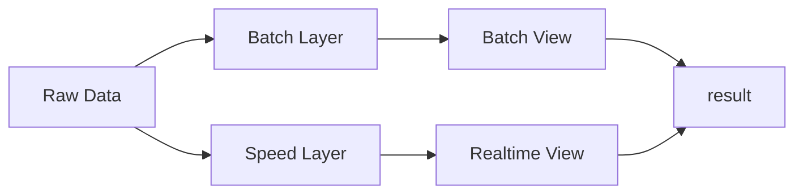

# 并发计算模型

> The world is concurrent
>
> Concurrency is the key to responsive systems.

###  CPU Bit级别的并行

为什么32bit架构的计算机要比8bit的更快？因为32bit可以同时处理更多的bit

### CPU指令级别的并行

- 现代CPU高度并行的
  - pipelining
  - out-of-order execution
  - speculative execution

但如今CPU单核的处理能力很难再有提升， 迫使我们转向利用多核心

### 数据并行(SIMD:Single Instruction Multiple Data)

一种能够在大规模数据上应用单一运算的解决方案。典型的例子是图像处理，GPU对位图进行重复运算，比如调整亮度，这就是为什么GPUs可以充当数据并行处理器。但这种方法并不适合所有的场合。


### Task并行化，多处理器

- Shared Memory System
- Distributed Memory System

通过内存通讯更加的迅速可靠，所以基于SharedMemory的多处理器编码简单很多。很多异常不需要特别处理。但超过一定数目的处理器，共享内存就成为扩展的瓶颈。你就必须使用分布式内存系统，这就需要编写程序的时候考虑更多的容错，比共享内存系统开发难度更高。


### Concurrent

## Threads + Locks

- Mutual Exclusion: 计数问题

- Race Condition

- Deadlocks
  
  - Dining philosophers
  
- Java
  - Intrinsic Locks : 不可中断，不能设置Timeout
  - Reentran Locks : 可被中断，可设置Timeout
  
- Livelock: 所有的线程在获取锁的操作全部Timeout, 

- Condition Variables: 并发变成通常需要等待某个事情发生， 否则阻塞当前线程（我是不是要等一等？）

  - 需要配合一把锁， 在使用Condition 等待之前，用这把锁lock

  - 条件满足，unlock走人

  - 条件不满足，Condition调用await()会做一个阻塞当前线程，同时unlock的原子操作,  其他线程就可以使用Condition了。

  - 当Condition的signal或signalAll被调用后， await不再阻塞并且再次lock(时机已到，赶紧抢票，但是你未必能强到票，所以就在一个循环里不断等待尝试直到成功)

    ```go
    c.L.Lock()
    for !condition() {
        c.Wait()
        // access shared resource
    }
    c.L.Unlock()
    ```

    ```java
    ReentrantLock lock = new ReentrantLock();
    Condition condition = lock.newCondition();
    lock.lock();
    try {
    	while (! « condition is true » ) {
    		condition.await();
    		// access shared resource
    	}
    } finally { 
        lock.unlock(); 
    }
    ```

    

- Read/Write locking

- Fine-grained locking (mutex and read/write)

  - 把资源分割成更小的部分，拥有更系细力度的锁，通常操作需要不止一把锁来完成
  - 实现的时候需要非常小心
  - 并发性好
  - Hand Over Hand Locking:  在操作链表的时候不是锁住整个链表，而是锁住要操作的节点，比如insert操作可能需要最多锁住两个节点

- Coarse-grained mutual exclusion: 

  - 所有操作用一把锁搞定一切
  - 实现简单
  - 并发性有瓶颈

- optimistic locking

- lock-free/nonblocking algorithms

  - inc&get, get&inc
  - Atomatic Variables通常是用Lock-Free但算法实现,  不用你自己去管理锁(彻底摆脱DeadLock)

- lazy synchronization

- Copy On Write

> no-blocking, unbounded并非总是好事，当生产速度大于消费速度的时候队列会不断消耗内存

```     
题目: 从50G文本文件中统计出词频， 快者获胜
```


## Functional Programming

因为共享内存(Shared Mutable State)，所以需要锁来保护，假如内存不会被改变，那就不再需要锁。这使得函数变成语言具有天生的并发能力。


> Referential Transparency: 是一种程序中表达式被等价表达式替换不会有任何影响的能力，本质上要求表达式是纯净的，没有任何外部IO,  在数学中所有的表达式都具备这样的性质，但是在计算机程序语言则不一定。

## The Clojure Way : Separating Identity And State

- STM: http://gcc.gnu.org/wiki/TransactionalMemory

## Actors

	- Actor本身有mailbox, 可以接受消息
	- Actor内部的状态是不能被其他Actor所访问的
 - Actor一个接一个的处理mailbox中的消息
   - 根据消息创建更多的Actor
   - 根据当前消息改变处理下一条消息的策略
   - 运算并将结果投递到其他Actors的mailbox

Actors是广泛使用的并发编程模型， 本身还具备分布式的能力。

- Erlang
- Elixir: Based Erlang VM
- Akka: Based JVM

## CSP

CSP强调的是channels, 与Actors模型不同, channel是一种资源，并不属于任何对象， 可以被独立创建使用传递。

> Channels is the frist class
>
> Channels == thread-safe queue

- unbuffered channels: write blocked until someone read
- buffered channels: write unblocked
- 在CSP中unbuffered channels使用的更加频繁？？


> ThreadingPools仍然是非常好的解决方案，有其实针对CPU-intensive的任务，运算完毕交回给线程池，然后处理后面的运算任务。但是当遇到通讯的时候，我们就不得不阻塞当前线程了。为此我们又会转向event-driven, 但是event-driven会把代码执行逻辑打散，代码可读性降低，维护成本变高。更不可控的是，event handler可以为以后的handler保存状态，这就陷入到global state的麻烦，我们知道这对并发编程并不友好。


CSP Vs. Actors

Actors本身包含了通讯机制(mailbox), CSP则是channel is first class, channel可以在程序之间传递，因此灵活性更高。

```
Rich Hickey, creator of the Clojure language, explained his reasons for
choosing CSP over actors like this:

I remain unenthusiastic about actors. They still couple the producer with the
consumer. Yes, one can emulate or implement certain kinds of queues with actors
(and, notably, people often do), but since any actor mechanism already incorporates
a queue, it seems evident that queues are more primitive.
```


## Data Parallelism

## Lambda

> Lambda Architecture is a general way to compute functions on all your data at once

主要用来处理大数据。



- Batch Layer: 利用Batch-oriented技术，如MapReduce等计算历史数据，效率高，但是延迟也高
  - Map Reduce
- Speed Layer: 利用实时技术，如stream processing等创建事实数据视图，弥补延时问题
  - Stream Processing

Lambda基于几个已经存在的技术:

 	1. Map Reduce
      	1. 始于google
      	2. Apache Hadoop是Google Map Reduce的开源实现
      	3. EMR: Amazon Elastic MapReduce
 	2. Stream Processing
      	1. Storm

## 其他

	- Tuple Space
	- Grid Computing
	- Reactive Programming


## 参考

	- http://fileadmin.cs.lth.se/cs/Education/EDA015F/2013/Herlihy4-5-presentation.pdf
	- http://hjemmesider.diku.dk/~vinter/xmp/lecture3.pdf
	- Brian Goetz. Java Concurrency in Practice. Addison-Wesley, Reading, MA


