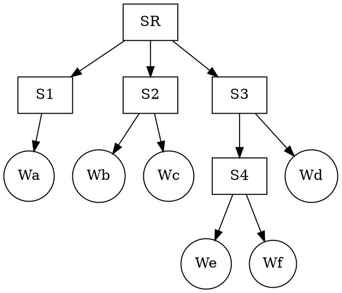
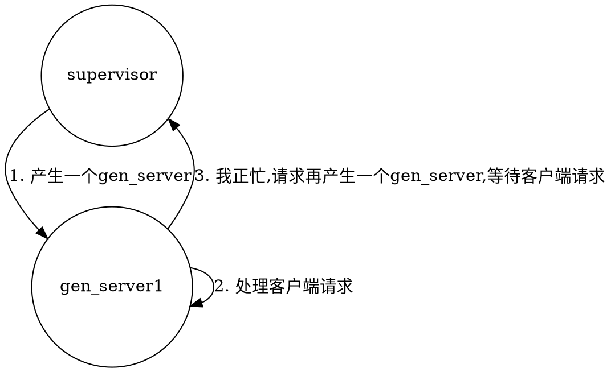

<!-- toc -->
# Annotations 
 * -export
 * -module
# -export 
声明模块中的公有函数.
```
-export([f1,f2,...,fn]).
```
比如:
```
-export([show/2]).
```
# -compile 
将模块中的所有函数都公开出去,下面这个做法是很偷懒地.
```
-compile(export_all).
```
# -author 
开发者信息.
```
-author(amas@gmail.com).
```
# Erlang Arithmetic Operators 
|+  | Unary + Integer | Float |
|−  | Unary − Integer | Float |
|*  | Multiplication Integer | Float |
|/  | Floating-point division Integer | Float |
|div| Integer division Integer  |
|rem| Integer remainder Integer |
|+  |Addition Integer | Float   |
|−  | Subtraction Integer | Float|
# 逻辑运算符
|and    | 与 |
|andalso| Shortcut evaluation of and: returns false if the first argument is false, without evaluating the second
|or     | Returns true if either of the arguments is true
|orelse | Shortcut evaluation of or: returns true if the first argument is true, without evaluating the second Operator Description
|xor    | “Exclusive or”: returns true if one of its arguments is true and the other false
|not    | Unary negation operator: returns true if its argument is false, and vice versa
# 比较运算符(Comparison Operators)
| ==  | Equal to
| /=  | Not equal to
| =:= | Exactly equal to
| =/= | Exactly not equal to
| =<  | Less than or equal to
| <   | Less than
| >=  | Greater than or equal to
| >   | Greater than
# Erlang  Atoms 
用以表示非数值常量
 * 小写字幕开头
 * 可以被单引号括起
 * Atom的值即Atom本身(Self-indicating identifiers)
```
atom
this_is_an_atom
‘I am also an atom’
```
```
#!erl-sh
19> hello.
hello
20> Hello.
* 1: variable 'Hello' is unbound
21> 'Hello'.
'Hello'
```
# Bit Syntax Expressions 
# <<>> 
# <<E1, E2, ..., En>> 
```erl
Ei = Value | Value:Size | Value/TypeSpecifierList | Value:Size/TypeSpecifierList
```
 * Size必须是 BoundVariable / 结果是整数的Expr
 * Size总和要保证是8的倍数，因为Binary的基本单位是Bytes
 * Value必须是 BoundVariable / Strings / 结果是整数|Floating|Binaries的Expr  
 * TypeSpecifierList : 
   * @type End = [big] | little | native 
   * @type Sign = signed | [unsigned]
   * @type Type = [integer] | float | binary
   * @type Unit = 1 | 2 | ... 255 : The total size of the segment is Size x Unit bits long.
     1. 必须大于等于 0
     2. 必须8的倍数
```erl
35> {<<16#12345678:32/big>>, <<16#12345678:32/little>>, <<16#12345678:32/native>>, <<16#12345678:32>>}.
{<<18,52,86,120>>,
 <<120,86,52,18>>,
 <<120,86,52,18>>,
 <<18,52,86,120>>}
```
# Real World Examples 
 1. Finding the synchronization frame in MPEG data 
 2. Unpacking COFF data 
```c
typedef struct _IMAGE_RESOURCE_DIRECTORY 
{ DWORD Characteristics; 
  DWORD TimeDateStamp; 
  WORD MajorVersion; 
  WORD MinorVersion; 
  WORD NumberOfNamedEntries;
  WORD NumberOfIdEntries;
} IMAGE_RESOURCE_DIRECTORY, *PIMAGE_RESOURCE_DIRECTORY;
```
```erl
-define(DWORD, 32/unsigned-little-integer). 
-define(LONG, 32/unsigned-little-integer). 
-define(WORD, 16/unsigned-little-integer). 
-define(BYTE, 8/unsigned-little-integer).
unpack_image_resource_directory(Dir) -> <<
Characteristics:       ?DWORD,
TimeDateStamp:         ?DWORD,
MajorVersion:          ?WORD,
MinorVersion:          ?WORD,
NumberOfNamedEntries : ?WORD,
NumberOfIdEntries :    ?WORD, 
_/binary>> = Dir, ...
```
 3. Unpacking the header in an IPv4 datagram
# Build Web Application with Erlang
# Erlang Concurrent Programming 
# Erlang Processes 
 1. Create/Destory proccesses 非常迅速
 2. Processes 间发送消息非常迅速
 3. Processes 的行为与OS级的进程类似
 4. 超多Processes并存
 5. Processes 之间并不共享内存，完全独立
 6. Processes 之间只能通过 MessagePassing 互通。
基于以上几点，Erlang也被称为 PureMessagePassingLanguage .
# The Concurrency Primitives  
 * spawn
 * send 
 * receive
# Pid = spawn(Fun) =
 1. 建立 Process， Pid为 Process的唯一标识， 可以通过Pid向该Process发送Message.
 2. 对Fun求值
# Pid ! Message =
'!'又称 SendOperator.
 * 向Pid发送Message, 为异步消息。
 * SendOperator 返回 Message本身。(这样便于把一个消息发送到多个进程)
```
向多个Process发送Message可以这样表达:
Pid1 ! Pid2 ! ... ! PidN ! M.
(1) Pid1 ! Pid2 ! ... ! (PidN ! M).
(2) Pid1 ! Pid2 ! ... ! M.
(3) ...
(4) Pid1 | M.
(5) M.
```
# receive ... end =
 * 接受Process收到的 Message
```
#!erl
receive
    Pattern1 [when Guard1] ->
        Expressions1;
    Pattern2 [when Guard2] ->
        Expressions2;     
    ... 
end
```
# 最简单的Server 
现在我们来建立一个Process, 用来计算面积:
area_server.erl:
```
#!erl
-module(area_server).
-export([loop/0]).
loop() ->
    receive
        {rect, W, H} ->
            io:format("area(RECT) : ~p~n", [W * H]),
            loop();
        {circ, R} ->
            io:format("area(CIRC) : ~p~n", [3.1415926 * R * R]),
            loop();
        Other ->
            io:format("area(?) : ~p~n", [Other]),
            loop()
    end.
```
```
#!erl-sh
20> c(area_server).
{ok,area_server}
21> Pid = spawn(fun area_server:loop/0).
<0.85.0>
22> Pid ! {rect, 3, 3}.                 
area(RECT) : 9
{rect,3,3}
23> Pid ! {t,1,2,3}.                    
area(?) : {t,1,2,3}
{t,1,2,3}
```
# 改进Server 1 
```
#!erl
-module(area_server).
-export([loop/0, rpc/2]).
rpc(Pid, Request) ->
    Pid ! {self(), Request},
    receive
        Response ->
            Response
    end.
loop() ->
    receive
        {From, {rect, W, H}} ->
            % io:format("area(RECT) : ~p~n", [W * H]),
            From ! W * H,
            loop();
        {From, {circ, R}} ->
            % io:format("area(CIRC) : ~p~n", [3.1415926 * R * R]),
            From ! 3.1415926 * R * R,
            loop();
        {From, Other} ->
            % io:format("area(?) : ~p~n", [Other]),
            From ! {error, Other},
            loop()
    end.
```
```
#!erl-sh
33> c(area_server).
{ok,area_server}
34> Pid = spawn(fun area_server:loop/0).
<0.115.0>
35> area_server:rpc(Pid, {rect1, 2,3}). 
{error,{rect1,2,3}}
36> area_server:rpc(Pid, {rect, 2,3}). 
```
 * self() 为当前进程的PID
 * Server 处理请求后，将结果返回给 Client
 * Client 接收Server的消息直接返回
```
#!div class=warn
Client实际上是在接受任何可能接受到的信息，如果在等待Server的计算结果到来之前，其他进程发消息给Client, 显然Client也可以收到， 而我们只希望Client接受对口Server发来的信息， 因此我们还需要进一步改进。
```
# 改进Server3 
通过传递彼此的PID, Client与Server之间就可以不受干扰的通讯了。 可以说， PID在通讯中充当了一种非常重要的上下文信息。
```
#!erl
-module(area_server).
-export([loop/0, rpc/2]).
rpc(Pid, Request) ->
    Pid ! {self(), Request},
    receive
        {Pid, Response} ->
            Response
    end.
loop() ->
    receive
        {From, {rect, W, H}} ->
            % io:format("area(RECT) : ~p~n", [W * H]),
            From ! {self(), W * H},
            loop();
        {From, {circ, R}} ->
            % io:format("area(CIRC) : ~p~n", [3.1415926 * R * R]),
            From ! {self(), 3.1415926 * R * R},
            loop();
        {From, Other} ->
            % io:format("area(?) : ~p~n", [Other]),
            From ! {self(), {error, Other}},
            loop()
    end.
```
```
#!erl-sh
33> c(area_server).
{ok,area_server}
34> Pid = spawn(fun area_server:loop/0).
<0.115.0>
35> area_server:rpc(Pid, {rect1, 2,3}). 
{error,{rect1,2,3}}
36> area_server:rpc(Pid, {rect, 2,3}). 
```
更进一步，出于模块设计的考虑，我们将程序进一步模块化， 对于Client关心的操作归纳为:
 1. 启动Server
 2. 请求Server运行一个计算，并返回结果
最后，我们得到如下结果:
```
#!erl
-module(area_server).
-export([start/0, area/2]).
start() -> spawn(fun loop/0).
area(Pid, What) ->
    rpc(Pid, What).
rpc(Pid, Request) ->
    Pid ! {self(), Request},
    receive
        {Pid, Response} ->
            Response
    end.
loop() ->
    receive
        {From, {rect, W, H}} ->
            % io:format("area(RECT) : ~p~n", [W * H]),
            From ! {self(), W * H},
            loop();
        {From, {circ, R}} ->
            % io:format("area(CIRC) : ~p~n", [3.1415926 * R * R]),
            From ! {self(), 3.1415926 * R * R},
            loop();
        {From, Other} ->
            % io:format("area(?) : ~p~n", [Other]),
            From ! {self(), {error, Other}},
            loop()
    end.
```
Client的调用:
```
#!erl-sh
41> Pid = area_server:start().
<0.133.0>
42> area_server:area(Pid, {rect, 3, 4}).
12
```
# ErlangVM最多支持多少进程 ? 
```
#!erl-sh
43> erlang:system_info(process_limit).  
32768
```
启动erl时指定最大进程数为500000(并不是指定多少就能支持多少，主要取决于操作系统以及Erlang的版本):
```
#!sh
$ erl +P 500000
```
# ErlangVM建立进程的开销有多大 ? 
我们来测试下:
```
#!sh
# Arch Linux
$ Linux myhost 2.6.35-ARCH #1 SMP PREEMPT Sat Oct 30 19:57:05 UTC 2010 i686 Intel(R) Core(TM)2 Quad CPU Q6600 @ 2.40GHz GenuineIntel GNU/Linux
```
测试程序: 
```
#!erl
-module(proc_benchmark).
-export([max/1]).
max(N) -> 
    Max = erlang:system_info(process_limit),
    io:format("Maximum allowed processes:~p~n",[Max]),
    statistics(runtime),
    statistics(wall_clock),
    L = for(1, N, fun() -> spawn(fun() -> wait() end) end),
    {_, Time1} = statistics(runtime),
    {_, Time2} = statistics(wall_clock),
    lists:foreach(fun(Pid) -> Pid ! die end, L),
    U1 = Time1 * 1000 / N,
    U2 = Time2 * 1000 / N,
    io:format("Process spawn time=~p (~p) microseconds~n", [U1, U2]).
wait() ->
    receive
        die -> void
    end.
for(N, N, F) -> [F()]; 
for(I, N, F) -> [F()|for(I+1, N, F)].
```
```
#!erl-sh
Erlang R14B (erts-5.8.1) [source] [smp:4:4] [rq:4] [async-threads:0] [hipe] [kernel-poll:false]
Eshell V5.8.1  (abort with ^G)
1> erlang:system_info(process_limit).
32768
2> c(proc_benchmark).                
{ok,proc_benchmark}
3> proc_benchmark:max(20000).
Maximum allowed processes:32768
Process spawn time=3.5 (3.1) microseconds
ok
4> proc_benchmark:max(25000).
Maximum allowed processes:32768
Process spawn time=4.0 (3.12) microseconds
ok
5> proc_benchmark:max(30000).
Maximum allowed processes:32768
Process spawn time=4.0 (3.1333333333333333) microseconds
ok
```
# 处理Timeout 
```
#!erl
receive
    Pattern1 [when Guard1] ->
        Expressions1;
    Pattern2 [when Guard2] ->
        Expressions2;     
    ... 
after Time ->
    ExpressionsForTimeout
end
```
 * 单位时间为milliseconds
 * Time毫秒之内Process没有收到消息，则去对 ExpressionsForTimeout 求值
# 1. 只有Timeout部分 
你也可以只有Timeout部分，比如sleep一段时间，我们可以这样:
```
#!erl
sleep(T) -> 
    receive 
    after T -> 
        true
    end.
```
# 2. Timeout 为 0 
下面这段程序用来清理ProccessMailbox中的所有消息。
```
#!erl
clear_mailbox() ->
 receive
    _Any -> 
        clear_mailbox()
 after 0 ->
    true
 end
```
 * 如果 ProcessMailbox 中有任何消息， 则继续调用clear_mailbox（）。
 * 一旦 ProcessMailbox 中无信息， 立刻Timeout, 返回true
假如没有这个Timeout 0, 当ProcessMailbox无任何消息时， clear_mailbox()会永远被Suspend.
```
#!erl
priority_receive() -> 
    receive 
        {alarm, X} -> {alarm, X}
    after 0 -> 
        receive 
            Any -> Any
        end 
    end.
```
 * 如果消息非{arlam, X}, 则priority_receive收到该 ProcessMailbox 中的第一条消息
 * 如果收到{alarm, X},则立即返回
 
```
#!div class=warn
注意， 假设 ProcessMailbox 中有N条消息， 当这N条消息都按照receive 中指定的Pattern进行Match之后， 才会转入处理after 0部分的代码。
以上个例子来说明:
[Mailbox] : {M1, M2, {alarm, 1}}
 1. 检查Mailbox中的所有Message, 发现有{alarm, 1} 可以与 receive 中的 {alarm, X} 匹配， 则立刻返回{alarm, 1}
假如:
[Mailbox] : {M1, M2}
 1. 检查Mailbox中的所有Message， 都不能与{alarm, X}匹配， 则执行after 0 部分的代码
 2. after 0 部分返回任何消息，依次返回M1, M2.
Note: Using largemailboxes with priority receive is rather inefficient, so if you’re going to use this technique, make sure your mailboxes are not too large.
```
# 3. 无限等待 
```
#!erl
wait_for_ever() ->
    receive
    after infinit
    end.
```
# Timer实现 
现在我们来实现一个Timer, 这个Timer在N毫秒后，对一个指定的函数求值。
```
#!erl
-module(stimer).
-export([start/2, cancel/1]).
start(Time, Fun) -> spawn(fun() -> timer(Time, Fun) end).
cancel(Pid) -> Pid ! cancel.
timer(Time, Fun) ->
    receive 
        cancel ->
            void
    after Time ->
            Fun()
    end
```
```
#!erl-sh
5> Pid = stimer:start(5000, fun() -> io:format("timer event~n") end).
<0.43.0>
timer event
% 5秒后打印出"timer event"
```
# Selective Receive 
```
#!graphviz
digraph G {
node[shape=record];
ProcA -> ProcB
}
```
向一个Process发送消息，实际上是向该 Process 的 ProcessMailbox 中追加消息， 该 Process receive消息，实际上是从自己的ProcessMailbox 移出消息。这是个生产者／消费者的模型。
这个Process中的 receive 操作，实际上是检查 ProcessMailbox。 还记得一切都是Expressions么？ receive也是Expressions， 我们可以想到，当receive被求值的时候，就是检查 ProcessMailbox的时候。
```
# receive 是怎么工作的 ? 
 1. 当对receive求值时, 如果receive中有after T, 则启动一个Timer(T, TimoutExpressions)
 2. 从 ProcessMailbox 取出第一个消息， 看看能否与 receive 中的 Pattern1, Pattern2 ... 匹配， 
  2.1 如果匹配则对Pattern对应的 Expressions 求值。并且删除该消息。
  2.2 如果没有任何匹配，该消息也被删除，但是保存到 SaveQueue 中，而后取出第二条消息，返回2.
 3. 如果 ProcessMailbox 中没有任何能够匹配的消息，进程被 Suspend。当有新消息到来时， SaveQueue中的消息不参与新一轮的匹配。除非刚到的消息可以匹配。
  * 一旦出现匹配消息， 则 SaveQueue 中的全部消息，将按照他们当年出现在 ProcessMailbox 中的先后顺序，再一次出现在 ProcessMailbox 中
  * 一旦出现匹配消息，如果之前设置了Timer，则立刻清除
 4. 如果一直没有出现匹配消息，Timer也到时间了(TimerElapses), 则立刻对TimoutExpressions求值， SaveQueue中的全部消息归还到 ProcessMailbox 中。
```
# Register Processes 
我们可以了解到，为有知道进程的PID, 才能向其发送消息。在实践中， 你会发现到处都飘满PID, 其好处是安全，坏处是不方便.
在Erlang中， 我们可以给PID起一个名字， 实际上是将PID跟Atom帮定在一起， 这样你就不用到处传PID了， 需要向某个进程发送消息，可以通过这个名字。
我们把这样的进程叫做RegisteredProcess。有4个BIFs负责处理这件事:
 * register(AnAtom, Pid) : 注册
 * unregister(AnAtom) : 注销
 * whereis(AnAtom) -> Pid | undefined : 查看AnAtom是否已经注册了，如果已经注册，返回Pid, 否则返回undefined
 * registered() -> [AnAtom::atom()] : 列出系统中已经注册的全部进程.
我们看看启动erl后都有那些已注册的进程:
```
#!erl-sh
6> registered().         
[code_server,file_server_2,kernel_safe_sup,user_drv,
 application_controller,standard_error,standard_error_sup,
 global_group,init,erl_prim_loader,rex,error_logger,user,
 inet_db,kernel_sup,global_name_server]
```
# 并发程序的模板 
```
#!erl
-module(cp_template).
-compile(export_all).
start() -> spawn(fun() -> loop([]) end).
rpc(Pid, Request) -> 
    Pid ! {self(), Request}, 
    receive 
        {Pid, Response} -> Response
    end.
loop(X) -> 
    receive 
        Any -> io:format("Received:~p~n",[Any]), 
               loop(X)
end.
```
----
# 设计可以容错的并发程序 
Erlang顺序程序的设计中提到了如何处理异常，在并发程序中处理异常为其延伸，我们需要接触3个新的概念:
 * ErlangLinks
 * ErlangExitSignals
 * ErlangSystemProcess.
# Linking Porcesses 
之前我们看到的进程都是彼此独立的， 现在我们看看有依赖关系的进程。
假如有进程A, B, A的工作依赖于B，显然A有必要关心B的健康状况。
在Erlang中，通过link(P)将A/B两个进程连接在一起， A/B彼此之间会观察对方的运行状况，任一方挂了，都会给对方发送 ExitSignals.
```
# 当进程收到 ExitSignals 后会发生什么? 
 * 如果进程不处理ExitSignals, 该进程会立刻结束。
如果一个进程处理ExitSignals (Trap ExitSignals), 则此进程被成为 ErlangSystemProcess. 
如果一个进程A与 ErlangSystemProcess B 连接到一块了， 如果A不小心挂了， B不会立刻也跟着结束， 而是接受到A发来的 ExitSignals, B转入到 ExitSignals处理。
```
# on_exit Handler 
 * on_exit(Pid, Fun)
进程挂之前，会得到一个立遗嘱的机会，就是这个on_exit(Pid, Fun)函数。
一个进程怎样变成 ErlangSystemProcess ?
 * process_flag(trap_exit, true) : 将trap_exit设为true, 进程就变为 ErlangSystemProcess
现在我们来演示一下如何使用on_exit获得进程的遗嘱:P.
```
#!erl
-module(lib_misc).
-compile(export_all).
% spawn a system process and linked to the Pid for monitor the signal of Pid.
% If Pid die, the spowned system process will eval the Fun.
on_exit(Pid, Fun) ->
    spawn(fun() ->
                process_flag(trap_exit, true),
                link(Pid),
                receive
                    {'EXIT', Pid, Why} ->
                        Fun(Why)
                end
            end).
```
```
#!erl-sh
31> F = fun() -> receive X -> list_to_atom(X) end end.
#Fun<erl_eval.20.67289768>
32> Pid = spawn(F).
<0.103.0>
33> lib_misc:on_exit(Pid, fun(Why) -> io:format(" ~p died with:~p~n",[Pid, Why]) end).
<0.105.0>
34> Pid ! {[1,2]}.
 <0.103.0> died with:{badarg,[{erlang,list_to_atom,[{[1,2]}]}]}
=ERROR REPORT==== 19-Dec-2010::01:27:01 
Error in process <0.103.0> with exit value: {badarg,[{erlang,list_to_atom,[{[1,2]}]}]}
{[1,2]}
```
我们给Pid配了一个 ErlangSystemProcess,  专门处理 Pid 发来的 ExitSignals, 当出现 ExitSignals时， 它就对 Fun求值。
上面的例子中，故意给Pid发送了一个错误的参数，致其死亡。 最终F被求值。
# Remote Handling of Errors 
通过上面的例子，我们发现，一个进程一旦出了问题，可以不必在该进程中处理， 这就是 RemoteHandlingOfError, 更进一步， 
异常处理也不必非要局限在同一台机器的其他进程上， 也可以是另外一台机器的某个进程。这样的容错性可以使Erlang很容易实现分布式系统。
# 怎样Trapping Exits ? 
# 1. 我建立了一个进程， 我不关心它是否会崩溃，要是它崩溃了，可别连累我 
```
Pid = spawn(fun() -> ... end)
```
# 2. 如果我建立的进程死了， 我也不想活了 
```
Pid = spawn_link(fun() -> ... end)
```
注意，这里为什么我会跟着结束， 是因为我并没有对 ErlangExitSignals 做任何处理， 同时也说明我不是 ErlangSystemProcess, 所以默认行为就是跟着LinkedProcess一起死。
# 3. 如果我建立的进程死了， 我需要拯救它，或者知道他的死因 
这件事儿只能由 ErlangSystemProcess 来做。
```
#!erl
%% 变身为 ErlangSystemProcess
process_flag(trap_exit, true), 
Pid = spawn_link(fun() -> ... end), 
... 
loop(...).
loop(State) -> 
    receive {'EXIT', SomePid, Reason} -> 
        %% do something with the error loop(State1);
        ... 
    end
```
# Race Conditions 
```
#!erl
% keep_alive 相当于先spawn,再link(在on_exit中),
% 假如在register执行完毕的时候，on_exit没执行之前进程挂了，则相当于没link，而我们知道
% 没link的进程死了也没人知道，所以keep_alive可能名不符实。
%
% 这里想说明的是，有些操作必须是原子的，否则在并发情况下会闹出乱子，此种情形下需要使用spawn_link()
% 而不是这个keep_aliv.
%
% 当你把spawn / spawn_link / register这些手段组合在一起的时候，要警惕RaceConditions这种野兽
keep_alive(Name, Func) ->
    register(Name, Pid = spawn(Func)),
    on_exit(Pid, fun(_Why) -> keep_alive(Name, Fun) end).
```
# Monitor 
 * See: ErlangMonitors
 
# ErlangCookieSystem 
Each node has a single cookie, and this cookie must be the same as the cookies of any nodes to which the node talks. 
To ensure this, all the ErlangNodes in a distributed Erlang system must have been started with the same magic cookie or have their cookie changed to the same value by evaluating erlang:set_cookie
# MagicCookie 
两个 ErlangNodes 之间通信， 他们必须使用相同的 MagicCookie.
有三种方法:
 1. 将cookie保存在 ~/.erlang.cookie 中，其中是ErlangShell第一次启动后填充的随机字符.
这东西可以拷贝到其他节点上，拥有相同cookie的节点就能相互通讯了。
```
#!sh
# 安全起见，我们把这个cookie设置为仅当前用户可以读写。
$ chmod 400 .erlang.cookie
```
 
 2. -setcookie 参数
```
#!sh
$ erl -setcookie UVIMOZOCIBJMWOOWWFGO ...
```
 3. erlang:set_cookie(node(),C)
  * C: MagicCookie (比如2中的: UVIMOZOCIBJMWOOWWFGO)
```
#!div class=note
如果不能确定环境十分安全，1/3比2要更加安全。因为方法2中，其他用户可以使用ps得到这个cookie.
```
Distributed Erlang 的Sessions并不加密，但是这个Sessions可以建立在加密的信道(Channels)中。
# ErlangDistributedProgramming 
# 为什么我们需要分布式编程 
 * 性能: 
 * 可靠(容错): 一台机器挂了，另外的机器会代替它工作
 * 可扩展（Scalability）: 如果系统超负荷，通过添加机器即可
 * IntrinsicallyDistributedApplication
# 2种模型 
# 1. Distributed Erlang (简单 + 较安全) 
Provides a method for programming applications that run on a set of tightly coupled computers.1 In distributed Erlang, programs are written to run on Erlang nodes. We can spawn a process on any node, and all the message passing and error handling primitives we talked about in previous chap- ters work as in the single node case.
Distributed Erlang applications run in a trusted environment since any node can perform any operation on any other Erlang node, a high degree of trust is involved. Typically distributed Erlang applications will be run on clusters on the same LAN and behind a firewall, though they can run in an open network.
# 2. Socket-based distribution (更加安全) 
we can write distributed applications that can run in an untrusted environment. 
The programming model is less powerful than that used in distributed Erlang but more secure.
有两个标准库用于分布式Erlang:
 1. rpc    : RPC 服务
 2. global : 名字, 锁, 维护
# how to start an Erlang node 
# how to perform a remote procedure call on a remote Erlang node 
```
# 怎样编写分布式程序的一般步骤 
 1. 编写程序的非分布式版本，测试／调试完毕。
 2. 在同一台机器的两个 ErlangNodes 上测试程序。
 3. 在不同机器的两个 ErlangNodes 上测试程序。
```
现在来造个程序，它能够提供这样的服务:
 1. store(Key, Value) 保存一对K/V值
 2. lookup(Key) 查找Key对应的值
# 1. 非分布式版本: 
```
-module(kvs).
-compile(export_all).
start() -> register(kvs, spawn(fun() -> loop() end)).
store(K, V) -> rpc({store, K, V}).
lookup(K) -> rpc({lookup, K}).
rpc(Q) ->
    kvs ! {self(), Q},
    receive
        {kvs, Reply} -> 
            Reply
    end.
loop() ->
    receive
        {From, {store, K, V}} ->
            put(K, {ok, V}),
            From ! {kvs, true},
            loop();
        {From, {lookup, K}} ->
            From ! {kvs, get(K)},
            loop()
    end.
```
你可以打开一个 ErlangShell 测试一下，确保没有问题。
# 2. 在同一台机器的两个 ErlangNodes 上测试程序 
gandalf节点:
```
$ erl -sname gandalf
(gandalf@localhost) 1> kvs:start(). 
true
```
在bilbo节点上使用gandalf的kvs服务
```
#!sh
$ erl -sname bilbo 
(bilbo@localhost) 1> rpc:call(gandalf@localhost, kvs,store, [weather, fine]).
true 
(bilbo@localhost) 2> rpc:call(gandalf@localhost, kvs,lookup,[weather]).
{ok,fine}
```
# rpc:call(Node, Mod, Func, [Arg1, Arg2, ..., ArgN]) 
 * Node
 * Mod
 * Func
 * [Arg1, Arg2, ..., ArgN]
远程调用 ErlangNodes 上的 Mod:Func(Arg1, Arg2, ..., ArgN).
现在客户端和服务器运行在本机的不同节点了， 下面我们让C/S运行在不同机器上的不同节点下。
# 3.C/S运行在相同LAN下的不同机器上 == 
```
doris $ erl -name gandalf -setcookie abc 
(gandalf@doris.myerl.example.com) 1> kvs:start(). 
true
% Step 2: Start an Erlang node on george, and send some commands to gandalf:
george $ erl -name bilbo -setcookie abc 
(bilbo@george.myerl.example.com) 1> rpc:call(gandalf@doris.myerl.example.com, kvs,store,[weather,cold]).
true 
(bilbo@george.myerl.example.com) 2> rpc:call(gandalf@doris.myerl.example.com, kvs,lookup,[weather]).
{ok,cold}
```
  1. -name : 
  2. -setcookie :
   * 必须使用相同的cookie
```
#!class=note
 1. Start Erlang with the -name parameter. 
    * two nodes on the same machine, use “short” names (-sname)
    * two nodes on different networks, use names (-name).
    * two nodes on the same subnet, we can use both of them, but the (-sname) way is not DNS service required.
 2. 确保C/S节点间使用相同的 Cookie
    * -setcookie
```
#!sh
# 同一台机器上的不同节点使用~/.erlang.cookie
$ cat ~/.erlang.cookie                                                                    ~
UVIMOZOCIBJMWOOWWFGO% 
```
 3. Make sure the fully qualified hostnames of the nodes concerned are resolvable by DNS. In my case, the domain name myerl. example.com is purely local to my home network and is resolved locally by adding an entry to /etc/hosts.
 4. Make sure that both systems have the same version of the code that we want to run.
  * 这里说的是分布式，分布式意味着同一份代码放在不同的机器上，提供相同的服务，并不等同于rpc, 所以每个节点上都部署相同的代码。
  * 务必确保不同节点上的Erlang的版本相同。
```
# 4. C/S运行在Internet下的不同机器上 
这个跟3类似，但是节点分散在Internet上，你就必须考虑安全问题。3不存在问题，因为LAN通常有Firewall保护。LAN内部是非常安全的。
 1. Port 4369 必须为TCP/UDP打开，这端口为epmd(ErlangPortMapperDaemon)所使用.
 2. 选择 PortRange 供 DistributedErlang.
```
$ erl -name ... -setcookie ... -kernel inet_dist_listen_min Min  inet_dist_listen_max Max
```
  * Min : 低口
  * Max : 高口
  * Min 等于 Max : DistributedErlang 使用一个端口
```
#!div class=note
查看nodes之间是否联通，可使用net_adm, 参看手册。
1> net_adm:ping(Node) 
```
# Distribution Primitives 
 * ErlangDistributionPrimitives
# Libraries 
通常我们不需要使用ErlangDistributionPrimitives， 因为已经有
很强壮的库供程序员使用，使我们不必关注太复杂的事情。
 * rpc : provides a number of remote procedure call services.
 * global : functions for the registration of names and locks in a distributed system and for the maintenance of a fully connected network.
```
# The single most useful function in the module rpc is the following function 
 * call(Node, Mod, Function, Args) -> Result | {badrpc, Reason} 
This evaluates apply(Mod, Function, Args) on Node and returns the result Result or {badrpc, Reason} if the call fails.
```
 
The BIFs that are used for writing distributed programs are as follows:7
# @spec spawn(Node, Fun) -> Pid 
This works exactly like spawn(Fun), but the new process is spawned on Node.
# @spec spawn(Node,Mod, Func, ArgList) -> Pid 
This works exactly like spawn(Mod, Func, ArgList), but the new pro- cess is spawned on Node. spawn(Mod, Func, Args) creates a new process that evaluates apply(Mod, Func, Args). It returns the PID of the new process.
```
#!div class=note
Note: This form of spawn is more robust than spawn(Node, Fun). spawn(Node, Fun) can break when the distributed nodes are not running exactly the same version of a particular module.
```
# @spec spawn_link(Node, Fun) -> Pid 
This works exactly like spawn_link(Fun), but the new process is spawned on Node.
# @spec spawn_link(Node, Mod, Func, ArgList) -> Pid 
This works like spawn(Node,Mod, Func, ArgList), but the new process is linked to the current process.
# @spec disconnect_node(Node) -> bool() | ignored 
This forcibly disconnects a node.
# @specmonitor_node(Node, Flag) -> true 
If Flag is true, monitoring is turned on; if Flag is false, monitoring is turned off. If monitoring has been turned on, then the process that evaluated this BIF will be sent {nodeup, Node} and {nodedown, Node} messages if Node joins or leaves the set of connected Erlang nodes.
# @spec node() -> Node 
This returns the name of the local node. nonode@nohost is returned if the node is not distributed
# @spec node(Arg) -> Node 
This returns the node where Arg is located. Arg can be a PID, a reference, or a port. If the local node is not distributed, non- ode@nohost is returned.
# @spec nodes() -> [Node] 
This returns a list of all other nodes in the network to which we are connected.
# @spec is_alive() -> bool() 
This returns true if the local node is alive and can be part of a distributed system. Otherwise, it returns false.
# {RegName, Node } ! Msg 
向Node的RegName Process发送消息Msg.
# Remote Spawning 
下面的例子从RemoteNode上启动一个进程
```
-module(dist_demo). 
-export([rpc/4, start/1]).
start(Node) -> 
    spawn(Node, fun() -> loop() end).
rpc(Pid, M, F, A) -> 
    Pid ! {rpc, self(), M, F, A}, 
    receive {Pid, Response} 
        -> Response
    end.
loop() -> 
    receive {rpc, Pid, M, F, A} -> 
            Pid ! {self(), (catch apply(M, F, A))}, 
            loop()
    end
```
```
#!div class=note
Then we start two nodes; both nodes have to be able to load this code. If both nodes are on the same host, then this is not a problem. We merely start two Erlang nodes from the same directory. If the nodes are on two physically separated nodes with different file systems, then the program must be copied to all nodes and compiled before starting both the nodes (alternatively, the .beam file can be copied to all nodes). In the example, I’ll assume we’ve done this.
On the host doris, we start a node named gandalf:
```
#!sh
doris $ erl -name gandalf -setcookie abc 
(gandalf@doris.myerl.example.com)1>
```
And on the host george, we start a node named bilbo, remembering to use the same cookie:
```
#!sh
george $ erl -name bilbo -setcookie abc 
(bilbo@george.myerl.example.com) 1>
```
Now (on bilbo) we can spawn a process on the remote node (gandalf): 
```
(bilbo@george.myerl.example.com) 1> Pid = dist_demo:start('gandalf@doris.myerl.example.com').
<5094.40.0>
```
Pid is now a process identifier of the process on the remote node, and 
we can call dist_demo:rpc/4 to perform a remote procedure call on the remote node:
```
(bilbo@george.myerl.example.com)2> dist_demo:rpc(Pid, erlang, node, []). 'gandalf@doris.myerl.example.com'
```
```
# Erlang EDoc
```
#!erl
%% @spec start_link(Port::integer()) -> {ok, Pid}
%% where
%% Pid = pid()
```
# Tags
| @spec         | 类型说明 |
| @doc ... @end |
# erlang 
  * 此模块中多数函数都是BIFs
  * 不带`erlang`包名的函数,都是自动引入的
  * 如果BIFs因为参数类型错误,都将返回`badarg`
  * 有些BIFs可以用作AuardTests, 在文档中将被标记为"Allowd in guard tests"
# 数据类型
  * ext_binary() 
  * iodata() = iolist() | binary()
  * iolist() = [char() | binary() | iolist()]
# Exports Functions
```
'!'/2                           '*'/2                           
'+'/1                           '+'/2                           
'++'/2                          '-'/1                           
'-'/2                           '--'/2                          
'/'/2                           '/='/2                          
'<'/2                           '=/='/2                         
'=:='/2                         '=<'/2                          
'=='/2                          '>'/2                           
'>='/2                          'and'/2                         
'band'/2                        'bnot'/1                        
'bor'/2                         'bsl'/2                         
'bsr'/2                         'bxor'/2                        
'div'/2                         'not'/1                         
'or'/2                          'rem'/2                         
'xor'/2                         abs/1                           
adler32/1                       adler32/2                       
adler32_combine/3               append/2                        
append_element/2                apply/2                         
apply/3                         atom_to_binary/2                
atom_to_list/1                  await_proc_exit/3               
binary_part/2                   binary_part/3                   
binary_to_atom/2                binary_to_existing_atom/2       
binary_to_list/1                binary_to_list/3                
binary_to_term/1                binary_to_term/2                
bit_size/1                      bitstring_to_list/1             
bump_reductions/1               byte_size/1                     
call_on_load_function/1         cancel_timer/1                  
check_process_code/2            concat_binary/1                 
crasher/6                       crc32/1                         
crc32/2                         crc32_combine/3                 
date/0                          decode_packet/3                 
delay_trap/2                    delete_module/1                 
demonitor/1                     demonitor/2                     
dexit/2                         dgroup_leader/2                 
disconnect_node/1               display/1                       
display_nl/0                    display_string/1                
dist_exit/3                     dlink/1                         
dmonitor_node/3                 dmonitor_p/2                    
dsend/2                         dsend/3                         
dunlink/1                       element/2                       
erase/0                         erase/1                         
error/1                         error/2                         
exit/1                          exit/2                          
external_size/1                 finish_after_on_load/2          
float/1                         float_to_list/1                 
flush_monitor_message/2         format_cpu_topology/1           
fun_info/1                      fun_info/2                      
fun_to_list/1                   function_exported/3             
garbage_collect/0               garbage_collect/1               
garbage_collect_message_area/0  get/0                           
get/1                           get_cookie/0                    
get_keys/1                      get_module_info/1               
get_module_info/2               get_stacktrace/0                
group_leader/0                  group_leader/2                  
halt/0                          halt/1                          
hash/2                          hd/1                            
hibernate/3                     integer_to_list/1               
integer_to_list/2               iolist_size/1                   
iolist_to_binary/1              is_alive/0                      
is_atom/1                       is_binary/1                     
is_bitstring/1                  is_boolean/1                    
is_builtin/3                    is_float/1                      
is_function/1                   is_function/2                   
is_integer/1                    is_list/1                       
is_number/1                     is_pid/1                        
is_port/1                       is_process_alive/1              
is_record/2                     is_record/3                     
is_reference/1                  is_tuple/1                      
length/1                        link/1                          
list_to_atom/1                  list_to_binary/1                
list_to_bitstring/1             list_to_existing_atom/1         
list_to_float/1                 list_to_integer/1               
list_to_integer/2               list_to_pid/1                   
list_to_tuple/1                 load_module/2                   
load_nif/2                      loaded/0                        
localtime/0                     localtime_to_universaltime/1    
localtime_to_universaltime/2    make_fun/3                      
make_ref/0                      make_tuple/2                    
make_tuple/3                    match_spec_test/3               
max/2                           md5/1                           
md5_final/1                     md5_init/0                      
md5_update/2                    memory/0                        
memory/1                        min/2                           
module_info/0                   module_info/1                   
module_loaded/1                 monitor/2                       
monitor_node/2                  monitor_node/3                  
nif_error/1                     nif_error/2                     
node/0                          node/1                          
nodes/0                         nodes/1                         
now/0                           open_port/2                     
phash/2                         phash2/1                        
phash2/2                        pid_to_list/1                   
port_call/2                     port_call/3                     
port_close/1                    port_command/2                  
port_command/3                  port_connect/2                  
port_control/3                  port_get_data/1                 
port_info/1                     port_info/2                     
port_set_data/2                 port_to_list/1                  
ports/0                         pre_loaded/0                    
process_display/2               process_flag/2                  
process_flag/3                  process_info/1                  
process_info/2                  processes/0                     
purge_module/1                  put/2                           
raise/3                         read_timer/1                    
ref_to_list/1                   register/2                      
registered/0                    resume_process/1                
round/1                         self/0                          
send/2                          send/3                          
send_after/3                    send_nosuspend/2                
send_nosuspend/3                seq_trace/2                     
seq_trace_info/1                seq_trace_print/1               
seq_trace_print/2               set_cookie/2                    
set_cpu_topology/1              setelement/3                    
setnode/2                       setnode/3                       
size/1                          spawn/1                         
spawn/2                         spawn/3                         
spawn/4                         spawn_link/1                    
spawn_link/2                    spawn_link/3                    
spawn_link/4                    spawn_monitor/1                 
spawn_monitor/3                 spawn_opt/1                     
spawn_opt/2                     spawn_opt/3                     
spawn_opt/4                     spawn_opt/5                     
split_binary/2                  start_timer/3                   
statistics/1                    subtract/2                      
suspend_process/1               suspend_process/2               
system_flag/2                   system_info/1                   
system_monitor/0                system_monitor/1                
system_monitor/2                system_profile/0                
system_profile/2                term_to_binary/1                
term_to_binary/2                throw/1                         
time/0                          tl/1                            
trace/3                         trace_delivered/1               
trace_info/2                    trace_pattern/2                 
trace_pattern/3                 trunc/1                         
tuple_size/1                    tuple_to_list/1                 
universaltime/0                 universaltime_to_localtime/1    
unlink/1                        unregister/1                    
whereis/1                       yield/0   
```
# length(List) -> int() (*)
获得List的长度
```
1> length([a,b,c,d,e]).
5
```
# hd/1
取List头
```
#!erl
1> erlang:hd([1,2,3,4,5,6]).
1
```
# list_to_atom(String) -> atom()
```erl
1> list_to_atom("Erlang").
'Erlang'
```
# Test BIFs
以is_开头的一类函数,通常用于类型检测.
```
is_atom/1           is_binary/1        
is_bitstring/1      is_boolean/1        is_builtin/3       
is_float/1          is_function/1       is_function/2      
is_integer/1        is_list/1           is_number/1        
is_pid/1            is_port/1           is_record/2        
is_record/3         is_reference/1      is_tuple/1  
```
# make_ref() -> reference()
返回一个唯一引用.
The returned reference will re-occur after approximately 2^82 calls; there‐
fore it is unique enough for practical purposes.
```erl
> make_ref().
#Ref<0.0.0.135>
```
# erlang:processes()
列出当前所有正在运行的进程
```erl
>erlang:processes().
[<0.0.0>,<0.3.0>,<0.5.0>,<0.6.0>,<0.8.0>,<0.9.0>,<0.10.0>,
 <0.11.0>,<0.12.0>,<0.13.0>,<0.14.0>,<0.15.0>,<0.17.0>,
 <0.18.0>,<0.19.0>,<0.20.0>,<0.21.0>,<0.22.0>,<0.23.0>,
 <0.24.0>,<0.25.0>,<0.26.0>,<0.27.0>,<0.28.0>,<0.47.0>]
```
# erlang:system_info(otp_release).
获得OTP版本信息
```erl
> erlang:system_info(otp_release).
"R14B"
```
# Erlang Eclipse IDE
# 安装
# 配置
# $ERL_TO
```
Found a symbolic link in 'to_erl' that brought me to: /opt/lib/erlang
This appears to be my $ERL_TOP
```
# erl 
Erlang Emulator
# 如何查看帮助
```
#!sh
$ erl -man erl
```
# 如何运行程序
# -eval 方式
```sh
$ erl -eval 'io:format("Memory: ~p~n" , [erlang:memory(total)]).'\
-noshell -s init stop
```
 * -eval    : 对Erlang Term求值
 * -noshell : 非交互模式
 * -s module function : 调用指定函数
# excript方式
```
#!/usr/bin/env escript
main(_) ->
io:format("Hello world
" ).
```
# Emulator Flags
'+'号开头的参数,都是用来调整虚机的.
| +P N | ![16-134217727] 默认为: 32768 | 最大进程数 |
# escript 
escript可以让你以让你运行Erlang脚本.
# 简介
```sh
#!/usr/bin/escript
main() -> io:format("hello escript!~n",[]).
```
# Erlang ETS
Erlang Tuple Storage
 1. 与VM生命周期绑定的持久化数据存储
 2. 单VM, 无ReplicatedData
 3. 数据获取在几毫秒内完成
 4. 可以跨Erlang/Process访问
 5. 非关系性数据,扁平的存储(KV数据库)
# 建立ETS表
 1. 使用`ets:new/2`建立ETS表
 2. `ets:new/2`返回tablehandle, 你可以使用它操作表
 3. 也可以为ETS表指定一个表名,通过表名操作
```
#!erl
-define(TABLE_ID, ?MODULE).
init() ->
    ets:new(?TABLE_ID, 
            [
             public, 
             named_table
            ]
           ),
    ok.
```
# Exceptions 
# Raise Exceptions 
#  1. exit(Why) =
This is used when you really want to terminate the current process. If this exception is not caught, 
the message {’EXIT’,Pid,Why} will be broadcast to all processes that are linked to the current process.
#  2. throw(Why) =
throw an exception that a caller might want to catch.
#  3. erlang:error(Why) =
This is used for denoting “crashing errors.”
# try catch 
```
try FuncOrExpressionSequence of 
    Pattern1 [when Guard1] -> Expressions1; 
    Pattern2 [when Guard2] -> Expressions2; 
    ...
catch 
    ExceptionType: ExPattern1 [when ExGuard1] -> ExExpressions1; 
    ExceptionType: ExPattern2 [when ExGuard2] -> ExExpressions2; 
    ...
after 
    AfterExpressions
end
```
详细过程:
 1. FuncOrExpressionSequence 先被求值， 
  * 无异常： FuncOrExpressionSequence 的返回结果 Pattern Matching Against Pattern1/Pattern2 ...
  * 有异常发生: 在catche clauses中寻找匹配
 2. Internal errors that are detected by the Erlang runtime system always have the tag error.
 3. after中的Expr用来做清理，无论是否发生异常，都会被执行
   
```
# try / catch Has Value 
在Erlang中一切都是表达式，所以一切都能求值， try/catch也不例外，只不过通常我们关心。
```
# error code way 
If your function does not really have a “common case,” you should prob- ably return something like :
 * {ok, Value} 
 * {error, Reason}
but remember that this forces all callers to do something with the return value. You then have to choose between two alternatives; you either write this:
```
case f(X) of 
    {ok, Val} -> do_some_thing_with(Val);
    {error, Why} ->  do_error_handle(Why);
end,
```
Code Where Errors Are Possible but Rare Typically you should write code that is expected to handle errors as in this example:
```
try my_func(X) 
catch throw:{thisError, X} -> ... 
throw:{someOtherError, X} -> ...
end
%%And the code that detects the errors should have matching throws: 
my_func(X) -> 
    case ... of 
    ... 
    ... ->
        ... throw({thisError, ...}) 
    ... -> 
        ... throw({someOtherError, ...})
```
# Catching Every Possible Exception 
```
try Expr 
catch 
    _:_ -> ... Code to handle all exceptions ...
end
```
If we omit the tag and write this:
```
try Expr 
catch 
    _   -> ... Code to handle all exceptions ...
end
```
# Stack Trace:  erlang:get_stacktrace() 
```
demo3() -> 
    try generate_exception(5) 
    catch 
       error:X -> {X, erlang:get_stacktrace()}
    end.
```
An exit signal is something generated by a process when the process dies.
This signal is broadcast to all processes that are in the link set of the dying process. 
The exit signal contains an argument giving the reason why the process died. The reason can be
any Erlang data term. This reason can be set explicitly by calling the primitive exit(Reason), 
or it is set implicitly when an error occurs. For example, if a programtries to divide a number by zero, 
then the exit reason will be the atom badarith.
 1. When a process has successfully evaluated the function it was spawned with, it will die with the exit reason normal. 
 2. In addition, a process Pid1 can explicitly send an exit signal X to a process Pid2 by evaluating exit(Pid2, X). 
 3. The process that sends the exit signal does not die; it resumes execution after it has sent the signal.
 4. Pid2 will receive a {’EXIT’, Pid1, X} message (if it is trapping exits), exactly as if the originating process had died. Using this mechanism, Pid1 can “fake” its own death (this is deliberate).
```
advise/4                  altname/1                 change_group/2            
change_mode/2             change_owner/2            change_owner/3            
change_time/2             change_time/3             close/1                   
consult/1                 copy/2                    copy/3                    
copy_opened/3             datasync/1                del_dir/1                 
delete/1                  eval/1                    eval/2                    
format_error/1            get_cwd/0                 get_cwd/1                 
ipread_s32bu_p32bu/3      ipread_s32bu_p32bu_int/3  list_dir/1                
make_dir/1                make_link/2               make_symlink/2            
module_info/0             module_info/1             open/2                    
path_consult/2            path_eval/2               path_eval/3               
path_open/3               path_script/2             path_script/3             
pid2name/1                position/2                pread/2                   
pread/3                   pwrite/2                  pwrite/3                  
raw_read_file_info/1      raw_write_file_info/2     read/2                    
read_file/1               read_file_info/1          read_line/1               
read_link/1               read_link_info/1          rename/2                  
script/1                  script/2                  set_cwd/1                 
sync/1                    truncate/1                write/2                   
write_file/2              write_file/3              write_file_info/2
```
# Erlang Functions 
# 匿名函数 
fun匿名函数，相当于lambuda.
```
5> Double = fun(X) -> 2*X end.
#Fun<erl_eval.6.13229925>
6> Double(2).
4
%% 匿名函数, 也可以定义多个子句:
8> TempConvert = fun({c,C}) -> {f, 32 + C*9/5};
8>                  ({f,F}) -> {c, (F-32)*5/9} 
8> end.
#Fun<erl_eval.6.56006484>
```
```
#!div class=warn
# . / , / ; 
Where Do I put Those Semicolons? We use three types of punctuation in Erlang.
 * Commas     (,) separate arguments in function calls, data con- structors, and patterns.
 * Periods    (.) (followed by whitespace) separate entire functions and expressions in the shell.
 * Semicolons (;) separate clauses.We find clauses in several con- texts: in kn function definitions and in case, if, try..catch and receive expressions.
Wheneverwe see sets of patterns followed by expressions,we’ll see semicolons as separators:
Pattern1 -> Expressions1;
Pattern2 -> Expressions2;
```
# erlang:file 
This has routines for opening, closing, reading, and writing files; listing directories; and so on. A short summary of some of the more frequently used functions in file is shown in Figure 13.1, on page 228. For full details, consult the manual page for the file module.
 * file:consult(name) : read all terms from "name" file
# erlang:filename 
Thismodule has routines thatmanipulate filenames in a platform- independent manner, so you can run the same code on a number of different operating systems
# erlang:filelib 
This module is an extension to file, which contains a number of utilities for listing files, checking file types, and so on. Most of these are written using the functions in file
 
# erlang:io 
This module has routines that work on opened files. It contains routines for parsing data in a file and writing formatted data to a file.
[[TOC]]
# gen_tcp
# 模块名
gen_tcp - TCP/IP sockets接口
# 描述
The gen_tcp module provides functions for communicating with sockets using the TCP/IP protocol.
The following code fragment provides a simple example of a client connecting to a server at port 5678, transferring a binary and closing the connection:
```erl
client() ->
    SomeHostInNet = "localhost", % to make it runnable on one machine
    {ok, Sock} = gen_tcp:connect(SomeHostInNet, 5678, 
                                 [binary, {packet, 0}]),
    ok = gen_tcp:send(Sock, "Some Data"),
    ok = gen_tcp:close(Sock).
```
At the other end a server is listening on port 5678, accepts the connection and receives the binary:
```erl
server() ->
    {ok, LSock} = gen_tcp:listen(5678, [binary, {packet, 0}, 
                                        {active, false}]),
    {ok, Sock} = gen_tcp:accept(LSock),
    {ok, Bin} = do_recv(Sock, []),
    ok = gen_tcp:close(Sock),
    Bin.
do_recv(Sock, Bs) ->
    case gen_tcp:recv(Sock, 0) of
        {ok, B} ->
            do_recv(Sock, [Bs, B]);
        {error, closed} ->
            {ok, list_to_binary(Bs)}
    end.
```
# 数据类型
```erl
option() = {active, true | false | once}
         | {buffer, integer() >= 0}
         | {delay_send, boolean()}
         | {deliver, port | term}
         | {dontroute, boolean()}
         | {exit_on_close, boolean()}
         | {header, integer() >= 0}
         | {high_watermark, integer() >= 0}
         | {keepalive, boolean()}
         | {linger, {boolean(), integer() >= 0}}
         | {low_watermark, integer() >= 0}
         | {mode, list | binary}
         | list
         | binary
         | {nodelay, boolean()}
         | {packet,
            0 |
            1 |
            2 |
            4 |
            raw |
            sunrm |
            asn1 |
            cdr |
            fcgi |
            line |
            tpkt |
            http |
            httph |
            http_bin |
            httph_bin}
         | {packet_size, integer() >= 0}
         | {priority, integer() >= 0}
         | {raw,
            Protocol :: integer() >= 0,
            OptionNum :: integer() >= 0,
            ValueBin :: binary()}
         | {recbuf, integer() >= 0}
         | {reuseaddr, boolean()}
         | {send_timeout, integer() >= 0 | infinity}
         | {send_timeout_close, boolean()}
         | {sndbuf, integer() >= 0}
         | {tos, integer() >= 0}
option_name() = active
              | buffer
              | delay_send
              | deliver
              | dontroute
              | exit_on_close
              | header
              | high_watermark
              | keepalive
              | linger
              | low_watermark
              | mode
              | nodelay
              | packet
              | packet_size
              | priority
              | {raw,
                 Protocol :: integer() >= 0,
                 OptionNum :: integer() >= 0,
                 ValueSpec :: (ValueSize :: integer() >= 0)
                            | (ValueBin :: binary())}
              | recbuf
              | reuseaddr
              | send_timeout
              | send_timeout_close
              | sndbuf
              | tos
connect_option() = {ip, inet:ip_address()}
                 | {fd, Fd :: integer() >= 0}
                 | {ifaddr, inet:ip_address()}
                 | inet:address_family()
                 | {port, inet:port_number()}
                 | {tcp_module, module()}
                 | option()
listen_option() = {ip, inet:ip_address()}
                | {fd, Fd :: integer() >= 0}
                | {ifaddr, inet:ip_address()}
                | inet:address_family()
                | {port, inet:port_number()}
                | {backlog, B :: integer() >= 0}
                | {tcp_module, module()}
                | option()
socket()
As returned by accept/1,2 and connect/3,4.
```
# Exports
# connect(Address, Port, Options) -> {ok, Socket} | {error, Reason}
# connect(Address, Port, Options, Timeout) -> {ok, Socket} | {error, Reason}
```erl
Address = inet:ip_address() | inet:hostname()
Port = inet:port_number()
Options = [connect_option()]
Timeout = timeout()
Socket = socket()
Reason = inet:posix()
```
 * 与目标主机在指定Port上建立TCP连接
 * Address可以是Hostname或IP地址
Options可以是:
| list   | 已经接收的Packet以List形式分发 
| binary | 已经接收的Packet以二进制数据形式分发
| {ip, ip_address()} | 如果目标主机有多个NetworkInterface可以使用，此选项可以明确指定其中之一
| {port, Port} | 指定LocalPort
| {fd, int()>=0 }  | fd是一个已经建立连接的socket的文件描述符，通常不是由gen_tcp建立的，但是gen_tcp仍然可以通过设置这个参数使用这个socket收发数据
| inet6 | IPv6 Socket
| inet  | IPv4 Socket
| Opt   |  See inet:setopts/2 
Packets可以通过send/2发送. 从对方接收的Packets以如下消息格式分发:
```erl
{tcp, Socket, Data}
```
如果socket被关闭， 以下消息将被分发:
```erl
{tcp_closed, Socket}
```
如果socket出现了错误， 以下消息将被分发:
```erl
{tcp_error, Socket, Reason}
```
listen(Port, Options) -> {ok, ListenSocket} | {error, Reason}
Types:
Port = inet:port_number()
Options = [listen_option()]
ListenSocket = socket()
Reason = system_limit | inet:posix()
Sets up a socket to listen on the port Port on the local host.
If Port == 0, the underlying OS assigns an available port number, use inet:port/1 to retrieve it.
The available options are:
list
Received Packet is delivered as a list.
binary
Received Packet is delivered as a binary.
{backlog, B}
B is an integer >= 0. The backlog value defaults to 5. The backlog value defines the maximum length that the queue of pending connections may grow to.
{ip, ip_address()}
If the host has several network interfaces, this option specifies which one to listen on.
{port, Port}
Specify which local port number to use.
{fd, Fd}
If a socket has somehow been connected without using gen_tcp, use this option to pass the file descriptor for it.
{ifaddr, ip_address()}
Same as {ip, ip_address()}. If the host has several network interfaces, this option specifies which one to use.
inet6
Set up the socket for IPv6.
inet
Set up the socket for IPv4.
{tcp_module, module()}
Override which callback module is used. Defaults to inet_tcp for IPv4 and inet6_tcp for IPv6.
Opt
See inet:setopts/2.
The returned socket ListenSocket can only be used in calls to accept/1,2.
Note
The default values for options given to listen can be affected by the Kernel configuration parameter inet_default_listen_options. See inet(3) for details.
# GuardExpressions 
The set of valid guard expressions is a subset of all valid ErlangExpressions. The reason for restricting guard expressions to a subset of Erlang expressions is that we want to guarantee that evaluating a GuardExpression is free from side effects. [wiki:Guards] are an extension of pattern matching, and since pattern matching has no SideEffects, we don’t want guard evaluation to have SideEffects.
In addition, guards cannot be user-defined BooleanExpressions, since we want to guarantee that they are side effect free and terminate.
The following syntactic forms are legal in a guard expression:
 * The atom true
 * Other constants (terms and bound variables); these all evaluate to false in a guard expression
 * Calls to the guard predicates in Figure 3.2, on page 68 and to the BIFs11 in Figure 3.3, on page 69.
 * TermComparisons
 * ArithmeticExpressions
 * TermComparisons (Figure 5.3, on page 116) • Arithmetic expressions (Figure 3.1, on the previous page) • Booleanexpressions(Section 5.4, Boolean Expressions, on page 103)
 * ShortircuitBooleanExpressions (Section 5.4, [wiki:ShortCircuitBooleanExpressions], on page 115)
# Erlang Guards
 * Guards 增强了PatternMatching 的功能，它允许你根据条件选择相应的Pattern.
 * 用于对模式匹配进行简单的逻辑测试
 * 增强代码可读性
比如:
```
#!erl
max(X, Y) when X > Y -> X;
max(X, Y) -> Y
```
max(X, Y):
```
#!erl
max(X, Y) when X > Y -> X; 
max(X, Y) -> Y.
```
# Guard Sequences
多个Guard组合在一起，就构成了GuardSequences。
 * GuardExp1 <sep> GuardExp2 <sep> ... GuardExpN(See: GuardExpressions)
 * Guard1 <sep>  Guard2 <sep> Guard3
<sep>:
 1. ',' 表示 and
 2. ';' 表示 or
用户定义的 BooleanExpr 不能作为 Guard. 主要是因为:
 1. Guard必须是SideEffectFree的，如果支持用户定义，很难保障这一点。
 2. Guard必须是Terminate的。
# Guard Predicates 
 * GuardPredicates 
# Ture Guard
我们用true作为Guard（学名叫:CatchAllGuard）,并且置于最后，意为DefaultCluases之义. 
```
#!erl
if
        1 -> a;
        2 -> b;
        3 -> c;
     true -> z;
end
```
# Guard Buildin Functions 
|=Function=|= Meaning =|
|abs(X)          | Absolute value of X. |
|element(N, X)   | Element N of X. Note X must be a tuple.| 
|float(X)        | X是Number, X转化为float |
|hd(X)           | X是List, 取头|
|length(X)       | X是List, List的长度|
|node()          | 当前节点|
|node(X)         | X被创建的节点, X必须是PID/Reference/Port/Identifier|
|round(X)        | X是Number, X转化为整数|
|self()          | 当前进程的PID |
|size(X)         | X是Tuple/Binary, X的长度|
|trunc(X)        | Truncates X， X必须是Number|
|tl(X)           | X是List, List的尾|
[[TOC]]
# inet
# 模块
inet
# 简介MODULE SUMMARY
Access to TCP/IP Protocols
DESCRIPTION
Provides access to TCP/IP protocols.
See also ERTS User's Guide, Inet configuration for more information on how to configure an Erlang runtime system for IP communication.
Two Kernel configuration parameters affect the behaviour of all sockets opened on an Erlang node: inet_default_connect_options can contain a list of default options used for all sockets returned when doing connect, and inet_default_listen_options can contain a list of default options used when issuing a listen call. When accept is issued, the values of the listensocket options are inherited, why no such application variable is needed for accept.
2个 KernelConfiguration 参数将对所有ErlangNode上的Socket产生影响:
 * inet_default_connect_options
 * inet_default_listen_options
Using the Kernel configuration parameters mentioned above, one can set default options for all TCP sockets on a node. This should be used with care, but options like {delay_send,true} might be specified in this way. An example of starting an Erlang node with all sockets using delayed send could look like this:
通过调整 KernelConfiguration 来改变节点上TCPSockets的默认参数应当谨慎使用。 类似于设置`{delay_send true}`选项可以采用下面这种办法:
```sh
$ erl -sname test -kernel \
inet_default_connect_options '[{delay_send,true}]' \
inet_default_listen_options '[{delay_send,true}]'
```
```div class=note
# 注意
由于内部原因,`{active,true}`选项目前已经无法更改
```
Addresses 的数据类型可以`String`或`Tuple`. 比如IP地址`150.236.20.73`可以写做:
 * "150.236.20.73"
 * {150, 236, 20, 73}
```erl
%% 下面两种调用方法都是正确的
gethostbyaddr("150.236.20.73").
gethostbyaddr({150, 236, 20, 73}).
```
IPv4地址:
| 127.0.0.1      |  {127,0,0,1}    |
| 192.168.42.2   |  {192,168,42,2} |
IPv6地址:
| ::1            | {0,0,0,0,0,0,0,1} |
| ::192.168.42.2 |  {0,0,0,0,0,0,(192 bsl 8) bor 168,(42 bsl 8) bor 2} |
| FFFF::192.168.42.2 | {16#FFFF,0,0,0,0,0,(192 bsl 8) bor 168,(42 bsl 8) bor 2} |
| 3ffe:b80:1f8d:2:204:acff:fe17:bf38 |        {16#3ffe,16#b80,16#1f8d,16#2,16#204,16#acff,16#fe17,16#bf38} |
| fe80::204:acff:fe17:bf38 |  {16#fe80,0,0,0,0,16#204,16#acff,16#fe17,16#bf38} |
inet_parse:address/1是一个非常有用的函数:
```erl
1> inet_parse:address("192.168.42.2").
{ok,{192,168,42,2}}
2> inet_parse:address("FFFF::192.168.42.2").
{ok,{65535,0,0,0,0,0,49320,10754}}
```
# 数据类型
```erl
hostent() = 
    #hostent{h_name = undefined | inet:hostname(),
             h_aliases = [inet:hostname()],
             h_addrtype = undefined | inet | inet6,
             h_length = undefined | integer() >= 0,
             h_addr_list = [inet:ip_address()]}
%% 该记录在`"inet.hrl"`中定义。 可以通过如下方式引用:
%%  {{{#!erl
%% -include_lib("kernel/include/inet.hrl").
%% }}}
hostname() = atom() | string()
ip_address() = ip4_address() | ip6_address()
ip4_address() = {0..255, 0..255, 0..255, 0..255}
ip6_address() = 
    {0..65535,
     0..65535,
     0..65535,
     0..65535,
     0..65535,
     0..65535,
     0..65535,
     0..65535}
port_number() = 0..65535
posix() = exbadport | exbadseq | file:posix()
%% An atom which is named from the Posix error codes used in Unix, and in the runtime libraries of most C compilers. See POSIX Error Codes.
socket()
%% See gen_tcp(3) and gen_udp(3).
address_family() = inet | inet6
```
# EXPORTS
# close(Socket) -> ok
Types:
```erl
Socket = socket()
```
关闭任何类型的Socket.
# get_rc() -> [{Par :: any(), Val :: any()}]
Returns the state of the Inet configuration database in form of a list of recorded configuration parameters. (See the ERTS User's Guide, Inet configuration, for more information). Only parameters with other than default values are returned.
# format_error(Reason) -> string()
Types:
```erl
Reason = posix() | system_limit
```
返回错误诊断信息. 请看: possible Posix values and the corresponding strings.
# getaddr(Host, Family) -> {ok, Address} | {error, posix()}
Types:
```erl
Host = ip_address() | hostname()
Family = address_family()
Address = ip_address()
```
通过主机名获得主机IP.
示例:
```erl
1> inet:getaddr("www.baidu.com", inet).
{ok,{119,75,218,70}}
2> inet:getaddr("www.baidu.com", inet6).
{error,nxdomain}
3> inet:getaddr("localhost", inet). 
{ok,{127,0,0,1}}
```
# getaddrs(Host, Family) -> {ok, Addresses} | {error, posix()}
Types:
```erl
Host = ip_address() | hostname()
Family = address_family()
Addresses = [ip_address()]
```
通过主机名获得主机IP列表.
```erl
1> inet:getaddrs("www.baidu.com", inet).
{ok,[{119,75,217,109},{119,75,218,70}]}
```
# gethostbyaddr(Address) -> {ok, Hostent} | {error, posix()}
```div class=note
# hostent
hostent是HostEntry的缩写, 主要包括
 * 主机名
 * 主机别名
 * 地址类型
 * IP
等信息
```
Types:
```erl
Address = string() | ip_address()
Hostent = hostent()
```
```erl
1> inet:gethostbyaddr("127.0.0.1").    
{ok,{hostent,"localhost.localdomain",
             ["localhost"],
             inet,4,
             [{127,0,0,1}]}
```
获取指定IP地址的hosten信息。
# gethostbyname(Hostname) -> {ok, Hostent} | {error, posix()}
Types:
```erl
Hostname = hostname()
Hostent = hostent()
```
获取指定主机名的hosten信息。
例如:
```erl
1> inet:gethostbyname("www.baidu.cn"). 
{ok,{hostent,"www.a.shifen.com",
             ["www.baidu.cn"],
             inet,4,
             [{119,75,217,109},{119,75,218,70}]}}
```
# gethostbyname(Hostname, Family) -> {ok, Hostent} | {error, posix()}
Types:
```
Hostname = hostname()
Family = address_family()
Hostent = hostent()
```
同上，但是追加了Family信息.
# gethostname() -> {ok, Hostname}
Types:
```erl
Hostname = string()
```
获取本地主机名,永远都不会失败.
例如:
```erl
{ok,"lambda"}
```
# getifaddrs() -> {ok, Iflist} | {error, posix()}
Types:
```
Iflist = [{Ifname, [Ifopt]}]
Ifname = string()
Ifopt = {flag, [Flag]}
      | {addr, Addr}
      | {netmask, Netmask}
      | {broadaddr, Broadaddr}
      | {dstaddr, Dstaddr}
      | {hwaddr, Hwaddr}
Flag = up
     | broadcast
     | loopback
     | pointtopoint
     | running
     | multicast
Addr = Netmask = Broadaddr = Dstaddr = ip_address()
Hwaddr = [byte()]
```
返回本地主机的全部网络接口信息。
 * Ifname为Unicode字符串
 * Hwaddr取决于网卡硬件.(如: 以太网接口地址为6字节以太网地址/MAC/EUI-48)
 * Ifopt包扩多个接口选项
  * {addr, Addr}
  * {netmask, _}
  * {broadaddr,_}
 * Flag
  * broadcast
  * loopback
  * pointtopoint
  * running
  * multicast
不要指望Flag和Ifopt的顺序太多，有些潜规则如下:
 * Immediately after {addr,_} follows {netmask,_}
 * Immediately thereafter follows {broadaddr,_} if the broadcast flag is not set and the pointtopoint flag is set.
 * Any {netmask,_}, {broadaddr,_} or {dstaddr,_} tuples that follow an {addr,_} tuple concerns that address.
 * {hwaddr, _}元组在Solaris上不会出现，因为历史原因网卡地址属于LinkLayer, 并且只有超级用户才有权获取。
 * 在Windows上, 这些数据通过非常不同的OS API函数获得。 所以子网掩码和广播地址可能想那些Flag值，是经过计算的??? 
```
On Windows, the data is fetched from quite different OS API functions, so the Netmask and Broadaddr values may be calculated, just as some Flag values. You have been warned. Report flagrant bugs.
```
例如:
```erl
1> inet:getifaddrs().
{ok,[{"lo",
      [{flags,[up,loopback,running]},
       {hwaddr,[0,0,0,0,0,0]},
       {addr,{127,0,0,1}},
       {netmask,{255,0,0,0}},
       {addr,{0,0,0,0,0,0,0,1}},
       {netmask,{65535,65535,65535,65535,65535,65535,65535,
                 65535}}]},
     {"eth0",
      [{flags,[up,broadcast,running,multicast]},
       {hwaddr,[0,34,21,135,43,8]},
       {addr,{192,168,1,101}},
       {netmask,{255,255,255,0}},
       {broadaddr,{192,168,1,255}},
       {addr,{65152,0,0,0,546,5631,65159,11016}},
       {netmask,{65535,65535,65535,65535,0,0,0,0}}]}]}
```
# getopts(Socket, Options) -> {ok, OptionValues} | {error, posix()}
Types:
```
Socket = socket()
Options = [socket_getopt()]
OptionValues = [socket_setopt()]
socket_getopt() = gen_sctp:option_name()
                | gen_tcp:option_name()
                | gen_udp:option_name()
socket_setopt() = gen_sctp:option()
                | gen_tcp:option()
                | gen_udp:option()
```
获得Socket的选项。全部的选项，请参照`setopts/2`。
The number of elements in the returned OptionValues list does not necessarily correspond to the number of options asked for. If the operating system fails to support an option, it is simply left out in the returned list. An error tuple is only returned when getting options for the socket is impossible (i.e. the socket is closed or the buffer size in a raw request is too large). This behavior is kept for backward compatibility reasons.
A raw option request RawOptReq = {raw, Protocol, OptionNum, ValueSpec} can be used to get information about socket options not (explicitly) supported by the emulator. The use of raw socket options makes the code non portable, but allows the Erlang programmer to take advantage of unusual features present on the current platform.
The RawOptReq consists of the tag raw followed by the protocol level, the option number and either a binary or the size, in bytes, of the buffer in which the option value is to be stored. A binary should be used when the underlying getsockopt requires input in the argument field, in which case the size of the binary should correspond to the required buffer size of the return value. The supplied values in a RawOptReq correspond to the second, third and fourth/fifth parameters to the getsockopt call in the C socket API. The value stored in the buffer is returned as a binary ValueBin where all values are coded in the native endianess.
Asking for and inspecting raw socket options require low level information about the current operating system and TCP stack.
As an example, consider a Linux machine where the TCP_INFO option could be used to collect TCP statistics for a socket. Lets say we're interested in the tcpi_sacked field of the struct tcp_info filled in when asking for TCP_INFO. To be able to access this information, we need to know both the numeric value of the protocol level IPPROTO_TCP, the numeric value of the option TCP_INFO, the size of the struct tcp_info and the size and offset of the specific field. By inspecting the headers or writing a small C program, we found IPPROTO_TCP to be 6, TCP_INFO to be 11, the structure size to be 92 (bytes), the offset of tcpi_sacked to be 28 bytes and the actual value to be a 32 bit integer. We could use the following code to retrieve the value:
        get_tcpi_sacked(Sock) -> 
            {ok,[{raw,_,_,Info}]} = inet:getopts(Sock,[{raw,6,11,92}]),
            <<_:28/binary,TcpiSacked:32/native,_/binary>> = Info,
            TcpiSacked.
Preferably, you would check the machine type, the OS and the kernel version prior to executing anything similar to the code above.
# getstat(Socket) -> {ok, OptionValues} | {error, posix()}
# getstat(Socket, Options) -> {ok, OptionValues} | {error, posix()}
Types:
```
Socket = socket()
Options = [stat_option()]
OptionValues = [{stat_option(), integer()}]
stat_option() = recv_cnt
              | recv_max
              | recv_avg
              | recv_oct
              | recv_dvi
              | send_cnt
              | send_max
              | send_avg
              | send_oct
              | send_pend
```
获取指定Socket的统计信息。
getstat(Socket) 等价于 getstat(Socket, [recv_avg, recv_cnt, recv_dvi, recv_max, recv_oct, send_avg, send_cnt, send_dvi, send_max, send_oct])
The following options are available:
| recv_avg | 收到封包的平均大小  | Byte 
| recv_cnt | 收到封包数 | 个 |
| recv_dvi | Average packet size deviation in bytes received to the socket | Byte
| recv_max | 收到的最大封包 | Byte
| recv_oct | Number of bytes received to the socket.
| send_avg | 发送封包的平均大小 | Byte
| send_cnt | 发送封包的总数 | 个 
| send_dvi | Average packet size deviation in bytes received sent from the socket.
| send_max | 发送的最大封包 | Byte
| send_oct | Number of bytes sent from the socket.
```erl
1> {ok, Socket}=gen_tcp:connect("www.baidu.com", 80, [{active, false},{send_timeout, 15000}]).
{ok,#Port<0.620>}
2> inet:getstat(Socket).
{ok,[{recv_oct,0},
     {recv_cnt,0},
     {recv_max,0},
     {recv_avg,0},
     {recv_dvi,0},
     {send_oct,0},
     {send_cnt,0},
     {send_max,0},
     {send_avg,0},
     {send_pend,0}]}
```
# peername(Socket) -> {ok, {Address, Port}} | {error, posix()}
Types:
```
Socket = socket()
Address = ip_address()
Port = integer() >= 0
```
获得链接目标的主机地址和端口。
例如:
```erl
1> {ok, Socket}=gen_tcp:connect("www.baidu.com", 80, [{active, false},{send_timeout, 15000}]).
{ok,#Port<0.612>}
1> inet:peername(Socket).
{ok,{{119,75,218,70},80}}
```
# port(Socket) -> {ok, Port} | {error, any()}
Types:
```
Socket = socket()
Port = port_number()
```
获得本地端口.
```erl
1> {ok, Socket}=gen_tcp:connect("www.baidu.com", 80, [{active, false},{send_timeout, 15000}]).
{ok,#Port<0.619>}
2> inet:port(Socket).                                                                         
{ok,37245}
```
# sockname(Socket) -> {ok, {Address, Port}} | {error, posix()}
Types:
```
Socket = socket()
Address = ip_address()
Port = integer() >= 0
```
返回指定Socket的本地IP地址和端口.
例如:
```erl
1> {ok, Socket}=gen_tcp:connect("www.baidu.com", 80, [{active, false},{send_timeout, 15000}]).
{ok,#Port<0.621>}
2> inet:sockname(Socket).
{ok,{{192,168,1,101},44732}}
```
# setopts(Socket, Options) -> ok | {error, posix()}
Types:
```erl
Socket = socket()
Options = [socket_setopt()]
socket_setopt() = gen_sctp:option()
                | gen_tcp:option()
                | gen_udp:option()
```
设置指定Socket的一个或多个选项。下面是全部可用的选项:
# {active, true | false | once}
| true  | 默认值 | 所有Socket接收的数据将以消息的形式发送到接收进程 |
| false |        | (也称为: PassiveMode) 根据Socket类型的不同，进程通过调用`gen_tcp:recv/2,3`或`gen_utp:recv/2,3`收取Socket接收的数据. |
| once  |        | 只能从Socket接收一条收取数据的消息，如果想再获取更多的数据，必须反复通过`setopts/2`设置`{active, once}`，每设置一次就可以获得一条消息. |
When using {active, once}, the socket changes behaviour automatically when data is received. 
使用`{active, once}`模式接收数据时，每次Socket接收数据后都会自动改变行为。 
This can sometimes be confusing in combination with connection oriented sockets (i.e. gen_tcp) as a socket with {active, false} behaviour reports closing differently than a socket with {active, true} behaviour. 
To make programming easier, a socket where the peer closed and this was detected while in {active, false} mode, will still generate the message {tcp_closed,Socket} when set to {active, once} or {active, true} mode. 
为了是编程容易些，一个由对端关闭的`{active false}`模式的Socket，仍然会在切换为`{active once}`或者`{active true}`模式后发送`{tcp_closed, Socket}`消息。
It is therefore safe to assume that the message {tcp_closed,Socket}, possibly followed by socket port termination (depending on the exit_on_close option) will eventually appear when a socket changes back and forth between {active, true} and {active, false} mode. However, when peer closing is detected is all up to the underlying TCP/IP stack and protocol.
```div class=note
# 注意
`{active, true}`模式下不提供 FlowControl, 发送者过快发送大量数据将导致接收者的消息队列溢出，通常只在以下场景使用:
 * 更高层的协议提供 FlowControl (比如: 高层协议支持接收消息确认)
 * 总的数据交换量很小 
`{active, once}`模式提供 FlowControl, 可以保证对端的发送速度永远低于接收者的读取速度。
```
# {bit8, clear | set | on | off}
Scans every byte in received data-packets and checks if the 8 bit is set in any of them. Information is retrieved with inet:getopts/2.
```div class=warn
# 注意
此选项将会在Erlang/OTP R16中移除。
```
# {broadcast, Boolean}(UDP sockets)
打开/关闭 发送广播消息的权限。
# {buffer, Size}
 * Diver使用的用户级别的软缓冲区大小(UserLevelSoftwareBuffer).
 * 不是sndbuf也不是recbuf
 * 这个缓冲区至少要大于sndbuf和recbuf
 * 实际上，如果你设定了sndbuf或recbuf, 软缓冲的大小也将自动调整。
# {delay_send, Boolean}
 * 正常境况下，当Erlang进程向Socket发送数据， Driver将试图立即发送这些数据。
 * 如果发送失败， Driver将数据入队保存，等待OS通知，然后继续完成发送.
 * 设置了`{delay_send, true}`将缓存全部消息. 这样将减少数据发送的次数，同时增加单次发送的数据量。
 * 该选项只是修改了进程通过Socket发送数据的策略，并不改变真正的Socket属性.
 * Needless to say it is an implementation specific option.
 * 默认为false
# {deliver, port | term}
 * 当`{active true}`时，设定分发数据的格式
 * `{deliver, port}` : `{S, {data, [H1,..Hsz | Data]}}`
 * `{deliver, term}` : `{tcp, S, [H1..Hsz | Data]}`
# {dontroute, Boolean}
Enable/disable routing bypass for outgoing messages.
# {exit_on_close, Boolean}
 * 默认值为true
 * 你希望可以继续向一个已经关闭的Socket发送数据时，才需要将此选项设置为false.(如: 对端使用`gen_tcp:shutdown/2`关闭了写通路)
# {header, Size}
 * 只有建立Socket时设定了`binary`参数才有实际意义
 * 如果设置了`{header, 2}`, 从Socket接收数据的前2个字节将依次插入消息列表，其余的部分则以二进制形式保存在列表尾元素中。(即: 进程将接收到这样的消息`{Byte1, Byte2|Binary}`)
# {high_watermark, Size}
 * 如果发送缓冲队列中的数据总量超过HighwaterMark时， Sender强制为buzy状态。
 * 默认为: 8192KB
# {low_watermark, Size}
 * 当发送缓冲队列中的数据低于LowWaterMark时，Sender不再强制为buzy.
 * 默认为: 4096
# {keepalive, Boolean} (TCP/IP sockets)
  * 是否开启Socket的Keepalive机制
  * 默认为关闭
详细请参看: ([wiki:Tcp/Keepalive]
# {linger, {true|false, Seconds}}
 * `{linger, {true, N}}`调用`close/1`关闭Socket时，如果有未发送的数据，允许其在N秒内完成发送，超时将丢弃数据.
 * `{linger, {false, 1000}}` 此种情形下`close/1`不做任何等待，立即关闭, Timeout值无任何意义
# {mode, Mode :: binary | list}
Socket接收的数据以何种类型发送给接收进程:
|=list   =| 列表形式 |
|=binary =| 二进制形式 |
# {nodelay, Boolean} (TCP/IP sockets)
 * true: 指定Socket的TCP_NODELAY选项打开， 即便是极少量的数据也将被立刻发送。
# {packet, PacketType} (TCP/IP sockets)
指定封包类型, 可以是:
 * raw | 0  : No packaging is done.
 * 1 | 2 | 4 
  1. 每次发送的封包中包含一个用于指示封包大小(Byte)的Header, 该Header可以是1/2/4字节大小
  2. Header字节顺序为大端的无符号整数
  3. 这个Header将被接收方切掉
  4. 目前的实现4字节Header被限制为2GB |
 * asn1 | cdr | sunrm | fcgi | tpkt | line 
  * 这些封包类型只影响接收时对封包的处理
  * 不同的通讯协议中定义的报文格式不同，可以指定一些常用的报文格式，这样只有接收到一条完整报文后才会push一条消息，可以大大简化程序员的协议解析工作。
  * asn1  - ASN.1 BER, 
  * sunrm - Sun's RPC encoding, 
  * cdr   - CORBA (GIOP 1.1), 
  * fcgi  - Fast CGI, 
  * tpkt  - TPKT format [RFC1006], 
  * line  - Line mode, a packet is a line terminated with newline, lines longer than the receive buffer are truncated.
 * http | http_bin
  * Http报文，参看 HttpPacket 以及 erlang:decode_packet/3
  * `{active true}`模式的Socket将收到`{ok, HttpPacket}`格式的消息
  * `{active false}`模式的Socket通过`gen_tcp:recv`收取`{http, Socket, HttpPacket}`格式的消息
 * httph | httph_bin
  * These two types are often not needed as the socket will automatically switch from http/http_bin to httph/httph_bin internally after the first line has been read. 
  * There might be occasions however when they are useful, such as parsing trailers from chunked encoding.
# {packet_size, Integer} (TCP/IP sockets)
 * 设置允许接收的封包体的最大长度。 如果封包Header中指示的封包体长度大于设定值， 则该封包将被丢弃。 当Header超过Socket接收缓冲大小时也将遭丢弃
 * 对于面向行的协议(line/http*), packet_size可以保证指定长度的数据能够被正常接收，而不会因为接收数据超过内部缓冲区的限制而被视为无效报文
# {priority, Priority}
Set the protocol-defined priority for all packets to be sent on this socket.
# {raw, Protocol, OptionNum, ValueBin}
# {read_packets, Integer}(UDP sockets)
Sets the max number of UDP packets to read without intervention from the socket when data is available. When this many packets have been read and delivered to the destination process, new packets are not read until a new notification of available data has arrived. The default is 5, and if this parameter is set too high the system can become unresponsive due to UDP packet flooding.
# {recbuf, Size}
Socket接收数据的缓冲区大小.
# {reuseaddr, Boolean}
 * 是否允许重用本地端口
 * 默认是不允许的
# {send_timeout, Integer}
 * 仅适用于面向链接的Socket
 * 设置发送超时
 * 超时后接收进程将收到`{error,timeout}`消息， 已经发送了多少数据也不得而知
 * 超时后是否关闭Socket由`{sendtimeout_close true|false}`选项控制
 * 默认为: `infinity`
# {send_timeout_close, Boolean}
 * 仅适用于面向链接的Socket
 * 发送超时后是否自动关闭Socket
 * 推荐设置为: true
 * 默认值为: false (出于向后兼容的考虑)
# {sndbuf, Size}
设置发送缓冲区的大小。
# {priority, Integer}
Sets the SO_PRIORITY socket level option on platforms where this is implemented. The behaviour and allowed range varies on different systems. The option is ignored on platforms where the option is not implemented. Use with caution.
# {tos, Integer}
Sets IP_TOS IP level options on platforms where this is implemented. The behaviour and allowed range varies on different systems. The option is ignored on platforms where the option is not implemented. Use with caution.
In addition to the options mentioned above, raw option specifications can be used. The raw options are specified as a tuple of arity four, beginning with the tag raw, followed by the protocol level, the option number and the actual option value specified as a binary. This corresponds to the second, third and fourth argument to the setsockopt call in the C socket API. The option value needs to be coded in the native endianess of the platform and, if a structure is required, needs to follow the struct alignment conventions on the specific platform.
Using raw socket options require detailed knowledge about the current operating system and TCP stack.
As an example of the usage of raw options, consider a Linux system where you want to set the TCP_LINGER2 option on the IPPROTO_TCP protocol level in the stack. You know that on this particular system it defaults to 60 (seconds), but you would like to lower it to 30 for a particular socket. The TCP_LINGER2 option is not explicitly supported by inet, but you know that the protocol level translates to the number 6, the option number to the number 8 and the value is to be given as a 32 bit integer. You can use this line of code to set the option for the socket named Sock:
        inet:setopts(Sock,[{raw,6,8,<<30:32/native>>}]),
As many options are silently discarded by the stack if they are given out of range, it could be a good idea to check that a raw option really got accepted. This code places the value in the variable TcpLinger2:
        {ok,[{raw,6,8,<<TcpLinger2:32/native>>}]}=inet:getopts(Sock,[{raw,6,8,4}]),
Code such as the examples above is inherently non portable, even different versions of the same OS on the same platform may respond differently to this kind of option manipulation. Use with care.
Note that the default options for TCP/IP sockets can be changed with the Kernel configuration parameters mentioned in the beginning of this document.
# POSIX Error Codes
|e2big | argument list too long|
|eacces | permission denied|
|eaddrinuse | address already in use|
|eaddrnotavail | cannot assign requested address|
|eadv | advertise error|
|eafnosupport | address family not supported by protocol family|
|eagain | resource temporarily unavailable|
|ealign | EALIGN|
|ealready | operation already in progress|
|ebade | bad exchange descriptor|
|ebadf | bad file number|
|ebadfd | file descriptor in bad state|
|ebadmsg | not a data message|
|ebadr | bad request descriptor|
|ebadrpc | RPC structure is bad|
|ebadrqc | bad request code|
|ebadslt | invalid slot|
|ebfont | bad font file format|
|ebusy | file busy|
|echild | no children|
|echrng | channel number out of range|
|ecomm | communication error on send|
|econnaborted | software caused connection abort|
|econnrefused | connection refused|
|econnreset | connection reset by peer|
|edeadlk | resource deadlock avoided|
|edeadlock | resource deadlock avoided|
|edestaddrreq | destination address required|
|edirty | mounting a dirty fs w/o force|
|edom | math argument out of range|
|edotdot | cross mount point|
|edquot | disk quota exceeded|
|eduppkg | duplicate package name|
|eexist | file already exists|
|efault | bad address in system call argument|
|efbig | file too large|
|ehostdown | host is down|
|ehostunreach | host is unreachable|
|eidrm | identifier removed|
|einit | initialization error|
|einprogress | operation now in progress|
|eintr | interrupted system call|
|einval | invalid argument|
|eio | I/O error|
|eisconn | socket is already connected|
|eisdir | illegal operation on a directory|
|eisnam | is a named file|
|el2hlt | level 2 halted|
|el2nsync | level 2 not synchronized|
|el3hlt | level 3 halted|
|el3rst | level 3 reset|
|elbin | ELBIN|
|elibacc | cannot access a needed shared library|
|elibbad | accessing a corrupted shared library|
|elibexec | cannot exec a shared library directly|
|elibmax | attempting to link in more shared libraries than system limit|
|elibscn | .lib section in a.out corrupted|
|elnrng | link number out of range|
|eloop | too many levels of symbolic links|
|emfile | too many open files|
|emlink | too many links|
|emsgsize | message too long|
|emultihop | multihop attempted|
|enametoolong | file name too long|
|enavail | not available|
|enet | ENET|
|enetdown | network is down|
|enetreset | network dropped connection on reset|
|enetunreach | network is unreachable|
|enfile | file table overflow|
|enoano | anode table overflow|
|enobufs | no buffer space available|
|enocsi | no CSI structure available|
|enodata | no data available|
|enodev | no such device|
|enoent | no such file or directory|
|enoexec | exec format error|
|enolck | no locks available|
|enolink | link has be severed|
|enomem | not enough memory|
|enomsg | no message of desired type|
|enonet | machine is not on the network|
|enopkg | package not installed|
|enoprotoopt | bad protocol option|
|enospc | no space left on device|
|enosr | out of stream resources or not a stream device|
|enosym | unresolved symbol name|
|enosys | function not implemented|
|enotblk | block device required|
|enotconn | socket is not connected|
|enotdir | not a directory|
|enotempty | directory not empty|
|enotnam | not a named file|
|enotsock | socket operation on non-socket|
|enotsup | operation not supported|
|enotty | inappropriate device for ioctl|
|enotuniq | name not unique on network|
|enxio | no such device or address|
|eopnotsupp | operation not supported on socket|
|eperm | not owner|
|epfnosupport | protocol family not supported|
|epipe | broken pipe|
|eproclim | too many processes|
|eprocunavail | bad procedure for program|
|eprogmismatch | program version wrong|
|eprogunavail | RPC program not available|
|eproto | protocol error|
|eprotonosupport | protocol not supported|
|eprototype | protocol wrong type for socket|
|erange | math result unrepresentable|
|erefused | EREFUSED|
|eremchg | remote address changed|
|eremdev | remote device|
|eremote | pathname hit remote file system|
|eremoteio | remote i/o error|
|eremoterelease | EREMOTERELEASE|
|erofs | readonly file system|
|erpcmismatch | RPC version is wrong|
|erremote | object is remote|
|eshutdown | cannot send after socket shutdown|
|esocktnosupport | socket type not supported|
|espipe | invalid seek|
|esrch | no such process|
|esrmnt | srmount error|
|estale | stale remote file handle|
|esuccess | Error 0|
|etime | timer expired|
|etimedout | connection timed out|
|etoomanyrefs | too many references|
|etxtbsy | text file or pseudo-device busy|
|euclean | structure needs cleaning|
|eunatch | protocol driver not attached|
|eusers | too many users|
|eversion | version mismatch|
|ewouldblock | operation would block|
|exdev | cross-domain link|
|exfull | message tables full|
|nxdomain | the hostname or domain name could not be found|
# Erlang IO
# 描述
 * 该模提供了ErlangIO服务的标准接口
 * 输出函数执行成功皆返回`ok`, 否则退出
 * 所有函数皆支持一个名为IoDevice的可选参数, 它一定是处理IO Protocals的进程之PID, 通常file:open/2返回IoDevice
# put_chars([IoDevice,] IoData) -> ok
```
#!erl
1> io:put_chars("hello
").    
hello
ok
```
# get_line([IoDevice,] Prompt) -> Data | eof | {error,Reason}
```
              Types  IoDevice = io_device()
                     Prompt = atom() | string()
                     Data = [ unicode_char() ] | unicode_binary()
```
从STDIN(或指定IoDevice)读入一行.
e.g:
```erl
loop() -> 
    Line = io:get_line("Enter your name : "), 
    io:format("Hi!~p~n", [Line]),
    loop().
```
# nl([IoDevice])
写空行
```
#!erl
1> io:nl().
ok
```
# fwrite(Format) ->
# fwrite([IoDevice,] Format, Data) -> ok
# format(Format) ->
# format([IoDevice,] Format, Data) -> ok
```
              Types  IoDevice = io_device()
                     Format = atom() | string() | binary()
                     Data = [term()]
```
# ~F.P.PadModC
 * C(Control): 
  * ~:
  * c:
  * f: 浮点数(![-]ddd.ddd),默认精度为6
```
#!erl
1> io:format("|~f|~n",[1.98]).
|1.980000|
2> io:format("|~.2f|~n",[1.98]).
|1.98|
```
  * e: 
  * g: 
  * s: 字符串, 当Mod为't'时,参数必须为chardata()型,就是说使用UTF-8
```
#!erl
1> io:format("~s~n", ["hello world!"]).
hello world!
ok
% 超出了ASCII的范围
2> io:fwrite("~s~n",[[1024]]). 
** exception exit: {badarg,[{io,format,[<0.25.0>,"~s~n",[[1024]]]},
                            {erl_eval,do_apply,5},
                            {shell,exprs,7},
                            {shell,eval_exprs,7},
                            {shell,eval_loop,3}]}
     in function  io:o_request/3
4> io:fwrite("~ts~n",[[1024]]).
Ѐ
ok
```
  * w: 打印ErlangTerms
```
#!erl
1> io:format("~4w~n", ["hello world!"]).
****
ok
% 
2> io:fwrite("~w~n",[[1,2,3,[4,5,6]]]). 
[1,2,3,[4,5,6]]
% 浮点数将按照最接近的精度打印
3> io:fwrite("~w~n",[3.14000]).
3.14
ok
% 打印atom
2> io:format("~w~n", [good]).
good
ok
% 打印含有空格的atom
3> io:format("~w~n", ['good bye']).
'good bye'
ok
```
  * p: 同w, 过长的Term将被折行,缩进. 由可打印字符组成的列表将以字符串的形式输出.F默认为`80`
```
#!erl
% p
1> io:format("~p~n", [[$a,$b,$c]]).
"abc"
ok
% w
2> io:format("~w~n", [[$a,$b,$c]]).
[97,98,99]
ok
% 打印整数
3> io:format("~w~n", [12]).        
12
ok
```
  * W: 类似w, 缩写打印, 当term深度超出指定值时,代之以'...'
  * P: 类似p, 缩写打印
  * B(Base): 以Base(2..36)打印整数, Base默认为10, 即默认为十进制输出, 若输出字母,则为大写
```erl
% 二进制
1> io:format("~.2B~n", [16]).   
10000
ok
% 八进制
2> io:format("~.8B~n", [16]).   
20
ok
% 十六进制
3> io:format("~.16B~n", [16]).
10
4> io:format("~.16B~n", [126]).
7E
```
  * X: 类似B, 但是可以支持插入一个前缀
```erl
1> io:format("~.16X~n", [126,"0x"]).
0x7E
ok
```
  * #: 类似B, 但输出`Base#`作为前缀
```erl
1> io:format("~.16#~n", [126]).     
16#7E
ok
```
  * b: 类似B, 输出小写字母
  * x: 类似X, 输出小写字母
  * +: 类似#, 输出小写字母
  * n: 换行
  * i: 或略下一个Term
```
1> io:format("~.16#~n", [126,97]).  
** exception exit: {badarg,[{io,format,[<0.25.0>,"~.16#~n","~a"]},
                            {erl_eval,do_apply,5},
                            {shell,exprs,7},
                            {shell,eval_exprs,7},
                            {shell,eval_loop,3}]}
     in function  io:o_request/3
% 忽略后面的Terms
2> io:format("~.16#~n~i", [126,97]).
16#7E
ok
```
 * F(Field Width): 宽度/数值类型
  * 负数右对齐
  * 正数左对齐
 * P(Precision): 精度/数值类型
 * Pad(Padding): 留白字符, 默认为空格(`' '`)
 * Mod(Modifier): 目前只有't', 意为UnicodeTranslation
# Eralng & Web
# Nitrogen
 * http://nitrogenproject.com/
 * http://nitrogenproject.com/doc/tutorial.html
Nitrogen is the new kid on the scene but has quickly become my favorite framework. Unlike most frameworks it’s event driven. I enjoy it even more than Rails at the moment. It’s dead simple to get started in and very powerful. It’s in very active development and new and cool features are added almost weekly. The last new feature added was the simplest but one of the most powerful Comet implementation out there.
ONe of it’s drawbacks is that there is no routing system in it. Paths are defined by the module names. So web_index.erl becomes /web/index or /web and web_blog_comment.erl becomes /web/blog/comment. Some might find this a bit limiting.
There are many cool features planned and one of the most interesting is implementing Erlangs power to be a distributed web frameworks. Thus solving many of the problems of scalability that many other web frameworks have
Pros:
 * Dead simple.
 * Nice bindings system.
 * Kick ass Comet support. (http://en.wikipedia.org/wiki/Comet_(programming))
 * Interesting future ideas.
Cons:
 * No routing at the moment.
 * A little too simple on the template side.
 * Really young so no real documentation yet.
# Http Server
Mochiweb - HTTP server developed by Bob Ippolito/MochiMedia.
Yaws - HTTP server developed by Claes "Klacke" Wikstrom.
Cowboy - HTTP server developed by Loïc Hoguin.
Webmachine - HTTP resource server developed by Basho Technologies (runs on Mochiweb under the hood.)
Inets - Lightweight HTTP server built into Erlang.
# Template Languages
# erlydtl
http://code.google.com/p/erlydt
```
$ svn checkout http://erlydtl.googlecode.com/svn/trunk/ erlydtl-read-only
```
# herml
https://github.com/kevsmith/herml
 * http://cean.process-one.net/
 * http://jungerl.sourceforge.net/
Jungerl
The Jungle of Erlang code. This sourceforge project contains miscellanous utilities for erlang programmers.
What is in the collection?
The following list has been assembled automatically by a short description file found in each jungerl subproject.
bic
No description in the file ./lib/bic/doc/short-desc yet!
builder
OTP release script builder.
ce
miscellaneous Erlang/OTP programming support library
claw
CLAW is an embryonic compiler from Core Erlang to Common Lisp.
dhcp
No description in the file ./lib/dhcp/doc/short-desc yet!
distel
Emacs add-on for communication with Erlang nodes (+ dev tools).
edep
Dependecy generator for erlang files
edoc
EDoc lets you write the documentation of an Erlang program as comments in the source code, using Javadoc-style tags and XHTML markup. Note that the latest version of the syntax_tools application is nowadays part of the standard Erlang/OTP distribution. The Jungerl version is frozen.
eldap
This is 'eldap', the Erlang LDAP library.
enfs
Minimal NFS v2 server in Erlang
epop
A POP3 server/client package.
eradius
RADIUS authentication/accounting
erlang_automated_build
erlang_automated_build is a shell script which will run some or all of: * a CVS download of code * a full compile * a test suite * a Dialyzer analysis * a Tsunami load test The results of these are graphed and copied to a location as a web page. There is also e-mail notification on fail/success.
erl_cgi
a cgi-erlang interface with a lot of nice features, such as esp scripts
erl_img
Image processing stuff (bmp, gif, jpeg, png, xpm, tiff, mpeg)
erlmerge
No description in the file ./lib/erlmerge/doc/short-desc yet!
erlspect
Erlspect is a simple tool for automating interactive text based applications like telnet etc. And also for testing such applications.
ermacs
an erlang clone of emacs.
esmb
This is an implementation of a subset of the SMB protocol.
ex11
This is an Erlang-X11 binding, i.e an implementation of the X11 protocol in Erlang.
fd_server
No description in the file ./lib/fd_server/doc/short-desc yet!
ftpd
No description in the file ./lib/ftpd/doc/short-desc yet!
gd1_drv
This driver is for GD, a library for dynamic creation of PNG and JPEG images: line drawing, polygons, text, and lots more.
gen_leader
This application implements a leader election behaviour modeled after gen_server. This behaviour intends to make it reasonably straightforward to implement a fully distributed server with master-slave semantics.
gettext
No description in the file ./lib/gettext/doc/short-desc yet!
gregexp
This module extends the regexp module in OTP R7B-1 with support for submatches (the (...) syntax in SED regular expressions). This makes it possible to retrieve several components of a match with a single evaluation of a regexp.
gtkNode
gtkNode - a c-node that gives access to a large subset of GTK2
ibrowse
A powerful HTTP/1.1 client written in erlang
iconv
No description in the file ./lib/iconv/doc/short-desc yet!
intl
internationalization localization
js
No description in the file ./lib/js/doc/short-desc yet!
lama
Log and Alarm Management Application (handles alarms, maps them to SNMP traps, logs to syslog)
lersp
an Erlang interpreter for an approximation of Scheme
lines
Efficient array-of-lines ADT. Allows for append, as well as insert, replace, delete in any position with reasonable access times.
lisperl
A generic (mostly) CommonLisp compliant parser for lisp-like syntax.
measurement
Measurement ADT.
mibs
No description in the file ./lib/mibs/doc/short-desc yet!
msc
Miscellaneous small (single-file) libraries.
otp.net
A port of jinterface-1.2.1.1 to C#.NET
pan
Profiler
pgsql
An Erlang PostgreSQL driver. Connects by plain tcp and should be able to perform simple SQL commands.
pico
Joe Armstrong's pico (http server) and wiki code
plain_fsm
A behaviour/support library for writing plain Erlang FSMs.
posix_drv
Small driver for POSIX functions not normally supported by the Erlang runtime system.
prf
prf - framework for loading and monitoring performance measuring code to remote node
proc
No description in the file ./lib/proc/doc/short-desc yet!
proc_reg
No description in the file ./lib/proc_reg/doc/short-desc yet!
psocket
PF_PACKET socket interface via port program
quickcheck
This is a program testing tool presented by John Hughes at EUC'03.
rdbms
A relational database management layer on top of mnesia.
rpc
SUN ONC/RPC for erlang.
sl
A driver for using serial ports on unix & win32.
slang
an erlang interface to the amazing highly portable tty interface slang
smart_exceptions
This is a parse transform to give more informative exceptions. There is also support for invoking an "exit handler module" instead of just exiting.
snmp_ext
No description in the file ./lib/snmp_ext/doc/short-desc yet!
spread_drv
This driver is for Spread, a reliable multicast library. See http://www.spread.org/.
ssh
This package contains a ssh implementation inclunding scp and port forwarding in both directions. It also supports distribution over ssh.
syntax_tools
Modules for handling abstract Erlang syntax trees, in a way that is compatible with the "parse trees" of the standard library module `erl_parse', together with utilities for reading source files in unusual ways and pretty-printing syntax trees. Note that the latest version of the syntax_tools application is nowadays part of the standard Erlang/OTP distribution. The Jungerl version is frozen.
timebomb
Access control for timebomb.mine.nu
tuntap
Linux "Universal TUN/TAP device" driver
ucs
No description in the file ./lib/ucs/doc/short-desc yet!
unixdom
UNIX domain socket support.
unixdom_drv
A reimplementation of UNIX domain socket support.
wiki
Joe Armstrong's wiki code
wumpus
Erlang Wumpus is an implementation of the classic game of _Hunt the Wumpus_ in Erlang.
www_tools
This is Joe Armstrong's www_tools contrib
x11
New flavour of the ex11.
xmerl
XML processing tools for Erlang. Note that xmerl is nowadays part of the standard Erlang/OTP distribution. The official development point for xmerl is http://sowap.sourceforge.net/developer.html.
xmlrpc
This is an HTTP 1.1 compliant XML-RPC library for Erlang.
yfront
No description in the file ./lib/yfront/doc/short-desc yet!
ysql
No description in the file ./lib/ysql/doc/short-desc yet!
zip
No description in the file ./lib/zip/doc/short-desc yet!
zlib
ZLIB interface driver
A link is something that defines an error propagation path between two processes. If two processes are linked together and one of the processes dies, then an exit signal will be sent to the other process.
The set of processes that are currently linked to a given process is called the link set of that process.
# Erlang List Comprehensions 
# Erlang Lists 
 * 变长容器
 * 使用[H|T]语法取得ListHead以及ListTail
比如:
```
#!erl
L     = [1,2,3].
[H|T] = L.
[H1|H2|T] = L.
```
# Lists [...] 
 * [1,2,3,4,5]
  * '1' : head
  * [2,3,4,5] : tail
# 定义Lists 
```
[H|T]
```
 * H: head
 * T: tail
```
#!erl-sh
39> L1=[apple,egg].
[apple,egg]
40> L2=[1|L1].
[1,apple,egg]
```
# 取出特定元素 
```
#!erl-sh
43> [A,B,C]=L2.
[1,apple,egg]
44> A.
1
45> B.
apple
46> C.
egg
47> [Head|Tail]=L2.
[1,apple,egg]
48> Head.
1
49> Tail.
[apple,egg]
```
# Lists常用函数 
 * lists:map(F,L)
 * lists:filter(F,L)
 * lists:member(X, L) returns
# Lists ++ / -- 
 * L1 ++ L2 
 * L1 -- L2
```
#!erl-sh
61> [1,2,3]++[4,5].
[1,2,3,4,5]
62> "1234"++"abcd".
"1234abcd"
63> [1,2,3,4,5] -- [1,2].
[3,4,5]
64> [1,2,3,4,5] -- [1,a].
[2,3,4,5]
65> [1,2,3,4,5] -- [b,a].
[1,2,3,4,5]
```
```
#!div class=warn
# Building Lists in Natural Order 
List在头部插入是特别高效的, 所以你经常会看到如下模式的代码:
```
some_function([H|T], ..., Result, ...) ->
    H1 = ... H ..., 
    some_function(T, ..., [H1|Result], ...);
some_function([], ..., Result, ...) -> {..., Result, ...}.
```
这个some_function将List中的每个元素做一些处理，放到另一个新的List'中，为了保持效率， 每次总是:
 1. 取List头
 2. 处理元素，得到结果
 3. 将结果头插入到List'中
这样的结果是，处理完毕后List'中的元素与List中元素的对应关系反过来了。
好了，如果你想让他保持原来的顺序， 只要在最后用list:reverse/1处理一下。
任何时候想要逆转List的顺序，请一定使用list:reverse/1， 这个函数已经被尽可能优化了。
当你遇到以下模式时，请保持警惕:
 * List ++ [H]
这个在尾巴上追加元素的操作是较为低效的， 只有在List很短的时候，你可以这么用.
为了高效操作List,你只要遵循以下简单规则:
 1. 只使用头插入
 2. 从InputList中取头，处理完毕，结果头插入到OutputList中
 3. 如果你在乎结果的顺序，只使用lists:reverse/1处理。
 4. 绝不要触犯1/2/3。
```
# Macros 
# 定义Macros 
 * -define(Constant, Replacement).
 * -define(Func(Var1, Var2,.., Var), Replacement).
# 扩展Macros 
 * ?MacroName
 * ?FILE
 * ?MODULE 
 * ?LINE
# 条件Macros 
 * -undef(Macro).
 * -ifdef(Macro).
 * -ifndef(Macro).
 * -else.
 * -endif.
```
-ifdef(debug). 
-define(...). 
-else. 
-define(...). 
-endif.
```
定义Trac宏:
```
-ifdef(debug). 
-define(TRACE(X), io:format("TRACE ~p:~p ~p~n",[?MODULE, ?LINE, X])). 
-else. 
-define(TRACE(X), void). 
-endif.
```
比如:
```
-module(my_mod).
-vsn(1.0).
-author({amas}).
-desc("Lear Erlang").
-compile(export_all). 
-ifdef(debug). 
-define(TRACE(X), io:format("TRACE ~p:~p ~p~n",[?MODULE, ?LINE, X])). 
-else. 
-define(TRACE(X), void). 
-endif.
func("begin"++T) -> {T}.
startLoop() -> loop(5).
loop(0) -> void;
loop(N) -> 
    ?TRACE(N),
    loop(N-1)
```
编译运行:
```
72> c(my_mod).
{ok,my_mod}
73> my_mod:startLoop().
void
```
编译时定义debug宏:
```
76> c(my_mod, {d, debug}).
{ok,my_mod}
77> my_mod:startLoop().   
TRACE my_mod:20 5
TRACE my_mod:20 4
TRACE my_mod:20 3
TRACE my_mod:20 2
TRACE my_mod:20 1
void
```
# Mnesia
Mneisa是由Erlang编写的分布式DBMS. Mneisa主要解决的问题是:
 * 能够快速的实时的进行key/value检索
 * Complicated non real-time queries mainly for operation and maintenance
 * 为分布式程序提供分布式存储
 * 高容灾
 * 热配置
 * 支持复杂对象
# 特性
 * 可在运行期对数据库结构进行调整
 * 数据表可以生命类似Location, Replication, 以及Persistence属性
 * 数据表可以在节点之间Replication, 其它系统的表此事仍然可以进行读写操作
 * 数据库事务支持分布式,在一个事务中可以调用大量函数
 * 表的位置对于程序员是透明的
 * 多个事务可并发执行
 * Transactions can be assigned the property of being executed on all nodes in the system, or on none.
Transactions can also be bypassed in favor of running so called "dirty operations", which reduce overheads and
run very fast.
# QLC
# Nnesia适合
 * 需要复制数据
 * 需要执行复杂查询
 * 使用AtomicTransactions并行更新多条记录
 * 软实时
 * Mnesia  is  fantastic  at  smaller  numbers  of  replicas  and  smaller 
units of data. 
 * great for runtime data that needs to be shared between processe
# Mnesia不适合
 * Programs that process plain text or binary data files
 * Applications that merely need a look-up dictionary which can be stored to disc can utilize the standard library
module dets, which is a disc based version of the module ets.
 * Applications which need disc logging facilities can utilize the module disc_log by preference.
 * Not suitable for hard real time systems.
# 开始 
```sh
$ erl -nmesia dir '/tmp/nmesia_db'
```
```erl
%% 初始化数据库
1> mnesia:create_schema([node()]).
ok
%% 启动
2> mnesia:start().
ok
%% 建
3> mnesia:create_table(amas, []).
{atomic,ok}
4> mnesia:info().
---> Processes holding locks <--- 
---> Processes waiting for locks <--- 
---> Participant transactions <--- 
---> Coordinator transactions <---
---> Uncertain transactions <--- 
---> Active tables <--- 
amas           : with 0        records occupying 307      words of mem
schema         : with 2        records occupying 519      words of mem
===> System info in version "4.4.15", debug level = none <
opt_disc. Directory "/tmp/mnesia_store/Mnesia.nonode@nohost" is NOT used.
use fallback at restart = false
running db nodes   = [nonode@nohost]
stopped db nodes   = [] 
master node tables = []
remote             = []
ram_copies         = [amas,schema]
disc_copies        = []
disc_only_copies   = []
[{nonode@nohost,ram_copies}] = [schema,amas]
3 transactions committed, 0 aborted, 0 restarted, 0 logged to disc
0 held locks, 0 in queue; 0 local transactions, 0 remote
0 transactions waits for other nodes: []
ok
```
 * -mnesia dir "/path/to/store" : 指定数据库文件位置
 * 
```div class=note
# 如果Shema已经存在
```erl
1> mnesia:create_schema([node()]).
{error,{nonode@nohost,{already_exists,nonode@nohost}}}
```
```
# 初始化数据库
最好是写一个小模块用于初始化数据库.
# Erlang Modules 
 * 逻辑上有关联的代码集合
 * 使用`':'`引用模块中的元素
# ErlangMonitors 
Sometimes programming with links is tricky, because links are symmetric. If A dies, B will be sent an ErlangExitSignals, and vice versa. To prevent a process from dying, we have to make it a ErlangSystemProcess, but we might not want to do this. In such occasions we can use a ErlangMonitors.
A ErlangMonitors is an asymmetric link. If process A monitors process B and B dies, A will be sent an exit signal. But if A dies, B will not be sent a signal. We can find full details of how to create a monitor in the erlang manual page.
The central concept in distributed Erlang is the node. A node is a self contained Erlang system containing a complete virtual machine with its own address space and own set of processes.
Access to a single node or set of nodes is secured by a ErlangCookieSystem.
The set of connected nodes having the same cookie defines an Erlang cluster.
# Erlang OTP Applications 
Applications是一种将关联模块打包的方方. 与其他语言的打包系统有所不同, they have the ability to be alive and dynamic.
他们有完整的生命周期, 可以并发的运行.
 * Applications可以仅作为库, 亦可称为LibraryApplications. (如:OTP/stdlib)
 * 更多的Applications具有运行的能力, 你可以启动或关闭它. 这种叫做ActiveApplications.
   * ActiveApplications可能会启动至少一个进程,以便提供服务.通常会有一个RootSupervisors进程负责管理其他内部进程.
# 建立Applications
打包系统通常都有一套固定的打包规则, 建立Applications首先要遵循如下的代码组织方式:
```
#!sh
<application-name>-<application-version>
|-- ebin                        # 存放编译结果
|   `-- <application-name>.app  # ApplicationMetadata
|-- include                     # 公开的头文件
|-- priv                        # 任何发布程序中必须包含的模板/共享库等等, 你可以使用`code:priv_dir(<application-name>)`获得这个目录的绝对路径
`-- src                         # 源代码目录
```
# 1. Application Metadata
这个文件存放在ebin目录下, 用来描述你的Application, OTP根据这个文件将整个应用加载到ERTS中, 基本格式如下:
```
{application, <application-name>, [{},{}...{}]}
```
 * <application-name>: Application name
 * 属性列表, 其中可以存放多个Pair(2-tuple或KV对)
# description 
对整个Application功能的简单描述 
```
{description, "描述而已"}
```
# vsn
版本号, 你可以使用任何格式的版本号 
```
{vsn, "0.1.0"}
```
# modules
Application中所有的模块列表
```
{modules, []}
```
# registered
可记得RegisteredProcesses? 在单一的ERTS系统中, 不可有同名的RegisteredProcesses, 有了这个字段, 如果出现名字冲突, ERTS会在加载它时提醒我们
```
{registered, []}
```
# applications
依赖Applications列表, ERTS会首先启动它们.
```
{applications, [<dependence-app1>,<dependence-app2>, ..., <dependence-appN>]}
```
# mod
用告诉OTP如何启动这个Application, 这里需要配置一个启动模块的名字, 以及启动模块时传入的参数(通常我们啥都不传, 启动参数一般都放到特定的配置文件中).
这里的模块,必须具备`Application Behaviour`, 也就是至少要公开`start/2`函数
```
{mod, {<module-name>, [<args1>,<args2>,...,<argsN>]}}
```
# 2. 实现Application Behaviour
<namingspace>_sup.erl:
```
#!erl
-module(amas_es_app).
-behaviour(application).
-export([
         start/2,
         stop/1
        ]).
%% 启动
start(Type, StartArgs) ->
    case amas_es_sup:start_link() of
        {ok, Pid} ->
            {ok, Pid};
        Error ->
            Error
    end.
%% 关闭
stop(State) ->
    ok.
```
```
#!sh
$ APPDIR=<application-name>-<application-version>
$ mkdir $APPDIR ; cd $APPDIR
$ mkdir mkdir ebin include priv src
```
# 3. 实现Supervisors
```
#!erl
-module(amas_es_sup).
-behaviour(supervisor).
%% API
-export([start_link/0]).
%% Supervisor callbacks
-export([init/1]).
-define(SERVER, ?MODULE).
start_link() ->
    supervisor:start_link({local, ?SERVER}, ?MODULE, []).
init([]) ->
    Server = {amas_es_server,
              {amas_es_server, start_link, []},
              permanent,
              2000,
              worker,
              [amas_es_server]},
    {ok,{{one_for_one, 0, 1}, [Server]}}. %% RETURN
```
1. 首先我们来看下Child Spec:
```
#!erl
%% Child Spec用来描述被监控进程:
    Server = {amas_es_server,                   %% 1. Child Id, Supervisor用来引用该进程
              {amas_es_server, start_link, []}, %% 2. 如何启动该模块(三个参数:MFA)
              permanent,                        %% 3. 该模块的ProcessType, permanent的意思是这个进程是持久运行的
              2000,                             %% 4. 该模块的关闭类型, 2000表示该模块收到kill请求后,,有2000毫秒的时间进行关闭
              worker,                           %% 5. 该模块是worker还是supervisor
              [amas_es_server]}                 %% 6. 该模块用到的模块, 用于热升级
```
2. 接下来,我们返回了:
```
#!erl
{ok,{{one_for_one,  %% 1. Restart Strategy, one_for_one策略为, 如果进程死, 则只启动该进程
      0,            %% 2. maximum number of restarts allowed
      1},           %% 3. timeframe for those restarts
     [Server]}
    }.
```
 * 2为10, 3为1000的情况下, 在1000毫秒内,最多重启10次, 超过10次, 则supervisor将终止.
amas_es_server.erl:
```
#!erl
%%%-------------------------------------------------------------------
%%% @author amas<zhoujb.cn@gmail.com>
%%% @copyright 2011 amas
%%% @doc  学习Erlang/Otp之用
%%% @end
%%%-------------------------------------------------------------------
-module(amas_es_server).
-behaviour(gen_server).
%% API
-export([
         start_link/1,
         start_link/0,
         get_count/0,
         stop/0
        ]).
%% Gen Server Callbacks
-export([init/1, 
         handle_call/3, 
         handle_cast/2, 
         handle_info/2,
         terminate/2, 
         code_change/3
        ]).
-define(SERVER, ?MODULE).
-define(DEFAULT_PORT, 9999).
%% 你可以使用如下方法产生一条记录:
%% State = #state{port = 80},
%% 你可以使用如下方法读出记录中的数据:
%% State#state.port,
-record(state, {port, lsock, request_count=0}).
%%---------------------------------------------------------------[ API.IMPL ]
%% 启动服务
start_link(Port) ->
    gen_server:start_link({local,?SERVER}, ?MODULE, [Port], []).
%% @spec start_link() -> {ok, Pid}
%% @equiv start_link(Port::integer())
start_link() ->
    start_link(?DEFAULT_PORT).
get_count() ->
    gen_server:call(?SERVER, get_count).
stop() ->
    gen_server:cast(?SERVER, stop).
%%---------------------------------------------------------------[ gen_server.callback ]
%% 1. init/1
init([Port]) ->
    {ok, LSock} = gen_tcp:listen(Port,[{active,true}]),
                                 {ok, #state{port=Port, lsock=LSock}, 0}.
%% 2. handle_call/3
handle_call(get_count, _From, State) ->
    {reply, {ok, State#state.request_count}, State}.
%% 3. handle_cast/2
handle_cast(stop, State) ->
    {stop, ok, State}.
%% 4. handle_info/2
handle_info({tcp, Socket, RawData}, State) ->
    RequestCount = State#state.request_count,
    try
        io:format("[RECV]:~p~n", [RawData]),
        gen_tcp:send(Socket, io_lib:fwrite("~p~n", [RawData]))
     catch
         _C:E ->
             gen_tcp:send(Socket, io_lib:fwrite("~p~n", [E]))
     end,
    {noreply, State#state{request_count = RequestCount + 1}};
%% 5. handle_info
handle_info(timeout, #state{lsock = LSock} = State) ->
    {ok, _Sock} = gen_tcp:accept(LSock),
    {noreply, State}.
terminate(_Reason, _State) ->
    ok.
code_change(_OldVsn, State, _Extra) ->
    {ok, State}.
```
# 4. 启动Application
```
#!sh
$ cd ebin 
$ erlc ../src/*erl
$ ls
amas_echo_server.app  amas_es_app.beam  amas_es_server.beam  amas_es_sup.beam
```
启动:
```
#!erl-sh
1> application:start(amas_echo_server).
ok
2> pman:start(). %% 查看运行状态
```
# Application 启动类型
 * temporary: 异常导致application终止,其他ERTS不会受到任何影响
 * permanent: 异常导致application终止,整个ERTS随之结束
 * transient: 异常导致application终止,整个ERTS随之结束,可由其它ERTS的 HeartProcess重启
application:start/1默认启动类型为`temporary`
```
#!div class=warn
我们可以用telnet或nc测试一下:
```
#!sh
$ telnet localhost 9999
Trying 127.0.0.1...
Connected to localhost.
Escape character is '^]'.
nihao
"nihao
"
```
如果我们kill掉telnet, 会发现application也会终止, 问什么?
```
#!erl-sh
=ERROR REPORT==== 21-Oct-2011::07:29:14 
** Generic server amas_es_server terminating
** Last message in was {tcp_closed,#Port<0.1659>}
** When Server state == {state,9999,#Port<0.1658>,1}
** Reason for termination 
** {function_clause,[{amas_es_server,handle_info,
                                     [{tcp_closed,#Port<0.1659>},
                                      {state,9999,#Port<0.1658>,1}]},
                     {gen_server,handle_msg,5},
                     {proc_lib,init_p_do_apply,3}]}
=INFO REPORT==== 21-Oct-2011::07:29:14 
    application: amas_echo_server
    exited: shutdown
    type: temporary
```
```
# Releases
你的application通常会依赖于另外一些指定版本的application, Releases主要描述了这种依赖,使得Erlang知道该如何让它正常运行.
 * A release describes a running Erlang runtime system.
 * A release has a version.
 * A release aggregates a number of versioned applications along with metadata 
on how to manage the system.
 * Installing a release on a HostMachine produces a TargetSystem.
发布流程:
# 1. Decide which applications should be included
目录结构:
```
$ROOT/lib/App1-AVsn1/ebin
                    /priv
         /App2-AVsn2/ebin
                    /priv
         ...
         /AppN-AVsnN/ebin
                    /priv
     /erts-EVsn/bin
     /releases/Vsn
     /bin
```
 * $ROOT/lib: TargetSystem存放ErlangApplications的目录
# 2. Create a release metadata (.rel) file describing the release’s contents.
```
{release, {Name,Vsn}, {erts, EVsn},
 [{Application1, AppVsn1},
   ...
  {ApplicationN, AppVsnN}]}.
```
 * AppVsn通常遵循x.x.x三段式
```erl
{release,
    {"simple_cache", "0.1.0"},
    {erts, "5.8.1"},          
    [
    {kernel, "2.14.1"},
    {stdlib, "1.17.1"}
    ]
}.
```
# release 
# erts
你可以在启动erl时看到erts的版本号:
```sh
$ erl
Erlang R14B (erts-5.8.1) [source] [smp:4:4] [rq:4] [async-threads:0] [hipe] [kernel-poll:false]
Eshell V5.8.1  (abort with ^G)
1> 
```
# [] : 依赖Applications列表.
你可以通过下面的方法查询依赖App的版本号:
```
1> application:loaded_applications().
[{kernel,"ERTS  CXC 138 10","2.14.1"},
 {stdlib,"ERTS  CXC 138 10","1.17.1"}
```
# 3. Create the boot script.
```sh
$ erl -pa /path/to/your-application/ebin -pa ...
1> systools:make_script("application_name-release-version", [local]).
ok
2> ls().
...
application_name-release-version.script
application_name-release-version.boot
...
```
 * .script: 系统完整的启动流程, 如果你手动修改了它,记得使用`systools:script2boot("application_name-release-version")重建.boot文件
 * .boot: 
```div class=note
# local
'local'选项,使得make_script/2在生成.script/.boot文件时,引用库文件时,使用全路径. 只是为了方便测试, 移植行不太好.
```
这时候我们可以试着启动一下应用:
```sh
$ erl -boot "application_name-release-version"
# 如果你不想启动shell, 可以加上-detached
$ erl -boot "application_name-release-version" -detached
```
```div class=note
# 注意 
如果你的app没有加载sasl模块,启动时你是看不到任何信息的, 所以最好加上sasl模块. 再启动,你就可以看到类似下面的信息:
```
=PROGRESS REPORT==== 12-Feb-2012::00:00:29 
          supervisor: {local,sasl_safe_sup}
             started: [{pid,<0.35.0>},
                       {name,alarm_handler},
                       {mfargs,{alarm_handler,start_link,[]}},
                       {restart_type,permanent},
                       {shutdown,2000},
                       {child_type,worker}]
=PROGRESS REPORT==== 12-Feb-2012::00:00:29 
          supervisor: {local,sasl_safe_sup}
             started: [{pid,<0.36.0>},
                       {name,overload},
                       {mfargs,{overload,start_link,[]}},
                       {restart_type,permanent},
                       {shutdown,2000},
                       {child_type,worker}]
=PROGRESS REPORT==== 12-Feb-2012::00:00:29 
          supervisor: {local,sasl_sup}
             started: [{pid,<0.34.0>},
                       {name,sasl_safe_sup},
                       {mfargs,
                           {supervisor,start_link,
                               [{local,sasl_safe_sup},sasl,safe]}},
                       {restart_type,permanent},
                       {shutdown,infinity},
                       {child_type,supervisor}]
=PROGRESS REPORT==== 12-Feb-2012::00:00:29 
          supervisor: {local,sasl_sup}
             started: [{pid,<0.37.0>},
                       {name,release_handler},
                       {mfargs,{release_handler,start_link,[]}},
                       {restart_type,permanent},
                       {shutdown,2000},
                       {child_type,worker}]
=PROGRESS REPORT==== 12-Feb-2012::00:00:29 
         application: sasl
          started_at: nonode@nohost
=PROGRESS REPORT==== 12-Feb-2012::00:00:29 
          supervisor: {local,amas_es_sup}
             started: [{pid,<0.43.0>},
                       {name,amas_es_server},
                       {mfargs,{amas_es_server,start_link,[]}},
                       {restart_type,permanent},
                       {shutdown,2000},
                       {child_type,worker}]
```
```
# 4. 建立配置文件
# 5. 打包
```
1> systools:make_tar("application_name-release-version").
2> ls().
...
application_name-release-version.tar.gz
...
```
来看看包文件的结构 :
```sh
$ tar tf application_name-release-version.tar.gz
```
# Erlang OTP Behaviour
Behaviour类似Java中接口的概念, OTP将一般Server需要完成的工作,抽象为Behaviour.
# 优点
 1. 减少开发量
 2. 更加可靠
 3. 扩展性好
 4. 代码易于阅读
# 三个组成部分
# 1. Behaviour Interface
 * init/1
 * handle_call/3
 * handle_cast/2
 * handle_info/2
 * terminate/2
 * code_change/3
# 2. Behaviour Implementation
 * 一个实现并公开了 BehaviourInterface的[wiki:Erlang/Module]即为BehaviourImplementation
 * 模块中使用`-behaviour`属性告知外界,该模块实现了那种Behaviour.
# 3. Behaviour Container
BehaviourContainer是一个单独的进程, 负责处理并发, 容错, 同步消息, 进程初始化, 进程结束, 清理资源, 等等. BehaviourContainer的实现部分包行在Erlang/Otp中. 它封装了Server端编程的复杂性, 使你仅仅需要实现几个接口,便可以拥有可靠的Server.
# 标准Behaviour实现模块的预览
# Module Header (头文件)
```
#!div class=warn
# Erlang使用单级名字空间
因此你在命名自己的模块时,请尽量加上自己固定的前缀,不要使用server这样简单,而容易产生冲突的模块名.
```
```
#!erl
%%%-------------------------------------------------------------------
%%% @author amas
%%% @copyright 2011 amas
%%% @doc  学习Erlang/Otp之用
%%% @end
%%%-------------------------------------------------------------------
```
定义你的模块名:
```
#!div class=warn
你的模块名必须与文件名一致.
```
```
#!erl
-module(amas_rpc_server).
```
声明API, 以及BehaviourInterface:
```
#!erl
%% API
-export([]).
%% Gen Server Callbacks
-export([init/1, 
         handle_call/3, 
         handle_cast/2, 
         handle_info/2,
         terminate/2, 
         code_change/3]).
```
# 实现API部分
API是真正帮你完成工作的部分, 最主要的两个功能是:
 1. 启动进程
 2. 向正在运行的进程发送消息
完成上述工作,是通过三个BehaviourContainer中的函数完成的;
| gen_server:start_link/4 | Module:init/1 | 启动一个gen_server进程 |
| gen_server:call/2      | Module:handle_call/3 | 发送同步消息 |
| gen_server:cast/2      | Module:handle_cast/2 | 发送异步消息 |
```
#!div class=note
# 每个模块使用一个ProcessType
一个模块可以启动多个进程,但是应当只包含一种ProcessType
```
```
#!erl
%% 启动服务
start_link(Port) ->
    gen_server:start_link({local,?SERVER}, ?MODULE, [Port], []).
```
 * 上述代码执行后, gen_server的init/1接口会被调用, 进程被启动,时刻准备接收消息.
 * {local,?SERVER}, 在本地为进程注册一个名字
向Server发送同步消息`get_count`:
```
get_count() ->
    gen_server:call(?SERVER, get_count).
```
同步消息,意味着, 任何对get_count的调用,都会被阻塞,直到从Server侧返回结果.
向Server发送异步消息`stop`:
```
stop() ->
    gen_server:cast(?SERVER, stop).
```
# 实现gen_server的六个回调函数
你可能看到了,之前gen_server容器函数调用了
1. init/1
```
#!erl
init([Port]) ->
    {ok, LSock} = gen_tcp:listen(Port,[{active,true}],
                                 {ok, #state{port=Port, lsock=LSock}, 0}
```
 * 参数只有一个, 是List类型
 * 里面调用gen_tcp建立一个TcpListenSocket(用于处理客户端连接请求)
 * 最后我们返回一个以ok为首元素的tuple.
 * 0是Server的timeout值, 就是说,除非你主动终止Server, 否则它将尽可能运行.
2. handle_call/3
```
#!erl
handle_call(get_count, _From, State) ->
    {reply, {ok, State#state.request_count}, State}.
```
 * 每当进程Mailbox收到一条由gen_server:call函数产生的消息时,都会尝试调用handle_call/3, 如此你便可以处理同步消息.
 * 调用者,会收到`{ok, State#state.request_count}`
3. handle_cast/2
```
#!erl
handle_cast(stop, State) ->
    {stop, ok, State}.
```
 * 调用gen_server:cast会投递一条异步消息, 最终你会在handle_cast中处理这条消息.
 * 第一个参数即由gen_server:cast发送的消息
 * 第二个参数则是Server状态
 * 返回`{stop, ok, State}`
4. handle_info/2 (TCP产生的消息都会投递到这里)
```
#!erl
handle_info({tcp, Socket, RawData}, State) ->
    RequestCount = State#state.request_count,
    try
        MFA = re:replace(RawData, "
$", "", [{return, list}]),
        {match, [M, F, A]} = re:run(MFA, "(.*):(.*)s*\((.*)s*\)s*.s*$", [{capture, [1,2,3], list}, ungreedy]),
        Result = apply(list_to_atom(M), list_to_atom(F), args_to_terms(A)),
        gen_tcp:send(Socket, io_lib:fwrite("~p~n", [Result]))
     catch
         _C:E ->
             gen_tcp:send(Socket, io_lib:fwrite("~p~n", [E]))
     end,
    {noreply, State#state{request_count = RequestCount + 1}};
%% 5. handle_info
handle_info(timeout, #state{lsock = LSock} = State) ->
    {ok, _Sock} = gen_tcp:accept(LSock),
    {noreply, State}.
```
 * 首先handle_info参数1: 匹配一条{tcp, Socket, RawData}的消息, 这种消息是由socket产生的.
 * 收到消息后,我们要处理消息, 对消息的内容做一个解析:
```
此例中:
我们通过正则表达式得到模块(M), 函数(F), 参数(A)三个部分, 比如: lists:flatten("a","b")经正则匹配后,会得到:
 M = "lists"
 F = "flatten"
 A = ""a", "b""
```
 * apply用于动态的调用函数
6. terminate/2
```
#!erl
terminate(_Reason, _State) ->
    ok.
```
7. code_change/3
```
#!erl
code_change(_OldVsn, State, _Extra) ->
    {ok, State}.
```
# 附录
# 完整代码:
```
#!erl
%%%-------------------------------------------------------------------
%%% @author amas<amask@gmail.com>
%%% @copyright 2011 amas
%%% @doc  学习Erlang/Otp之用
%%% @end
%%%-------------------------------------------------------------------
-module(amas_rpc_server).
-behaviour(gen_server).
%% API
-export([
         start_link/1,
         start_link/0,
         get_count/0,
         stop/0
        ]).
%% Gen Server Callbacks
-export([init/1, 
         handle_call/3, 
         handle_cast/2, 
         handle_info/2,
         terminate/2, 
         code_change/3
        ]).
-define(SERVER, ?MODULE).
-define(DEFAULT_PORT, 8001).
%% 你可以使用如下方法产生一条记录:
%% State = #state{port = 80},
%% 你可以使用如下方法读出记录中的数据:
%% State#state.port,
-record(state, {port, lsock, request_count=0}).
%%---------------------------------------------------------------[ API.IMPL ]
%% 启动服务
start_link(Port) ->
    gen_server:start_link({local,?SERVER}, ?MODULE, [Port], []).
%% @spec start_link() -> {ok, Pid}
%% @equiv start_link(Port::integer())
start_link() ->
    start_link(?DEFAULT_PORT).
get_count() ->
    gen_server:call(?SERVER, get_count).
stop() ->
    gen_server:cast(?SERVER, stop).
%%---------------------------------------------------------------[ gen_server.callback ]
%% 1. init/1
init([Port]) ->
    {ok, LSock} = gen_tcp:listen(Port,[{active,true}]),
                                 {ok, #state{port=Port, lsock=LSock}, 0}.
%% 2. handle_call/3
handle_call(get_count, _From, State) ->
    {reply, {ok, State#state.request_count}, State}.
%% 3. handle_cast/2
handle_cast(stop, State) ->
    {stop, ok, State}.
%% 4. handle_info/2
handle_info({tcp, Socket, RawData}, State) ->
    RequestCount = State#state.request_count,
    try
        io:format("[RECV]:~p~n", [RawData]),
        MFA = re:replace(RawData, "
$", "", [{return, list}]),
        {match, [M, F, A]} = re:run(MFA, "(.*):(.*)s*\((.*)s*\)s*.s*$", [{capture, [1,2,3], list}, ungreedy]),
        Result = apply(list_to_atom(M), list_to_atom(F), args_to_terms(A)),
        gen_tcp:send(Socket, io_lib:fwrite("~p~n", [Result]))
     catch
         _C:E ->
             gen_tcp:send(Socket, io_lib:fwrite("~p~n", [E]))
     end,
    {noreply, State#state{request_count = RequestCount + 1}};
%% 5. handle_info
handle_info(timeout, #state{lsock = LSock} = State) ->
    {ok, _Sock} = gen_tcp:accept(LSock),
    {noreply, State}.
%%%================================================================
%%% Internal functions
%%%================================================================
args_to_terms([]) ->
    [];
args_to_terms(RawArgs) ->
    {ok, Toks, _Line} = erl_scan:string("[" ++ RawArgs ++ "]. ", 1),
    {ok, Args} = erl_parse:parse_term(Toks),
    Args.
terminate(_Reason, _State) ->
    ok.
code_change(_OldVsn, State, _Extra) ->
    {ok, State}.
```
# 运行服务
# 1. 启动服务
```
#!erl-sh
Erlang R14B (erts-5.8.1) [source] [smp:4:4] [rq:4] [async-threads:0] [hipe] [kernel-poll:false]
Eshell V5.8.1  (abort with ^G)
1> c(amas_rpc_server).
{ok,amas_rpc_server}
2> amas_rpc_server:start_link(9999).
{ok,<0.39.0>}
3> 
```
# 2. 运行客户端
```
#!sh
$ telnet localhost 9999                                                                                                                               ~/sandbox/erlang.git/otp:[1]
Trying 127.0.0.1...
Connected to localhost.
Escape character is '^]'.
lists:flatten("hello","amas").
"helloamas"
```
# OTP Design Principles
# 1.1 概览
The OTP Design Principles is a set of principles for how to structure Erlang code in terms of processes,
modules and directories.
# 1.1.1 Supervison Tree
 * Wokers是负责计算的进程,它们完成真正的运算任务
 * Supervisors负责监测Workers的行为. 如果除了什么差子, Supervisor可以重启Worker
 * Supervisors/Workers以树型结构组织起来,叫做SupervisionTree, 这使得FaultTolerant称为可能.

# 1.1.2 Behaviours
在SupervisonTree中,许多进程有着类似的结构,他们有着相似的模式.
比如: 
 1. Supervisors在结构上非常相似,不同之处仅在于它们管理不同的进程. 
 2. 此外,许多Workers或是以CS方式提供服务,或是FiniteStateMachines,亦或只是单纯处理事件(比如: logger).
BehavioursModule是Erlang/OTP的组成部分. 想要实现一个进程作为Supervisor, 只要实现模块中特定的回调函数即可.
举个例子:
```erl
-module(ch1).
-export([start/0]).
-export([alloc/0, free/1]).
-export([init/0]).
start() ->
    spawn(ch1, init, []).
alloc() ->
    ch1 ! {self(), alloc},
    receive
        {ch1, Res} ->
            Res
    end.
free(Ch) ->
    ch1 ! {free, Ch},
    ok.
init() ->
    register(ch1, self()),
    Chs = channels(),
    loop(Chs).
loop(Chs) ->
    receive
        {From, alloc} ->
            {Ch, Chs2} = alloc(Chs),
            From ! {ch1, Ch},
            loop(Chs2);
        {free, Ch} ->
            Chs2 = free(Ch, Chs),
            loop(Chs2)
    end.
```
上面这程序可以改写成下面这样:
```erl
-module(server).
-export([start/1]).
-export([call/2, cast/2]).
-export([init/1]).
start(Mod) ->
    spawn(server, init, [Mod]).
call(Name, Req) ->
    Name ! {call, self(), Req},
    receive
        {Name, Res} ->
            Res
    end.
cast(Name, Req) ->
    Name ! {cast, Req},
    ok.
init(Mod) ->
    register(Mod, self()),
    State = Mod:init(),
    loop(Mod, State).
loop(Mod, State) ->
    receive
        %% 处理异步请求
        {call, From, Req} ->
            {Res, State2} = Mod:handle_call(Req, State),
            From ! {Mod, Res},
            loop(Mod, State2);
        %% 处理同步请求
        {cast, Req} ->
            State2 = Mod:handle_cast(Req, State),
            loop(Mod, State2)
    end.
```
```erl
-module(ch2).
-export([start/0]).
-export([alloc/0, free/1]).
-export([init/0, handle_call/2, handle_cast/2]).
start() ->
    server:start(ch2).
alloc() ->
    server:call(ch2, alloc).
free(Ch) ->
    server:cast(ch2, {free, Ch}).
init() ->
    channels().
handle_call(alloc, Chs) ->
    alloc(Chs).    % => {Ch,Chs2}
handle_cast({free, Ch}, Chs) ->
    free(Ch, Chs). % => Chs2
```
我们将可以重用的部分集中到server模块, 在server模块中调用具体的运算逻辑.
 1. 经过重写后,虽效率降低,但是重用性提高
 2. 消息传递协议被隐藏起来
# 1.1.3 Applications
[[TOC]]
# gen_server
# Exports
```
gen_server module            Callback module
-----------------            ---------------
gen_server:start_link -----> Module:init/1
gen_server:call
gen_server:multi_call -----> Module:handle_call/3
gen_server:cast
gen_server:abcast     -----> Module:handle_cast/2
-                     -----> Module:handle_info/2
-                     -----> Module:terminate/2
-                     -----> Module:code_change/3 
```
 * 如果callback调用失败,或返回错误值, gen_server将终止运行
 * gen_server进程可以冬眠,如果callback指定了'hibernate'. 如果server想进入长时间的IDLE状态,这将十分有用
# start_link(Module, Args, Options) -> Result
# start_link(ServerName, Module, Args, Options) -> Result
```erl
ServerName = {local,Name} | {global,GlobalName}
 Name = atom()
 GlobalName = term()
Module = atom()
Args = term()
Options = [Option]
 Option = {debug,Dbgs} | {timeout,Time} | {spawn_opt,SOpts}
  Dbgs = [Dbg]
   Dbg = trace | log | statistics | {log_to_file,FileName} | {install,{Func,FuncState}}
  SOpts = [term()]
Result = {ok,Pid} | ignore | {error,Error}
 Pid = pid()
 Error = {already_started,Pid} | term()
```
 * start_link/3/4 建立一个新的进程,作为SupervisionTree的子进程.
 * 他们一般被Supervisor直接或间接调用
 * gen_server同步方式调用Module:init/1进行初始化
# ServerName
 * 如果ServerName={local,Name}, gen_server使用register/2对Name进行本地注册
 * 如果ServerName={global, GlobalName}, gen_server使用global:register/2进行注册 
 * 如果ServerName={}, 则不进行注册
# Module
 * callback模块的名字
# Args
 * 将被传递给Module:init/1 
 
# Option
 * {timeout, Time} : gen_server启动超时,如果Time毫秒之内没有完成初始化,则立刻终止,返回 {error,timeout}
 * {debug, Dbgs} : sys将协助我们输出调试信息, 见sys(3)
 * {spawn_opt, SOpts}: SOpts将被作为spawn_opt BIF, 作为产生gen_server进程的参数.
# return
 * {ok, Pid} : 成功
 * {error, {alredy_started,Pid}}: 失败, ServerName进程已经起来了
 * {error, Reason}: 还记得么, start_link会调用Module:init/1进行初始化, 如果Module:init/1返回 
   * {stop,Reason}: Module:init/1返回的 初始化中止
   * ignore       : Module:init/1返回的 ignore
# start(Module, Args, Options) -> Result
# start(ServerName, Module, Args, Options) -> Result
```erl
ServerName = {local,Name} | {global,GlobalName}
 Name = atom()
 GlobalName = term()
Module = atom()
Args = term()
Options = [Option]
 Option = {debug,Dbgs} | {timeout,Time} | {spawn_opt,SOpts}
  Dbgs = [Dbg]
   Dbg = trace | log | statistics | {log_to_file,FileName} | {install,{Func,FuncState}}
  SOpts = [term()]
Result = {ok,Pid} | ignore | {error,Error}
 Pid = pid()
 Error = {already_started,Pid} | term()
```
单独启动gen_server, 此时gen_server不属于任何supervisor, 具体见start_link/3,4
# call(ServerRef, Request) -> Reply
# call(ServerRef, Request, Timeout) -> Reply
```erl
ServerRef = Name | {Name,Node} | {global,GlobalName} | pid()
 Node = atom()
 GlobalName = term()
Request = term()
Timeout = int()>0 | infinity
Reply = term()
```
向发送同步请求.
# ServerRef
 * Pid
 * Name
 * {Name, Node}
 * {global GlobalName}
# Request
 将作为参数传递给Module:handle_call/3
# Timeout
请求超时.
 * N(N=0): 超时毫秒, 默认为5000 
 * infinity: 死等
 假如超时了, caller可以抓住异常,再去调用, 反复知道成功, 但是超时消息可能会稍候返回, 所以如果caller此事正在运行, 那就需要随时做好处理这种迟到垃圾消息的准备(据说是个pair)
# return 
 * 见Module:handle_call/3
 * The call may fail for several reasons, including timeout and the called gen_server dying before or during the call.
 * The ancient behaviour of sometimes consuming the server exit message if the server died during the call while linked to the client has been removed in OTP R12B/Erlang 5.6.
# multi_call(Name, Request) -> Result
# multi_call(Nodes, Name, Request) -> Result
# multi_call(Nodes, Name, Request, Timeout) -> Result
Types:
```erl
Nodes = [Node]
 Node = atom()
Name = atom()
Request = term()
Timeout = int()>=0 | infinity
Result = {Replies,BadNodes}
 Replies = [{Node,Reply}]
  Reply = term()
BadNodes = [Node]
```
群发同步消息.
# return
 * {Replies, BadNodes}
  * Replies  = [{Node,Reply}, ..., {Node, Reply}] : 群发结果
  * BadNodes = [Node, ... , Node] : 死节点
# Nodes
[node(), ..., node()]
# Name
gen_server的 LocalRegisterName
# Request
将作为参数传递给Module:handle_call/3
# Timeout
请求超时.
 * 默认值为infinity
 * N(N>0): 如果该节点在N秒之内没有返回结果,就被认为是死节点
```div class=warn
If one of the nodes is not capable of process monitors, for example C or Java nodes, and the gen_server is not started when the requests are sent, but starts within 2 seconds, this function waits the whole Timeout, which may be infinity.
This problem does not exist if all nodes are Erlang nodes.
```
```div class=note
为了避免超时后出现的滞后消息污染caller的消息队列,广播消息实际上是由一个中间进程执行的.
```
# cast(ServerRef, Request) -> ok
```erl
ServerRef = Name | {Name,Node} | {global,GlobalName} | pid()
 Node = atom()
 GlobalName = term()
Request = term()
```
发送异步请求.
# Request
将作为Module:handle_cast/2的参数.
# abcast(Name, Request) -> abcast
# abcast(Nodes, Name, Request) -> abcast
```erl
Nodes = [Node]
 Node = atom()
Name = atom()
Request = term()
```
群发异步消息, 死节点将被乎略, 参数说明见 multi_call/2,3,4
# reply(Client, Reply) -> Result
```
Client - see below
Reply = term()
Result = term()
```
如果gen_server想在:
 * call/2,3
 * multi_call/2,3,4
明确返回给对方(caller)消息, 可以使用reply. 不过Module:handle_call/3可就不要返回
# Reply
Client must be the From argument provided to the callback function. Reply is an arbitrary term, which will be given back to the client as the return value of call/2,3 or multi_call/2,3,4.
# return
 * 啥都不返回, 返回也被乎略
# enter_loop(Module, Options, State)
# enter_loop(Module, Options, State, ServerName)
# enter_loop(Module, Options, State, Timeout)
# enter_loop(Module, Options, State, ServerName, Timeout)
```erl
Module = atom()
Options = [Option]
 Option = {debug,Dbgs}
  Dbgs = [Dbg]
   Dbg =   trace 
         | log 
         | statistics 
         | {log_to_file,FileName} 
         | {install,{Func,FuncState}}
State = term()
ServerName = {local,Name} | {global,GlobalName}
 Name = atom()
 GlobalName = term()
Timeout = int() | infinity
```
 * 允许一个已经存在的进程进入到gen_server内部.
 * 不返回,调用进程进入到gen_server的ReceiveLoop中,称为gen_server进程.
 * 进程必须由proc_lib中的启动函数启动.
 * 用户负责进程初始化工作,办括为其注册
This function is useful when a more complex initialization procedure is needed than the gen_server behaviour provides.
Module, Options and ServerName have the same meanings as when calling gen_server:start[_link]/3,4. However, if ServerName is specified, the process must have been registered accordingly before this function is called.
State and Timeout have the same meanings as in the return value of Module:init/1. Also, the callback module Module does not need to export an init/1 function.
ailure: If the calling process was not started by a proc_lib start function, or if it is not registered according to ServerName.
# Callbacks
# Module:init(Args) -> Result
```erl
Args = term()
Result =  {ok,State} 
        | {ok,State,Timeout} 
        | {ok,State,hibernate}
        | {stop,Reason} 
        | ignore
 State = term()
 Timeout = int()>=0 | infinity
 Reason = term()
```
# Args
初始化必须的参数, 由start/3,4 | start_link3.4提供
# return
成功:
 * {ok,State}
 * {ok,State,Timeout} 
 * {ok,State,hibernate}
失败:
 * {stop,Reason} 
 * ignore
# Module:handle_call(Request, From, State) -> Result
```erl
Request = term()
From = {pid(),Tag}
State = term()
Result =  {reply,Reply,NewState} 
         | {reply,Reply,NewState,Timeout}
         | {reply,Reply,NewState,hibernate}
         | {noreply,NewState} 
         | {noreply,NewState,Timeout}
         | {noreply,NewState,hibernate}
         | {stop,Reason,Reply,NewState} 
         | {stop,Reason,NewState}
 Reply = term()
 NewState = term()
 Timeout = int()>=0 | infinity
 Reason = term()
```
# Request
有gen_server:call/2,3 | gen_server:multi_call/2,3,4传入.
# From
```erl
pid() | Tag
```
客户端(或调用方)标识
# State
gen_server初始状态
# return
Reply将作为call/2,3 | multi_call/2,3,4的返回值
  * {reply,Reply,NewState} 
  * {reply,Reply,NewState,Timeout}
  * {reply,Reply,NewState,hibernate}
无返回值, gen_server会使用NewState进行后续处理.
  * {noreply,NewState} 
  * {noreply,NewState,Timeout}
  * {noreply,NewState,hibernate}
失败
  * {stop,Reason,Reply,NewState} 
  * {stop,Reason,NewState} ：　这条消息意味着,你之前必然使用gen_server:reply/2返回给From结果了.
```div class=note
  gen_server随后会调用Module:terminate(Reason, NewState)结束工作.
```
# Module:handle_cast(Request, State) -> Result
```erl
Request = term()
State = term()
Result =  {noreply,NewState} 
        | {noreply,NewState,Timeout}
        | {noreply,NewState,hibernate}
        | {stop,Reason,NewState}
 NewState = term()
 Timeout = int()>=0 | infinity
 Reason = term()
```
# Module:handle_info(Info, State) -> Result
```erl
Info = timeout | term()
State = term()
Result =  {noreply,NewState}
        | {noreply,NewState,Timeout} 
        | {noreply,NewState,hibernate}
        | {stop,Reason,NewState}
 NewState = term()
 Timeout = int()>=0 | infinity
 Reason = normal | term()
```
This function is called by a gen_server when a timeout occurs or when it receives any other message than a synchronous or asynchronous request (or a system message).
Info is either the atom timeout, if a timeout has occurred, or the received message.
See Module:handle_call/3 for a description of the other arguments and possible return values.
# Module:terminate(Reason, State)
```erl
Reason = normal 
       | shutdown 
       | {shutdown,term()} 
       | term()
State = term()
```
This function is called by a gen_server when it is about to terminate. It should be the opposite of Module:init/1 and do any necessary cleaning up. When it returns, the gen_server terminates with Reason. The return value is ignored.
这个函数在gen_server即将终止时调用, 与`Module:init/1`函数对应，用作资源清理。 当函数返回后，gen_server终结并返回`终结原因(Reasion)`, 这个返回值将被忽略。
Reason is a term denoting the stop reason and State is the internal state of the gen_server.
`终结原因(Reason)`代表了gen_server终结的原因，而`状态(State)`表示gen_server的内部状态。
Reason depends on why the gen_server is terminating. If it is because another callback function has returned a stop tuple {stop,..}, Reason will have the value specified in that tuple. If it is due to a failure, Reason is the error reason.
`终结原因`取决于gen_server为什么终止。 如果是因为其他的回调函数返回了`终止元组(StopTuple: {stop, ... })`, 那么终止原因将在`终止元组`中明确指定。
如果是因为故障而终止， `终止原因`又称为`错误原因(ErrorReason)`
If the gen_server is part of a supervision tree and is ordered by its supervisor to terminate, this function will be called with Reason=shutdown if the following conditions apply:
如果gen_server属于SupervisionTree的一部分， 并且它是由其监察者关闭的，这个函数
the gen_server has been set to trap exit signals, and
the shutdown strategy as defined in the supervisor's child specification is an integer timeout value, not brutal_kill.
Even if the gen_server is not part of a supervision tree, this function will be called if it receives an 'EXIT' message from its parent. Reason will be the same as in the 'EXIT' message.
 1. gen_server为系统进程且 ShutdownStrategy 指定了 Timeout, 即使gen_server不是监察树的一部分，此函数仍将在gen_server收到由Parent进程发来的'EXIT'消息时被调用。 终止原因就是`EXIT`消息.
Otherwise, the gen_server will be immediately terminated.
其他情况下，gen_server将立即终止.
Note that for any other reason than normal, shutdown, or {shutdown,Term} the gen_server is assumed to terminate due to an error and an error report is issued using error_logger:format/2.
```div class=note
# 注意:
终止原因为normal/shutdown/{shutdown Term}以外的情形都被认为是异常终止， 错误报告将有error_logger:format/2函数打印。
```
# Module:code_change(OldVsn, State, Extra) -> {ok, NewState} | {error, Reason}
```erl
OldVsn = Vsn | {down, Vsn}
  Vsn = term()
State = NewState = term()
Extra = term()
Reason = term()
```
This function is called by a gen_server when it should update its internal state during a release upgrade/downgrade, i.e. when the instruction {update,Module,Change,...} where Change={advanced,Extra} is given in the appup file. See OTP Design Principles for more information.
In the case of an upgrade, OldVsn is Vsn, and in the case of a downgrade, OldVsn is {down,Vsn}. Vsn is defined by the vsn attribute(s) of the old version of the callback module Module. If no such attribute is defined, the version is the checksum of the BEAM file.
State is the internal state of the gen_server.
Extra is passed as-is from the {advanced,Extra} part of the update instruction.
If successful, the function shall return the updated internal state.
If the function returns {error,Reason}, the ongoing upgrade will fail and roll back to the old release.
# Module:format_status(Opt, [PDict, State]) -> Status
Types:
Opt = normal | terminate
PDict = [{Key, Value}]
State = term()
Status = term()
Note
This callback is optional, so callback modules need not export it. The gen_server module provides a default implementation of this function that returns the callback module state.
This function is called by a gen_server process when:
One of sys:get_status/1,2 is invoked to get the gen_server status. Opt is set to the atom normal for this case.
The gen_server terminates abnormally and logs an error. Opt is set to the atom terminate for this case.
This function is useful for customising the form and appearance of the gen_server status for these cases. A callback module wishing to customise the sys:get_status/1,2 return value as well as how its status appears in termination error logs exports an instance of format_status/2 that returns a term describing the current status of the gen_server.
PDict is the current value of the gen_server's process dictionary.
State is the internal state of the gen_server.
The function should return Status, a term that customises the details of the current state and status of the gen_server. There are no restrictions on the form Status can take, but for the sys:get_status/1,2 case (when Opt is normal), the recommended form for the Status value is [{data, [{"State", Term}]}] where Term provides relevant details of the gen_server state. Following this recommendation isn't required, but doing so will make the callback module status consistent with the rest of the sys:get_status/1,2 return value.
One use for this function is to return compact alternative state representations to avoid having large state terms printed in logfiles.
# Erlang OTP 
The Erlang/OTP ecosystem's entire purpose is building stable, fault tolerant systems.
# Erlang OTP Supervisors
 * 在OTP中, Supervisors本身是一个进程, 专门负责监视其他进程的运行状态,时刻准备复活已死进程.
 * 因为Supervisors本身即进程, 所以Supervisors本身亦可被监控, 由此构成一种树形结构.
# Erlang Recursion 
在指令型编程语言中(C/Java...), 循环控制结构往往使用迭代的方式. 在Erlang中达到这一目的,你只能使用递归.
如果你是初学者,可能会因为找不到for/while而觉得十分别扭. 
DirectRecursion版本:
```
sum([H|T]) -> H+sum(T);
sum([])    -> 0.
```
```
sum([1,2,3]) => 1 + sum([2,3])
             => 1 + 2 + sum([3])
             => 1 + 2 + 3 + sum([])
             => 1 + 2 + 3 + 0
             => 1 + 2 + 3
             => 1 + 5
             => 6
```
累加器版本:
```
sum_acc(L) -> sum_acc(L, 0).
sum_acc([], Sum) -> Sum;
sum_acc([H|T], Sum) -> sum_acc(T,Sum+H).
```
```
sum_acc([1,2,3]) => sum_acc([2,3], 1)
                 => sum_acc([3], 1+2)
                 => sum_acc([], 1+2+3)
                 => 6
```
比较两种递归方法:
 * DirectRecursion 直观
 * TailRecursive 高效 (如果你仔细观察这个过程,有点像C/Java里的循环)
```
#!div=note
实际上Erlang针对两种递归都进行了优化,二者性能差异并不大.
如今你完全不用考虑这种区别. 除非性能确实至关重要时, 你最好
仔细测试这两种方法,决不能武断认为TailRecursive一定更高效.
```
# Tail-Recursive Functions 尾递归函数 
sum_acc即属尾递归函数. 在讲尾递归函数前,我们现在解释一个概念:`LastCall`.
在求值过程中,最后调用的函数即LastCall. 比如: 
```
sum([H|T]) -> H+sum(T) 的LastCall是 '+'
sum_acc([1,2,3]) => sum_acc([2,3], 1) 的LastCall是sum_acc本身
```
函数f是尾递归的,当且仅当f的LastCall也是f.
# regexp
# 参考
 * http://schemecookbook.org/Erlang/RegexChapter
# A Fault-tolerant server
 * [http://www.sics.se/~joe/tutorials/robust_server/robust_server.html 原文]
# 问题
我们打算做个BankServer. 它有如下功能:
 1. 可以存钱
 2. 查询账户状态
 3. 取钱
Banks, being suspicious by nature do not let you take out more money than you have in your account.
银行十分在意系统的安全性而且要提供全天候的服务. 如果它们的一台服务器掉了，不应当
# A fault-tolerant server
为了实现fault-tolerant的服务器，你必须至少有两台计算机。 就算你的软件再牛，也不能在一台机器上构建一个fault-tolerant系统.
我们将有两个服务器, 所有的数据在彼此之间复制.
我们有两种反案:
 1. 客户端只知道一台服务器
 2. 客户端知道所有的服务器
在第一种方案下， 客户端只知道一台服务器的IP, 如果这个IP地址的Server掉了，一些与这台机器绑定的硬件或者软件负责将数据包发送到可以工作的另一台机器. 
有很多种技术可以做到这点，但是它们都不是很简单， 绝大多数需要使用比较晦涩的技巧，这些解决方案也常常是不可移植的.
第二种方案， 客户端知道两台服务器的地址. 客户端优先请求第一台服务器，如果失败了，再尝试连接第二台服务器.这种方法很容易实现，并且不需要特别的硬件支持。另外，这样的设计已经通过了实践的检验，比如 DNS 就使用这种方法.
# Server Design Patterns

# Erlang Shell 
# 快捷键 
|=C-p=|前一条命令|
|=C-n=|后一条命令|
|=C-c=|终止当前会话|
```
#!div class=warn
 注意:: 在 ErlangShell 中写完语句后别忘记加上'.'号!!!
```
# 启动／退出 
```
#!sh
$ erl 
Erlang R14B (erts-5.8.1) [source] [smp:4:4] [rq:4] [async-threads:0] [hipe] [kernel-poll:false]
Eshell V5.8.1  (abort with ^G)
1> 
# C-g 退出
```
# 忘记全部已经绑定的变量 
```
60> f().
ok
```
# Modules 
Modules是Erlang程序的基本组成单位，是函数的集合，保存在.erl文件中。
geometry.erl
```
-module(geometry).
-export([area/1]).
area({retangle, W, H}) -> W * H;
area({circle, R}) -> 3.14 * R * R.
```
 1. -module中的包名必须与文件名一致
 2. 函数有多个定义时，多个定义要用;分开，定义完毕时使用"."结束(学名:多个clauses,用;分开)
编译模块:
```
1> c(geometry).
{ok,geometry}
```
执行模块中的函数:
```
1> area({retangle, 3, 4}).
...
2> geometry:area(R1).
```
# 内置函数  
 * f()
 * c(modules-name)
 * pwd()
 * cd(path)
 * q()
# f() 
清除所有绑定,你之前定义的变量都会不见了.
如果你只想清除变量X, 你可以使用'f(X).', 比如:
```
1> X=100.
100
2> f(X).
ok
3> X.
* 1: variable 'X' is unbound
```
# v(N) 
N就是解释器前面哪个序号, v(N)对第N条命令进行求值.
```
1> X=100.
100
2> v(1).
100
```
# ls() 
列出当前目录下所有文件.
# pwd() 
查看当前工作目录.
# cd(Path) 
切换工作目录.
# registered() 
列出当前所有注册进程.
```
1> registered().
[code_server,file_server_2,kernel_safe_sup,user_drv,
 application_controller,standard_error,standard_error_sup,
 global_group,init,erl_prim_loader,rex,error_logger,user,
 inet_db,kernel_sup,global_name_server]
```
 * 本质上是整数列表
 * 必须使用双引号括起
比如:
```erl
Message="PLUG".
% 相当于:
Message=[80,76,85,71]
```
```erl
51> [83,117,114,112,114,105,115,101].
"Surprise"
52> [1,2,3].
[1,2,3]
53> [1,2,83].
[1,2,83]
```
 * 51>: 都是可打印字符，数字转换成字母。
 * 52>: 都是不可打印字符，不做转换
 * 53>: 至少有一个不可打印， 不转换
可打印字符 转 整数:
```erl
54> AscII_A=$A
65
56> $a.
97
57> $=.
61
```
 * When a process receives a nonnormal exit signal, it too will die unless it is special kind of process called a system process. 
 * When a system process receives an exit signal Why from a process Pid, then the exit signal is converted to the message {’EXIT’, Pid, Why} and added to the mailbox of the system process.
 * Calling the BIF process_flag(trap_exit, true) turns a normal process into a system process that can trap exits.
 * When an ErlangExitSignals arrives at a process, then a number of different things might happen. What happens depends upon the state of the receiving process and upon the value of the ErlangExitSignals and is determined by the following table:
|trap_exit|Exit Signal|Action|
| true  | kill   | Die: Broadcast the ErlangExitSignals killed to the LinkedProcessesSet. |
| true  | X      | Add {’EXIT’, Pid, X} to the mailbox |
| false | normal | Continue: Do-nothing signal vanishes |
| false | kill   | Die: Broadcast the ErlangExitSignals killed to the LinkedProcessesSet. |
| false | X      | Die: Broadcast the ErlangExitSignals X to the LinkedProcessesSet. |
If the reason is given as kill, then an UntrappableExitSignal will be sent. An UntrappableExitSignal will always kill the process it is sent to, even if it is a ErlangSystemProcess. 
This is used by the supervisor process in [wiki:OTP] to kill rogue processes. When a process receives a kill signal, it dies and broadcasts killed signals to the processes in its link set. This is a safety measure to avoid accidentally killing more of the system than you had intended. 
```
#!div class=warn
The kill signal is intended to kill rogue processes. Think hard before using it.
```
# How CanWe Make a Fault-Tolerant System? 
 * [wiki:WorkerSupervisorModel],
# Erlang Tuples 
 * 固定长度的容器
 * 通常以IdentifierAtom开头
 * 通过模式匹配取得其中的值
 * 可以容纳不同类型的元素
 * 自由变量不能放到Tuples中
比如:
```
People = { people , {:name, amas}, {:age, 19} }.
% 取元素
{people, Name, Age} = People.
```
```
22> {true, Q, 23, Costs}.
* 1: variable 'Q' is unbound
23> {true, hola, 23, 2}. 
{true,hola,23,2}
```
 * 22> 这句中Ｑ/Costs都没有定义，所以不能放到Tuple中
# 从Tuples中取出元素 
```
33> Point = {point, 10, 45}.
{point,10,45}
34> {point,XX,YY}=Point.
{point,10,45}
35> XX.
10
36> YY.
45
```
 1. 33>: Point帮定了一个Tuple -> {point, 10 45}
 2. 34>: '='号将Point的值匹配到{point, XX, YY}上， 结果XX与10绑定， YY与45绑定.
# 匿名变量: '_' 
可能你只关心Tuple中的某些值，你可以使用'_'充当PlaceHolder。‘_’叫做AnonymousVariable
```
37> {_,_,YY}=Point.     
{point,10,45
```
# Erlang Variables 
 1. 变量只能赋值一次.(绑定一次)
 2. 所有变量必须以大写字母开头
 3. Last evaluation is return value of function
# LHS = RHS 
 对RHS求值,将结果匹配到LHS
# 变量只能赋值一次 
```
> X=1
> X.
1
> X+X+X.
3
```
```
#!div class=warn
在代数中:
 1. X+Y=10
 2. X-Y=2
1/2中的X是同一个东东，或者说他们的值是相等的。
可是你还记得C/Java中有这样的语句:
 X = X + 1;
这两个X的值是不同的。
'''在Erlang中的变量，和代数中的变量意思一样'''
```
变量的值只能指定一次，之后是不可一改变的，请看下面的例子:
```
7> Y=1.
1
8> Y=1.
1
9> Y=2.
** exception error: no match of right hand side value 2
```
# `=` 号不是 赋值 的意思 
'''Variables That Don’t Vary!!!'''
----
Erlang的Variables叫做SingleAssignmentVariables。
`X=1`: 将1绑定到"X"上，你可以把1看成萝卜，X看成坑，萝卜放坑里就不允许再把别的萝卜替换进来。
 * "="号叫做PatternMatchingOperator
# 如何实现一个简单的缓存系统
每个进程存储一个值
