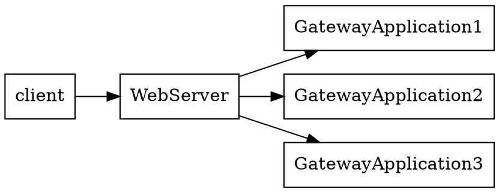

# Nginx
 * [http://nginx.net Home]
>Apache is like Microsoft Word, it has a million options but you only need six. 
>Nginx does those six things, and it does five of them 50 times faster than Apache." 
>      ---- Chris Lea, ChrisLea.com
# 测试配置文件
```sh
$ [sudo] nginx -t
nginx: the configuration file /etc/nginx/conf/nginx.conf syntax is ok
nginx: configuration file /etc/nginx/conf/nginx.conf test is successful
$ [sudo] nginx -t /path/to/nginx.conf
```
# 进程模型
典型的clone , 当 worker_processes为4时，我们来观察nginx相关进程:
```sh
$ sudo /etc/rc.d/nginx restart
$ pstree -cp
init(1)-+
        ...
        |-nginx(16371)-+-nginx(16372)
        |              |-nginx(16373)
        |              |-nginx(16374)
        |              `-nginx(16375)
        ...
$ ps -faux | grep nginx
root     16371  0.0  0.0   5064   620 ?        Ss   19:41   0:00 nginx: master process /usr/sbin/nginx -c /etc/nginx/conf/nginx.conf
http     16372  0.0  0.0   5232   972 ?        S    19:41   0:00  _ nginx: worker process                        
http     16373  0.0  0.0   5232   972 ?        S    19:41   0:00  _ nginx: worker process                        
http     16374  0.0  0.0   5232   972 ?        S    19:41   0:00  _ nginx: worker process                        
http     16375  0.0  0.0   5232   972 ?        S    19:41   0:00  _ nginx: worker process
```
 * nginx启动后会有一个MasterProcess和N个WorkerProcesses
 * MasterProcess为启动者的权限，上例中为root:root
 * WorkerProcesses具有的权限可以通过配置文件修改
 * MasterProcess并不实际处理请求, 它是个监察者，负责管理WorkerProcesses
# Directive blocks
# Diminutives
数量:
 * k or K: Kilobytes
 * m or M: Megabytes
时间: 
 * ms: Milliseconds
 * s: Seconds
 * m: Minutes
 * h: Hours
 * d: Days
 * w: Weeks
 * M: Months (30 days
 * y: Years (365 days)
# Variables
 * $nginx_version
 * $pid
 * $remote_addr
# 字符串
```
root /home/example.com/www;
root '/home/example.com/my web pages';
root "/home/example.com/my web pages";
```
# 基本模块
# CoreModule
# daemon
 * on
 * off
# debug_points
 * stop 
 * abort
# env
```
    env KEY;
    env KEY=value;
```
# error_log
```
    error_log /path/to/log level
```
 * level
# lock_file
# log_not_found
 * on
 * off
# master_process
 * on
 * off : 指定为off时，nginx将只有一个进程，此种模式只在调试时有用
# pid
此值一般在编译时确定的.
```
pid logs/nginx.pid;
```
# ssl_engine
```
ssl_engine enginename
```
enginename是系统上已知的HardwareSslAccelerator的名字, 可以使用以下命令查看
```sh
# 咱的机器上没有这玩意儿
$  openssl engine -t
(dynamic) Dynamic engine loading support
     [ unavailable ]
```
# thread_stack_size
```
thread_stack_size 1M
```
# timer_resolution
```
timer_resolution 100ms;
```
Controls the interval between system calls to gettimeofday() 
to synchronize the internal clock. If this value is not specifed, the 
clock is refreshed after each kernel event notifcation.
# user
```
user username;
user username groupname;
```
# worker_threads
每个WorkerProcess可以启动的线程数, 默认不开启
# worker_cpu_affinity
```
worker_cpu_affinity 1000 0100 0010 0001;
worker_cpu_affinity 10 10 01 01;
worker_cpu_affinity;
```
默认不开启.
This directive works in conjunction with worker_processes. It 
lets you affect worker processes to CPU cores.
There are as many series of digit blocks as worker processes; there 
are as many digits in a block as your CPU has cores.
If you confgure Nginx to use three worker processes, there  
are three blocks of digits. For a dual-core CPU, each block has  
two digits.
worker_cpu_affinity 01 01 10;
The frst block (01) indicates that the frst worker process should be 
affected to the second core.
The second block (01) indicates that the second worker process 
should be affected to the second core.
The third block (10) indicates that the third worker process should 
be affected to the frst core.
Note that affnity is only recommended for multi-core CPUs, not 
for processors with hyper-treading or similar technologies.
# worker_priority
```
worker_priority 0;
```
 * 默认值: 0
 * 取值: -20-19
```div class=note
Kernel进程的优先级一般为-5, 所以通常nginx设置的优先级要比-5低.
```
# worker_processes
```
worker_processes 4
```
Defnes the amount of worker processes. Nginx offers to separate 
the treatment of requests into multiple processes. The default value
is 1, but it's recommended to increase this value if your CPU has 
more than one core.
如果某个WorkerProcess被I/O操作阻塞住，此时新来的请求可以被另外的WorkerProcess处理。 
 * 默认值: 1
# worker_rlimit_nofile 
Defnes the amount of files a worker process may use simultaneously.
```
worker_rlimit_nofile 10000;
```
# worker_rlimit_sigpending
Defnes the amount of signals that can be queued per user (user ID 
of the calling process). If the queue is full, signals are ignored past 
this limit.
```
worker_rlimit_sigpending 10000;
```
# working_directory
```
working_directory /usr/local/nginx/;
```
 * 默认值: 编译时指定
# EventsModule
# accept_mutex
# accept_mutex_delay
```
accept_mutex_delay 500ms;
```
# debug_connection
```
debug_connection 172.63.155.21;
debug_connection 172.63.155.0/24;
```
可以记录来自指定IP的Log. (Log的输出位置参考: error_log)
```div class=note
nginx编译时需指定--debug参数方可开启此选项
```
# multi_accept
 * on
 * off (默认)
# use 
||/dev/poll || An effcient method for Solaris 7 11/99+, HP/UX 11.22+, IRIX 6.5.15+, and Tru64 UNIX 5.1A+ operating systems
||epoll     || An effcient method for Linux 2.6+ based operating systems
||eventport ||
||kqueue    ||
||rtsig     || Real time signals, available as of Linux 2.2.19, but unsuited for high-traffc profles as default system ettings only allow 1,024 queued signals
||select    || The default and standard module, it is used if the OS does not support a more effcient one (it's the only available method under Windows)
||poll      || It is automatically preferred over select, but not available on all systems
||eventport || An effcient method for Solaris 10, though a security patch is required
# worker_connections
WorkerProcesse最多同时处理的连接数
```
worker_connections 1024
```
# ConfgurationModule
# include
```
include /file/path.con
include sites/*.conf;
```
# worker_processes
# events
# worker_connections
# http模块
# server
# listen
```
listen [address][:port] [additional options];
```
 * options:
  * default
  * ssl
# server_name
Assigns one or more hostnames to the server block. When Nginx receives an HTTP request, it matches the Host header 
# server_name_in_redirect
参考rewrite模块
# server_names_hash_max_size
默认值: 512
Nginx uses hash tables for various data collections in order to 
speed up the processing of requests. This directive defnes the 
maximum size of the server names hash table. If your server 
uses a total of more than 512 hostnames, you will have to 
increase this value.
# access_log
# location
# index模块
# index ( http, server, location)
```
index file1 [file2…] [absolute_file];
```
例:
```
index index.php index.html index.htm;
index index.php index2.php /catchall.php;
```
# autoindex ( http, server, location)
如果你没有设置autoindex on; 那么通过nginx访问某个目录时，你定会遭遇403错误.
# autoindex_exact_size
||on  || 不显示文件大小的单位 || 默认值
||off || 显示文件大小单位: KB, MB, G ...
# autoindex_localtime
||on  || 使用主机时间 ||
||off || 使用GMT时间 || 默认值
# 日志
# access_log (http,server,location)
```
access_log path [format [buffer=size]] | off;
```
# log_format (http,server,location)
```
log_format combined '$remote_addr - $remoteuser [$time_local] '"$request" $status  $body_bytes_sent '"$http_referer"  "$http_user_agent"';
# Other example
log_format simple '$remote_addr $request';
```
# open_log_file_cache
```
open_log_file_cache max=N [inactive=time] [min_uses=N] [valid=time] | off;
```
# Log模块提供的变量
||$connection        || The connection number
||$pipe              || The variable is set to 'p', if the request was pipelined
||$time_local        || Local time (at the time of writing the log entry)
||$msec              || Local time (at the time of writing the log entry) to the microsecond
||$request_time      || Total length of the request processing, in milliseconds
||$status            || Response status code
||$bytes_sent        || Total number of bytes sent to the client
||$body_bytes_sent   || Number of bytes sent to the client for the response body
||$apache_bytes_sent || Similar to $body_bytes, which corresponds to the %B parameter of Apache's mod_log_config
||$request_length    || Length of the request body
# 基本认证模块
```nginx
location /admin/ {
    auth_basic "Admin control panel";
    auth_basic_user_file access/password_file;
}
```
 * auth_basic_user_file : 这个是密码文件相对于配置文件的路径, 密码文件可以使用'htpasswd'命令生成.
# deny
|| all  ||
|| IP   ||
|| CIDR ||
# limit_zone
用于限制指定区域的最大并发数. 结合limit_conn可以用来控制下载目录的流量.
# limit_conn
# limit_req_zone 
```
limit_req_zone $variable zone=name:max_memory_size rate=rate;
```
以上种种限制，一旦突破，客户端就会得到503.
# tcp_nodelay (http,server,location)
Enables or disables the TCP_NODELAY socket option for
keep-alive connections only.
# tcp_nopush  (http,server,location)
Enables or disables the TCP_NOPUSH (FreeBSD) or  
TCP_CORK (Linux) socket option. Note that this option only 
applies if the sendfile directive is enabled. If tcp_nopush
is set to on, Nginx will attempt to transmit the entire HTTP 
response headers in a single TCP packet.
Syntax: on or off
Default value: off
tcp_nopush off;
# sendfile    (http,server,location)
Nginx是否使用内核调用: sendfile来传输文件.
Syntax: on or off
Default value: off
sendfile off;
# sendfile_max_chunk (http, server)
This directive defnes a maximum size of data to be used for 
each call to sendfile (read above).
# reset_timedout_connection (http,server,location)
当客户端连接超时, 如果此选项为off, 则相关的信息将不会保留在内存中.
When a client connection times out, its associated information 
may remain in memory depending on the state it was on. 
Enabling this directive will erase all memory associated  
to the connection after it times out.
# error_page (server,location,if)
```nginx
error_page code1 [code2…] [=replacement code] [=@block | URI]
error_page 404 /not_found.html;
error_page 500 501 502 503 504 /server_error.html;
error_page 403 http://website.com/;
error_page 404 @notfound; # jump to a named  
# location block
error_page 404 =200 /index.html; # in case of  404 error, redirect to index.html with a 200 OK response code
```
# if_modified_since
```
limit_except METHOD1 [METHOD2…] { allow | deny | auth_basic | auth_basic_user_file | proxy_pass | perl;
}
```
 * off 
 * exact
 * before
Defnes how Nginx handles the If-Modified-Since HTTP header. 
This header is mostly used by search engine spiders (such as Google 
web crawling bots). The robot indicates the date and time of the last 
# satisfy(location)
 * any 
 * all
```nginx
location /admin/ {
    allow 192.168.1.0/24;
    deny all;
    auth_basic "Authentication required";
    auth_basic_user_file conf/htpasswd;
}
```
以上配置，包含两条访问控制规则:
 1. 客户端IP必须是192.168.1.0/24
 2. 必须通过认证
当 satisfy 为all时: 客户端必须通过两条访问规则, 为any时只要通过一条访问规则即可.
# internal(location)
表明该url为内部请求.
# try_files
# 文件处理和缓存
# direction ( http, server, location)
If this directive is enabled, fles with a size greater than 
he specifed value will be read with the Direct I/O system 
mechanism. This allows Nginx to read data from the storage 
device and place it directly in memory with no intermediary 
caching process involved. Enabling this directive will 
automatically disable the sendfile directive as they cannot 
be used together.
Syntax: Size value, or off
Default value: off
directio 5m;
# open_file_cache( http, server, location)
This directive allows you to enable the cache which stores 
information about open fles. It does not actually store fle 
contents itself but only information such as:
File descriptors (fle size, modifcation time, and  
so on).
The existence of fles and directories.
File errors, such as Permission denied, File not 
found, and so on. Note that this can be disabled with 
the open_file_cache_errors directive.
This directive accepts two arguments:
max=X, where X is the amount of entries that the cache 
can store. If this amount is reached, older entries will 
be deleted in order to leave room for newer entries.
Optionally inactive=Y, where Y is the amount 
of seconds that a cache entry should be stored. By 
default, Nginx will wait 60 seconds before clearing a 
cache entry. If the cache entry is accessed, the timer 
is reset. If the cache entry is accessed more than the 
value defned by open_file_cache_min_uses, the 
cache entry will not be cleared (until Nginx runs out of 
space and decides to clear out older entries).
Syntax: open_file_cache max=X [inactive=Y] | off
Default value: off
open_file_cache max=5000 inactive=180;
# open_file_cache_errors( http, server, location)
Enables or disables the caching of fle errors with the  
open_file_cache directive (read above).
Syntax: on or off
Default value: off
open_file_cache_errors on;
# open_file_cache_min_uses
By default, entries in the open_file_cache are cleared 
after a period of inactivity (60 seconds, by default). If there is 
activity though, you can prevent Nginx from removing the 
cache entry. This directive defnes the amount of time an entry 
must be accessed in order to be eligible for protection.
open_file_cache_min_uses 3;
If the cache entry is accessed more than three times, it becomes 
permanently active and is not removed until Nginx decides  
to clear out older entries to free up some space.
Syntax: Numeric value
Default value: 1
# open_file_cache_valid
The open fle cache mechanism is important, but cached 
information quickly becomes obsolete especially in the case 
of a fast-moving flesystem. In that perspective, information 
needs to be re-verifed after a short period of time. This 
directive specifes the amount of seconds that Nginx will  
wait before revalidating a cache entry.
Syntax: Time value (in seconds)
Default value: 60
open_file_cache_valid 60;
# MIME类型
# Limits and restrictions
# limit_except (location)
```nginx
location /admin/ {
    limit_except GET {
      allow 192.168.1.0/24;
      deny all;
    }
}
```
# 路径和文档
# root (http,server,location,if)
# alias
# location
```
location [=|~|~*|^~|@] pattern { ... }
```
# =
字符串匹配, 有关大小写的匹配受文件系统的影响.
# none
匹配以特定模式开头的URL
# ~
大小写敏感的正则表达式匹配.
# ~*
大小写不敏感的正则表达式匹配.
# ^~
相当于啥都不加, 一旦匹配Nginx就不再继续寻找其他模式了.
# @
这个location不能为外部访问,仅用于内部.
# Search order and priority
```nginx
server {
    server_name website.com;
    location /files/   {
    # applies to any request starting with "/files/"
    # for example /files/doc.txt, /files/, /files/temp/
    }
    location = /files/ {
    # applies to the exact request to "/files/"
    # and as such does not apply to /files/doc.txt
    # but only /files/
    }
}
```
 * http://website.com/files/doc.txt  -> 会被第一个location所匹配
 * http://website.com/files/ -> 会被第二个location所匹配
> '=' > 'none'且完全匹配 > '^~' > '~' or '~*' > 'none'且开头匹配
匹配的规则遵循如下顺序:
  1. location blocks with the = modifer: If the specifed string exactly matches the requested URI, Nginx retains the location block
  2. location blocks with no modifer: If the specifed string exactly matches the requested URI, Nginx retains the location block
  3. location blocks with the ^~ modifer: If the specifed string matches the beginning of the requested URI, Nginx retains the location block
  4. location blocks with ~ or ~* modifer: If the regular expression matches the requested URI, Nginx retains the location block
  5. location blocks with no modifer: If the specifed string matches the beginning of the requested URI, Nginx retains the location block
# 杂项
# log_not_found
Context: http, server, location
Enables or disables logging of 404 Not found HTTP errors. 
If your logs get flled with 404 errors due to missing favicon.
ico or robots.txt fles, you might want to turn this off.
Syntax: on or off
Default value: on
log_not_found on;
# log_subrequest
Context: http, server, location
Enables or disables logging of sub-requests triggered by 
internal redirects (see the Rewrite module section) or SSI  
requests (see the Server Side Includes module section).
Syntax: on or off
Default value: off
log_subrequest off;
# merge_slashes
Context: http, server, location
Enabling this directive will have the effect to merge multiple 
consecutive slashes in a URI. It turns out to be particularly 
useful in situations resembling the following:
```
server {
    […]
    server_name website.com;
    location /documents/ {
        type { }
        default_type text/plain;
   }
}
```
By default, if the client attempts to access http://website.com//documents/ (note the // in the middle of the URI), 
Nginx will return a 404 Not found HTTP error. If you enable 
this directive, the two slashes will be merged into one and the 
location pattern will be matched.
Syntax: on or off
Default value: off
merge_slashes off;
# msie_padding
Context: http, server, 
location
This directive was specifcally designed for the Microsoft 
Internet Explorer browser family. In the case of error pages 
(with error code 400 or higher), if the length of the response 
body is less than 512 bytes, these browsers will display 
their own error page, sometimes at the expense of a more 
informative page provided by the server.
If you enable this option, the body of responses with a status 
code of 400 or higher will be padded to 512 bytes.
Syntax: on or off
Default value: off
msie_padding off;
# msie_refresh
Context: http, server, location
It is another MSIE-specifc directive that will take effect in the 
case of HTTP response codes 301 Moved permanently 
and 302 Moved temporarily. When enabled, Nginx sends 
clients running an MSIE browser a response body containing a 
refresh meta tag (<meta http-equiv="Refresh"…>) in order 
to redirect the browser to the new location of the requested 
resource.
Syntax: on or off
Default value: off
msie_refresh off;
# resolver
Context: http, server, location
Specifes the name server that should be employed by Nginx to 
resolve hostnames to IP addresses and vice-versa.
Syntax: IP address
Default value: None (system default)
resolver 127.0.0.1; # use local DNS
# resolver_timeout
Context: http, server, location
Timeout for a hostname resolution query.
Syntax: Time value (in seconds)
Default value: 30
resolver_timeout 30s;
# server_tokens
Context: http, server, location
This directive allows you to defne whether or not Nginx 
should inform the clients of the running version number.
There are two situations where Nginx indicates its  
version number:
on:
```sh
$ curl --head http://localhost/
HTTP/1.1 200 OK
Server: nginx/1.0.3
Date: Wed, 13 Jun 2012 10:01:56 GMT
Content-Type: text/html; charset=utf-8
Connection: keep-alive
```
off:
```sh
$ curl --head http://localhost/
HTTP/1.1 200 OK
Server: nginx
Date: Wed, 13 Jun 2012 10:06:25 GMT
Content-Type: text/html; charset=utf-8
Connection: keep-alive
```
# underscores_in_headers
Context: http, server
Allows or disallows underscores in custom HTTP header 
names. If this directive is set to on, the following example 
header is considered valid by Nginx: test_header: value.
Syntax: on or off
Default value: off
underscores_in_headers off;
# variables_hash_max_size
Context: http
This directive defnes the maximum size of the variables' hash 
table. If your server confguration uses a total of more than 512 
variables, you will have to increase this value.
Syntax: Numeric value
Default value: 512
# variables_hash_bucket_size
Context: http
Defnes the maximum length of a variable in the variables hash 
table. If one of your variables is longer than 64 characters, you 
will have to increase this value.
Syntax: Numeric value
Default value: 64 (or 32, or 128, depending on your processor 
cache specifcations)
# post_action
Context: http, server, 
location, if
Defnes a post-completion action, a URI that will be called by 
Nginx after the request has been completed.
Syntax: URI or named location block.
Example:
```nginx
location /payment/ {
    post_action /scripts/done.php;
}
```
# Module variables
The HTTP Core module introduces a large set of variables that you can use within 
the value of directives. Be careful though, as only a handful of directives accept 
variables in the defnition of their value. If you insert a variable in the value of a 
directive that does not accept variables, no error is reported; instead the variable 
name appears as raw text.
There are three different kinds of variables that you will come across. The frst set 
represents the values transmitted in the headers of the client request. The second set 
corresponds to the headers of the response sent to the client, and fnally, the third set 
comprises variables that are completely generated by Nginx.
# Request headers
Nginx lets you access the client request headers under the form of variables that you 
will be able to employ later on in the confguration:
Variable Description
||$http_host      || Value of the Host HTTP header, a string indicating the hostname that the client is trying to reach.
||$http_user_agent|| Value of the User-Agent HTTP header, a string indicating the web browser of the client.
||$http_referer   || Value of the Referer HTTP header, a string indicating the URL  of the previous page from which the client comes.
||$http_via       || Value of the Via HTTP header, which informs us about possible proxies used by the client.
||$http_x_forwarded_for ||Value of the X-Forwarded-For HTTP header, which shows the actual IP address of the client if the client is behind a proxy.
||$http_cookie    || Value of the Cookie HTTP header, which contains the cookie data sent by the client.
||$http_...       || Additional headers sent by the client can be retrieved using $http_ followed by the header name in lowercase and with dashes (-) replaced by underscores (_).
# Response headers
In a similar fashion, you are allowed to access the HTTP headers of the response that 
was sent to the client. These variables are not available at all times—they will only 
carry a value after the response is sent, for instance, at the time of writing messages 
in the logs.
||$sent_http_content_type     || Value of the Content-Type HTTP header, indicating the MIME type of the resource being transmitted.
||$sent_http_content_length   || Value of the Content-Length HTTP header informing the client of the response body length.
||$sent_http_location         || Value of the Location HTTP header, which indicates that the location of the desired resource is different than the one specifed in the original request.
||$sent_http_last_modified    || Value of the Last-Modifed HTTP header corresponding to the modifcation date of the requested resource.
||$sent_http_connection       || Value of the Connection HTTP header, defning whether the connection will be kept alive or closed.
||$sent_http_keep_alive       || Value of the Keep-Alive HTTP header that defnes the amount of time a connection will be kept alive.
||$sent_http_transfer_encoding|| Value of the Transfer-Encoding HTTP header, giving information about the response body encoding method (such as compress, gzip).
||$sent_http_cache_control    || Value of the Cache-Control HTTP header, telling us whether the client browser should cache the resource or not.$sent_http_...Additional headers sent to the client can be retrieved using 
||$sent_http_followed         || 
||$sent_http_content_type     || Value of the Content-Type HTTP header, indicating the MIME type of the resource being transmitted.
||$sent_http_content_length   || Value of the Content-Length HTTP header informing the client of the response body length.
||$sent_http_location         || Value of the Location HTTP header, which indicates that the location of the desired resource is different than the one specifed in the original request.
||$sent_http_last_modified    || Value of the Last-Modifed HTTP header corresponding to the modifcation date of the requested resource.
||$sent_http_connection       || Value of the Connection HTTP header, defning whether the connection will be kept alive or closed.
||$sent_http_keep_alive       || Value of the Keep-Alive HTTP header that defnes the amount of time a connection will be kept alive.
||$sent_http_transfer_encoding|| Value of the Transfer-Encoding HTTP header, giving information about the response body encoding method (such as compress, gzip).
||$sent_http_cache_control    || Value of the Cache-Control HTTP header, telling us whether the client browser should cache the resource or not. $sent_http_... Additional headers sent to the client can be retrieved using $sent_http_followed by the header name, in lowercase and with dashes (-) replaced by underscores (_).by the header name, in lowercase and with dashes (-) replaced by underscores (_).
# Nginx generated
Apart from the HTTP headers, Nginx provides a large amount of variables 
concerning the request, the way it was and will be handled, as well as settings  
in use with the current confguration.
||$arg_XXX      ||Allows you to access the query string (GET parameters), where XXX is the name of the parameter you want to utilize.
||$args         ||All the arguments of the query string combined together.
||$binary_remote_addr || IP address of the client as binary data (4 bytes).
||$body_bytes_sent    || Amount of bytes sent in the body of the response.
||$content_length|| Equates to the Content-Length HTTP header.
||$content_type || Equates to the Content-Type HTTP header.
||$cookie_XXX   || Allows you to access cookie data where XXX is the name of the parameter you want to utilize.
||$document_root|| Returns the value of the root directive for the current request.
||$document_uri || Returns the current URI of the request. It may differ from the original request URI if internal redirects were performed. It is identical to the $uri variable.
||$host         || This variable equates to the Host HTTP header of the request. Nginx itself gives this variable a value for cases where the Host header is not provided in the original request.
||$hostname     || Returns the system hostname of the server computer
||$is_args      || If the $args variable is defned, $is_args equates to ?. If $args is empty, $is_args is empty as well.
||$limit_rate   || Returns the per-connection transfer rate limit, as defned by the limit_rate directive. You are allowed to edit this variable by using set (directive from the Rewrite module):set $limit_rate 128k;
||$nginx_version|| Returns the version of Nginx you are running.
||$pid          || Returns the Nginx process identifer.
||$query_string || Identical to $args.
||$remote_addr  || Returns the IP address of the client.
||$remote_port  || Returns the port of the client socket.
||$remote_user  || Returns the client username if they used authentication.
||$realpath_root|| Returns the document root in the client request, with symbolic links resolved into the actual path.
||$request_body || Returns the body of the client request, or - if the body is empty.
||$request_body_file  || If the request body was saved (see the client_body_in_file_only directive) this variable indicates the path of the temporary fle
||$request_completion || Returns OK if the request is completed, an empty string otherwise
||$request_filename   || Returns the full fle name served in the current request.
||$request_method     || Indicates the HTTP method used in the request, such as GET  or POST
||$request_uri        || Corresponds to the original URI of the request, remains unmodifed all along the process (unlike $document_uri/$uri)
||$scheme             || Returns either http or https, depending on the request
||$server_addr        || Returns the IP address of the server. Be aware as each use of the variable requires a system call, which could potentially affect overall performance in the case of high-traffc setups.
||$server_name        || Indicates the value of the server_name directive that was used while processing the request
||$server_port        || Indicates the port of the server socket that received the request data
||$server_protocol    || Returns the protocol and version, usually HTTP/1.0 or HTTP/1.1
||$uri                || Identical to $document_uri
# 常见问题
# 403
总结起来，这个403通常有如下几个原因:
 1. 没有设置`'autoinde on;'`
 2. 设置的目录没有读权限
# 找不到favicon.ico
使用浏览器访问网站时，你可能会注意到Tab标签页或是浏览器地址栏上有个小图标，这个就是favicon, 它是浏览器从webserver那取的。
问题是，通常可能我们的webserver的root下不会放这个favicon.ico, 所以类似下面的log要漫天飘:
error.log:
```
2012/06/13 14:20:57 [error] 18459#0: *1 open() "/etc/nginx/html/favicon.ico" failed (2: No such file or directory), client: 127.0.0.1, server: localhost, request: "GET /favicon.ico     HTTP/1.1", host: "localhost:8888"
```
access.log:
```
127.0.0.1 - - [13/Jun/2012:14:54:21 +0800] "GET /favicon.ico HTTP/1.1" 404 570 "-" "Mozilla/5.0 (X11; Linux i686) AppleWebKit/534.24 (KHTML, like Gecko) Chrome/11.0.696.71 Safari/534.24"
```
五讲四美的你可以做如下配置:
```nginx
location = /favicon.ico {
  return 204;
  access_log     off;
  log_not_found  off;
}
```
# PHP / Pytho + Nginx
通过FastCGI, 我们可以将HTTP服务与GatewayApplication部署在不同的服务器上, 

如今诸如PHP之类的GatewayApplication是相当消耗系统资源的，因此将应用网关部署在不同的机器上可以有效提高处理能力.
Nginx的Upstream模块即可方便构造这种服务架构.
```nginx
serever {
  ...
  Location ~* .php$ {
         fastcgi_pass gw_php;
  }
  ...
  upstream gw_php {
         server 192.168.0.10:9000;
         server 192.168.0.11:9000;
         server 192.168.0.12:9000;
  }
}
```
Nginx会将符合条件的请求均衡到这三个Backend上， 就跟发牌道理是一样的.
RoundRobin也有不好的地方，比如同一个客户端的请求如果被分发到两个不同的Backend上，就会带来一些麻烦，因为客户端的会话信息必须在两个后端上同步，才能保证服务的正确性. 所以我们的均衡算法必须将客户端IP考虑在内，
将相同IP的请求发送到同一个backend上. 在Nginx中， ip_hash参数就是干这个的.
# ip_hash
```nginx
  upstream gw_php {
         ip_hash;
         server 192.168.0.10:9000;
         server 192.168.0.11:9000;
         server 192.168.0.12:9000;
  }
```
通过这种增强形式的RoundRobin,可以解决大部分问题。 但是，要知道客户端的IP是可以随时发生变化的，比如DynamicIpRefresh, ProxySwitching, 等等， 这种情形下ip_hash就帮不上忙了.
# weight       = n;
```nginx
  upstream gw_php {
         ip_hash;
         server 192.168.0.10:9000 weight=2;
         server 192.168.0.11:9000;
         server 192.168.0.12:9000;
  }
```
第一个backend上的负载是其他机器上的2倍，给它发两张牌，才给其他人发一张牌，因为它厉害啊。 假如你的backends们参差不齐，可以通过调整weight达到更好的均衡效果.
# max_failes   = n;
# fail_timeout = n;
以上这俩参数为双胞胎，通常都是一起使用，如果在max_timeout这段时间里失败了max_failes次，那么这个backend即不被信任(处于inoperative状态)，等同于死掉.
# down
开启ip_hash后， 标记为down的backend将不被使用.
# backup
标记为backup的backend不会被使用，直到其他可使用的backends都不能干活了(down或者inoperative).
# 安全
# 隐藏nginx版本
```
server_tokens off;
```
# 参考 
 * https://calomel.org/nginx.html
 * [http://wiki.nginx.org/Modules Nginx模块]

