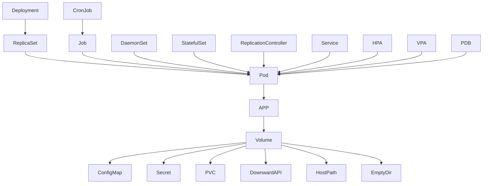

#  k8s

> TODO:
>
> - https://www.spinnaker.io/
> - https://helm.sh/

```
The history of computer science is a history of the development of abstractions that hide complexity and empower you to build ever more sophisticated applications
```

> 理想的团队在6-8人之间，如此规模的团队更容易分享知识，迅速的做出决策，

## 安装

### 使用minikube

```bash
$ pacman -S minikube
# 或者从官方安装最新
$ curl -Lo minikube https://storage.googleapis.com/minikube/releases/latest/minikube-linux-amd64 && chmod +x minikube
$ ./minkube start
😄  minikube v1.6.1 on Arch 
✨  Automatically selected the 'virtualbox' driver (alternates: [none])
💿  Downloading VM boot image ...
    > minikube-v1.6.0.iso.sha256: 65 B / 65 B [--------------] 100.00% ? p/s 0s
    > minikube-v1.6.0.iso: 150.93 MiB / 150.93 MiB  100.00% 687.51 KiB p/s 3m45
🔥  Creating virtualbox VM (CPUs=2, Memory=2000MB, Disk=20000MB) ...
🐳  Preparing Kubernetes v1.17.0 on Docker '19.03.5' ...
💾  Downloading kubelet v1.17.0
💾  Downloading kubeadm v1.17.0
🚜  Pulling images ...
🚀  Launching Kubernetes ... 

# 也可以指定minikube使用的cpu和内存
$ minikube delete; minikube start --extra-config=kubelet.authentication-token-webhook=true --cpus 4 --memory 8192

# 查看集群的IP
$ minkube ip
192.168.99.101

# 部署echo server
$ kubectl create deployment hello --image=k8s.gcr.io/echoserver:1.10
deployment.apps/hello created

# 查看deployment
$ kubectl get deployments hello -o yaml 
```

### Deployment
```yaml
apiVersion: apps/v1
kind: Deployment
metadata:
  annotations:
    deployment.kubernetes.io/revision: "1"
  creationTimestamp: "2019-12-18T09:57:30Z"
  generation: 1
  labels:
    app: hello
  name: hello
  namespace: default
  resourceVersion: "80943"
  selfLink: /apis/apps/v1/namespaces/default/deployments/hello
  uid: abf0036c-b91f-4512-996c-3ec325005843
spec:
  progressDeadlineSeconds: 600
  replicas: 1
  revisionHistoryLimit: 10
  selector:
    matchLabels:
      app: hello
  strategy:
    rollingUpdate:
      maxSurge: 25%
      maxUnavailable: 25%
    type: RollingUpdate
  template:
    metadata:
      creationTimestamp: null
      labels:
        app: hello
    spec:
      containers:
      - image: k8s.gcr.io/echoserver:1.10
        imagePullPolicy: IfNotPresent
        name: echoserver
        resources: {}
        terminationMessagePath: /dev/termination-log
        terminationMessagePolicy: File
      dnsPolicy: ClusterFirst
      restartPolicy: Always
      schedulerName: default-scheduler
      securityContext: {}
      terminationGracePeriodSeconds: 30
status:
  availableReplicas: 1
  conditions:
  - lastTransitionTime: "2019-12-18T09:58:40Z"
    lastUpdateTime: "2019-12-18T09:58:40Z"
    message: Deployment has minimum availability.
    reason: MinimumReplicasAvailable
    status: "True"
    type: Available
  - lastTransitionTime: "2019-12-18T09:57:30Z"
    lastUpdateTime: "2019-12-18T09:58:40Z"
    message: ReplicaSet "hello-76dfd64498" has successfully progressed.
    reason: NewReplicaSetAvailable
    status: "True"
    type: Progressing
  observedGeneration: 1
  readyReplicas: 1
  replicas: 1
  updatedReplicas: 1
```

```zsh
# 我们把Deployment通过Service暴露给外部
$ kubectl expose deployment hello --type=NodePort --port=8080

# 查看Service
$ kubectl get svc
NAME         TYPE           CLUSTER-IP      EXTERNAL-IP   PORT(S)          AGE
hello        NodePort       10.96.221.248   <none>        8080:30112/TCP   11m
$ kubectl get svc hello -o yaml
$ kubectl get endpoints hello -o yaml
```

### Service 
```yaml
apiVersion: v1
kind: Service
metadata:
  creationTimestamp: "2019-12-18T10:09:53Z"
  labels:
    app: hello
  name: hello
  namespace: default
  resourceVersion: "82411"
  selfLink: /api/v1/namespaces/default/services/hello
  uid: 37bf6aee-6dbb-461b-9624-0ec88ca53153
spec:
  clusterIP: 10.96.221.248 | None
  externalTrafficPolicy: Cluster
  ports:
  - nodePort: 30112
    port: 8080
    protocol: TCP
    targetPort: 8080
  selector:
    app: hello
  sessionAffinity: None
  type: NodePort
status:
  loadBalancer: {}
```
 - ports
   	- nodePort: 节点IP, `--service-node-port-range` flag (default: 30000-32767).
      	- port: Service的端口
      	- targetPort: 通过selector选出的Pod的端口

### Endpoint

```yaml
apiVersion: v1
kind: Endpoints
metadata:
  annotations:
    endpoints.kubernetes.io/last-change-trigger-time: "2019-12-18T10:09:53Z"
  creationTimestamp: "2019-12-18T10:09:53Z"
  labels:
    app: hello
  name: hello
  namespace: default
  resourceVersion: "82412"
  selfLink: /api/v1/namespaces/default/endpoints/hello
  uid: 91cced1d-7202-45a2-a229-3a4f77813e79
subsets:
- addresses:
  - ip: 172.17.0.5
    nodeName: minikube
    targetRef:
      kind: Pod
      name: hello-76dfd64498-674z2
      namespace: default
      resourceVersion: "80941"
      uid: f92988e8-3095-4a4d-a6e7-764cb6be2b14
  ports:
  - port: 8080
    protocol: TCP
```

```zsh
# 确保Deployment的Pod已经启动成功
$ kubectl get pod 
NAME                          READY   STATUS    RESTARTS   AGE
hello-76dfd64498-674z2        1/1     Running   0          1m

# 查看Pod
$ kubectl get pod hello-76dfd64498-674z2 -o yaml
```

### Pod
```yaml
apiVersion: v1
kind: Pod
metadata:
  creationTimestamp: "2019-12-18T09:57:30Z"
  generateName: hello-76dfd64498-
  labels:
    app: hello
    pod-template-hash: 76dfd64498
  name: hello-76dfd64498-674z2
  namespace: default
  ownerReferences:
  - apiVersion: apps/v1
    blockOwnerDeletion: true
    controller: true
    kind: ReplicaSet
    name: hello-76dfd64498
    uid: 2fdb6791-dca8-4bd7-9108-a2668f408887
  resourceVersion: "80941"
  selfLink: /api/v1/namespaces/default/pods/hello-76dfd64498-674z2
  uid: f92988e8-3095-4a4d-a6e7-764cb6be2b14
spec:
  containers:
  - image: k8s.gcr.io/echoserver:1.10
    imagePullPolicy: IfNotPresent
    name: echoserver
    resources: {}
    terminationMessagePath: /dev/termination-log
    terminationMessagePolicy: File
    volumeMounts:
    - mountPath: /var/run/secrets/kubernetes.io/serviceaccount
      name: default-token-vc276
      readOnly: true
  dnsPolicy: ClusterFirst
  nodeSelector: # 节点选择, 可以按照标签筛选节点
    ${key}: ${value}
  affinity:
    nodeAffinity:
      requiredDuringSchedulingIgnoredDuringExecution:
        nodeSelectorTerms:
      preferredDuringSchedulingIgnoredDuringExecution:
        
  enableServiceLinks: true
  nodeName: minikube
  priority: 0
  restartPolicy: Always
  schedulerName: default-scheduler
  securityContext: {}
  serviceAccount: default
  serviceAccountName: default
  terminationGracePeriodSeconds: 30
  tolerations:
  - effect: NoExecute
    key: node.kubernetes.io/not-ready
    operator: Exists
    tolerationSeconds: 300
  - effect: NoExecute
    key: node.kubernetes.io/unreachable
    operator: Exists
    tolerationSeconds: 300
  volumes:
  - name: default-token-vc276
    secret:
      defaultMode: 420
      secretName: default-token-vc276
status:
  conditions:
  - lastProbeTime: null
    lastTransitionTime: "2019-12-18T09:57:30Z"
    status: "True"
    type: Initialized
  - lastProbeTime: null
    lastTransitionTime: "2019-12-18T09:58:40Z"
    status: "True"
    type: Ready
  - lastProbeTime: null
    lastTransitionTime: "2019-12-18T09:58:40Z"
    status: "True"
    type: ContainersReady
  - lastProbeTime: null
    lastTransitionTime: "2019-12-18T09:57:30Z"
    status: "True"
    type: PodScheduled
  containerStatuses:
  - containerID: docker://1d98eb60c3fdfe6459a3c0ad1ea63d8ac32128c611ce5cf30936e3e1c1cc7eae
    image: k8s.gcr.io/echoserver:1.10
    imageID: docker-pullable://k8s.gcr.io/echoserver@sha256:cb5c1bddd1b5665e1867a7fa1b5fa843a47ee433bbb75d4293888b71def53229
    lastState: {}
    name: echoserver
    ready: true
    restartCount: 0
    started: true
    state:
      running:
        startedAt: "2019-12-18T09:58:40Z"
  hostIP: 192.168.99.101
  phase: Running
  podIP: 172.17.0.5
  podIPs:
  - ip: 172.17.0.5
  qosClass: BestEffort
  startTime: "2019-12-18T09:57:30Z"
```

```zsh
#  万事具备，可以从外部访问服务了
$ minikube service hello --url
http://192.168.99.101:30112
# 或者使用kubectl获得service的端口
$ kubectl get service hello --output='jsonpath="{.spec.ports[0].nodePort}"'
"30112"
$ kubectl get service hello -o yaml | grep nodePort
  - nodePort: 30112

# 可以通过节点Port访问这个服务了
$ curl http://192.168.99.101:30112

Hostname: hello-76dfd64498-674z2

Pod Information:
        -no pod information available-

Server values:
        server_version=nginx: 1.13.3 - lua: 10008

Request Information:
        client_address=172.17.0.1
        method=GET
        real path=/
        query=
        request_version=1.1
        request_scheme=http
        request_uri=http://192.168.99.101:8080/

Request Headers:
        accept=*/*
        host=192.168.99.101:30112
        user-agent=curl/7.67.0

Request Body:
        -no body in request-
```

###  使用minikube的docker

```zsh
# 我们可以直接使用minkube的docker runtime, 这样就不用搞一个Registry了
$ minikube docker-env
export DOCKER_TLS_VERIFY="1"
export DOCKER_HOST="tcp://192.168.99.101:2376"
export DOCKER_CERT_PATH="/home/amas/.minikube/certs"
# Run this command to configure your shell:
# eval $(minikube docker-env)
$ eval $(minikube docker-env)
```

```bash
# 我们也可以利用docker context命令来保存minkube的docker链接信息
$ docker context create minikube  \
--default-stack-orchestrator=kubernetes  \
--kubernetes config-file=/home/amas/.kube/config \
--docker 'host=tcp://192.168.99.106:2376,ca=/home/amas/.minikube/certs/ca.pem,cert=/home/amas/.minikube/certs/cert.pem,key=/home/amas/.minikube/certs/key.pem

# 查看所有的docker context
$ docker context ls
NAME                DESCRIPTION                               DOCKER ENDPOINT               KUBERNETES ENDPOINT                     ORCHESTRATOR
default *           Current DOCKER_HOST based configuration   unix:///var/run/docker.sock   https://192.168.99.106:8443 (default)   swarm
minikube                                                      tcp://192.168.99.106:2376     https://192.168.99.106:8443 (default)   kubernetes

$ docker context use minikube
```


minikube创建了一个叫minikube的kubectrl context, 当我们想操作其他集群后，需要切换context, 想要再用回minikube可以

```zsh
$ kubectl config use-context minikube
# 或者明确设置kubectl的上下文
$ kubectl get pods --context=minikube
```


### 配置Minikube

minkube默认使用的资源可能不够用，可以通过以下命令调整

```bash
minikube config set cpus 4
minikube config set memory 4096
minikube config view
minikube delete || true
minikube start --vm-driver ${1-"virtualbox"}
```

### 安装集群

- https://kubernetes.io/docs/setup/production-environment/tools/kubeadm/install-kubeadm/

>你的任务:
>
>1. 安装单节点的k8s (single control-plane node)
>2. 安装多节点的k8s集群 (high availability )
>3. 通过: Certified k8s: https://github.com/cncf/k8s-conformance
>4. 通过vagrant+ansible部署到本地虚机
>5. 通过ansible部署到Pi集群
>6. 通过ansible部署到Aws
>7. 通过ansible部署到DigitalOcean
>8. 通过ansible部署到阿里云
>9. 使用minikube
>10. 使用minishift
>11. 使用iosti


 安装条件:

- OS

  - Ubuntu 16.04+
  - Debian 9+
  - CentOS 7
  - Red Hat Enterprise Linux (RHEL) 7
  - Fedora 25+
  - HypriotOS v1.0.1+
  - Container Linux (tested with 1800.6.0)

- 2GB+ RAM

- 2CPUs+

- hostname/MAC/product_uuid 每个节点必须唯一

- 保持对应的端口打开

  - Master

    - TCP inbound 6443* : k8s API server
    - TCP inbound 2379-2380: etcd server client API @usedby kube-apiserver, etcd
    - TCP inbound 10250: kublet API @usedby Self, Control plane
    - TCP inbound 10251: kube-scheduler @usedby self
    - TCP inbound 10252: kube-controller-manager @usedby selfWorker

    - TCP inbound 10250: kublet API @usedby self,Control plane
    - TCP inbound 30000-32767: NodePort Services **

- Disable Swap

- 确保iptables不使用nftables作为后端

  - Deian 10

  - Ubuntu 19.04

    ```sh
    sudo update-alternatives --set iptables /usr/sbin/iptables-legacy
    sudo update-alternatives --set ip6tables /usr/sbin/ip6tables-legacy
    sudo update-alternatives --set arptables /usr/sbin/arptables-legacy
    sudo update-alternatives --set ebtables /usr/sbin/ebtables-legacy
    ```

  - Fedora 29

    ```sh
    update-alternatives --set iptables /usr/sbin/iptables-legacy
    ```

- 安装Runtime

  - v1.6.0+, k8s默认用CRI(Container Runtime Interface)
  - v1.14.0+， kubeadm会自动检测容器runtime:
    - docker: /var/run/docker.sock
    - containerd: /run/containerd/containerd.sock
    - CRI-O: /var/run/crio/crio.sock
    - 总是尽量使用docker

- 安装kubeadm, kubelet, kubectl

  - kubeadm: 用来搭建k8s集群
  - kubelet: 运行在所有机器上，管理集群内部的各种组件
  - kubectl: 控制集群的命令
  - 注意: kubeadm不会安装和管理kubelet和kubectrl, 你必须保证三者之间尽可能使用相同的版本(见: https://kubernetes.io/docs/setup/release/version-skew-policy/)

- 配置cgroup diver, kublet会用到

  - 当你使用docker时，kubeadm会自动检测cgroup驱动，并且配置到/var/lib/kubelet/kubeadm-flags.env中

  - 如果你使用CRI: 则必须修改/etc/default/kubelet的cgroup-diver: 

    ```ini
    KUBELET_EXTRA_ARGS=--cgroup-driver=<value>
    ```

  > 注意： 只有CRI使用的cgroup驱动不是cgroupfs的时候，你才需要这么做

  - 重新启动kubelet你需要:

    ```sh
    systemctl daemon-reload
    systemctl restart kubelet
    ```

- k8s的发布周期为9个月
	- v1.6.x: 2019年9月～2020年7月
	

----
## LET'S GO

### 0x00: 安装docker

```bash
# 1. 安装docker的GPG key
- name: Add an apt signing key for Docker
   apt_key:
     url: https://download.docker.com/linux/ubuntu/gpg
     state: present
      
$ curl -fsSL https://download.docker.com/linux/ubuntu/gpg | sudo apt-key add -

# 2. 将docker官方的源加入到apt中
- name: Add apt repository for stable version
   apt_repository:
     repo: deb [arch=amd64] https://download.docker.com/linux/ubuntu xenial stable
     state: present
$ sudo add-apt-repository "deb [arch=amd64] https://download.docker.com/linux/ubuntu $(lsb_release -cs) stable"

# 3. 更新
$ sudo apt-get update
# 如果不放心，可以确认下docker-ce确实使用官方的源
$ apt-cache policy docker-ce 

# 4. 开始安装
  - name: Install docker and its dependecies
    apt: 
      name: "{{ packages }}"
      state: present
      update_cache: yes
    vars:
      packages:
      - docker-ce 
      - docker-ce-cli 
      - containerd.io
$ sudo apt-get install -y docker-ce docker-ce-cli containerd.io

# 5. 确认下docker运行的状态
$ sudo systemctl status docker

# 6. 将当前用户加入到docker group里
$ sudo usermod -aG docker ${USER}
# 需要重新登录下才能让权限生效
$ sudo su - ${USER} 

# 7. 检查下是否可以使用docker
$ docker info
```


关闭swap

```bash
$ sudo swapoff -a  
# 为了保证重启的时候也可以关闭swap, 需要检查/etc/fstab里面是否存在swap分区，有的话用sed干掉
$ sudo sed -i '/ swap / s/^/#/' /etc/fstab
```


### 0x01: 安装kubeadm, kubelet, kubectl

```bash
sudo apt-get update && sudo apt-get install -y apt-transport-https curl
curl -s https://packages.cloud.google.com/apt/doc/apt-key.gpg | sudo apt-key add -
cat <<EOF | sudo tee /etc/apt/sources.list.d/kubernetes.list
deb https://apt.kubernetes.io/ kubernetes-xenial main
EOF
sudo apt-get update
sudo apt-get install -y kubelet kubeadm kubectl
sudo apt-mark hold kubelet kubeadm kubectl

# 可以查看下版本是不是匹配
$ kubeadm version
$ kubectl verison
$ kubelet --version
```

### 0x02: 初始化control-plane node
 1. ControlPlaneNode就是ControlPlane组建运行的节点，包括
    - etcd
    - API server
    
 2. 为了便于日后升级为高可用集群，可以加上
    
     - --control-plane-endpoint <ip>
     
 3. 安装Pod network add-on
     - SEE: https://kubernetes.io/docs/setup/production-environment/tools/kubeadm/create-cluster-kubeadm/#pod-network
     
 >Pod Network Add-on
 >
 >这个东西可以让Pod之间可以互相访问, 简单的话使用Flannel, 生产环境为了安全可使用Calico

 4. kubeadm init

    - --apiserver-advertise-address
    - --control-plane-endpoint

```bash
# 初始化的时候要用root权限， 这个时间会比较长
# 注意--pod-network-cidr的设置和你选择的add-on插件有关
#  - calico: --pod-network-cidr=192.168.0.0/16
#  - flannel: --pod-network-cidr=10.244.0.0/16 
$ sudo kubeadm init --apiserver-advertise-address="192.168.50.10" --apiserver-cert-extra-sans="192.168.50.10"  --node-name k8s-master --pod-network-cidr=192.168.0.0/16
Your Kubernetes control-plane has initialized successfully!

To start using your cluster, you need to run the following as a regular user:

  mkdir -p $HOME/.kube
  sudo cp -i /etc/kubernetes/admin.conf $HOME/.kube/config
  sudo chown $(id -u):$(id -g) $HOME/.kube/config

You should now deploy a pod network to the cluster.
Run "kubectl apply -f [podnetwork].yaml" with one of the options listed at:
  https://kubernetes.io/docs/concepts/cluster-administration/addons/

Then you can join any number of worker nodes by running the following on each as root:

kubeadm join 192.168.50.10:6443 --token tl5guk.eks9pdcjvbsxxh1d \
    --discovery-token-ca-cert-hash sha256:f52e083623e59d8fdf0d9fbfbf2177d6db94ffa8ab8da42ebb7d024c8940a14d 
```

 ```bash
# 成功之后提示我们给当前用户配置一下，这样不必用root权限操作
$ mkdir -p $HOME/.kube
$ sudo cp -i /etc/kubernetes/admin.conf $HOME/.kube/config
$ sudo chown $(id -u):$(id -g) $HOME/.kube/config

# 最后根据提示，我们可以安装pod networking add-on了， 我们使用calico
$ kubectl apply -f https://docs.projectcalico.org/v3.8/manifests/calico.yaml

# 最后我们检查下是否OK
$ kubectl get pods --all-namespaces
NAMESPACE     NAME                                      READY   STATUS              RESTARTS   AGE
kube-system   calico-kube-controllers-55754f75c-hqnfg   0/1     Pending             0          38s
kube-system   calico-node-fr4j9                         0/1     PodInitializing     0          38s
kube-system   coredns-5644d7b6d9-7hwzb                  0/1     Pending             0          21m
kube-system   coredns-5644d7b6d9-96whr                  0/1     ContainerCreating   0          21m
kube-system   etcd-k8s-master                           1/1     Running             0          20m
kube-system   kube-apiserver-k8s-master                 1/1     Running             0          19m
kube-system   kube-controller-manager-k8s-master        1/1     Running             0          19m
kube-system   kube-proxy-bfx5c                          1/1     Running             0          21m
kube-system   kube-scheduler-k8s-master                 1/1     Running             0          20m

# 一且OK了，还需要做一件事情，处于安全和稳定的考虑，通常不会在control-plane上运行pod, 我们需要改变一下
# 删除node-role.kubernetes.io/master
# https://www.linode.com/docs/kubernetes/getting-started-with-kubernetes/
$ kubectl taint nodes --all node-role.kubernetes.io/master-
$ kubectl get nodes
$ kubectl get namespaces
 ```


### Smoke Test

一切就绪，我们来测试一下k8s是不是work

```zsh
$ kubectl create deployment nginx --image=nginx
$ kubectl get pods -l app=nginx

# 建立一个Pod
$ POD_NAME=$(kubectl get pods -l app=nginx -o jsonpath="{.items[0].metadata.name}")
$ kubectl port-forward $POD_NAME 8080:80
$ curl --head http://127.0.0.1:8080
$ kubectl exec -ti $POD_NAME -- nginx -v

# 查看日志
$ kubectl logs $POD_NAME

# 运行一个service
$ kubectl expose deployment nginx --port 80 --type NodePort
$ NODE_PORT=$(kubectl get svc nginx --output=jsonpath='{range .spec.ports[0]}{.nodePort}')
$ print $NODE_PORT
$ 31071

# 接下来我们可以在外部系统访问这个端口的http服务了
$ curl http://192.168.50.10:31071
```


```bash
# 清除kubeadm所做的事情
$ kubectl drain <node name> --delete-local-data --force --ignore-daemonsets
$ kubectl delete node <node name>

# 重启
$ kubeadm reset

# 撤销iptables设置
$ iptables -F && iptables -t nat -F && iptables -t mangle -F && iptables -X
# 如果是ipvs
$ ipvsadm -C
```


安装补全脚本:

```bash
# BASH
$ sudo apt-get install bash-completion
$ echo 'source /usr/share/bash-completion/bash_completion' >> ~/.bashrc
$ echo 'alias k=kubectl' >>~/.bashrc
$ echo 'complete -F __start_kubectl k' >>~/.bashrc
$ kubectl completion bash > /tmp/kubect
$ sudo cp /tmp/kubect /etc/bash_completion.d/
$ . ~/.bashrc
```


目前支持的Network Add-on:

- https://kubernetes.io/docs/concepts/cluster-administration/addons/
- [ACI](https://www.github.com/noironetworks/aci-containers) provides integrated container networking and network security with Cisco ACI.
- [Calico](https://docs.projectcalico.org/latest/getting-started/kubernetes/) is a secure L3 networking and network policy provider.
- [Canal](https://github.com/tigera/canal/tree/master/k8s-install) unites Flannel and Calico, providing networking and network policy.
- [Cilium](https://github.com/cilium/cilium) is a L3 network and network policy plugin that can enforce HTTP/API/L7 policies transparently. Both routing and overlay/encapsulation mode are supported.
- [CNI-Genie](https://github.com/Huawei-PaaS/CNI-Genie) enables Kubernetes to seamlessly connect to a choice of CNI plugins, such as Calico, Canal, Flannel, Romana, or Weave.
- [Contiv](http://contiv.github.io/) provides configurable networking (native L3 using BGP, overlay using vxlan, classic L2, and Cisco-SDN/ACI) for various use cases and a rich policy framework. Contiv project is fully [open sourced](http://github.com/contiv). The [installer](http://github.com/contiv/install) provides both kubeadm and non-kubeadm based installation options.
- [Contrail](http://www.juniper.net/us/en/products-services/sdn/contrail/contrail-networking/), based on [Tungsten Fabric](https://tungsten.io/), is an open source, multi-cloud network virtualization and policy management platform. Contrail and Tungsten Fabric are integrated with orchestration systems such as Kubernetes, OpenShift, OpenStack and Mesos, and provide isolation modes for virtual machines, containers/pods and bare metal workloads.
- [Flannel](https://github.com/coreos/flannel/blob/master/Documentation/kubernetes.md) is an overlay network provider that can be used with Kubernetes.
- [Knitter](https://github.com/ZTE/Knitter/) is a network solution supporting multiple networking in Kubernetes.
- [Multus](https://github.com/Intel-Corp/multus-cni) is a Multi plugin for multiple network support in Kubernetes to support all CNI plugins (e.g. Calico, Cilium, Contiv, Flannel), in addition to SRIOV, DPDK, OVS-DPDK and VPP based workloads in Kubernetes.
- [NSX-T](https://docs.vmware.com/en/VMware-NSX-T/2.0/nsxt_20_ncp_kubernetes.pdf) Container Plug-in (NCP) provides integration between VMware NSX-T and container orchestrators such as Kubernetes, as well as integration between NSX-T and container-based CaaS/PaaS platforms such as Pivotal Container Service (PKS) and OpenShift.
- [Nuage](https://github.com/nuagenetworks/nuage-kubernetes/blob/v5.1.1-1/docs/kubernetes-1-installation.rst) is an SDN platform that provides policy-based networking between Kubernetes Pods and non-Kubernetes environments with visibility and security monitoring.
- [Romana](http://romana.io/) is a Layer 3 networking solution for pod networks that also supports the [NetworkPolicy API](https://kubernetes.io/docs/concepts/services-networking/network-policies/). Kubeadm add-on installation details available [here](https://github.com/romana/romana/tree/master/containerize).
- [Weave Net](https://www.weave.works/docs/net/latest/kube-addon/) provides networking and network policy, will carry on working on both sides of a network partition, and does not require an external database.

> 注意: network必须最先部署， 然后才能安装CoreDNS
>
> 里国内外kubeadm只支持CNI(Container Network Interface)
>
> IPV6需要安装:
>
> - CNI v0.60+
> - CNI bridge
> - local-ipam
>
> 注意: kubeadm强制使用RBAC: https://kubernetes.io/docs/reference/access-authn-authz/rbac/, 你要确保network manifest支持RBAC

> 注意: Pod网络不能与主机网络重合, 你可以通过--pod-network-cidr设定合适的CIDR

```bash
$ kubectl apply -f <add-on.yaml>
```

## 故障排除

```bash
# 如果重启机器发现k8s没有启动，可以看kubelet日志
$ journalctl -xeu kubelet
```

## k8s的组成

	- kubernetes
	- containerd: 容器标准运行环境
	- coredns: DNS server/forwarder
	- cni: Container Network Interface
	- etcd: 可靠的分布式kv存储

## 生产环境选择

- 红帽的openshift的最小化部署https://github.com/MiniShift/minishift
- CoreOS的tectonic: https://coreos.com/tectonic/

## Kubectl 

```bash
# kubectl可以管理多个集群
# 查看
$ kubectl config current-context
minikube
# 修改
$ kubectl config set-context my-context --namespace=mystuff
# 配置文件： ~/.kube/config中
$ cat ~/.kube/config
# 使用
$ kubectl config use-context my-context --namespace=mystuff

# 查看
$ kubectl get ds --namespace=kube-system kube-proxy

# 以minikube为例，查看节点启动的全部k8s组件
$ kubectl get  --namespace=kube-system all 
NAME                                   READY   STATUS    RESTARTS   AGE
pod/coredns-6955765f44-2kk4k           1/1     Running   12         30d
pod/coredns-6955765f44-z5dxj           1/1     Running   12         30d
pod/etcd-minikube                      1/1     Running   12         30d
pod/kube-addon-manager-minikube        1/1     Running   12         30d
pod/kube-apiserver-minikube            1/1     Running   12         30d
pod/kube-controller-manager-minikube   1/1     Running   12         30d
pod/kube-proxy-884mj                   1/1     Running   14         30d
pod/kube-scheduler-minikube            1/1     Running   22         30d
pod/storage-provisioner                1/1     Running   22         30d

# CoreDNS
NAME               TYPE        CLUSTER-IP   EXTERNAL-IP   PORT(S)                  AGE
service/kube-dns   ClusterIP   10.96.0.10   <none>        53/UDP,53/TCP,9153/TCP   30d

NAME                        DESIRED   CURRENT   READY   UP-TO-DATE   AVAILABLE   NODE SELECTOR                 AGE
daemonset.apps/kube-proxy   1         1         1       1            1           beta.kubernetes.io/os=linux   30d

NAME                      READY   UP-TO-DATE   AVAILABLE   AGE
deployment.apps/coredns   2/2     2            2           30d

NAME                                 DESIRED   CURRENT   READY   AGE
replicaset.apps/coredns-6955765f44   2         2         2       30d


## DEBUG
# 登录到pod上
$ kubectl logs <pod-name>
$ kubectl exec -it <pod-name> -- <cmd>
$ kubectl attach -it <pod-name>
# 注意pod:后面的文件路径必须去掉'/'
$ kubectl cp xecho-67c74f4587-clfmk:etc/hostname 1.txt 
# 通过master开一个隧道链接到Pod
$ kubectl port-forward <pod-name>|service/<srv-name> <local-port>:<pod-port>

# Rank, 必须安装heapster
$ kubectl top pod
$ kubectl node pod

# 创建Pod
$ kubectl run --restart=Never -it --image infoblox/dnstools dnstools 
```


## 组件之间的关系




## kubectl

```bash
# 可以查看资源对象的缩写,所属APIGROUP等
$  kubectl api-resources
NAME                              SHORTNAMES   APIGROUP                       NAMESPACED   KIND
bindings                                                                      true         Binding
componentstatuses                 cs                                          false        ComponentStatus
configmaps                        cm                                          true         ConfigMap
endpoints                         ep                                          true         Endpoints
events                            ev                                          true         Event
limitranges                       limits                                      true         LimitRange
namespaces                        ns                                          false        Namespace
nodes                             no                                          false        Node
persistentvolumeclaims            pvc                                         true         PersistentVolumeClaim
persistentvolumes                 pv                                          false        PersistentVolume
pods                              po                                          true         Pod
podtemplates                                                                  true         PodTemplate
replicationcontrollers            rc                                          true         ReplicationController
resourcequotas                    quota                                       true         ResourceQuota
secrets                                                                       true         Secret
serviceaccounts                   sa                                          true         ServiceAccount
services                          svc                                         true         Service
mutatingwebhookconfigurations                  admissionregistration.k8s.io   false        MutatingWebhookConfiguration
validatingwebhookconfigurations                admissionregistration.k8s.io   false        ValidatingWebhookConfiguration
customresourcedefinitions         crd,crds     apiextensions.k8s.io           false        CustomResourceDefinition
apiservices                                    apiregistration.k8s.io         false        APIService
controllerrevisions                            apps                           true         ControllerRevision
daemonsets                        ds           apps                           true         DaemonSet
deployments                       deploy       apps                           true         Deployment
replicasets                       rs           apps                           true         ReplicaSet
statefulsets                      sts          apps                           true         StatefulSet
tokenreviews                                   authentication.k8s.io          false        TokenReview
localsubjectaccessreviews                      authorization.k8s.io           true         LocalSubjectAccessReview
selfsubjectaccessreviews                       authorization.k8s.io           false        SelfSubjectAccessReview
selfsubjectrulesreviews                        authorization.k8s.io           false        SelfSubjectRulesReview
subjectaccessreviews                           authorization.k8s.io           false        SubjectAccessReview
horizontalpodautoscalers          hpa          autoscaling                    true         HorizontalPodAutoscaler
cronjobs                          cj           batch                          true         CronJob
jobs                                           batch                          true         Job
certificatesigningrequests        csr          certificates.k8s.io            false        CertificateSigningRequest
leases                                         coordination.k8s.io            true         Lease
endpointslices                                 discovery.k8s.io               true         EndpointSlice
events                            ev           events.k8s.io                  true         Event
ingresses                         ing          extensions                     true         Ingress
ingresses                         ing          networking.k8s.io              true         Ingress
networkpolicies                   netpol       networking.k8s.io              true         NetworkPolicy
runtimeclasses                                 node.k8s.io                    false        RuntimeClass
poddisruptionbudgets              pdb          policy                         true         PodDisruptionBudget
podsecuritypolicies               psp          policy                         false        PodSecurityPolicy
clusterrolebindings                            rbac.authorization.k8s.io      false        ClusterRoleBinding
clusterroles                                   rbac.authorization.k8s.io      false        ClusterRole
rolebindings                                   rbac.authorization.k8s.io      true         RoleBinding
roles                                          rbac.authorization.k8s.io      true         Role
priorityclasses                   pc           scheduling.k8s.io              false        PriorityClass
csidrivers                                     storage.k8s.io                 false        CSIDriver
csinodes                                       storage.k8s.io                 false        CSINode
storageclasses                    sc           storage.k8s.io                 false        StorageClass
volumeattachments                              storage.k8s.io                 false        VolumeAttachment

```


## LABELS

> 标签: 一个或多个绑定在k8s资源对象之上的key/value对
>
> - 合法字符集: [a-Z0-9.-_]
> - 长度限制： key256， value63

```sh
$ kubectl run $pod --image=$image --replicas=$n --labels="k1=v1,k2=v2,..."
$ kubectl get pods --show-labels
$ kubectl get pods -L $label-key
$ kubectl get pods --selector="k1=v1,k2=v2,..." # or -l
```


##  POD

```yaml
containers:
  - image:
    name:
    imagePullPolicy: [IfNotPresent|Always|]
    resources: resources
```

```yaml
resources:
  requests:
    cpu:
    memory:
  limits:
    cpu:
    memory:
```

```yaml
volumes:
  - name: 
    persistentVolumeClaim:
      claimName:
```

```yaml
env:
  - name:
    valueFrom:
    configMapKeyRef:
      name: ${cm_name}
      key: $pattern
```


```yaml
apiVersion: v1
kind: Pod
metadata:
	name: kuard
spec:
	containers:
		- image:
		  imagePullPolicy: [IfNotPresent|Always|]
		  imagePullSecrets: ${secret} #-----------[ 访问register需要的秘密 ]
		  name:
		  resources:     #------------------------[ CPU | 内存]
		  	requests:
		  	  cpu:
		  	  memory:
		  	limits:      # 资源上限
		  	  cpu:
		  	  memory:
		  volumes:       # ---------------------··[ 存储 ]
		  	- name:
		  	  hostPath:  # 访问主机文件系统
		  	    path:
		  	- name:      # NFS存储
		  	  nfs:
		  	    server:
		  	    path:
		  ports:
		  	- containerPort:
		  	  name:
		  	  protocal:
          livenessProbe:  # ----------------------[ 探活 ]
          	httpGet:
          	  path:
              port:
            initialDelaySecods:
            timeoutSeconds:
            periodSeconds:
            failureThreshold:
          readinessProbe: # ----------------------[ 可服务 ]
            httpGet:
              path:
              pot:
            initialDelaySecods:
            timeoutSeconds:     ${n}
            periodSeconds:      ${n}
            failureThreshold:   ${n}
          startupProbe:   # ----------------------[] ， 设置之后，readiness和liveness会失效，直到starup成功
          terminationMessagePath: ${file}
          terminationMessagePolicy: [File恶病年代：骑士、瘟疫、百年战争与金雀花王朝的凋落|backToLogsOnError] # 文件或是
          volumeMounts:
           - mountPath:
             name:
             readOnly:
          command: []
          args: []
          env: []
          securityContext:
            allowPrivilegeEscalation: [true|false]
            capabilities:
              drop:
            privileged: [true|false]
            readOnlyRootFilesystem: [true|false]
            runAsGroup: ${group_id}
            runAsNonRoot: [true|false]
            runAsUser: ${user_id} 
    dnsPolicy: [ClusterFirst]
    enableServiceLinks: [true|false]
    priorityClassName: ${priority_class_name} # 调度优先级， 会影响调度器部署的优先级
                                              # 调度队列中按照这个来排序
                                              # 资源不够的时候，调度器会试图回收低优先级的Pod
    initContainers:        
    affinity:                                 # 调度亲和性策略(nodeAffnity)
      nodeAffinity:
        requiredDuringSchedulingIgnoredDuringExecution:   # 选择必须满足条件的节点
          nodeSelectorTerms:
          - matchExpressions:
            - key:
              operator: In
              values: []
        preferredDuringSchedulingIgnoredDuringExecution:  # 最优选择条件
          weight: 1
            preference:
              matchExpressions:
      podAffinity:
      podAntiAffinity:

```

```bash
$ kubectl get [po]ds 
$ kubectl get [po]ds --watch # 持续监控
$ kubectl get po -o wide
$ kubectl --namespace=xxx get $pods
$ kubectl describe pods $pod
$ kubectl delete $pod
$ kubectl delete pod -l app=sleep 
$ kubectl port-forward [$local-port]:$remote-port # remote-port: = pod|svc port 
$ kubectl logs $pod
$ kubectl exec $pod $cmd
$ kubectl exec -it $pod [sh|ash|bash|zsh]
$ kubectl cp $pod/$path $local-path
$ kubectl label pod $pod "k=v"
$ kubectl edit pod $pod
# 利用selecor获得pod的名字
$ kubectl get pods --selector=$key=$value --output=jsonpath={.items..metadata.name}
```


存储的使用, 我们以最简单的使用节点机上的存储为例:
```yaml
# myapp.yaml
apiVersion: v1
kind: Pod
metadata:
  name: myapp
spec:
  containers:
  - name: myapp
    image: nginx
    volumeMounts:
    - name: myapp-store
      mountPath: /data
  volumes:
  - name: myapp-store
    hostPath:
      path: /data/share
```

> 注意: 通常我们不会直接建立POD,   而是由Deployment通过容器模板来产生POD, 另外本质上由RC来管理的POD, 本质上有高可用的保证, RC会保证运行最小的实例数量, 总之不要在生产环境中手动起POD

```sh
$ kubectl apply -f myapp.yaml
# 查看资源部署情况
$ kubectl describe myapp
$ kubectl get pod
NAME                  READY   STATUS             RESTARTS   AGE
myapp                 1/1     Running            0          6m52s
$ kubectl exec myapp -- sh -c "echo hello > /data/xxx"
$ minikube ssh -- cat /data/share/xxx
hello

# 结论: 因为POD会在机器之间飘来飘去, 所以实际我们也并不会太用到节点机器上的存储资源
```


修改POD的hosts文件

```yaml
# myapp.yaml
apiVersion: v1
kind: Pod
metadata:
  name: myapp
spec:
  hostAliases:
  - ip: "127.0.0.1"
    hostnames:
    - "foo.local"
    - "bar.local"
  containers:
  - name: myapp
    image: nginx
```

```sh
$ kubectl apply -f myapp.yaml
$ kubectl exec myapp -- cat /etc/hosts
# Kubernetes-managed hosts file.
127.0.0.1       localhost
::1     localhost ip6-localhost ip6-loopback
fe00::0 ip6-localnet
fe00::0 ip6-mcastprefix
fe00::1 ip6-allnodes
fe00::2 ip6-allrouters
172.17.0.8      myapp

# Entries added by HostAliases.
127.0.0.1       foo.local       bar.local
```

## SECURITYCONTEXT

SC有因作用域不同可分三类:

- 容器级别安全
- POD级别安全(Pod Security Context)
- 集群级别POD安全策略(Pod Security Policy)

```yaml

```

-privileged 运行特权容器 

defaultAddCapabilities 可添加到容器的Capabilities 

requiredDropCapabilities 会从容器中删除的Capabilities

 volumes 控制容器可以使用哪些volume 

hostNetwork host网络 hostPorts 允许的host端口列表 

hostPID 使用host PID namespace 

hostIPC 使用host IPC namespace 

seLinux SELinux Context 

runAsUser user ID 

supplementalGroups 允许的补充用户组 

fsGroup volume FSGroup 

readOnlyRootFilesystem 只读根文件系统

## DEPLOYMENT

> DEPLOYMENT+REPLICA SET代替最初的RC, 实现应用管理
>
> 主要职责:
>
> 1. 定义POD和REPLICA SET
> 2. 滚动升级和失败回滚
> 3. 伸缩

```yaml
apiVersion: extensions/v1beta1
kind: Deployment
metadata:
  name: $name
spec:
  paused: [true|false]       # 是否允许暂停发布
  progressDeadlineSeconds: 5 # 发布允许执行的最长时间(秒)
  minReadySeconds: 0         # 新创建的POD变为Ready状态所允许的最小等待时间，看到readiness后升级下一个POD
  revisionHistoryLimit: 14   # 保存的发布历史数量，默认10
  rollbackTo:                # 如果失败回退到哪个
      revision: $n           # 回退到哪个版本
  strategy:
      type: [rollingUpdate|Recreate] # Recreate简单粗暴，会downtime, rollingUpdate为默认
                                     # 滚动升级不会出现Downtime, 通过新床架一个RS来完成滚动
      maxUnavailable: [n|n%] # 发布过程中允许不可用的POD数
      maxSurge: [n|n%]       # 默认25%，发布过程中允许使用的额外POD数, 向上取证, 所以不会为0, 至少为1
  selector:
    matchLabels:
      ${label_key}: ${label_value}
    run: $name
  replicas: 1 # 创建RS
  template:   # POD模板
    metadata:
      creationTimestamp:
      labels:
        run: $name
    spec:
      containers:
      - name: $name
        image:
      dnsPolicy: ClusterFirst
      restartPolicy: Always
      schedulerName: default-scheduler
      securityContext: {}
      terminationGracePeriodSeconds: 30 # 优雅停机等待时间
```


```sh
# 注意, run命令可以创建pod和replica set, 但是新版本会推荐使用kubectl create depoyment来代替
$ kubectl run ng --image=nginx --replicas=3
# 删除刚才
$ kubectl delete deployments.apps ng

# 建立一个Deployment, --record命令可以在annotation种保留一些有用的信息
$ kubectl create deployment ng --image=nginx # 默认replica=1
$ kubectl describe deployments.app ng
Name:                   ng
...
Labels:                 app=ng
Annotations:            deployment.kubernetes.io/revision: 3
Selector:               app=ng
Replicas:               3 desired | 3 updated | 3 total | 3 available | 0 unavailable
StrategyType:           RollingUpdate
MinReadySeconds:        0
RollingUpdateStrategy:  25% max unavailable, 25% max surge # 注意这个是滚动升级策略
Pod Template:
  Labels:  app=ng
  Containers:
   nginx:
    Image:        nginx:latest


# 1. 查看建立的deployment资源
$ kubectl get deploment.app ng -o yaml
# 2. 查看建立的ReplicaSet资源, 注意RS的命名方式是, ${name}-${pod-template-hash}
$ kubectl get rs
NAME            DESIRED   CURRENT   READY   AGE
ng-59487c8b6d   1         1         1       9m8s
# 3. 查看建立的Pod资源
$ kubectl get pod
NAME                  READY   STATUS             RESTARTS   AGE
ng-59487c8b6d-fsdpq   1/1     Running            0          10m

# 扩容, 执行完扩容之后, Deployment中的spec.replica会相应修改
# 扩容过程中, 会创建新的RS, 新的RS会逐步扩容, 老的RS会缩容
$ kubectl scale deployments $name --replicas=2

# 使用yaml定义Deployment资源
$ kubectl create -f $depoyment.yaml --record

# 更新镜像
# kubectl set image deployments.apps ${.metadata.name} ${.spec.template.spec.containers[].name}
$ kubectl set image deployments.apps ng nginx=nginx:1.9.1 

# 修改Depolyment, 会打开编辑器, 修改结束包保存后自动提交
$ kubectl edit deployments.apps ${.metadata.name}
# 编辑完之后,k8s开始执行rollout, 你可以查看这个进度
$ kubectl rollout status deployment ${.metadata.name} --watch 
Waiting for deployment "ng" rollout to finish: 1 out of 3 new replicas have been updated...
Waiting for deployment "ng" rollout to finish: 1 out of 3 new replicas have been updated...
Waiting for deployment "ng" rollout to finish: 2 out of 3 new replicas have been updated...
Waiting for deployment "ng" rollout to finish: 2 out of 3 new replicas have been updated...
Waiting for deployment "ng" rollout to finish: 2 out of 3 new replicas have been updated...
Waiting for deployment "ng" rollout to finish: 2 old replicas are pending termination...
Waiting for deployment "ng" rollout to finish: 1 old replicas are pending termination...
Waiting for deployment "ng" rollout to finish: 1 old replicas are pending termination...
deployment "ng" successfully rolled out


# 查看升级历史, 哈哈, 这时没有--recorded就尴尬了, CHANGE-CAUSE会是<none>
$ kubectl rollout history deployment ng
deployment.apps/ng 
REVISION  CHANGE-CAUSE
1         <none>
2         <none>
3         <none>
# 查看下具体某个版本是什么样子
$  kubectl rollout history deployment ng --revision 1
$  kubectl rollout history deployment ng --revision 1 -o yaml

# ** 一次失败的升级 **
# 我们可以编辑下deployment, 修改image为一个不存在的版本
$ kubectl rollout status deployment ng
error: deployment "ng" exceeded its progress deadline
$ kubectl get pod 
NAME                  READY   STATUS             RESTARTS   AGE
ng-648fc58687-f27gm   0/1     ImagePullBackOff   0          121m # ImagePullBackOff  
$ kubectl rollout undo deployment
deployment.apps/ng rolled back
$ kubectl rollout status deployment ng
deployment "ng" successfully rolled out

# ** 一次失败的升级之pause修复 **
# 修改image为不存在的版本
$ kubectl rollout pause deployment ng
deployment.apps/ng paused
$ kubectl describe deployments.apps ng
...
Conditions:
  Type           Status   Reaso
  ----           ------   ------
  Available      True     MinimumReplicasAvailable
  Progressing    Unknown  DeploymentPaused
# 修改为正常的版本后继续发布
$ kubectl rollout resume deployment ng  


$ kubectl delete deployments --all
$ kubectl delete deployments --selector="k1=v1,k2=v2"


# 滚动升级
$ kubectl apply -f $name-deployment.yaml # 更新后，k8s将自动触发rollout
# 观察进度
$ kubectl rollout status deployments $name
# 暂停发布
$ kubectl rollout pause deployments $name
# 继续发布
$ kubectl rollout resume depoyments $name
# 查看发布历史
$ kubectl rollout history deployment $name
# 回滚发布
$ kubectl rollout undo deployments $name
# 查看某个发布版本的详情
$ kubectl rollout history deploment $name --reversion=2
# 回滚到指定版本
$ kubectl rollout undo deployments $name 		

# 自动扩容
$ kubectl autoscale deployment $name --min=10 --max=15 --cpu-percent=80

$ kubectl replace
$ kubectl patch
$ kubectl set image
```


## STATEFULLSET

- 有状态服务, 删除后存储会保留
- 稳定的DNS(重启或迁移后POD名字, HOST名字不变), 所以STATEFULLSET总是要和HeadlessService一起使用
- 有序部署, 有序收缩

```sh
# DNS格式, 其中service_name是headless service的名字
$name-${1..N}.${service_name}.${namespace}.svc.${cluster_domain:=cluster.local}
```

```yaml
# 注意这个HeadlessService要在StatefulSet之前创建
apiVersion: v1
kind: Service
metadata:
spec:
  ports:
  - port: 80
    name: ${name}
  clusterIP: None
#-----------------------
apiVersion: apps/v1beta1
kind: StatefulSet
metadata:
  name:
spec:
  serviceName: ${headless_service}
  replicas: ${1..N}
  template:
  podManagementPolicy: [*OrderedReady|Parallel] # 前一个POD变为READY后再创建下一个|并行创建
  volumeClaimTemplates:
  - metadata:
      name: ${vc_name}
    spec:
      storageClassName:
      accessModes: [ ReadWriteOnce ]
      resources:
        requests: 
          storage: 1Gi
  
```


## SERVICE

SERVICE主要提供负载均衡和服务发现这两个职责.


既然要提供负载均衡, 那么SERIVCE自然可以进行流量转发, 包括

	- 将流量路由到POD种
 - 将流量路由到外部IP
   	- 没有SELECTOR的SERVICE + ENDPOINT
    - HEADLESS SERVICE
      	-  不会给Service分配ClusterIP
      	- kube-proxy也不会搭理这个SERVICE
      	- 通常也不会给这个SERVICE注册内部的DNS

Service的域名:

```sh
$svc.$ns.svc.cluster.local
```


	- L4


> 一方面Service通过ClusterIP或DNS或NodePort来暴露自己, 另一方面用Endpoint链接背后提供服务的POD


### HEADLESS SERVICE

```

```


### SERVICE的类型

- ClusterIP：默认类型，自动分配一个仅cluster内部可以访问的虚拟IP
- NodePort：在ClusterIP基础上为Service在每台机器上绑定一个端口，这样就可以通过 <NodeIP>:NodePort 来访问该服务
- LoadBalancer：在NodePort的基础上，借助cloud provider创建一个外部的负载均
  衡器，并将请求转发到 <NodeIP>:NodePort
- ExternalName：将服务通过DNS CNAME记录方式转发到指定的域名（通
  过 spec.externlName 设定）。需要kube-dns版本在1.7以上

## REPLICASET

rs主要解决三种问题

- 冗余(Redundancy)
- 扩展(Scale)
- 分片(Shading)

```yaml
apiVersion: extensions/v1beta1
kind: ReplicaSet
metadata:
  name: $name
spec:
  replicas: $n
  template:
    metadata:
      labels:
    version: $n
    spec:
      containers:
        - name: $name
          image:
          ports:
            - containerPort:
```

```bash
# 扩容
$ kubectl scale replicasets $name --replicas=4
# 根据CPU自动扩容， autoscaler
$ kubectl autoscale rs $name --min=2 --max=5 --cpu-percent=80
# HPA
$ kubectl get hpa
# 删除RS(包含POD)
$ kubectl delete rs $name
# 删除RS,保留POD
$ kubectl delete rs $name --cascade=false
```

## REPLICATIONCONTROLLER

RC是也是一种资源对象, 通常我们不直接使用, 而是有Deployment来达到目的. 不仅支持滚动升级, 而且支持发布记录回滚等等

```yaml
apiVersion: v1
kind: ReplicationController
metadata:
  name: nginx
spec:
  selector:
    $key: $value
    matchLabels:
      $key: $value
    matchExpressions:
      - key: $key
        operator: [In|Or|And|Not]
        values: []
```


## INGRESS

- 提供暴露集群服务的功能(HTTP/HTTPS)
- L7

```yml
apiVersion: extensions/v1beta1
kind: Ingress
metadata:
  name:
spec:
  tls:
  - hosts:
    - $hostname
    secretName: $secret-name
  rules:
  - host:
    http:
      paths:
      - path:
        backend:
          serviceName:
          servicePort:
      - backend:
        serviceName:
        servicePort:
  backend:
    serviceName:
    servicePort: 
```


## DAEMONSET

> 在全部或部分节点上运行一组POD, 所以常被用作系统监控, 日志手机, 系统软件等场景(fluent,logstash,prometheus node exporter, collectd, gmond,kube-proxy,kube-dns,ceph)

```yaml
apiVersion: extensions/v1beta1
kind: DaemonSet
metadata:
name: $name
  labels:
spec:
  template:
    metadata:
      labels:
    spec:
      containers:
        - name: $name
          image:
          resources:
            limits:
              memory: 200Mi
          requests:
              cpu: 100m
              memory: 200Mi
          volumeMounts:
           - name: $volume-name
             mountPath: $path
             readOnly: true
      terminationGracePeriodSeconds: 30
      volumes:
        - name: $volume-name
          hostPath:
            path: $name
```

```sh
# kube-proxy就是一个daemonset方式在运行
$ kubectl get daemonsets.apps --all-namespaces
NAMESPACE     NAME         DESIRED   CURRENT   READY   UP-TO-DATE   AVAILABLE   NODE SELECTOR                 AGE
kube-system   kube-proxy   1         1         1       1            1           beta.kubernetes.io/os=linux   20d

```


```sh
# 可以启动时设置kubelet启动一些POD,将POD定义yaml放到制定目录种即可
$ kubelet --pod-manifest-path=/etc/kubernetes/manifests
```


## JOB

JOB负责处理短暂的一次性任务, 有三种类型

- 非并行JOB, 创建一个POD直到其执行成功
- 固定结束次数的JOB, .spec.completions来设置需要达到的成功次数
- .spec.parallelism用来控制同时可以运行多少个POD
- 带工作队列的JOB

```yaml
apiVersion: batch/v1
kind: Job
metadata:
name: $job
spec:
  parallelism: ${n:=1}
  completions: ${n:=1}
  activeDeadlineSeconds: ${time} # 
  template:
    spec:
    containers:
      - name: kuard
      image: gcr.io/kuar-demo/kuard-amd64:blue
      imagePullPolicy: Always
      args:
        - $arg1
        - $arg2
restartPolicy: OnFailure
```

## JOBCONTROLLER

> JOB CONTROLLER负责管理JOB, 并保证其运行,
>
> JOB中POD的restartPolicy只能是OnFailure和Never


```bash
$ kubectl run -i $job --image=$image --restart=OnFailure -- $args
$ kubectl delete jobs $job
```

## CRONJOB

```yaml
apiVersion: batch/v1beta1
kind: CronJob
metadata:
  name: $cron-job
spec:
  schedule: "0 */5 * * *" # 参考cron
  jobTemplate:
    spec:
      template:
        spec:
          containers:
          - name: $job
            image:
          restartPolicy: OnFailure
        startDeadlineSeconds: # 任务开始的截止期限  
        concurrencyPolicy: [Allow|Forbid|Replace]
```

```
$ 
```


## CONFIGMAP

> ConfigMap(cm)可以理解为k8s的一个小型文件系统

```yaml
apiVersion: v1
data:
  msg: $cm
kind: ConfigMap
metadata:
  name: cm-hello
```

引用方法

```yaml
containers:
  - name:
    image:
    command:
      - "$env-arg"
    env:                   # 环境变量方式引用
      - name: $env-arg
        valueFrom:
          configMapKeyRef:
            name: $cm
            key: $key
    volumeMounts:          # 文件方式引用
      - name: $volume
        mountPath: $path
volumes:
  - name: $volume
    configMap:
      name: $cm
```


```bash
$ kubectl create configmap $cm --from-file=[dir|filename|key=filename]
$ kubectl create configmap $cm --from-literal="k1=v1" --from-literal="k2=v2"
$ kubectl edit cm $cm
```


## PRIORTYCLASS

```yaml
apiVersion: scheduling.k8s.io/v1beta1
kind: PriorityClass
metadata:
  name: high-priority
value: 1000
globalDefault: false
description: This is a very high priority Pod clas
```


## SECRET

恩,用来保管秘密.

```sh
$ kubectl create secret generic my-secret --from-literal user=amas --from-literal password=123456  
secret/my-secret created
$ kubectl get secrets my-secret -o yaml
apiVersion: v1
data:
  password: MTIzNDU2
  user: YW1hcw==
kind: Secret
metadata:
...
type: Opaque
$ echo -n MTIzNDU2 | base64 --decode
123456
```


```yaml
apiVersion: v1
kind: Secret
metadata:
  name: mysecret
  type: Opaque
data:
  password: ${base64}
  username: ${base64}
```


```yml
apiVersion: v1
kind: Secret
metadata:
  creationTimestamp:
  name:
type:
data:
  tls.crt:
  tls.key:
```

```bash
$ kubectl create secret [tls|generic|docker-registry] $secret-name --cert $cert-pem-file --key $key-pem-file
```


创建访问 docker-registry的秘密

```sh
$ kubectl create secret docker-registry myregistrykey --docker-server
=DOCKER_REGISTRY_SERVER --docker-username=DOCKER_USER --docker-passwo
rd=DOCKER_PASSWORD --docker-email=DOCKER_EMAIL
secret "myregistrykey" created.

# 也可以从配置文件创建秘密
$ kubectl create secret docker-registry myregistrykey --from-file="~/.docker/config.json"
```


那怎么引用秘密呢?

- volume
- 环境变量


```yaml
# 1. Volume方式
# POD 
spec:
  volumes:
  - name: secrets
    secret:
      secretName: $secret
  containers:
  ...
  volumeMounts:
    - name: secrets
      mountPath: "/etc/secrets"
      readOnly: true
```

```yaml
# 2. 环境变量方式
# POD
spec:
  containers:
    - name: app
      ...
      env:
      - name: USER
        valueFrom:
          secretKeyRef:
            name: $secret
            key: $key
```

```yaml
# 3. 引用docker-register的秘密
spec:
  containers:
    - name: foo
      image: $image
  imagePullSecrets:
    - name: ${docker-register-secret}
```


## RBAC

authentication:

- HTTP Basic
- x509 
- Token
- 云服务商提供的

```sh
$ kubectl auth can-i create pods
```


##  ROLE

```yaml
kind: Role
apiVersion: rbac.authorization.k8s.io/v1alpha1
metadata:
  namespace: ${namespace}
  name: ${role_name}
rules:
  - apiGroups: [""]                 # The API group "" indicates the core API Group.
    resources: ["pods"]
    verbs: ["get", "watch", "list"]
    nonResourceURLs: []
```


## ROLEBINDING

```yaml
kind: RoleBinding
apiVersion: rbac.authorization.k8s.io/v1alpha1
metadata:
  name: read-pods
  namespace: default
subjects:
  - kind: ServiceAccount # May be "User", "Group" or "ServiceAccount"
    name: default
roleRef:
  kind: Role
  name: pod-reader
  apiGroup: rbac.authorization.k8s.io
```


## SERVICE  ACCOUNT

> SA为运行在POD中的进程提供身份, 启动容器的时候会自动挂到`/run/secrets/kubernetes.io/serviceaccount` 目录下


- SA只在某个命名空间下是唯一的
- TokenControrller会不断检测SA, 并为之创建secret
- 每个namespace都会自动建立一个


```sh
$ kubectl create ns amas 
$ kubectl get sa --all-namespaces | grep amas
```


```yaml
apiVersion: v1
kind: ServiceAccount
metadata:
  name: $service_account
spec:
  serviceAccountName: build-robot
  automountServiceAccountToken: false
  ...
```

```bash
$ kubectl get secrets $secrets
$ kubectl patch serviceaccount default -p '{"imagePullSecrets": [{"name": "$secrets"}]}'


$ kubectl exec ${pod} ls /run/secrets/kubernetes.io/serviceaccount
ca.crt
namespace
token
```


如何加密这些秘密请参考: https://kubernetes.io/zh/docs/tasks/administer-cluster/encrypt-data/

```sh
# 生成长度为32字节的随机密钥
$ head -c 32 /dev/urandom | base64
dcgWs4zOC7Gh0589p1jItLsuRcEsub2tyXg8/zkfe7M=

# secrets保存到etcd中, 如下命令可以获得
$ ETCDCTL_API=3 etcdctl get /registry/secrets/default/secret1 [...] | hexdump -C
```


## SERVICE ROLE

```yaml
apiVersion: "rbac.istio.io/v1alpha1"
kind: ServiceRole
metadata:
  name: ${svc_role_name}
spec:
  rules:
    - services: ["*"]
      paths: ["*/quotes"]
      dmethods: ["GET"]
```

```yaml
apiVersion: "rbac.istio.io/v1alpha1"
kind: ServiceRoleBinding
metadata:
  name:${svc_role_binding_name}
spec:
subjects:
  - properties:
      source.principal: "*"
  roleRef:
    kind: ServiceRole
    name: ${svc_role_name}
```


## PV和PVC

听起来像是塑料, 实际上是解决永久存储问题, PV和PVC的关系类似于POD和NODE之间的关系, PV/NODE提供资源, 而PVC和POD消耗资源.


## NAMESPACE

1. 删除某个namespace, 该namespace之下的资源也会被删除
2. default和kube-system不能被删除
3. PV不属于任何namespace, PVC属于某个namespace

## QoS

- Best-Effort
- Bustable
- Guaranteed

## NODE

```sh
# 给节点打标签
$ kubectl label nodes ${node-name} ${key}=${value}
```


## 调度问题

> 1. 如何将POD调度到制定的NODE上?

```sh
# 将NODE设置为维护模式
$ kubectl cordon ${node}
```


## 服务发现

### DNS

```sh
# 调试DNS, 启动busybox进入集群内部执行dig命令即可查看集群内dns解析
$ kubectl run -i --tty --image busybox dns-test --restart=Never --rm /bin/sh
# dig
```


### ENV

```sh
${SVC}_PORT_${PORT}_TCP
${SVC}_PORT_${PORT}_TCP_ADDR
${SVC}_PORT_${PORT}_TCP_PROTO
${SVC}_SERVICE_HOST
${SVC}_SERVICE_PORT
```


## HELM

如何解决软件的安装,升级,维护,卸载?

```sh
$ helm search repo content
$ helm repo add bitnami https://charts.bitnami.com/bitnami
$ helm reop list

$ helm install ${name} ${package}                       # 默认安装某包
$ helm 
$ helm install ${name} ${package}  --dry-run            #  - 模拟安装
$ helm install --namespace ${ns} ${name}                #  - 安装到某名字空间
$ helm install --namespace ${ns} ${name} --create-namespace # 如没有该名字空间则创建
$ helm install ${name} ${package} --set ${key}=${value} #  - 定制安装某包
$ helm install ${name} ${package} --value value.yaml    #  - 定制安装某包
$ helm install ${name} --generate-name                  # 安装,自动生成名字(避免冲突问题)
$ helm install ${name} --generate-name --name-template "xxx-{{randAlpha 7|lower}}" # 名字模板
# install比较重要的几个参数:
#   --wait: 正常helm得知manifest已经被k8s成功apply之后, 即认为成功, 并不管pod,svc等是否真正运行起来,--wait后, helm不断check k8s的后续状态, 直道成功
#   --atomic:

$ helm upgrate --inatall ${name}                        # 如已安装则升级,如未安装则安装

$ helm get note ${name}                                 # 获得Release Note
$ helm ls                                               # 列出已安装内容

$ helm get value ${name}                                # 查看安装配置
$ helm get value --all                                  # 查看所有可配置项
$ helm get manifest ${name}                             # 查看模板化之后的内容
$ helm template ${name}                                 # 查看实际安装的内容

$ helm uninstall ${name}                                # 卸载
$ helm uninstall ${name} --keep-history                 # 卸载,但保留安装历史


$ helm list                                             # 列出已经安装的包
$ helm list --all-namespaces

$ helm repo uptate                                      # 更新包
# --force
# --cleanup-on-fail

$ helm upgrade ${name} ${package} --reuse-values        # 升级


# TASK:
$ helm history  ${name}                                 # 安装历史
$ helm rollback ${name} ${seq}


# 打包
$ helm create  hello
$ helm lint    hello                                   # 检查
$ helm package hello
$ helm package 
       --dependency-update (-u) 
       --destination (-d) 
       --app-version
       --version
# .helmignore 不想被打包的文件可以加入其中       


# 签名
$ helm package --sign --key ${email} --keyring ${cert} ${chart}
$ helm veryfy ${chart.tgz} --keyring ${public_key}
$ helm install --verify --keyring ${public_key} ${chart}

# 下载chart
$ helm pull ${chart} --version ${version}

# 删除repo
$ helm repo remove ${chart}

# 更新依赖
$ helm dependency update


# 插件安装
$ helm plugin install
```


### Helm安装的五个阶段

```
1. 加载chart
2. 解析安装配置(--set  --value)
3. 执行模板
4. Render the YAML
5. 发送到k8s
```

### Helm Release

### Helm Chart

```sh
$ helm create hello
Creating hello
$ tree .
└── hello
    ├── charts
    ├── Chart.yaml                    # 安装包的元数据
    ├── templates                     # k8s相关资源模板
    │   ├── deployment.yaml
    │   ├── _helpers.tpl
    │   ├── ingress.yaml
    │   ├── NOTES.txt                 # helm get note 所显示的内容
    │   ├── serviceaccount.yaml
    │   ├── service.yaml
    │   └── tests
    │       └── test-connection.yaml
    └── values.yaml                   # 模板默认值
$ helm install my-hello hello --dry-run
NAME: my-hello
LAST DEPLOYED: Wed May 26 09:21:56 2021
NAMESPACE: default
STATUS: pending-install
REVISION: 1
HOOKS:
---
# Source: hello/templates/tests/test-connection.yaml
apiVersion: v1
kind: Pod
metadata:
  name: "my-hello-test-connection"
  labels:
    helm.sh/chart: hello-0.1.0
    app.kubernetes.io/name: hello
    app.kubernetes.io/instance: my-hello
    app.kubernetes.io/version: "1.16.0"
    app.kubernetes.io/managed-by: Helm
  annotations:
    "helm.sh/hook": test-success
spec:
  containers:
    - name: wget
      image: busybox
      command: ['wget']
      args: ['my-hello:80']
  restartPolicy: Never
MANIFEST:
---
# Source: hello/templates/serviceaccount.yaml
apiVersion: v1
kind: ServiceAccount
metadata:
  name: my-hello
  labels:
    helm.sh/chart: hello-0.1.0
    app.kubernetes.io/name: hello
    app.kubernetes.io/instance: my-hello
    app.kubernetes.io/version: "1.16.0"
    app.kubernetes.io/managed-by: Helm
---
# Source: hello/templates/service.yaml
apiVersion: v1
kind: Service
metadata:
  name: my-hello
  labels:
    helm.sh/chart: hello-0.1.0
    app.kubernetes.io/name: hello
    app.kubernetes.io/instance: my-hello
    app.kubernetes.io/version: "1.16.0"
    app.kubernetes.io/managed-by: Helm
spec:
  type: ClusterIP
  ports:
    - port: 80
      targetPort: http
      protocol: TCP
      name: http
  selector:
    app.kubernetes.io/name: hello
    app.kubernetes.io/instance: my-hello
---
# Source: hello/templates/deployment.yaml
apiVersion: apps/v1
kind: Deployment
metadata:
  name: my-hello
  labels:
    helm.sh/chart: hello-0.1.0
    app.kubernetes.io/name: hello
    app.kubernetes.io/instance: my-hello
    app.kubernetes.io/version: "1.16.0"
    app.kubernetes.io/managed-by: Helm
spec:
  replicas: 1
  selector:
    matchLabels:
      app.kubernetes.io/name: hello
      app.kubernetes.io/instance: my-hello
  template:
    metadata:
      labels:
        app.kubernetes.io/name: hello
        app.kubernetes.io/instance: my-hello
    spec:
      serviceAccountName: my-hello
      securityContext:
        {}
      containers:
        - name: hello
          securityContext:
            {}
          image: "nginx:1.16.0"
          imagePullPolicy: IfNotPresent
          ports:
            - name: http
              containerPort: 80
              protocol: TCP
          livenessProbe:
            httpGet:
              path: /
              port: http
          readinessProbe:
            httpGet:
              path: /
              port: http
          resources:
            {}

NOTES:
1. Get the application URL by running these commands:
  export POD_NAME=$(kubectl get pods --namespace default -l "app.kubernetes.io/name=hello,app.kubernetes.io/instance=my-hello" -o jsonpath="{.items[0].metadata.name}")
  echo "Visit http://127.0.0.1:8080 to use your application"
  kubectl --namespace default port-forward $POD_NAME 8080:80

```

### 模板

```json
# 注释
{{- /* 这是注释 */ -}}
# Pipelines, 模板函数在https://github.com/Masterminds/sprig这个项目里, 独立于helm
product: {{ .Values.product | default "rocket" | quote }}
labels:
        {{- include "anvil.selectorLabels" . | nindent 8 }}

{{- with .Values.nodeSelector }}
  nodeSelector:
    {{- toYaml . | nindent 8 }}
{{- end }}

# trim
{{ "hello" -}}
{{- "hello" }}

# 模板函数
# Helm内置了https://github.com/Masterminds/sprig

# 动态获取k8s信息
{{ (lookup "apps/v1" "Deployment" "target").metadata.annotations }}
{{ (lookup "v1" "ConfigMap" "anvil" "").items }}

# 分支
{{- if .Value.igress.enabled -}}
{{- else -}}
{{- end }}

# 变量
{{ $var := Values.character }} # 创建var并赋值
character: {{ $var | default 'amas' | quote }}
{{ $var = "xxx" }}             # 赋值

# 循环
{{- range Values.xs }}
  - {{ . | quote }}
{{- end}}

{{- range $key, $value := .Values.map }}
  - {{ $key }} : {{ $value }}
{{- end}}
```

```json
# Helm内置
.Release.Name
.Release.Namespace
.Release.IsInstall
.Release.IsUpgrade
.Release.Service
.CHart.Name
.Chart.Version
.Chart.AppVersion
.Chart.Annotations

# Helm内置 / k8s能力
.Capabilities.APIVersion
.Capabilities.KubVersion.Version
.Capabilities.KubeVersion.Major
.Capabilities.KubeVersion.Minor
# Helm内置 
.Template.Name
.Template.BasePath

# 
.Files.Get ${name}
.Files.GetBytes
.Files.Glob
.Files.AsConfig
.Files.AsSecrets
.Files.Lines
```

Helm如何寻找kubenates?

- 通过$KUBECONFIG 环境变量


可以这么练习模板:

```sh
$ helm create hello
$ echo 'name: {{ .Values.name}}' >> hello/template/hello.txt
$ helm template hello --set name=zhoujiabo
...
# Source: hello/templates/hello.txt
name: zhoujiabo
...
```

### Chart.yaml

```
# Semantic Version Range
${Major}.${Minor}.${Patch}
```


```yaml
apiVersion:
name:
type: library|  # 可以是一般的chart或者是库
description:
dependencies:
  - name:
    version:
    # ^1.2.3 : >= 1.2.3
    # ^1.2.x : >= 1.2.3
    # ^2.3   : >= 2.3 且 < 3
    # ^2.x   : >= 2.0.0 且 < 3
    
    # ~1.2.3 : >= 1.2.3 且 < 1.3.0
    # ~1     : >= 1     且 < 2
    # ~2.3   : >= 2.3   且 < 2.4
    # ~1.2.x : >= 1.2.0 且 < 1.3.0
    repository: ${url-to-find-chart}
    
```

### JSON Schema

究竟你的value文件怎么才算是合法呢, 那就要提一下shcema了.

```json
{
    "$schema": "http://json-schema.org/schema#",
    "type": "object",
    "properties": {
        "image": {
            "type": "object", 
            "properties": {
                "pullPolicy": {
                    "type": "string", 
                    "enum": ["Always", "IfNotPresent"] 
                },
                "repository": {
                    "type": "string"
                },
                "tag": {
                    "type": "string"
                }
            }
        }
    }
}
```


### 模板函数

 https://helm.sh/docs/chart_template_guide/function_list/


### Helm Hook


### Helm测试


### Chart 仓库

包含index.yaml

```yaml
apiVersion: v1
entries:
  superapp:
  - apiVersion: v2
    appVersion: 1.16.0
    created: "2020-04-27T17:46:52.60919-05:00"
    description: A Helm chart for Kubernetes
    digest: cd1f8d949aeb6a7a3c6720bfe71688d4add794881b78ad9715017581f7867db4
    name: superapp
    type: application
    urls:
    - superapp-0.1.0.tgz
    version: 0.1.0
generated: "2020-04-27T17:46:52.607943-05:00"
```

```sh
$ mkdir -p charts
$ helm repo index charts
$ cat charts/index.yaml
$ helm create ${chart}
$ helm pacage ${chart} --destination charts
$ helm repo index charts
$ (cd ${chart} && python3 -m http.server --bind 127.0.0.1:8080)
$ (cd ${chart} && python -m SimpleHTTPServer:8080)
$ helm repo add ${name} http://localhost:8080 --username ${user} --password ${password}
```


````
使用github建立chart仓库
````


## 参考

- https://github.com/kelseyhightower/kubernetes-the-hard-way/blob/master/docs/13-smoke-test.md
- https://github.com/kelseyhightower/kubernetes-the-hard-way
- https://github.com/kubernetes/examples/tree/master/